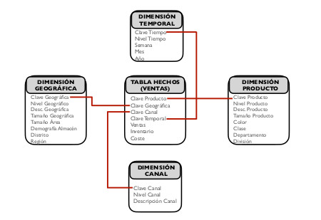
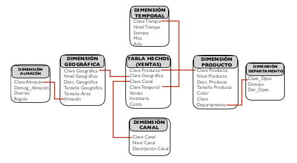

# UD 1 Gestión de Soluciones - Procedimientos y Mecanismos de Ingesta de Datos

En esta sección se profundizará en cada una de las **etapas necesarias para diseñar e implementar un almacén de datos**. Para ello, en primer lugar se describirá el proceso de **Extracción, Transformación y Carga (ETL)**, fundamental para construir y alimentar un almacén de datos. Después, se desarrollarán dos de los diseños más extendidos de almacén de datos: el **diseño en estrella** y el **diseño en copo de nieve**.

## 1. El proceso de Extracción, Transformación y Carga (ETL)

El proceso ETL es el encargado de extraer, limpiar e integrar los datos provenientes de las fuentes de datos para alimentar el almacén de datos. Este proceso también es el encargado de alimentar la capa de datos reconciliados en la arquitectura de tres capas. El proceso ETL tiene lugar cuando se puebla el almacén de datos y se lleva a cabo cada vez que el almacén de datos se actualiza. A continuación, se describen detalladamente cada una de las fases de las que consta este proceso

### 1.1 ⬆️ Extracción

Etapa que consiste en la **lectura de los datos de las distintas fuentes de las que provienen**. Cuando un almacén de datos se rellena por primera vez, se suele utilizar la técnica de **extracción estática**, la cual consiste en extraer una instantánea de los datos operacionales. A partir de entonces, se utiliza la **extracción incremental** para actualizar periódicamente los datos del almacén de datos, recogiendo los cambios aplicados desde la última extracción. Para ello, se utiliza el registro mantenido por el SGBD que, por ejemplo, asocia una **marca de tiempo (timestamp)** a los datos operacionales para registrar cuando fueron modificados y agilizar el proceso de extracción.

En la actualidad, existe una gran cantidad de conjuntos de datos o _data sets_ públicos, conocidos bajo el nombre de Open Data, que abarcan una gran cantidad de dominios y con los que es posible trabajar para construir soluciones big data.  

!!! note "Open Data"

    📋 **Open Data**: Se trata de datos que han sido generados por una fuente en particular, que abarcan un dominio temático o disciplinar y tienen atributos, dentro de los cuales está la frecuencia de actualización. Además, cuentan con una licencia específica que indica las condiciones de reutilización de los mismos.

**La fuente de los datos es en muchos de los casos el estado** nacional, provincial, municipal u organizaciones comerciales. En otras ocasiones, **la fuente de los datos es fruto del estudio o medición por parte de particulares**. Los **atributos** de los conjuntos de datos deben especificar cómo fueron obtenidos, incluyendo fechas de obtención, actualización y validez, así como el público involucrado, la metodología de recogida o muestreo, etc.

Algunas de las fuentes más utilizadas en la actualidad para la obtención de datos abiertos provienen de **los centros nacionales e internacionales de estadísticas**, como son el Instituto Nacional de Estadística de España (INE) [^1] , eurostat [^2] , la oficina europea de estadísticas, la Organización Mundial de la Salud (OMS) [^3] ... Por otra parte, existen **repositorios públicos de datos abiertos y a disposición de los usuarios como UCI4 [^4] o Kaggle [^5]** , que es una comunidad de científicos de datos donde empresas y organizaciones suben sus datos y plantean problemas que son resueltos por los miembros de la comunidad. La figura 1.8 muestra las fuentes de datos que se acaban de mencionar.

<figure style="align: center;">
    
    <figcaption>Figura 1.11: Fuentes para la obtención de datos abiertos. (Fuente: Propia)</figcaption>
</figure>

[^1]: [https://www.ine.es](https://www.ine.es)
[^2]: [https://ec.europa.eu/eurostat](https://ec.europa.eu/eurostat)
[^3]: [https://www.who.int/es/data/gho/publications/world-health-statistics](https://www.who.int/es/data/gho/publications/world-health-statistics)
[^4]: [https://archive.ics.uci.edu/](https://archive.ics.uci.edu/)
[^5]: [https://www.kaggle.com](https://www.kaggle.com)

### 1.2 🔄 Transformación

La etapa de transformación es la fase clave para **transformar los datos operativos en datos con un formato específico para alimentar un almacén de datos**. En esta etapa, **los datos se limpian y se transforman, añadiéndoles contexto y significado**. En caso de implementar un almacén de datos siguiendo una arquitectura de tres capas, **el proceso de transformación es el encargado de obtener la capa de datos reconciliados**. Si bien es cierto que algunos autores separan la limpieza y la transformación de los datos en dos etapas distintas, en este capítulo se considerarán ambas dentro de la fase de transformación.

!!! info "Transformación"

    📄 La etapa de **transformación** engloba todos los procesos de limpieza y manipulación de los datos, con el objetivo de transformar los datos operativos propios de sistemas relacionales (OLTP) en datos preparados para ser incluidos dentro del almacén de datos (OLAP).

La **limpieza de los datos** o _data cleaning_ engloba todos aquellos procedimientos necesarios para detectar y resolver situaciones problemáticas con los datos de partida que pudieran suponer problemas potenciales a la hora de analizarlos. Así pues, los datos de partida pueden ser **incompletos**, es decir, pueden contener atributos sin valor o valores agregados, **incorrectos** que incluyan errores o valores sin ningún significado, lo cual es común cuando los datos se introducen manualmente en el sistema, o inconsistentes cuando los cambios no son propagados a todos los módulos del sistema, los rangos de un determinado atributo son cambiantes, existen datos duplicados...

Otra tarea muy importante que se debe abordar en la fase de limpieza es la gestión de los **datos perdidos**. Se trata de **datos que no están disponibles para algunas de las variables en alguna instancia**. Esto puede ser debido, por ejemplo, a que no se registraran las modificaciones sufridas por los datos, se produjera un mal funcionamiento del equipo, los datos nunca fueron rellenados o no existían en el momento en que fueron completados, se eliminaron por ser inconsistentes con la información registrada...

En general, se distinguen **dos tipos de situaciones cuando existen valores perdidos: datos perdidos completamente aleatorios y datos perdidos de forma no completamente aleatoria**. En el segundo caso, puede ser interesante intentar analizar la razón de la pérdida de los datos, la cual puede ser indicativa. En muchas ocasiones, los valores perdidos tienen relación con un subconjunto de variables predictoras y no se encuentran aleatoriamente distribuidos por todas ellas. Por todo ello, las aproximaciones más comunes a la hora de gestionar datos perdidos son:

- **Eliminación de instancias que contengan valores perdidos**: consiste en establecer un porcentaje umbral de tal forma que, si una instancia contiene un número de valores perdidos que supera este porcentaje, la instancia se descarta. Se trata de una técnica útil cuando el conjunto de datos es grande y el número de instancias con valores perdidos no es muy elevado. No obstante, esta estrategia se debe utilizar con precaución, ya que puede suponer una excesiva pérdida de información si el conjunto de datos no es muy grande, el número de instancias con valores perdidos es alto o el porcentaje umbral es muy pequeño.

- **Asignación de valores fijos**: consiste en asignar un valor fijo a todos los valores perdidos de todas las variables. Este valor puede ser el número 0 o incluso un valor desconocido _Unknown_ o no numérico (NaN, Not a Number) en función del lenguaje de programación utilizado.

- **Asignación de valores de referencia**: asigna un valor de referencia a los valores perdidos para cada variable. Estos valores de referencia suelen ser medidas de centralización como la media o la mediana de los valores de cada variable.

- **Imputación de valores perdidos**: consiste en la aplicación de técnicas más sofisticadas, como pueden ser técnicas estadísticas o de aprendizaje automático para predecir o averiguar los valores que se han perdido.

Finalmente, la etapa de limpieza de datos también se encarga de la **detección de valores anómalos o outliers**. Se trata de valores que se han introducido de forma errónea o bien a una deformación en la distribución de valores. El proceso de detección de anomalías consiste, fundamentalmente, en dos etapas: en primer lugar, **asumir que existe un modelo generador de datos**, como podría ser una distribución de probabilidad. En segundo lugar, considerar que **las anomalías representan un modelo generador distinto**, que no coincide con el original. Existen multitud de técnicas para detectar y descartar o imputar valores anómalos, como lo son técnicas estadísticas basadas en la desviación y el rango intercuartílico o técnicas de aprendizaje automático.

Después de la etapa de limpieza, comienza la etapa de **transformación/manipulación**. En ella, los datos se preparan para su carga en el almacén de datos. Para ello, se transformarán los datos provenientes de sistemas transaccionales OLTP en datos preparados para su análisis OLAP. A continuación, se muestran algunos de los procesos de transformación más comunes:

- **Estandarización de códigos y formatos de representación**: incluye tareas como transformar la información EBCDIC a formato ASCII o Unicode, convertir números cardinales en ordinales o viceversa, homogeneización y tratamiento de fechas, expandir codificaciones añadiendo textos descriptivos, unificación de códigos (sexo, estado civil, etc) y estándares (medidas, monedas, etc). 

- **Conversiones y combinaciones de campos**: realización de agregaciones y cálculos simples (importe neto, beneficio, realización de cuentas y promedios), cálculos derivados con valores numéricos y textuales... 

- **Correcciones**: en caso de que no se pudiera hacer en el origen o en la etapa de limpieza, se deben corregir errores tipográficos, datos sin sentido ni significado, resolver conflictos de dominio de variables, aclaración de datos ambiguos y asignación de valores a datos nulos.

- **Integración de varias fuentes**: implica la resolución de claves y utilización de diccionarios de datos y repositorios de metadatos para el diseño del almacén de datos.

- **Eliminación de datos y/o registros duplicados**: frecuente cuando se trabaja con distintas fuentes de datos provenientes de diferentes dimensiones o departamentos de la organización. Para ello, es muy útil el uso de funciones de búsqueda y agrupamiento aproximado.

- **Escalado y centrado**: para reducir los efectos adversos de contar con datos dispersos, es muy útil utilizar técnicas para escalar y centrar los datos. Una posible transformación consiste en restar a cada valor de cada instancia el valor medio de la variable correspondiente y después dividir los valores por la desviación estándar. De esta forma, los valores se escalan y se centran entorno al cero. Esta transformación también puede hacerse entorno al valor de la media o la mediana. También es posible escalar los valores en el intervalo [0−1] o aplicar el logaritmo, para reducir la dispersión de los datos y mejorar la visualización.

- **Discretización**: la aplicación de muchas técnicas de aprendizaje automático requiere que los valores de las variables sean discreto, en lugar de continuos. La discretización es el proceso por el cual se divide un intervalo de valores continuos en tantos fragmentos como etiquetas o valores discretos se quieran asignar, sustituyendo los valores originales por la etiqueta o valor discreto correspondiente.

- **Selección de características**: permite reducir el coste computacional de trabajar con todas las variables del conjunto de datos cuando, en muchas ocasiones, existen variables que no aportan información para el aprendizaje. Además de reducir el coste computacional, se reduce el número de dimensiones del conjunto de datos, mejorando la visualización y mejorando el rendimiento de los modelos no solo en términos de tiempo, sino también de rendimiento, puesto que existen métodos de aprendizaje cuyo rendimiento es peor cuando se ejecutan utilizando variables no significativas.

### 1.3 🔀 Carga

Se trata de la última fase de cara a incluir datos en el almacén de datos. **La carga inicial de los datos puede requerir bastante tiempo al cargar de forma progresiva todos los datos históricos**, por lo que es normal realizarla en horas de baja carga de los sistemas. Una vez que el almacén de datos ha sido inicialmente cargado, las sucesivas cargas de datos se pueden realizar de dos formas:

- **Refresco**: El almacén de datos se reescribe completamente, de forma que se reemplazan los datos antiguos. El refresco **es utilizado habitualmente junto con la extracción estática** y suele ser una estrategia muy utilizada para **la carga inicial** del almacén de datos, aunque puede también realizarse a posteriori.

- **Actualización**: **Se añaden al almacén de datos solamente aquellos datos nuevos que se pretenden incluir, sin eliminar ni modificar los datos ya existentes**. Esta técnica es **utilizada frecuentemente junto con la extracción incremental** para actualizar regularmente el almacén de datos. Se trata de una estrategia de carga **compleja de diseñar**, ya que requiere que sea eficiente computacionalmente. Para ello, se requieren mecanismos de detección del cambio como aquellos basados en la marca de tiempo (timestamp) o la utilización de tablas de log, entre otros.

 
### 1.4 ⬆️🔄🔀 Frameworks ETL

Recientemente, han aparecido múltiples _frameworks_ que ofrecen herramientas tecnológicas para dar un soporte integrado al proceso ETL. A continuación, se describen algunos de los más utilizados:

- **[Bubbles](http://bubbles.databrewery.org)**: Se trata de un framework ETL escrito en Python, aunque es posible utilizarlo desde otros lenguajes. Ofrece un marco de trabajo sencillo, donde el proceso ETL se describe como una secuencia de nodos conectados que representan los datos y las distintas operaciones que se pueden realizar con ellos. De esta forma, es posible construir un grafo que implemente el proceso ETL completo para un conjunto de datos.

- **[Apache Camel](https://camel.apache.org)**: Este framework escrito en lenguaje Java y de acceso abierto se enfoca en facilitar la integración entre distintas fuentes de datos, haciendo el proceso más accesible a los desarrolladores, ofreciendo distintas herramientas para dar soporte al proceso ETL.

- **[Keetle](https://help.hitachivantara.com/Documentation/Pentaho/9.3/Products/Pentaho_Data_Integration)**: Es el framework de Pentaho para dar soporte al proceso ETL. Pentaho es una suite o conjunto de programas para construir soluciones de inteligencia de negocio y Keetle es su entorno de trabajo ETL. Similar a Bubbles, ofrece un entorno de trabajo sencillo para implementar un proceso ETL a través de nodos y conexiones entre ellos. Además, Keetle es de acceso abierto.

## 2. Diseño en Estrella

A la hora de diseñar un almacén de datos, existen dos alternativas ampliamente utilizadas: el **diseño en estrella**, que promueve el diseño directo de estructuras lógicas sobre el modelo relacional, y el **diseño en copo de nieve**, como variante del diseño en estrella.

El proceso de desarrollo de un almacén de datos siguiendo el diseño en estrella puede estructurarse según las siguientes fases:

1. **Elegir un proceso de negocio a modelar**: cualquier proceso de negocio puede ser modelado como un almacén de datos. No obstante, serán de especial interés aquellos procesos **necesarios para la toma de decisiones y que involucran a diferentes unidades de la organización**.

2. **Escoger la granularidad del proceso de negocio**: Los datos almacenados en el almacén de datos **deben expresarse siempre al mismo nivel de detalle**. Por este motivo es necesario escoger un nivel de granularidad al comienzo del diseño del almacén de datos.

3. **Selección de medidas/hechos**: indican **qué se necesita medir o evaluar enel proceso de negocio** con el fin de dar respuesta a las necesidades de información y toma de decisiones por las cuales se pretende diseñar el almacénde datos. Por ejemplo, en el ámbito logístico las medidas podrían ser las unidades aceptadas odevueltas, mientras que en el ámbito del control de calidad podrían ser lasunidades producidas, defectuosas, costo de la producción.

4. **Elegir las dimensiones que se aplicarán a cada medida o hecho**: las dimensiones especifican **las distintas propiedades de las medidas o hechos que se pretenden almacenar e integrar dentro del almacén de datos**. Por ejemplo, si las medidas seleccionadas están relacionadas con las ventas de una determinada empresa, las dimensiones podrían ser: fecha de la venta, vendedor ,cliente, producto...

A la hora de diseñar el almacén de datos siguiendo el diseño en estrella, se crea una **tabla central, también llamada tabla de hechos, tabla factual o fact table**. Esta tabla es la que posee los datos (medidas o hechos) sobre las diferentes combinaciones de las dimensiones. En algunas ocasiones, un diseño en estrella presenta más de una tabla de hechos. Los hechos introducidos pueden ser de distintos tipos: **completamente aditivos** (total de ventas de un departamento), **no aditivos** (márgen de beneficios expresado como porcentaje) o **semiaditivos** (como datos intermedios que pueden agregarse con datos de otras dimensiones).

Rodeando a la tabla de hechos, se encuentra u**na tabla por cada una de las dimensiones definidas**. La clave primaria de la tabla de hechos se crea combinando las claves primarias de sus dimensiones relacionadas, de forma que está compuesta por las claves ajenas de las tablas de dimensiones que relaciona. De esta forma, la tabla de hechos presenta una relación del tipo “muchos a muchos” entre todas las tablas de dimensiones que relaciona, a la vez que una relación “muchos a uno” con cada tabla de dimensión por separado. Este esquema con forma de estrella da nombre a este tipo de diseño.

**Ejemplo**

Sea un almacén de datos en el que se pretende almacenar **las ventas llevadas a cabo en una organización**. La tabla central de hechos representa los datos de cada venta, mientras que las dimensiones que rodean a la tabla central recogen datos sobre los productos vendidos, la fecha de la venta, el canal de distribución y el lugar de entrega. La [figura1.12][figura1.12] muestra un ejemplo de este esquema de almacén de datos.

<figure style="align: center;">
    
    <figcaption>Figura 1.12: Ejemplo de almacén de datos diseñado en estrella. (Fuente: UCLM)</figcaption>
</figure>

**Ventajas e incovenientes**

Entre las **ventajas del diseño en estrella**, destaca ser un diseño **fácil de modificar que proporciona tiempos rápidos de respuesta**, simplificando la navegación de los medatadatos. Además, este diseño **permite simular vistas de los datos que obtendrán los usuarios finales y facilita la interacción con otras herramientas**.

Sin embargo, el diseño en estrella presenta algunos **inconvenientes** que surgen, por ejemplo, cuando **se combinan dimensiones con distintos niveles de detalle**. Además, cuando se pretende limitar los niveles de una dimensión se debe añadir un campo de nivel o utilizar un modelo de tipo constelación, donde se incluyen diferentes estrellas que almacenan tablas de hechos agregadas, lo cual **añade complejidad al esquema**. 

**Resumen**

📄 El **diseño en estrella** permite crear un almacén de datos con una estructura centralizada. El diseño se compone de una tabla de hechos central, que recoge los valores de las medidas del proceso de negocio que se pretende modelar. Rodeando a la tabla de hechos, se incluyen tantas tablas como dimensiones se hayan especificado en el modelo, las cuales se relacionan entre sí a través de la tabla de hechos.

## 3. Diseño en Copo de Nieve

Otro de los diseños más extendidos a la hora de implementar un almacén de datos es el **diseño en copo de nieve**. De hecho, el diseño de copo de nieve es considerado una variante o derivado del diseño en estrella y, por tanto, puede construirse a partir de este siguiendo las mismas etapas que se describieron en la sección anterior. 

Este diseño es muy utilizado cuando se dispone de **tablas de dimensión con una gran cantidad de atributos**. En esta circunstancia, el diseño de copo de nieve permite **normalizar las tablas de dimensión**, ofreciendo un mejor rendimiento cuando las consultas realizadas sobre el almacén de datos requieren del uso de operadores de agregación. De esta forma, la tabla de hechos deja de ser la única tabla que presenta relaciones con las demás, apareciendo nuevas relaciones que se dan entre las tablas normalizadas que componen las tablas de dimensiones. Este esquema, que incluye ramificaciones en cada dimensión que se corresponden con las tablas necesarias para su normalización, guarda un gran parecido con la estructura de un copo de nieve, lo cual da nombre a este diseño.

**La diferencia entre los diseños en estrella y copo de nieve radica fundamentalmente en la modelización de las tablas de dimensiones**. Para obtener un diseño en copo de nieve, basta con partir de un diseño en estrella en el que, tras un proceso de normalización, se obtienen varias tablas de dimensión a partir de una tabla desnormalizada. Dentro del diseño de copo de nieve, es posible distinguir entre **copo de nieve parcial**, en el que solo algunas de las dimensiones son normalizadas y **copo de nieve completo**, en el que todas las dimensiones del esquema son normalizadas.

Siguiendo con el ejemplo anterior, en el que se mostraba un almacén de datos para representar las ventas realizadas por una organización, la [figura1.13][figura1.13] muestra un diseño para un almacén de datos siguiendo un esquema de copo de nieve parcial, en el que las dimensiones geográfica y producto han sido normalizadas. 

<figure style="align: center;">
    
    <figcaption>Figura 1.13: Ejemplo de almacén de datos diseñado en copo de nieve. (Fuente: UCLM)</figcaption>
</figure>

**Ventajas e Inconvenientes**

La normalización de las tablas de dimensiones proporciona al diseño de copo de nieve la **mejora de la eficiencia en la realización de consultas complejas que requieren el uso de operadores de agregación**. Sin embargo, este diseño es conceptualmente más difícil de implementar, ya que **incluye un mayor número de tablas** y requiere de realizar muchos joins entre ellas, lo que **incrementa los tiempos de consulta**.

En ocasiones, se requiere diseñar un almacén de datos que contenga más de una tabla de hechos. Para ello, el **esquema o diseño en constelación** permite crear un almacén de datos de forma similar al diseño en estrella, con la diferencia de que este modelo incluye más de una tabla de hechos. Además, cada tabla de hechos puede vincularse con todas o solo algunas tablas de dimensiones. Este esquema contribuye a la reutilización de las tablas de dimensiones, las cuales se pueden relacionar con más de una tabla de hechos.

**Resumen**

📄 El **diseño en copo de nieve** permite crear un almacén de datos a partir de un diseño en estrella. Para ello, las tablas de dimensiones se normalizan, generando más de una tabla para cada una de las dimensiones, mejorando la eficiencia de consultas complejas que requieren el uso de operadores avanzados.

[figura1.11]: images/Figura1.11_Fuentes_para_la_obtención_de_datos_abiertos.jpg "Figura1.11_Fuentes para la obtención de datos abiertos.jpg"
[figura1.12]: images/Figura1.12_Ejemplo_de_almacén_de_datos_diseñado_en_estrella.jpg "Figura1.12_Ejemplo de almacén de datos diseñado en estrella.jpg"
[figura1.13]: images/Figura1.13_Ejemplo_de_almacén_de_datos_diseñado_en_copo_de_nieve.jpg "Figura1.13_Ejemplo de almacén de datos diseñado en copo de nieve.jpg"