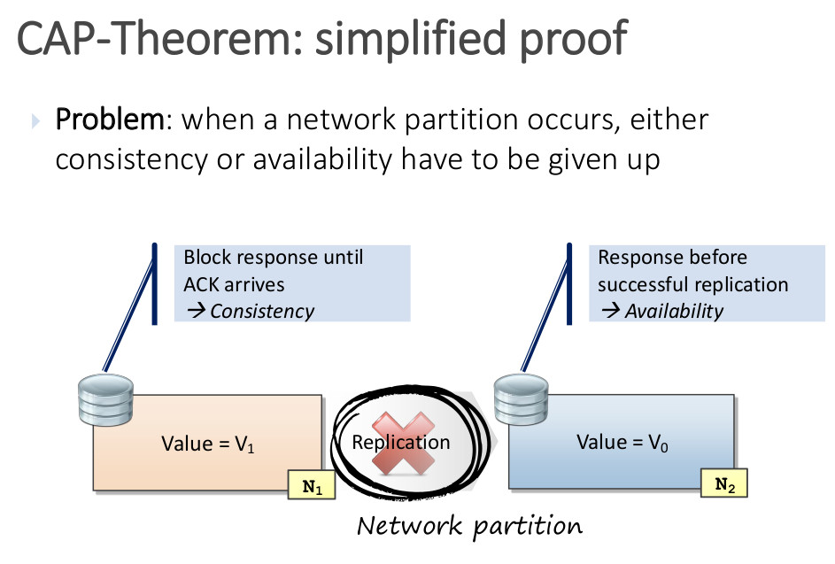
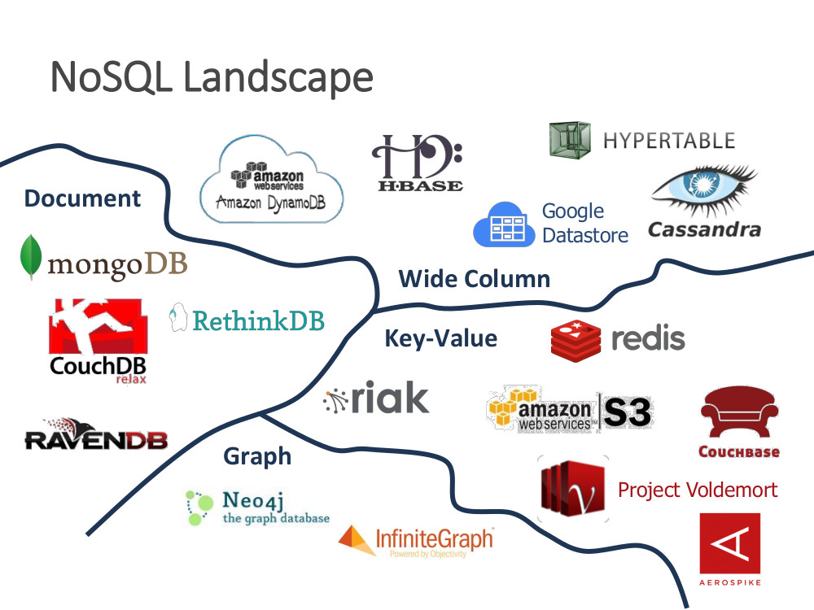
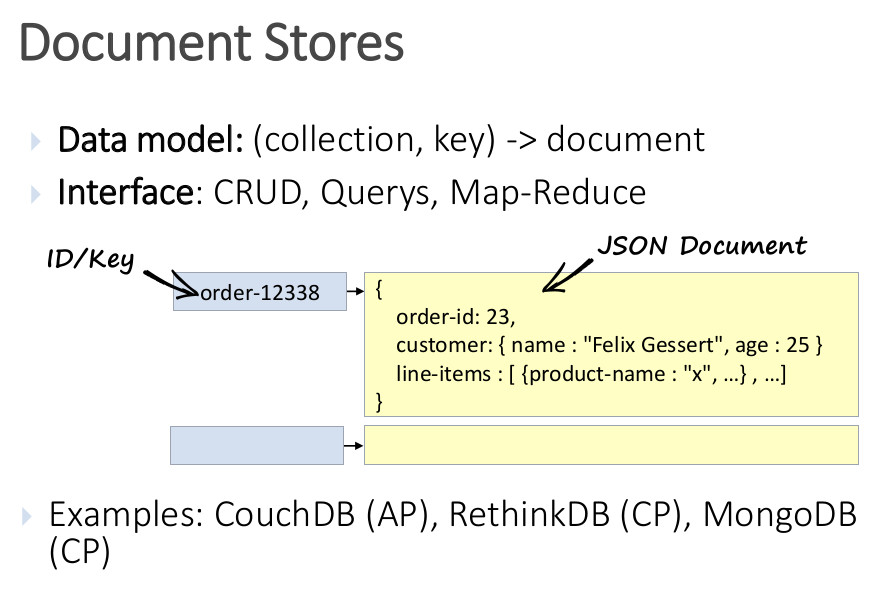
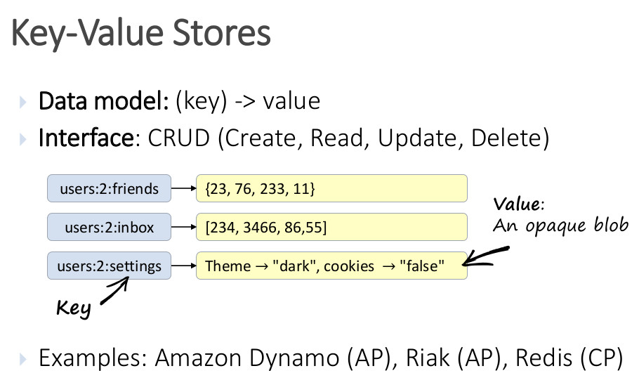
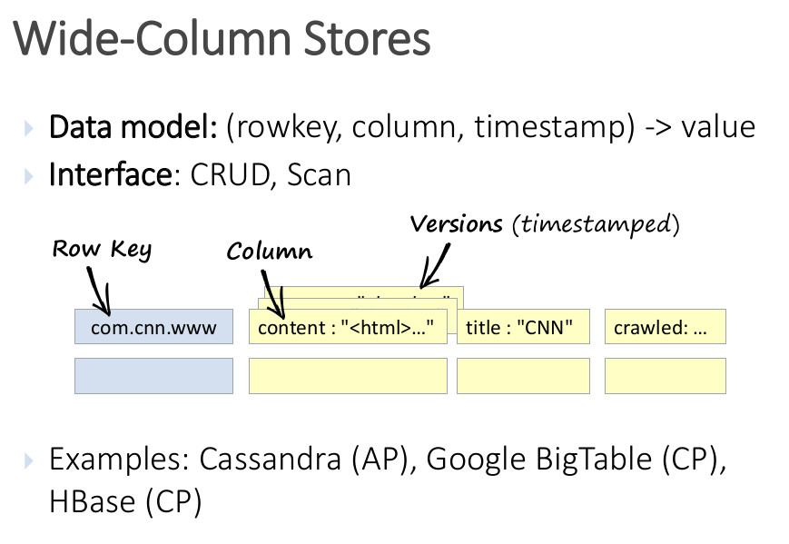

# UD 1 Gestión de Soluciones - Formato de Datos Adecuado para el Almacenamiento

Este capítulo profundiza en las soluciones de almacenamiento y gestión de datos propias de las bases de datos NoSQL para dar solución al almacenamiento de datos para los sistemas Big Data.

## 1. Teorema de CAP

Para entender las diferencias entre estos tipos de bases de datos, piense en el teorema CAP, una serie de principios aplicados a los sistemas distribuidos que almacenan el estado. En la siguiente figura se muestran las tres propiedades del teorema CAP.

<figure style="align: center;">
    
    <figcaption>Figura 1.14: Teorema de CAP. (Fuente: Microsoft)</figcaption>
</figure>

El teorema indica que los sistemas de datos distribuidos ofrecerán un equilibrio entre consistencia, disponibilidad y tolerancia a particiones. Además, cualquier almacén de datos **solo puede garantizar dos de las tres propiedades**:

- **Consistencia(C)**. Es la capacidad del sistema que garantiza devolver el último valor que ha sido escrito a cualquier operación de lectura. Por ejemplo, si actualizamos un registro con valor 2 a valor 3, las bases de datos y sistemas consistentes deberán devolver a todos los lectores el nuevo valor 3 a partir de ese momento. Cualquier otro resultado es considerado como una violación de la consistencia.
- **Disponibilidad(A)**. Capacidad del sistema de garantizar el procesamiento de cualquier operación de lectura sin producir ningún error..
- **Tolerancia a la partición(T)**. Capacidad del sistema de garantizar su funcionamiento en caso de partición de la red o incomunicación entre sus nodos. Para ello, el retraso o la pérdida de mensajes de comunicación no deberán impedir que el sistema funcione y responda a las peticiones.El sistema es tolerante a las particiones si los mensajes que se pierden o se retrasan no impiden su funcionamiento.

<figure style="align: center; width: 600px;">
    
    <figcaption>Figura 1.15: Teorema de CAP 2. (Fuente: medium.baqend.com)</figcaption>
</figure>

El teorema usa estas definiciones para afirmar que no es posible ofrecer las tres garantías de forma simultánea. O lo que es lo mismo, en cada instante se debe sacrificar alguna de ellas para garantizar las otras dos.

<figure style="align: center; width: 600px;">
    
    <figcaption>Figura 1.16: Teorema de CAP 3. (Fuente: medium.baqend.com)</figcaption>
</figure>

Como aplicación práctica, todos los sistemas distribuidos como las bases de datos sufren fallos e interrupciones de red y es necesario que sigan funcionando. Por esta razón, los sistemas deben elegir entre ser consistentes o disponibles y balancear estas dos garantías.

Podemos observarlo en la figura anterior, donde **cuando se produce una partición de red**, **se debe renunciar a la coherencia o a la disponibilidad**. Para la _consistencia_, se bloquea la respuesta hasta que llegue ACK, sin embargo, para la _disponibilidad_, la respuesta se da antes de que la replicación sea exitosa.

<figure style="align: center; width: 600px;">
    
    <figcaption>Figura 1.17: Teorema de CAP 4. (Fuente: medium.baqend.com)</figcaption>
</figure>

Si un sistema favorece la consistencia frente a la disponibilidad en el caso de una partición de red, será **CP**, mientras que si favorece la disponibilidad en este caso será **AP**. Los sistemas **ACID** como las bases de datos relacionales, eligen la consistencia sobre disponibilidad, mientras que los sistemas **BASE** eligen la disponibilidad.


## 2. Bases de datos NoSQL

El término **NoSQL** proviene del inglés y está formado por las palabras "No" y "SQL". El significado literal del término no debe confundir al lector ni alejarlo de su correcto significado. NoSQL no engloba solamente un conjunto de bases de datos y sistemas de almacenamiento que no utilizan SQL para su gestión. El significado de NoSQL amplía lo anterior, siendo el acrónimo de "***Not only SQL***". Por tanto, NoSQL es una categoría general de sistemas de bases de datos que, además de SQL, utilizan otra serie de tecnologías para almacenar y gestionar los datos. El término NoSQL fue acuñado en 1998 por Carlo Strozzy y retomado en el año 2009 por Eric Evans, quien aprovechó este término para referirse a esta nueva generación de familias de bases de datos como "**Big Data**".

<figure style="align: center;">
    
    <figcaption>Figura 1.18: Ecosistema NoSQL. (Fuente: medium.baqend.com)</figcaption>
</figure>

### 2.1 NoSQL vs Relacional (SQL)

Las **bases de datos relacionales** o **RDBMS** se usan generalmente para almacenar **datos estructurados**, en los que su formato, esquema, tipos y relaciones son fijas y sufren pocos cambios. Cada columna, define un aspecto del registro.

Las transacciones realizadas en los **sistemas de bases de datos relacionales** garantizan la consistencia y escalabilidad de las operaciones a través de una serie de características especificadas en el **modelo ACID**.

- **Atomicidad (A)**: Garantiza que una transacción se ha realizado completamente o no, evitando que algunas operaciones se ejecuten a medias.

- **Consistencia (C)**: También conocida como **integridad**, asegura que cualquier transacción realizada desde un estado seguro en la base de datos conducirá a esta a otro estado también seguro o válido.

- **Aislamiento (I: Isolation)**: Permite que el resultado en el estado del sistema sea el mismo, independientemente del modo de ejecución de las transacciones (secuencial o concurrente).

- **Durabilidad (D)**: O **persistencia**, garantiza que a pesar de que se produzca un fallo en el sistema, los cambios realizados por una transacción persistirán.

Algunos ejemplos de bases de datos relacionales o SQL son SQL Server, MySQL, PostgreSQL, DB2 y Oracle.

Por otro lado, las **bases de datos NoSQL** han venido para quedarse. Simplemente son capaces de aportar unas características de escalabilidad y flexibilidad que las bases de datos tradicionales no han podido satisfacer de forma sencilla. Alternativamente, las bases de datos **NoSQL** siguen el modelo conocido como **BASE**, más flexible que ACID en aquellos sistemas de bases de datos que no se adhieren estrictamente al modelo relacional.

- **Disponibilidad básica (Basic Availability)**: El sistema siempre ofrece una respuesta a una petición de datos, aunque los datos sean inconsistentes, estén en fase de cambio o incluso se produzca un fallo.

- **Soft-state (S)**: La consistencia de este tipo de bases de datos es eventual, por lo que el estado del sistema cambia a lo largo del tiempo, aunque no haya habido entradas de datos.

- **Eventual Consistency (E)**: Cuando se dejan de recibir datos, el sistema se vuelve consistente. Así pues, los datos se propagan a todo el sistema, pero este continúa recibiendo datos sin evaluar la consistencia de los mismos para cada transacción antes de avanzar a la siguiente.

!!! info inline end

    La **Computación o Informática ubicua** (ubicomp) es un concepto en ingeniería de software y las ciencias de la computación. Es entendida como la integración de la informática en el entorno de la persona, de forma que los ordenadores no se perciban como objetos diferenciados, apareciendo en cualquier lugar y en cualquier momento. Es el concepto que determina por primera vez que el hombre no se debe adaptar a la máquina, sino la máquina al hombre.

En la actualidad, las aplicaciones web modernas, el auge de la computación ubicua y el Big Data, presentan desafíos muy diferentes a los que presentan los sistemas de información tradicionales, implementados por medio de sistemas de bases de datos relacionales. Algunos **desafíos** son: el procesamiento masivo de datos, la alta frecuencia de lecturas y escrituras, los cambios dinámicos y frecuentes en el esquema de datos, la escalabilidad a costes razonables, gestión de datos temporales...En este contexto, en los últimos años han aparecido multitud de enfoques, modelos y tecnologías para aportar soluciones a los desafíos mencionados anteriormente. En este capítulo, se profundiza en **las bases de datos XML, bases de datos documentales y orientadas a grafos**.

!!! info "Base de datos NoSQL"

    📄 **Base de datos NoSQL**: Sistema de bases de datos no relacional que utiliza distintas tecnologías para la gestión y almacenamiento distribuido de datos masivos sin un esquema estricto subyacente. Esta familia de base de datos permite incrementar la disponibilidad y escalabilidad del sistema, mejorando su rendimiento.

### 2.2 Tipos de bases de datos NoSQL

<figure style="align: center;">
    
    <figcaption>Figura 1.19: Tipos BBDD NoSQL. (Fuente: medium.baqend.com)</figcaption>
</figure>

#### 2.2.1 Documentales

Estas bases de datos almacenan datos autocontenidos llamados documentos. Cada documento puede definir su propio esquema. Estos documentos generalmente tienen **formato JSON** (aunque también existen otros como **YAML** o **BSON**, o incluso como un fichero de texto). Asignan a cada documento un identificador único y no es necesario definir relaciones entre ellos.

<figure style="align: center; width: 600px;">
    
    <figcaption>Figura 1.20: NoSQL Documentales. (Fuente: medium.baqend.com)</figcaption>
</figure>

Algunos ejemplos de Base de datos NoSQL de tipo documental son MongoDB, CouchDB y DynamoDB.

#### 2.2.2 Clave-valor

Estas bases de datos tampoco tienen un esquema de datos predefinido. Se asimilan al concepto de array o map persistente y a las bases de datos con dos columnas, la primera es la clave y la segunda el valor del registro. Los valores pueden tomar el tipo de dato que sea necesario, incluso JSON.

La ventaja de estas bases de datos es su gran velocidad de lectura y de escritura debido a su estructura. La desventaja es su poca capacidad para filtrar la información en las consultas.

<figure style="align: center; width: 600px;">
    
    <figcaption>Figura 1.21: NoSQL clave valor. (Fuente: medium.baqend.com)</figcaption>
</figure>

Algunos ejemplos de Base de datos NoSQL de tipo clave-valor son DynamoDB, Redis.

#### 2.2.3 Tabular

Estas bases de datos orientadas a columnas organizan los datos de esta forma en vez de en filas y almacenan cada columna de forma separada. De esta forma, es muy sencillo y eficiente añadir nuevas columnas y realizar operaciones de búsqueda sobre ellas. Estas bases de datos usan el concepto de espacio de claves que contiene todas las familias de columnas. Dentro de una familia de columnas, el número de columnas de cada fila puede variar

Son muy populares en sistemas de analítica ya que funcionan de forma similar a lo que lo harían las tablas en bases de datos relacionales. Además, aportan una excelente escalabilidad y una compresión eficiente de los datos. Por otro lado, estas bases de datos son poco eficientes al consultar filas individuales y registros repartidos en varias columnas.

<figure style="align: center; width: 600px;">
    
    <figcaption>Figura 1.22: NoSQL Tabular. (Fuente: medium.baqend.com)</figcaption>
</figure>

Algunos ejemplos de Base de datos NoSQL de tipo tabular son Cassandra, HBase, Druid o BigTable.

#### 2.2.4 Grafo

En estas bases de datos, los registros son almacenados con una estructura en forma de grafo. Las relaciones interconectan los datos entre sí y los distribuyen.

Su estructura consiste en dos componentes principales. Los nodos son los datos en sí mismos y los enlaces o aristas explican las relaciones entre dos nodos. Estos enlaces también pueden contener información como la naturaleza de la relación o incluso dirección para describir el flujo.

<figure style="align: center; width: 600px;">
    
    <figcaption>Figura 1.23: NoSQL Grafo. (Fuente: medium.baqend.com)</figcaption>
</figure>

Algunos ejemplos de Base de datos NoSQL de tipo grafo son Neo4J, DEX, InfiniteGraph.

## 3. Bases de datos XML

El lenguaje **XML** (eXtensible Markup Language) es un lenguaje de marcas extensible derivado del lenguaje **SGML** (Standard Generalized Markup Language). Se trata de un lenguaje ideado para la definición y gestión de documentos que permite representar datos estructurados y semi-estructurados. En la actualidad, XML se ha convertido en un formato estándar para la comunicación entre aplicaciones, facilitando su integración. Entre las principales ventajas de XML destacan:

- **Datos autodocumentados**: Gracias a la posibilidad de definir cualquier tipo de etiquetas, no es necesario conocer el esquema para entender el significado de los datos. 

- **Extensión**: Permite adaptar el lenguaje fácilmente a cualquier dominio. Anidamiento: La definición de estructuras anidadas dota a los documentos de gran flexibilidad para transferir y consultar información. 

- **Flexibilidad**: Los documentos XML no tienen un formato estricto ni rígido, permitiendo añadir o ignorar información en ellos. 

**Estructura de un documento XML**

La estructura de un documento XML está compuesta de elementos. Un **elemento** es una porción de documento delimitado por un par de etiquetas _< >_ (apertura) y _< />_ (cierre) entre las cuales se incluye un texto llamado **contexto** del elemento. Un elemento sin contexto puede abreviarse mediante el uso de una única etiquete _<nombre_elemento/>_. La estructura de un XML se forma **anidando** elementos para especificar la estructura del documento, formando una estructura de árbol. El fragmento de código 3.1 representa la estructura básica de un documento XML que representa un listado de asignaturas.

```xml
<Asignaturas_Primero>
    <Asignatura>
        <titulo> Cálculo </titulo>
        <tipo> Anual </tipo>
        <profesor>
            <nombre> Ana </nombre>
            <apellido> Sanz </apellido>
        </profesor>
        <profesor>
            <nombre> Roberto </nombre>
            <apellido> Hernández </apellido>
        </profesor>
    </Asignatura>
    <Asignatura>
        <titulo> Física </titulo>
        <tipo> Semestral </tipo>
        <profesor>
            <nombre> Carmelo </nombre>
            <apellido> Moya </apellido>
        </profesor>
    </Asignatura>
</Asignaturas_Primero>
```
_Listado 1.1: Listado de Asignaturas_

Los elementos de un documento pueden contener atributos. Los atributos se incluyen en la definición del elemento, dentro de la etiqueta de apertura. Sintácticamente, se representan mediante un par _nombre = valor_. A diferencia de un subelemento, **un atributo solo puede aparecer una vez en una etiqueta**. El uso de atributos y su diferencia con respecto a los elementos no siempre es evidente. A **nivel de documento**, los atributos se introducen para añadir texto que no se visualizará en el documento, mientras que los subelementos formarán parte del contenido del documento. A **nivel de datos**, la diferencia es insustancial, puesto que la misma información se puede representar utilizando atributos o subelementos. Por ejemplo, el subelemento _< tipo >_ de una asignatura, podría representarse como un atributo del elemento asignatura. El listado 1.2 representa la asignatura de Cálculo del ejemplo anterior, incluyendo el título de la asignatura como atributo de la misma.


```xml
<Asignaturas_Primero>
    <Asignatura>
        <titulo> Cálculo tipo = 'anual' </titulo>
        <tipo> Anual </tipo>
        <profesor>
            <nombre> Ana </nombre>
            <apellido> Sanz </apellido>
        </profesor>
        <profesor>
            <nombre> Roberto </nombre>
            <apellido> Hernández </apellido>
        </profesor>
    </Asignatura>
</Asignaturas_Primero>
```
_Listado 1.2: Uso de atributos para la definición de asignaturas_

Dado que una de las principales aplicaciones de XML es el intercambio de información entre organizaciones, y ante la flexibilidad del lenguaje que permite definir cualquier nombre para una etiqueta, es posible que **existan conflictos entre los nombres de éstas**. Para ello, se recurre a los **espacios de nombres**, los cuales permiten a las organizaciones especificar nombres de etiquetas únicos. De esta forma, se añade al nombre de la etiqueta o atributo un identificador de recursos universal. El listado muestra de forma resumida un ejemplo de utilización del espacio de nombres para la definición de asignaturas.

```xml
<Asignatura xmlns:AS="http://www.listado-asignaturas.com">
    <AS:titulo> Cálculo tipo = 'anual' </AS:titulo>
    <AS:tipo> Anual </AS:tipo>
    <AS:profesor>
        <AS:nombre> Ana </AS:nombre>
        <AS:apellido> Sanz </AS:apellido>
    </AS:profesor>
    <AS:profesor>
        <AS:nombre> Roberto </AS:nombre>
        <AS:apellido> Hernández </AS:apellido>
    </AS:profesor>
</Asignatura>
```
_Listado 1.3: Uso de un espacio de nombres_

Al igual que ocurre en las bases de datos relacionales, las bases de datos XML presentan una serie de **lenguajes de definición de tipos de documentos XML**. Concretamente, a continuación se profundizaran en **DTD y XML Schema**. Seguidamente, se estudiarán los lenguajes **XPath, XSLT y XQuery**, **como lenguajes de manipulación de datos XML** para la definición y ejecución de consultas.


### 3.1 Definition Type Document (DTD)

En XML, se dice que un documento está **bien formado** si cumple con la sintaxis del lenguaje: correcta definición de elementos y atributos, correcto anidamiento...Como se puede apreciar, este concepto alude a la **dimensión sintáctica de los documentos**.

Por otra parte, se dice que un documento XML **es válido** cuando **está bien formado y cumple con la estructura de documento que ha sido dada a través de un lenguaje de definición de datos**. Esta definición de la estructura de los documentos XML es **opcional**, si bien es cierto que es recomendable, especialmente cuando se trabaja con documentos complejos y con un volumen grande de ellos. La definición de tipos de documento o **DTD permite definir la estructura de un documento XML**. Para ello, la DTD especifica la estructura de los elementos y atributos de un documento: qué elementos pueden aparecer, qué atributos, qué subelementos, multiplicidad de ellos... Existen multitud de validadores on-line de documentos XML y sus correspondientes DTDs y/o XML Schemas[^1].

La **declaración de una DTD** dentro de un documento XML puede implementarse de dos formas: en primer lugar, de manera **interna**. En este caso, se añade la DTD después del preámbulo XML y justo antes del documento propiamente dicho. El listado 1.4 muestra un ejemplo de declaración interna de una DTD.

```xml
<?xml version="1.0" encoding="UTF-8" standalone="yes" ?>
<!DOCTYPE Elemento_Raiz [Aquí la DTD]>
<!-------Aquí va el documento XML----->
```
_Listado 1.4: Declaración Interna DTD_

[^1]: [https://www.liquid-technologies.com/online-xsd-validator](http://xmlvalidator.new-studio.org) y [http://xmlvalidator.new-studio.org](http://xmlvalidator.new-studio.org)

En segundo lugar, la **DTD puede declararse de forma externa**, definiendo la misma en un fichero .DTD aparte que después es enlazado en el documento. El listado 1.5 muestra un ejemplo de declaración externa de una DTD.

```xml
<?xml version="1.0" encoding="UTF-8" standalone="yes" ?>
<!DOCTYPE Elemento_Raiz SYSTEM "Mi_DTD.dtd">
<!-------Aquí va el documento XML------>
```
_Listado 1.5: Declaración Externa DTD_

Siguiendo con el ejemplo del listado 1.1, el listado 1.6 muestra el archivo .dtd que validaría la estructura del documento de asignaturas.

```xml
<¡ DOCTYPE Listado_Asignaturas[
<! ELEMENT Asignaturas_Primero (Asignatura+)>
<! ELEMENT Asignatura (titulo, tipo, profesor+)>
<! ELEMENT titulo (#PCDATA)>
<! ELEMENT tipo (#PCDATA)>
<! ELEMENT profesor (nombre, apellido)>
<! ELEMENT nombre (#PCDATA)>
<! ELEMENT apellido (#PCDATA)>
```
_Listado 1.6: DTD Listado de Asignaturas_

En el listado anterior, se define en primer lugar el tipo de documento "Listado_Asignaturas". A continuación, y especificados entre corchetes, se describen los elementos que contendrá el documento, comenzando por el elemento raíz "Asignaturas_Primero". Este elemento estará formado por uno o más elementos "Asignatura" (especificado mediante el operador +). Seguidamente, el elemento "Asignatura" viene dado por un conjunto de tres subelementos: título, tipo y profesor. Además, cada asignatura puede tener uno o más profesores. Los elementos título y tipo vienen dados por cadenas de caracteres (denotadas con la instrucción #PCDATA) mientras que el elemento profesor estará formado por dos subelementos llamados "nombre" y "apellido" ambos definidos mediante cadenas de caracteres.

La definición de atributos para un elemento se hace a continuación de la definición del mismo utilizando _<!ATTLIST >_. El listado 1.7 muestra la DTD anterior en caso de que el tipo de asignatura sea considerado un atributo. 

```xml
<¡ DOCTYPE Listado_Asignaturas[
<! ELEMENT Asignaturas_Primero (Asignatura+)>
<! ELEMENT Asignatura (titulo, profesor+)>
<! ATTLIST tipo id #CDATA REQUIRED>
<! ELEMENT titulo (#PCDATA)>
<! ELEMENT tipo (#PCDATA)>
<! ELEMENT profesor (nombre, apellido)>
<! ELEMENT nombre (#PCDATA)>

```
_Listado 1.7: DTD Listado de Asignaturas con atributos_

Finalmente, la tabla 3.1a muestra un resumen de definición de elementos y atributos en una DTD.

| **Tipos** | **ELEMENTO** |
| :--: | :--: |
| #PCDATA | Cadena de caracteres |
| EMPTY | Elemento sin contexto |
| ANY | Cualquier tipo |
| **Operadores** | **ELEMENTO** |
| \| | Disyunción |
| + | Uno o más |
| * | Cero o más |
| ? | Cero o uno |

_Tabla 3.1a: Descripción DTD de elementos y atributos XML_

Y la tabla 3.1b muestra un resumen de definición de atributos en una DTD.

| **Tipos** | **ATRIBUTOS** |
| :--: | :--: |
| CDATA | Cadena de caracteres |
| ID | Identificador |
| IDREF |Referencia a un ID |
| **Operadores** | **ELEMENTO** |
| #REQUIRED | Obligatorio |
| #IMPLIED | Opcional |
| #FIXED | Valor fijo |
| #DEFAULT | Valor por defecto |

_Tabla 3.1a: Descripción DTD de atributos XML_


### 3.2 XML Schema

Se trata de un **lenguaje de definición de la estructura de documentos XML más sofisticado que DTD**. Aunque es **más complejo, soluciona muchos de los inconvenientes de las DTD**. De hecho, XML Schema es un superconjunto del lenguaje DTD especificado mediante la sintaxis de XML. Entre otros aspectos, XML Schema soporta no solo el tipo cadena de caracteres (soportado por DTD), sino también tipos numéricos, tipos complejos como listas y además permite al usuario definir sus propios tipos así como extender tipos de datos complejos mediante un mecanismo similar a la herencia. Además, XML Schema soporta el concepto de espacios de nombre, permitiendo reutilizar elementos de un esquema en otros.

Un XML Schema se especifica en un documento aparte del documento XML con extensión **.xsd**. Dentro de este archivo, que sigue las reglas sintácticas de cualquier documento XML, se especifican las definiciones de cada elemento del esquema, qué atributos incluye así como sus tipos de datos válidos asociados tanto a los elementos como a los atributos. De esta forma, **XML Schema permite definir un esquema para validar documentos XML, de forma más sofisticada a como lo hace DTD**. El listado 1.8 muestra un XML Schema para el ejemplo del listado de asignaturas.

```xml
<?xml version="1.0" encoding="utf-8"?>
<xs:schema attributeFormDefault="unqualified" elementFormDefault="qualified" xmlns:xs="http://www.w3.org/2001/XMLSchema">
    <xs:element name="Asignaturas_Primero">
        <xs:complexType>
            <xs:sequence>
                <xs:element maxOccurs="unbounded" name="Asignatura">
                    <xs:complexType>
                        <xs:sequence>
                            <xs:element name="titulo" type="xs:string" />
                            <xs:element name="tipo" type="xs:string" />
                            <xs:element maxOccurs="unbounded" name="profesor">
                                <xs:complexType>
                                    <xs:sequence>
                                        <xs:element name="nombre" type="xs:string" />
                                        <xs:element name="apellido" type="xs:string" />
                                    </xs:sequence>
                                </xs:complexType>
                            </xs:element>
                        </xs:sequence>
                    </xs:complexType>
                </xs:element>
            </xs:sequence>
        </xs:complexType>
    </xs:element>
</xs:schema>
```
_Listado 1.8: XML Schema: Listado de asignaturas_

El listado anterior comienza definiendo un XML Schema en la segunda línea de código. Cualquier XML Schema deberá incluir esta línea de código. El atributo _attributeFormDefault = "unqualified"_ indica que no es necesario utilizar el prefijo del espacio de nombres para definir los atributos del esquema, mientras que el atributo _elementFormDefault = "qualified"_ indica que no es necesario utilizar el prefijo del espacio de nombre para definir los elementos del esquema.

A continuación, se define el elemento raíz "Asignaturas_Primero" el cual se trata de un tipo complejo, puesto que no se define con un tipo de datos básico como entero, carácter, etc. Este elemento está formado por una secuencia de elementos del tipo "Asignatura" (el número máximo de elementos Asignatura no está limitado ya que _maxOccurs = "unbounded"_. Los elementos Asignatura, a su vez, están formados de una secuencia de elementos "nombre", "tipo" (ambos de tipo cadena de caracteres) y un conjunto de elementos de tipo "profesor" no acotados, el cual se compone a su vez de los elementos "nombre" y "apellido", ambos de tipo cadena de caracteres.

XML Schema permite representar la cardinalidad de un elemento, definiendo el número mínimo y máximo de ocurrencias mediante los atributos _minOccurs_ y _maxOccurs_. Además, también es posible añadir restricciones de forma que se limiten los valores de un elemento o atributo, se permita elegir entre una lista de posibles...Finalmente, XML Schema dispone de los contenedores _sequence_ para definir una secuencia ordenada de subelementos, _chocie_ para definir la elección entre posibles grupos de elementos o elementos y _all_ para definir un conjunto no ordenado de elementos. Al igual que sucedía con DTD, **existen distintas herramientas on-line que no solo permiten validar un documento XML a partir de su esquema XSD, sino que también permiten generar el esquema XSD a partir del archivo XML**[^2].

[^2]: [https://www.freeformatter.com](https://www.freeformatter.com), [https://www.liquid-technologies.com/online-xsd-validator](https://www.liquid-technologies.com/online-xsd-validator) y [https://extendsclass.com/xml-schema-validator.html](https://extendsclass.com/xml-schema-validator.html)

### 3.3 XPath

En cualquier sistema de bases de datos, además de los lenguajes de definición de datos, los **lenguajes de manipulación de datos** son esenciales para poder realizar consultas y recuperar datos, realizar actualizaciones, etc.

**XPath es un lenguaje de manipulación de datos XML**. La principal característica de este lenguaje es que **interpreta un documento XML como una estructura de datos de tipo árbol**, donde los nodos y sus respectivas hojas se corresponden con los elementos y subelementos del documento XML. De esta forma, y utilizando comandos que permiten recorrer el documento de forma análoga a los comandos que se utilizan en una terminal de comandos para recorrer el sistema de archivos de un computador, es posible realizar consultas. La tabla 3.2 muestra un listado de los principales operadores utilizados en XPath.

| **Operador** | **Significado** |
| :-- | :-- |
| / | Navegación entre nodos del documento. Selecciona los nodos del nivel inferior. |
| // | Navegación entre nodos del documento. Selecciona los nodos del nivel inferior de cualquier nodo especificado a continuación |
| . | Selecciona el nodo actual |
| .. | Selecciona el nodo padre o nodo de nivel superior |
| \| | Expresa alternativas |
| @ | Selecciona un atributo de un nodo |
| * | Selecciona todos los nodos |
| [] | Agrupa otros operadores |

_Tabla 3.2: XPath: Operadores básicos_

Con estos operadores, veamos cómo realizar algunas consultas de ejemplo sobre el fragmento XML que especifica un listado de asignaturas.

!!! question 

    **Consulta 1**. Recuperar los nombres de todas las asignaturas."

        /Asignaturas_Primero/Asignatura/titulo/text()

!!! question 

    **Consulta 2**. ¿Cuántas asignaturas son impartidas por más de un profesor?"

        /Asignaturas_Primero/Asignatura[count(profesor)>1]

!!! question 

    **Consulta 3**. ¿Quiénes son los profesores que imparten la asignatura de física?"

        /Asignaturas_Primero/Asignatura[titulo="Fisica"]/profesor/nombre

**Es posible utilizar XPath de forma on-line a través de visualizadores[^3] o, por ejemplo, instalando el plug-in XPatherizer de Notepad++, en caso de utilizar este último editor de código XML.**

[^3]: [https://download.cnet.com/XPath-Visualizer/3000-7241_4-75804649.html](https://download.cnet.com/XPath-Visualizer/3000-7241_4-75804649.html), [https://www.freeformatter.com/xpath-tester.html](https://www.freeformatter.com/xpath-tester.html)


### 3.3 XSLT

Otro lenguaje de manipulación de datos XML es el lenguaje XSLT. **El lenguaje XSLT (XML StylesSheet Transformations) proviene del lenguaje XSL (XML StylesSheet)**. Este último permite especificar las opciones de formato de un documento XML en un archivo separado, aislando así la especificación del contenido y la presentación de un archivo XML. Podría decirse que XSL es a XML lo que CSS es a HTML. **El lenguaje XSLT permite especificar las opciones e formato de un documento XML, pudiendo transformar este documento en otros formatos como HTML, PDF, etc**. Dada la potencia de este lenguaje, que es capaz de transformar un archivo XML en otro que también pudiera ser XML, **se utiliza frecuentemente como lenguaje de consulta**.

Las transformaciones XSLT se definen por medio de **plantillas**, que permiten a su vez recuperar contenido del documento XML a través de la utilización de expresiones XPath. La principal característica de XSLT es que la aplicación de plantillas se realiza de forma recursiva, lo cual recibe el nombre de **recursividad estructural**. El listado 1.9 presenta un ejemplo de aplicación de una transformación XSLT por medio de una plantilla.

```xml
<xsl: template match = /Asignaturas_Primero/Asignatura >
    <titulo_asignatura>
        <xsl:value-of select = titulo/>
    </titulo_asignatura>
</xsl:template>
```
_Listado 1.9: XSLT: Ejemplo de plantilla_

Tal y como se puede observar en el fragmento anterior, una transformación o consulta XSLT se define mediante dos órdenes básicas: _match_ que especifica una expresión XPath para seleccionar uno o más nodos y _value − of select_ que devuelve los valores especificados de los nodos que se han obtenido como resultado de la expresión XPath. Merece la pena destacar que **cualquier texto o etiqueta del archivo XSLT que no esté en el espacio de nombre se copia a la salida sin cambios**. Esto quiere decir, que el resultado del fragmento anterior no son únicamente los títulos de las asignaturas, sino estos mismos delimitados por una etiqueta de apertura y cierre llamada _< titulo_asignatura >_. De esta forma, a partir de un documento XML se ha generado otro con el resultado de la consulta. A modo de resumen, la tabla 3.3 define los principales constructores XSLT.

| **Constructor XSLT** | **Significado** |
| :-- | :-- |
| _< xsl:template match = "expresion XPath" >_ | Selecciona nodos a devolver |
| _<xsl:value − of select = "valor">_ | Devuelve todos los nodos que no coinciden con alguna otra plantilla |
| _<xsl:template ><xsl:template match = "∗"/>_ | Selecciona el nodo actual |
| _<xsl:attribute nombre = "nombre atributo">_ | Añade un atributo al elemento precedente |
| _<xsl:apply − templates/>_ | Aplica la recursividad estructural |
| _<xsl:keyname = "nombre clave" match = "elementos aplicar" use = "valor clave"/>_ | Define una clave |
| _<xsl:value − of select = "key("nombre clave" "valor")"/>_ | Devuelve los nodos que coincidan con el valor especificado. Especifica
operaciones de combinación (JOINS) |
| _<xsl:sort select = "elemento o atributo"/>_ | Devuelve los nodos resultados, ordenados por un elemento o atributo |

_Tabla 3.3: Principales Constructores XSLT_

Para trabajar con XSLT, se aconseja la descarga del software XML Copy Editor [https://xml-copy-editor.sourceforge.io](https://xml-copy-editor.sourceforge.io).


### 3.4 XQuery

Es un **lenguaje de consulta de propósito general sobre datos XML estandarizado por el consorcio W3C**. XQuery procede del lenguaje de programación Quilt y, por este motivo, toma prestadas muchas características de otros lenguajes como XPath o SQL. De hecho, la sintaxis de XQuery es mucho más similar a la de SQL, al contrario que ocurría con lenguajes como XPath o XSLT. 

Para definir una consulta en XQuery se construye una expresión, denominada **"FLWR"(flower, flor en inglés)**. A continuación, se describen cada una de las sentencias de las que se compone la expresión:

- **FOR**: Obtiene una serie de variables cuyos valores son el resultado de una expresión XPath. Es el equivalente a la cláusula FROM del lenguaje SQL.

- **LET**: Define y renombra expresiones complejas para ser utilizadas en el resto de la consulta, reduciendo la complejidad y aliviando la sintaxis. Es una cláusula opcional.

- **WHERE**: En esta cláusula, llamada igualmente en SQL, se especifican condiciones sobre los resultados obtenidos en la cláusula FOR.

- **RETURN**: Especifica y define el resultado que se va a obtener de la consulta. Se trata del equivalente a la cláusula **SELECT** en SQL.

Siguiendo la sintaxis anteriormente mencionada, el listado 1.10 muestra un ejemplo para obtener un listado con las asignaturas anuales.

```xquery
for $x in /Asignaturas_Primero/Asignatura
let $nombre_asignatura:= $x/titulo
where $x/tipo='anual'
return <asignatura_anual> $nombre_asignatura </asignatura_anual>
```
_Listado 1.10: XQuery: Ejemplo de consulta_

En el listado anterior,la cláusula _for_ permitirá recorrer todos los elementos asignatura. Por su parte, let define una expresión en la que se asigna a _nombre_asignatura_ el título de la asignatura que se está recorriendo en cada momento. La cláusula _where_ impone el criterio de que el tipo de asignatura sea anual y, finalmente, _result_ define como resultado un fragmento de código XML donde el nombre de la asignatura anual (según la expresión indicada en let) aparecerá como resultado encerrado entre dos etiquetas XML llamadas _asignatura_anual_. Tal y como se puede apreciar, XQuery también permite generar nuevos documetnos XML a partir de consultas.

Al igual que SQL, XQuery dispone de multitud de funciones para la consulta de datos. Así, es posible utilizar la función _distinct()_ para eliminar duplicados en los resultados así como funciones de agregación como _sum()_ o _count()_ además de poder especificar funciones definidas por el usuario. XQuery también permite utilizar "joins" incluyendo en la cláusula where el operador de combinación al igual que en SQL. Por otra parte, si bien es cierto que XQuery no posee el operador _group by_ de SQL, este puede implementarse mediante la creación de consultas anidadas, las cuales sí que son soportadas por el lenguaje.


## 4. Bases de datos documentales: MongoDB

Los sistemas de bases de datos documentales u orientados a documentos **son sistemas de bases de datos NoSQL que almacenan datos, los cuales se estructuran en forma de documentos**. En los últimos años, han proliferado una gran variedad de sistemas de este tipo como pueden ser **Cassandra[^4], CouchDB[^5], Riak[^6] o MongoDB[^7], sobre el cual trata esta sección**.


[^4]: [https://cassandra.apache.org/](https://cassandra.apache.org/)
[^5]: [http://couchdb.apache.org](http://couchdb.apache.org)
[^6]: [https://riak.com](https://riak.com)
[^7]: [https://www.mongodb.com/es](https://www.mongodb.com/es)

### 4.1 Características, funciones y método

Las bases de datos documentales son capaces de almacenar información en diferentes formatos **sin una estructura definida**. En cualquier caso, lo habitual es que los documentos empleen un formato de archivo, mientras que los datos contenidos sí utilicen una estructura fija.

A pesar de que su estructura es completamente distinta, estas bases de datos permiten realizar las mismas operaciones básicas que las bases de datos relacionales, esto es, añadir, actualizar o eliminar información, además de realizar las pertinentes consultas por parte del usuario.

A diferencia de las bases de datos relacionales, en las bases de datos orientadas a documentos **no es necesario recorren todas las columnas de una tabla a la hora de realizar una consulta**. En lugar de ello se asigna un identificador único a cada documento, de manera que a la hora de hacer una consulta se comprueba el mismo documento. Este identificador puede ser de diferentes tipos, por ejemplo una ruta completa o una cadena de caracteres.

Gracias a este funcionamiento, las bases de datos documentales se emplean para el almacenamiento y consulta de **datos semiestructurados**, los cuáles no tienen un esquema previamente definido y que serían difíciles (o incluso imposibles) de gestionar en la tradicionales bases relacionales.

### 4.2 Ventajas y Inconvenientes

#### Ventajas

- Permiten almacenar y consultar información semiestructurada sin una estructura definida.
- Son un modelo muy flexible que puede albergar numerosos tipos de datos.
- Simplifican las tareas de adición o actualización de datos. La mayoría de aplicaciones web o móviles están sometidas a cambios constantes. Gracias a las bases de datos documentales se pueden añadir nuevos datos o modelos de análisis de manera mucho más flexible.
- Aseguran una escritura rápida, dando prioridad a la disponibilidad de la escritura sobre la consistencia de los datos. Esto permite asegurar la rapidez incluso en casos de fallos en el hardware o en la red, que en otras bases de datos supondría retrasos en la modificación de los datos y repercutiría negativamente en su coherencia.
- Garantizan un buen rendimiento. La mayoría de bases de datos documentales cuentan con potentes motores de búsqueda y avanzadas propiedades de indexación, lo que asegura una mayor rapidez a la hora de consultar la información.
- Tienen una gran escalabilidad y son uno de los mejores métodos para el almacenamiento de grandes volúmenes de información.

#### Desventajas

- No utilizan el lenguaje SQL como lenguaje principal de consulta, aunque sí lo pueden usar de apoyo. Es decir, al contrario que las bases relacionales, no existe un lenguaje estandarizado para la creación de estas bases de datos.
- No siempre pueden garantizar las propiedades ACID de atomicidad, consistencia, integridad y durabilidad.
- No tienen una gran comunidad detrás y existen mucha menos información acerca de estas bases de datos.
- Los índices pueden ocupar mucha memoria RAM, sobre todo en las bases documentales que manejan un gran volumen de datos.

### 4.3 Estructura y uso

Como ya sabemos, las bases de datos documentales almacenan datos semiestructurados sin un esquema predefinido. La información se almacena en documentos que incluyen todas las características del registro, y las consultas se realizan en base a estos documentos. Esto las diferencia de las bases relacionales que organizan la información en tablas y las consultas se realizan en base a los campos (columnas) de dichas tablas.

Por otro lado, no utilizan el lenguaje SQL. Por el contrario, emplean otro tipo de formatos como pueden ser el **JSON o XML**. El formato más habitual es **JSON (Javascript Object Notation)**, un lenguaje que resulta más compacto y legible que el SQL.

En base a esta estructura y características, las bases de datos documentales se usan principalmente para almacenar **grandes cantidades de datos**, o cuando se trata de información poco estructurada.


## 5. Bases de datos orientadas a grafos

Tal y como se expuso anteriormente, en los últimos años han aparecido nuevos tipos de datos como aquellos que vienen dados en forma de **grafo**. Algunos de estos datos son los provenientes de interacciones en **redes sociales, datos geográficos expresados en forma de mapas, etc**.

Un **grafo** es un ente matemático compuesto por un conjunto de **nodos o vértices** y un conjunto de **enlaces o aristas**. Matemáticamente puede ser expresado por medio de la ecuación siguiente

    G = {V, E}


Donde V representa el conjunto de nodos o vértices y E representa el conjunto de enlaces o aristas. Así pues, sea el grafo de la figura 1.18 que representa un conjunto de ciudades conectadas por autovías, el conjunto V de nodos sería V = {La Coruña, Madrid, San Sebastián, Barcelona, Valencia, Sevilla, Cádiz}, mientras que el conjunto de enlaces E vendría dado por

    E = {A-1, A-2, A-3, A-4, A-4-I, A-4-II, A-6, A-7}

<figure style="align: center;">
    
    <figcaption>Figura 1.24: Grafo que representa las principales autovías de España. (Fuente: Propia)</figcaption>
</figure>

Una **base de datos orientada a grafos** es, por tanto, un sistema de bases de datos que implementa métodos de creación, lectura, actualización y eliminación de datos en un modelo expresado en forma de grafo. Existen dos aspectos fundamentales en este tipo de sistemas: el primero de ellos hace referencia al **almacenamiento de los datos**. En una base de datos orientada a grafos, los datos pueden almacenarse siguiendo el modelo relacional, lo que implica mapear la estructura del grafo a una estructura relacional, o bien, almacenarse de forma **nativa** utilizando modelos de datos propios para almacenar estructuras de tipo grafo. La ventaja de mapear los grafos a una estructura relacional radica en que la gestión y consulta de los datos se realizará de forma tradicional a través de un backend conocido como, por ejemplo, MySQL. Por su parte, la ventaja del almacenamiento nativo de grafos radica es que existen modelos de datos e implementaciones que aseguran y garantizan el buen rendimiento y la escalabilidad del sistema.

El segundo aspecto importante es el **procesamiento de los datos**. En este sentido, también es posible distinguir el procesamiento **no nativo** de los grafos, lo cual implica el tratamiento de estos datos siguiendo las técnicas tradicionales utilizadas en los lenguajes de modificación de datos de las bases de datos relacionales, o el procesamiento **nativo** de los datos de grafos, el cual es beneficioso porque optimiza los recorridos del grafo cuando se realizan consultas aunque, en ocasiones, invierta demasiado tiempo y memoria en consultas que no requieren de recorridos complejos.

Si bien es cierto que **cualquier dominio puede ser modelado como un grafo**, esta no es una razón de peso como para cambiar o migrar de un esquema y modelo de datos bien conocido e investigado, como el esquema relacional, a un modelo orientado a grafos. Sin embargo, la motivación para requerir de sistemas de bases de datos específicos, orientados a trabajar con este tipo de datos, radica en tres aspectos principales:

  - ⚫ **Rendimiento**: Los sistemas de bases de datos orientados a grafos optimizan el rendimiento de las consultas sobre este tipo de datos con respecto a las bases de datos relacionales. Si bien es cierto que las consultas en el modelo relacional se vuelven más complejas y el rendimiento disminuye a medida que el conjunto de datos crece, esto no es así **cuando se trabaja con grafos, donde complejidad y rendimiento permanecen constantes**. Esto es así, ya que las consultas se localizan en una porción del grafo y, por tanto, solo es necesario explorar la parte del grafo afectada para resolver la consulta.

  - ⚫ **Flexibilidad**: Los sistemas de bases de datos orientados a grafos son más flexibles que los sistemas de bases de datos relacionales. Mientras que los primeros requieren la modelización exhaustiva a priori de todo el dominio, esto no es necesario en los segundos, donde **la naturaleza aditiva de los grafos** permite añadir nuevos nodos, relaciones, etiquetas y subgrafos a uno dado **sin necesidad de modificar todo el modelo de datos**, facilitando la implementación y reduciendo el riesgo a corromper el modelo de datos. 
  - ⚫ **Agilidad**: A partir de las dos características anteriores, es posible deducir que el trabajo con sistemas de bases de datos orientados a grafos es más ágil que la gestión de estos datos a través de sistemas de bases de datos relacionales. Esta rápida gestión permitirá utilizar tecnología alineada con las nuevas metodologías de **desarrollo de software ágil**, permitiendo diseñar y desarrollar software que utilice este tipos de datos.

Existen distintos lenguajes de marcado de grafos, a partir de los cuales es posible generar archivos con formato de grafo para ser tratados por una base de datosde este tipo. Algunos de los lenguajes más utilizados **son GraphML, eXtensibleGraph Markup and Modeling Language (XGMML), Graph Exchange Language (GXL) o Graph Modelling Language (GML)**, entre otros. La mayoría deellos son variantes o extensiones del lenguaje XML para el modelado de grafos.


En la actualidad, **GraphML** es uno de los lenguajes más extendidos para el modelado de datos en forma de grafo. Se trata de un lenguaje sencillo, general, extensible y robusto que está compuesto por un núcleo del lenguaje que define las propiedades estructurales del grafo y un mecanismo flexible de extensiones que permite añadir información específica del mismo. La notación es muy similar a XML y se profundizará en ella en capítulos posteriores. A modo de ejemplo, el grafo mostrado en la [figura 1.18][figura1.18] podría representarse en GraphML según se muestra en el siguiente listado.


```xml
<graph id="Grafo_Autovias" edgedefault="undirected">
  <node id="La Coruña"/>
  <node id="San Sebastián"/>
  <node id="Madrid"/>
  <node id="Barcelona"/>
  <node id="Valencia"/>
  <node id="Sevilla"/>
  <node id="Cadiz"/>
  <edge id = "A-6" source="La Coruña" target="Madrid"/>
  <edge id = "A-1" source="Madrid" target="San Sebastián"/>
  <edge id = "A-2" source="Madrid" target="Barcelona"/>
  <edge id = "A-7" source="Barcelona" target="Valencia"/>
  <edge id = "A-3" source="Madrid" target="Valencia"/>
  <edge id = "A-4" source="Madrid" target="Sevilla"/>
  <edge id = "A-4-I" source="Sevilla" target="Cádiz"/>
  <edge id = "A-4-II" source="Madrid" target="Cádiz"/>
</graph>
```
_Listado 1.11: Grafo Autovías_

Como se puede apreciar en el fragmento de código, en primer lugar se define un grafo cuyo identificador es Grafo_Autovías. El tipo de aristas que incluye este grafo son aristas **no dirigidas**, puesto que los enlaces del grafo no presentan flechas que indiquen dirección. Por tanto, los enlaces son bidireccionales. En caso de definir un grafo dirigido, el valor del atributo edgedefault sería directed. A continuación, se definen los distintos nodos que contendrá el grafo y después las aristas o enlaces, definiendo el identificador de cada una de ellas así como su origen y destino. Al tratarse de un grafo no dirigido, origen y destino son intercambiables, no siendo así en caso de que se trate de un **grafo dirigido**.

Los sistemas de bases de datos orientados a grafos han proliferado mucho en los últimos años, existiendo numerosas tecnologías que dan soporte a ellos, como pueden ser **Microsoft Infinite Graph, Titan, OrientDB, FlockDB, AllegroGraph** o ***Neo4j***.

Aunque existen diferentes tipos de modelos de datos basados en grafos, cada sistema de base de datos elegirá uno de ellos para representar el contenido de la base de datos. Cualquiera de estos modelos está inspirado en **la estructura matemática de un grafo para modelizar un conjunto de datos**. Matemáticamente, un grafo es un conjunto de **nodos o vértices**, que representan entidades de un dominio, y un conjunto de **aristas o enlaces**, que representan las relaciones o interacciones que se producen entre las entidades. La [figura1.19] muestra un ejemplo de grafo que representa las relaciones de seguimiento entre distintos canales en YouTube.

<figure style="align: center;">
    
    <figcaption>Figura 1.25: Ejemplo de grafo relaciones de seguimiento de canales Youtube. (Fuente: Propia)</figcaption>
</figure>

Uno de los modelos de datos basado en grafos más popular es el **modelo de grafo de propiedades etiquetadas**. Un grafo representado mediante este modelo, debe cumplir las siguientes características principales:

1. Debe contener un conjunto de nodos y aristas o relaciones entre dichos nodos.
2. Los nodos contienen propiedades, definidas a través de pares “clave-valor”.
3. Los nodos pueden estar etiquetados con una o más etiquetas.
4. Las relaciones entre los nodos están nombradas y son dirigidas, teniendo siempre un nodo de inicio y otro nodo de fin.
5. Las relaciones del grafo también pueden contener propiedades. Este modelo, a pesar de su simplicidad, es sencillo de entender y permite modelar cualquier problema y/o conjunto de datos.

### 5.1 Características principales

El aumento del uso de los sistemas de bases de datos orientados a grafos y el auge que están alcanzando en los últimos años se debe, principalmente, a una serie de característica que confieren a estos sistemas una serie de ventajas importantes sobre los sistemas de bases de datos tradicionales y otros sistemas NoSQL.

- **Almacenamiento**: Las bases de datos orientadas a grafo pueden ser de almacenamiento nativo, en cuyo caso los datos se almacenan internamente con estructura de grafo. No obstante, existen bases de datos de grafos que mapean los datos para adptarlos a una estructura relacional.
- **Procesamiento**: El almacenamiento nativo permite obtener una estructura de datos que no requiere índices de adyacencia para referenciar los nodos del grafo, mejorando el rendimiento en la ejecución de consultas.
- **Rendimiento**: La ejecución de consultas sobre datos estructurados en forma de grafo proporciona escalabilidad al sistema de bases de datos, ya que aunque el número de datos aumente, las consultas se ejecutan sobre la porción del grafo de interés.
- **Flexibilidad**: Los modelos de datos basados en grafos permiten rápidamente añadir nuevos nodos, enlaces y subgrafos a un modelo existente con facilidad y sin pérdida de funcionalidad ni rendimiento.
- **Rapidez**: La naturaleza libre de esquema de las bases de datos orientadas a grafos, juntos con las APIs desarrolladas para su manipulación y los lenguajes de consulta, hacen que estos sistemas sean ágiles y rápidos, integrándolos con las metodologías de desarrollo de software iterativas e incrementales.

### 5.2 Áreas de Aplicación

Las características de las bases de datos orientadas a grafos desarrolladas en el apartado anterior confieren a esta tecnología un sinfín de aplicaciones reales en las que su uso mejora significativamente a las tecnologías tradicionales. A continuación, se muestran algunos ejemplos de aplicación donde, actualmente, este tipo de bases de datos es el más ampliamente utilizado.

- **Redes sociales**: El análisis de redes sociales es, a día de hoy, una de las principales fuentes de información de cualquier dominio. El análisis de redes sociales mediante bases de datos orientadas a grafos permite **identificar relaciones explícitas e implícitas** entre usuarios y grupos de usuarios, así como identificar la forma en la que ellos interactúan pudiendo inferir el comportamiento de un usuario en base a sus conexiones. En una red social, dos usuarios presentan una **conexión explícita** si están directamente conectados. Esto ocurre, por ejemplo, entre dos usuarios de Facebook que son amigos o dos compañeros de trabajo de la misma empresa en LinkedIn. Por otra parte, una **relación implícita** es aquella que se produce entre dos usuarios a través de un intermediario, como puede ser otro usuario, un post donde han hecho un comentario, un “like” o un artículo que ambos han comprado.

- **Sistemas de recomendación**: Estos sistemas permiten modelar en forma de grafo las relaciones que se establecen entre personas o usuarios y cosas, como pueden ser productos, servicios, contenido multimedia o cualquier otro concepto relevante en función del dominio de aplicación. **Las relaciones se establecen en función del comportamiento de los usuarios al comprar, consumir contenido, puntuarlo o evaluarlo etc**. De esta forma, los sistemas de recomendación **identifican recursos de interés** para un usuario específico y pueden **predecir su comportamiento al comprar un producto o contratar un servicio**.

- **Información geográfica**: Se trata del caso de aplicación más popular de la teoría de grafos. Las aplicaciones de las bases de datos orientadas a grafos en información geográfica van desde **calcular rutas óptimas entre dos puntos en cualquier tipo de red** (red de carreteras, de ferrocarril, aérea, logística...) **hasta encontrar todos los puntos de interés en un área concreta, encontrar el centro de una región u obtener la intersección entre dos o más regiones, entre otras muchas**. Así, las bases de datos orientadas a grafos permiten modelar estos casos de aplicación como grafos dirigidos sobre los cuales operar para obtener los resultados deseados.

Aunque en este apartado se hayan analizado las principales áreas de aplicación, son muchos los dominios de aplicación donde las bases de datos orientadas a grafos se están convirtiendo en una solución predominante, como lo son **la gestión de datos maestros, gestión de redes y centros de datos o control de acceso entre otros muchos**.


[figura1.14]: images/Figura1.14_Teorema_CAP_1.png "Figura 1.14: Teorema de CAP 1"
[figura1.15]: images/Figura1.15_Teorema_CAP_2.jpg "Figura 1.15: Teorema de CAP 2"
[figura1.16]: images/Figura1.16_Teorema_CAP_3.jpg "Figura 1.16: Teorema de CAP 3"
[figura1.17]: images/Figura1.14_Teorema_CAP_4.jpg "Figura 1.17: Teorema de CAP 4"
[figura1.18]: images/Figura1.18_Ecosistema_NoSQL.jpg "Figura 1.18: Ecosistema NoSQL"
[figura1.19]: images/Figura1.19_Tipos_BBDD_NoSQL.png "Figura 1.19: Tipos BBDD NoSQL"
[figura1.20]: images/Figura1.20_NoSQL_Documentales.jpg "Figura 1.20: NoSQL Documentales"
[figura1.21]: images/Figura1.21_NoSQL_clave_valor.jpg "Figura 1.21: NoSQL clave valor"
[figura1.22]: images/Figura1.22_NoSQL_Tabular.jpg "Figura 1.22: NoSQL Tabular"
[figura1.23]: images/Figura1.23_NoSQL_Grafo.jpg "Figura 1.23: NoSQL Grafo"
[figura1.24]: images/Figura1.24_Grafo.jpg "Figura 1.24: Grafo que representa las principales autovías de España"
[figura1.25]: images/Figura1.25_Ejemplo_grafo_relaciones_seguimiento_canales_Youtube.jpg "Figura 1.25: Ejemplo de grafo relaciones de seguimiento de canales Youtube"
