# UD 2 - Procesado y Presentación Datos Almacenados - MongoDB

El nombre **MongoDB** proviene de la palabra inglesa **"homongous"** que significa enorme. **MongoDB es, por tanto, un sistema de base de datos NoSQL, open source, orientado a documentos y escrito en lenguaje C++**. Este sistema de bases de datos está disponible no solo para múltiples plataformas y sistemas operativos (Windows, Linux, OS X) sino también como servicio empresarial en la nube y se puede integrar con otros servicios como, por ejemplo, Amazon Web Services (AWS).

## 1. Características

Tal y como se ha presentado anteriormente, MongoDB es un sistema de bases de datos documental u orientado a documentos. Esta orientación hace que los datos se almacenen de forma estructurada en forma de documentos, los cuales se acoplan sin problema en los tipos de datos utilizados por los lenguajes de programación. Además, esta concepción hace que una base de datos MongoDB disponga de un esquema dinámico y fácilmente modificable.

En este apartado se pretende poner de relieve **las principales características de MongoDB** que hacen que sea en la actualidad uno de los sistemas de bases de datos NoSQL más utilizados tanto en el ámbito académico como en el profesional. 

- **Alto rendimiento**: Gracias a la definición de los documentos y la creación de índices que hace que las lecturas y escrituras se realicen de forma más rápida.

- **Alta disponibilidad**: MongoDB dispone de servidores replicados con restablecimiento automático maestro.

- **Fácil escalabilidad**: Permitiendo distribuir colecciones de documentos entre diferentes máquinas de forma muy sencilla.

- **Indexación**: Similar al concepto de índice en una base de datos relacional, permite crear índices e índices secundarios para mejorar el rendimiento de las consultas.

- **Consultas ad-hoc**: Al igual que en una base de datos relacional, MongoDB da soporte a la búsqueda por campos, consultas de rangos, uso de expresiones regulares... A todo lo anterior, se añade la posibilidad de ejecutar y devolver una función JavaScript definida por el programador.

- **Replicación**: Siguiendo el modelo maestro-esclavo. El maestro puede ejecutar comandos de lectura y escritura mientras que el esclavo solo tiene acceso de lectura y la posibilidad de realizar copias de seguridad. En caso de que el maestro caiga, el esclavo puede elegir un nuevo maestro para mantener el servicio de replicación.

- **Balanceo de carga**: MongoDB es capaz de ejecutarse en múltiples servidores, pudiendo balancear la carga y/o duplicar los datos para mantener el correcto funcionamiento del sistema aunque se produzca un fallo hardware.

- **Almacenamiento de archivos**: Todo lo anterior, facilita que este sistema de base de datos pueda ser usado con un sistema de archivos GridFS con balanceo de carga y replicación.

- **Agregación**: Proporciona operadores de agregación y la posibilidad de utilizar funciones MapReduce para el procesamiento de datos por lotes.

- **Ejecución de Javscript del lado del servidor**: Es posible realizar consultas utilizando JavaScript, de forma que éstas son enviadas directamente a la base de datos para ser ejecutadas.

Todas estas características hacen que, en la actualidad, MongoDB sea uno de los principales sistemas de bases de datos NoSQL elegidos en multitud de aplicaciones como: **almacenamiento y registro de eventos, comercio electrónico, juegos, aplicaciones móviles, almacenes de datos, gestión de estadísticas en tiempo real y cualquier aplicación que requiera llevar a cabo analíticas sobre grandes volúmenes de datos**.

## 2. Conceptos básicos

Aunque MongoDB es un sistema de bases de datos NoSQL con todo lo que ello implica, también ofrece toda la funcionalidad de la que disponen las bases de datos relacionales. Sin embargo, **la estructura de una base de datos MongoDB difiere de la de una base de datos relacional**.

En un servidor MongoDB es posible crear tantas bases de datos como se desee. El concepto de **base de datos** es en este caso equivalente al de **base de datos** en los sistemas relacionales. Una vez creada, la base de datos estará compuesta por una o más **colecciones**. El término colección en el ámbito NoSQL es el equivalente al concepto de **tabla** en los sistemas relacionales.

Cada colección, por tanto, estará formada por un conjunto de **documentos** (o incluso ninguno, en cuyo caso la colección estaría vacía). El concepto de documento en NoSQL se corresponde con el concepto de **registro** en una base de datos relacional. Un documento estará compuesto por una serie de **campos**, al igual que lo están los registros de una base de datos relacional.

En el ámbito NoSQL, y más concretamente en MongoDB, cada documento viene dado por un archivo **JSON** [http://www.json.org/](http://www.json.org/) _(BSON, en realidad, que veremos justo en el siguiente punto)_ en el cual, siguiendo una estructura clave-valor se especifican las características de cada documento. El siguiente código muestra un ejemplo de documento que define un barco.

```json
{
    name: 'USS Enterprise-D',
    operator: 'Starfleet',
    type: 'Explorer',
    class: 'Galaxy',
    crew: 750,
    codes: [10,11,12]
}
```
### 2.1 BSON

BSON es un formato de intercambio de datos usado principalmente para su almacenamiento y transferencia en la base de datos ***MongoDB***. Es una representación binaria de estructuras de datos y mapas. El nombre BSON está basado en el término **JSON** y significa **Binary JSON (JSON Binario)**. Consulta su especificación en su página oficial [https://bsonspec.org/](https://bsonspec.org/)


!!! info "BSON fue diseñado para tener las siguientes características"

    - **Ligero**: Mantener la sobrecarga espacial al mínimo es importante para cualquier formato de representación de datos, especialmente cuando se utiliza a través de la red.
    - **Transitable**: BSON está diseñado para ser recorrido fácilmente. Esta es una propiedad vital en su papel como la principal representación de datos para MongoDB.
    - **Eficiente**: La codificación de datos a BSON y la decodificación desde BSON puede realizarse muy rápidamente en la mayoría de lenguajes debido al uso de tipos de datos C.

Un **objeto BSON** consiste en una lista ordenada de elementos. Cada elemento consta de un campo nombre, un tipo y un valor. Los nombres son de tipo String y los tipos pueden ser:
    
<figure style="align: center;">
    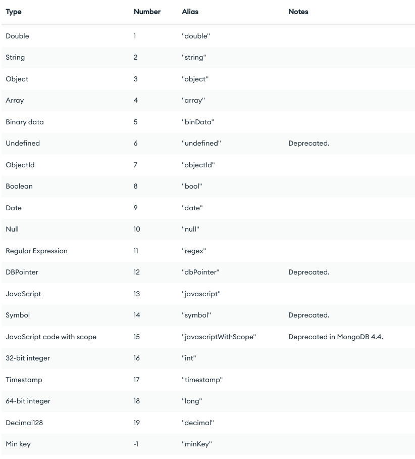
    <figcaption>Figura BSON 1: Tipos de datos BSON. (Fuente: MongoDB)</figcaption>
</figure>

Un ejemplo de un objeto BSON podría ser

```json
var mydoc = {
               _id: ObjectId("5099803df3f4948bd2f98391"),
               name: { first: "Alan", last: "Turing" },
               birth: new Date('Jun 23, 1912'),
               death: new Date('Jun 07, 1954'),
               contribs: [ "Turing machine", "Turing test", "Turingery" ],
               views : NumberLong(1250000)
            }
```

Donde los campos del ejemplo anterior tienen los siguientes tipos de datos:

- **_id** contiene un `ObjectId`.
- **name** contiene un documento embebido que contiene los campos **first** y **last**.
- **birth** y **death** mantienen valores del tipo `Date`.
- **contribs** contiene un `string`.
- **views** tiene un valor del tipo `NumberLong`.


Además, BSON también contiene expresiones que permiten la representación de tipos de datos que no forman parte de la especificación JSON. _Puedes consultarlos todos en [https://www.mongodb.com/docs/manual/reference/bson-types/](https://www.mongodb.com/docs/manual/reference/bson-types/)_

De todos estos tipos de datos, en MongoDB debemos hacer mayor consideración a estos particulares:

#### Binary Data

EL valor de un Binary Data `bindata` es un array de bytes. Un valor de `bindata` tiene un subtipo que indica cómo interpretar los datos binarios. La siguiente tabla muestra los subtipos. 

<figure style="align: center;">
    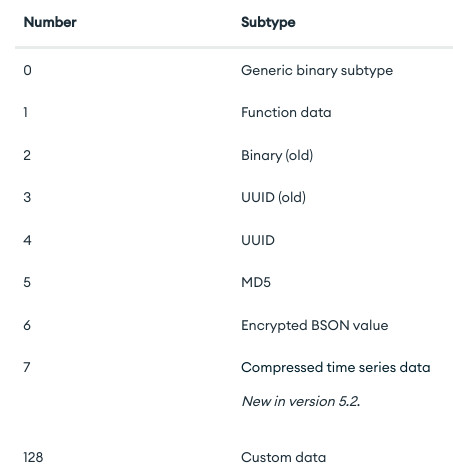
    <figcaption>Figura BSON 2: Subtipos de datos BSON Binary Data. (Fuente: MongoDB)</figcaption>
</figure>

#### ObjectIds

Los ObjectIds `object` son pequeños, probablemente únicos, rápidos de generar y ordenados. Los valores de ObjectId tienen una longitud de 12 bytes y constan de:

- 4-byte timestamp, que representa la creación del ObjectId, medida en segundos desde la época de Unix.
- Un valor aleatorio de 5 bytes generado una vez por proceso. Este valor aleatorio es exclusivo de la máquina y del proceso.
- Un contador incremental de 3 bytes, inicializado a un valor aleatorio.

!!! note 

    En MongoDB, cada documento almacenado en una colección **requiere un campo _id único que actúa como clave principal**. Si un documento insertado omite el campo _id, el controlador MongoDB genera automáticamente un ID de objeto para el campo _id.

#### String

BSON String `string` son UTF-8. En general, los controladores para cada lenguaje de programación convierten del formato de cadena del lenguaje a UTF-8 al serializar y deserializar BSON. Esto hace posible almacenar la mayoría de los caracteres internacionales en cadenas BSON con facilidad. Además, las consultas _$regex_ de MongoDB admiten UTF-8 en la cadena de expresiones regulares.

#### Timestamp

BSON tiene un tipo `timestamp` especial para uso interno de MongoDB y no está asociado con el estándar Tipo _Date_. Este tipo de marca de tiempo interna es un valor de 64 bits donde:

- los 32 bits más significativos son un valor `time_t `(segundos desde la época Unix)
- los 32 bits menos significativos son un `ordinal` incremental para operaciones dentro de un segundo determinado.

### 2.2 Document Limitations

!!! info end inline

    _Puedes consultar toda la información relacionada con documentos en [https://www.mongodb.com/docs/manual/core/document/](https://www.mongodb.com/docs/manual/core/document/)_

#### Límite de tamaño del documento

El tamaño máximo de documento BSON es de 16MB (ayuda a garantizar que un solo documento no pueda utilizar una cantidad excesiva de RAM ni ancho de banda). Para almacenar documentos que superen el tamaño máximo, MongoDB proporciona la API GridFS.

#### Orden de campos del documento

A diferencia de los objetos JavaScript, los campos de un documento BSON están ordenados. Pero no asegura que el orden de los campos se respete

#### Case sensitive

Es sensible a las mayúsculas y minúsculas

### 2.3 Comandos de Administración

Para la administración del sistema de bases de datos, MongoDB pone a disposición de los usuarios las siguientes utilidades:

- **mongo**: Se trata del shell interactivo de MongoDB que permite insertar, eliminar, actualizar datos y realizar consultas, además de replicar la información, apagar servidores y ejecutar código JavaScript.

- **mongostat**: Herramienta de línea de comandos que muestra las estadísticas de una instancia en ejecución de MongoDB

- **mongotop**: Herramienta de línea de comandos que muestra la cantidad de tiempo empleado en la lectura y escritura de datos por parte de la instancia en ejecución

- **mongosniff**: Herramienta de línea de comandos que permite hacer un rastreo del tráfico de la red que va desde y hacia MongoDB.

- **mongoimport/mongoexport**: Herramienta de línea de comandos para importar y exportar contenido en o desde .json, .csv o .tsv entre otros.

- **mongodump/mongorestore**: Herramienta de línea de comandos para la creación de una exportación binaria del contenido de la base de datos.

!!! tip "BSON => JSON"

    Si necesitamos transformar un fichero BSON a JSON, usaríamos el comando (bsondump)[https://www.mongodb.com/docs/database-tools/bsondump/]:

    ```
    bsondump file.bson > file.json
    ```

## 3. Instalación y uso

### 3.1 Docker

Vamos a explicar como levantar un contenedor MongoDB con Docker

!!! warning "Docker engine vs Docker Desktop on Linux"

    Linux, ya tenemos por defecto docker engine para la ejecución de contenedores. Si instalamos docker desktop hay que tener en cuenta que docker desktop trabaja sobre un maquina virtual **KVM**. Esto significa que las imágenes desplegadas en docker engine no están disponibles en docker desktop y viceversa. Para ello podemos "jugar" con el contexto de docker.

    Para más información observa la documentación oficial de docker: [What is the difference between Docker Desktop for Linux and Docker Engine](https://docs.docker.com/desktop/faqs/linuxfaqs/#what-is-the-difference-between-docker-desktop-for-linux-and-docker-engine)

    <figure style="align: center; width:600px;">
    
        <figcaption>Figura Docker 1. Docker Desktop on Linux. (Fuente: Docker)</figcaption>
    </figure>

    Para más información observa los siguientes recursos:

    - [Why does Docker Desktop for Linux run a VM?](https://docs.docker.com/desktop/faqs/linuxfaqs/#why-does-docker-desktop-for-linux-run-a-vm)
    - [Docker Desktop vs. Docker Engine en Ubuntu LTS](https://www.youtube.com/watch?v=9hW6SC8VPLQ). Video explicativo


1. Instalar MondoDB en Docker
2. Vamos a la [imagen oficial de mondodb en docker](https://hub.docker.com/_/mongo)
3. Observa con detenimiento la información que nos facilita la imagen oficial para el despliegue y configuración de los contenedores
4. Seguimos los pasos, que tienen este formato
   
    ```
    docker run -d --network some-network --name some-mongo \
    -e MONGO_INITDB_ROOT_USERNAME=mongoadmin \
    -e MONGO_INITDB_ROOT_PASSWORD=secret \
    mongo:tag
    ```
En mi caso voy a añadir un bind mount para poder luego importar un fichero para el ejemplo. Por tanto sería:

    ```
    docker run -d --name mongodb-bda1 -e MONGO_INITDB_ROOT_USERNAME=admin -e MONGO_INITDB_ROOT_PASSWORD=admin --mount type=bind,src=/home/jaime/BigData/BDA/,dst=/home/bda mongo:latest
    ```
También podemos crear el contenedor sin bind mount y copiarla directamente con `docker cp`:

    ```
    docker run -d --name mongodb-bda1 -e MONGO_INITDB_ROOT_USERNAME=admin -e MONGO_INITDB_ROOT_PASSWORD=admin mongo:latest
    docker cp fichero mongo:/directorio
    ```

5. Para añadir documentos, podemos importar datos de un dataset `mongoimport`, por ejemplo de kaggle, o restaurar una Base de datos `mongorestore` 

    === "Dataset restaurantes1.csv"

        Descarga [restaurantes1.csv](Ejercicios_clase/restaurantes1.csv)

    === "sampledata (muestra de datos de MongoDB, la misma de Mongo Atlas)"

        ```
        wget https://atlas-education.s3.amazonaws.com/sampledata.archive
        ```

6. Copiamos los archivos que vamos a importar/restaurar

    === "restaurantes1.csv"

        ``` 
        docker cp restaurantes1.csv mongodb-bda1:/tmp
        ```

    === "sampledata"

        ```
        docker cp sampledata.archive mongodb-bda1:/tmp
        ```

7. Abre una terminal en el contenedor (_puedes abrirla por Docker Desptop también_)

    ```
    docker exec -it mongodb-bda1 sh
    ```

8. Restauramos/importamos

    === "Importamos restaurantes1.csv"

        ``` 
        mongoimport --db=db_ej1_restaurantes --collection=restaurantes --file=tmp/restaurantes1.csv --authenticationDatabase=admin --username=admin --password=admin
        ```

    === "Restauramos sampledata"

        ```
        mongorestore --archive=/tmp/sampledata.archive --authenticationDatabase=admin --username=admin --password=admin
        ```

        ```
        2023-10-13T19:20:03.814+0000	preparing collections to restore from
        2023-10-13T19:20:03.817+0000	reading metadata for sample_airbnb.listingsAndReviews from archive '/tmp/sampledata.archive'
        2023-10-13T19:20:03.817+0000	reading metadata for sample_analytics.accounts from archive '/tmp/sampledata.archive'
        2023-10-13T19:20:03.817+0000	reading metadata for sample_analytics.customers from archive '/tmp/sampledata.archive'
        ...
        2023-10-13T19:20:14.010+0000	425367 document(s) restored successfully. 0 document(s) failed to restore.
        ```

9.  Comprobamos. Entrar a la consola de mongo y autorizarnos

    ```
    mongosh
    use admin
    db.auth("admin","admin")
    ```


10.  Ver las bases de datos

    ```
    show dbs
    ```

    <figure style="align: center;">
    
        <figcaption>Figura Docker 2. Mostrar las Bases de datos con Mongo. (Fuente: Propia)</figcaption>
    </figure>

11.  Usar la Base de datos (_use nombre_bd_ , también sirve para crear una Base de datos) 

    ```
    use db_ej1_restaurantes
    ```

12. Ver las colecciones de la base de datos que estamos usando
   
    ```
    show collections
    ```

13. Mostramos los documentos

    ```
    db.restaurantes.find()
    ```

### 3.2 Soluciones Mongo

En la actualidad, MongoDB se comercializa mediante tres productos:

- [MongoDB Enterprise Advanced](https://www.mongodb.com/es/products/mongodb-enterprise-advanced), versión de pago con soporte, herramientas avanzadas de monitorización y seguridad, y administración automatizada.
- [MongoDB Community Edition](https://www.mongodb.com/try/download/community), Software gratuito para trabajar on-premise, con versiones para diferentes sistemas operativos.
- [Mongo Atlas](https://www.mongodb.com/atlas), como plataforma cloud, con una opción gratuita mediante un cluster de 512MB.

#### MongoDB Community Edition

Instalación on-promise de MongoDB. Si deseas una instalación en local puedes seguir las instrucciones de la [documentación oficial](https://www.mongodb.com/try/download/community).

### 3.3 Mongo Atlas

Podemos hacer uso de una solución gratuita cloud de Mongo Atlas ofrecida por MongoDB, con 512MB de RAM compartida y 5GB de almacenamiento

<figure style="align: center;">
    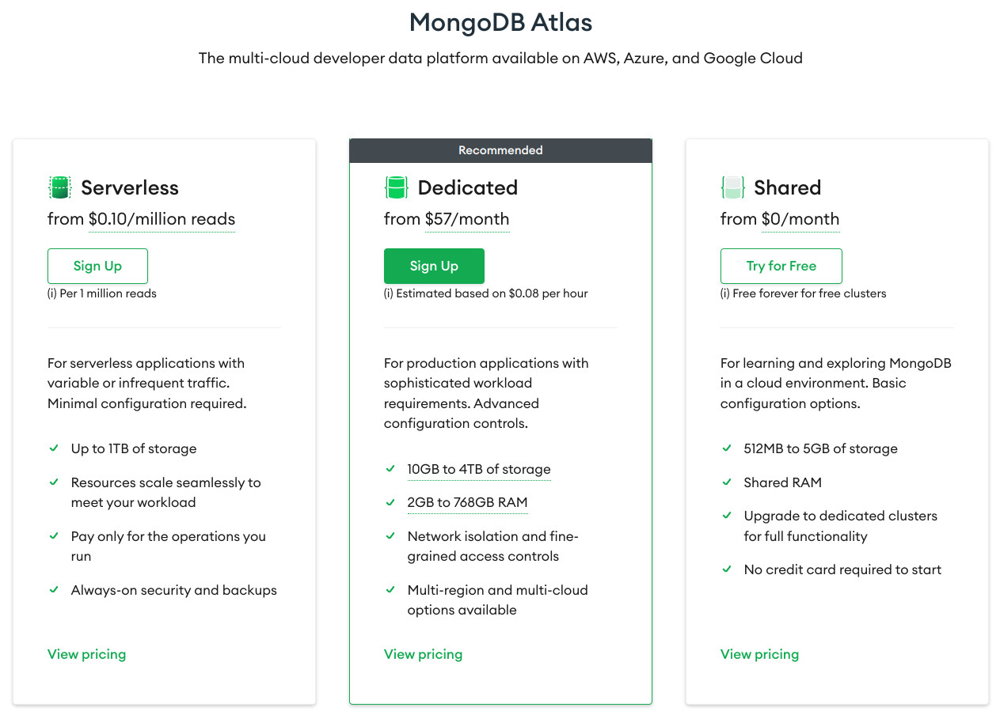
    <figcaption>Figura Atlas 1: MongoDB Atlas. (Fuente: Propia)</figcaption>
</figure>

Para ello seguimos todos los pasos: ***[Getting Started MongoDB](https://www.mongodb.com/docs/manual/tutorial/getting-started/)***

<figure style="align: center; width:600px;">
    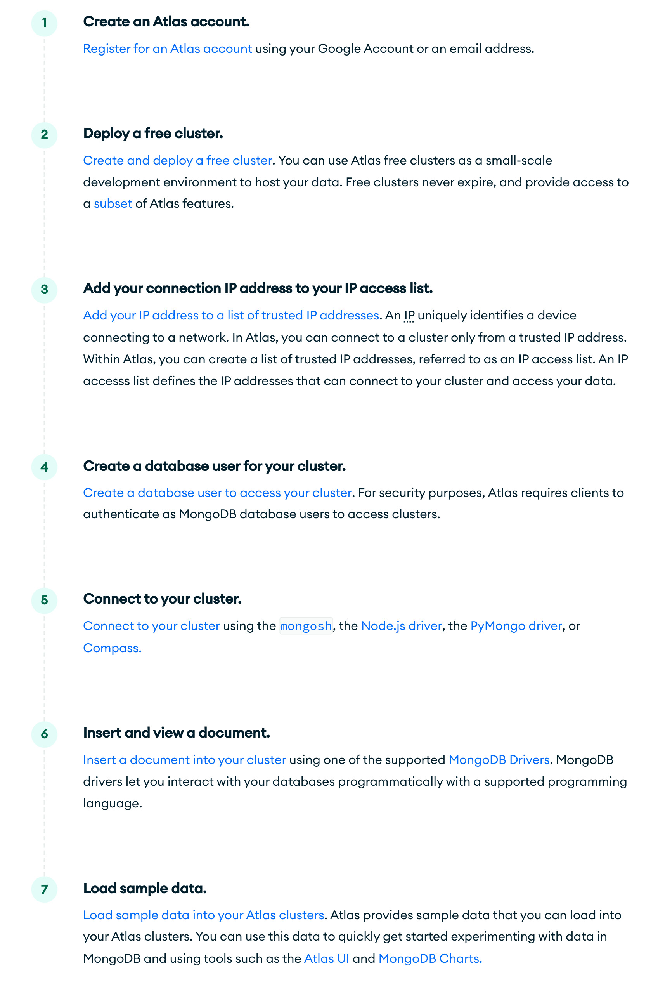
    <figcaption>Figura Atlas 2: MongoDB Atlas. Get Started. (Fuente: Propia)</figcaption>
</figure>


1. Creamos cuenta

2. Añadir tu dirección ip a la lista de ips de acceso al cluster

    - Menú izquierdo => Network Access

    - Add IP Address (Derecha)

<figure style="align: center;">
    
    <figcaption>Figura Atlas 3: MongoDB Atlas. Añadir IP. (Fuente: MongoDB)</figcaption>
</figure>

3. Desplegamos cluster gratuito. Creamos una Organización, Proyecto y una Base de Datos del cluster
   
   - Crear Organización

<figure style="align: center;">
    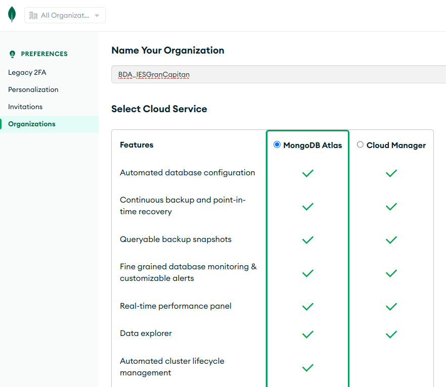
    <figcaption>Figura Atlas 4: Añadir Organización. (Fuente: Propia)</figcaption>
</figure>

   - Crear Proyecto

<figure style="align: center;">
    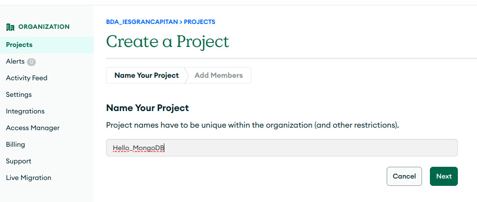
    <figcaption>Figura Atlas 5: Añadir Proyecto. (Fuente: Propia)</figcaption>
</figure>

   - Nueva Base de datos

<figure style="align: center;">
    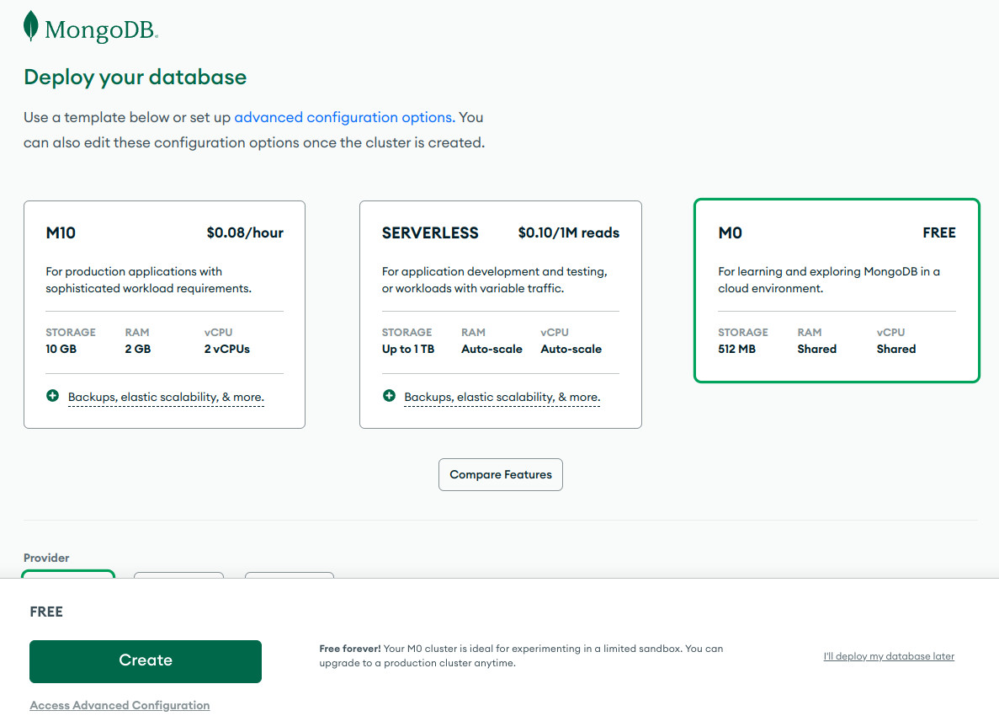
    <figcaption>Figura Atlas 6: Añadir Base de datos. (Fuente: Propia)</figcaption>
</figure>

   - Creando cluster

<figure style="align: center;">
    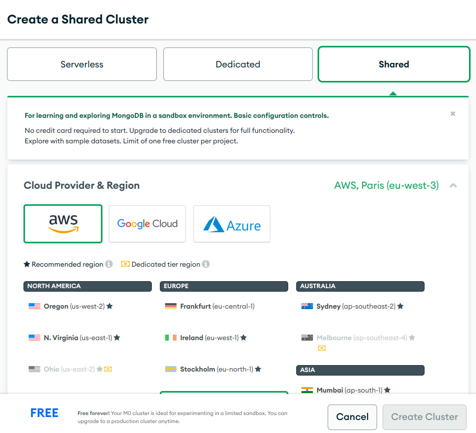
    <figcaption>Figura Atlas 7: Cluster. (Fuente: Propia)</figcaption>
</figure>

4. Crear un usuario para la Base de Datos

<figure style="align: center;">
    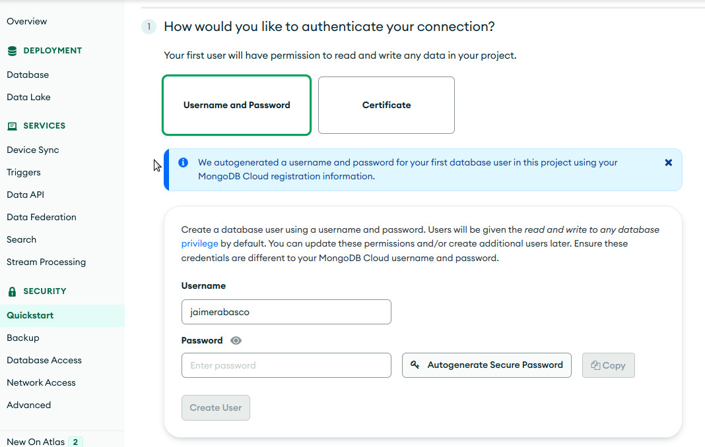
    <figcaption>Figura 8 Atlas: Nuevo usuario. (Fuente: Propia)</figcaption>
</figure>

5. Cargar contenido en nuestra Base de Datos. Vamos a usar uno de los Data Set de ejemplo facilitados por el propio MongoDB.

    - Damos a la opción de los **...** y Load Data Sample.

<figure style="align: center;">
    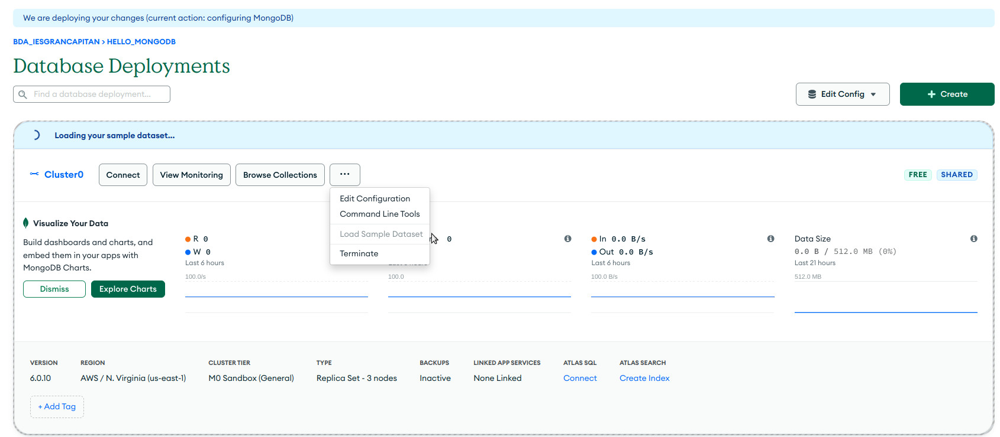
    <figcaption>Figura Atlas 9. Cargar datos a la Base de Datos. (Fuente: Propia)</figcaption>
</figure>

   - Browser Collections

<figure style="align: center;">
    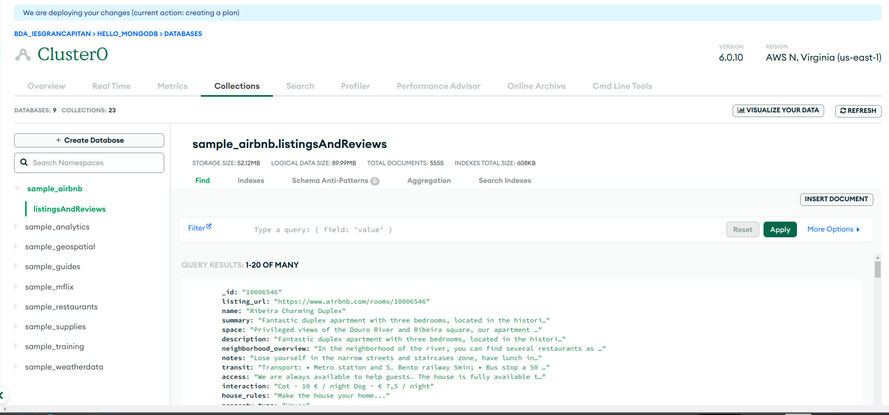
    <figcaption>Figura Atlas 10: Browser Collections. (Fuente: Propia)</figcaption>
</figure>

1. Conectarte a tu cluster. Hay varias formas de conexión a tu cluster.

   - [A MongoDB driver](https://www.mongodb.com/docs/drivers/), un controlador para comunicarse con su base de datos MongoDB mediante programación. Soporta varios lenguajes de programación.
   
   - [MongoDB Compass](https://www.mongodb.com/docs/compass/current/), una GUI para sus datos de MongoDB. Puede utilizar Compass para explorar, modificar y visualizar sus datos.
   
   - [The MongoDB Shell](https://www.mongodb.com/docs/mongodb-shell/), una interfaz de línea de comandos interactiva para MongoDB. Puedes usar mongosh para insertar e interactuar con datos en su clúster Atlas.
   
   - MongoDB for VS Code. Para trabajar MongoDB en VS Code
   
   - Atlas SQL. Para conectar fácilmente a Atlas para visualización y análisis de datos

<figure style="align: center; width:600px;">
    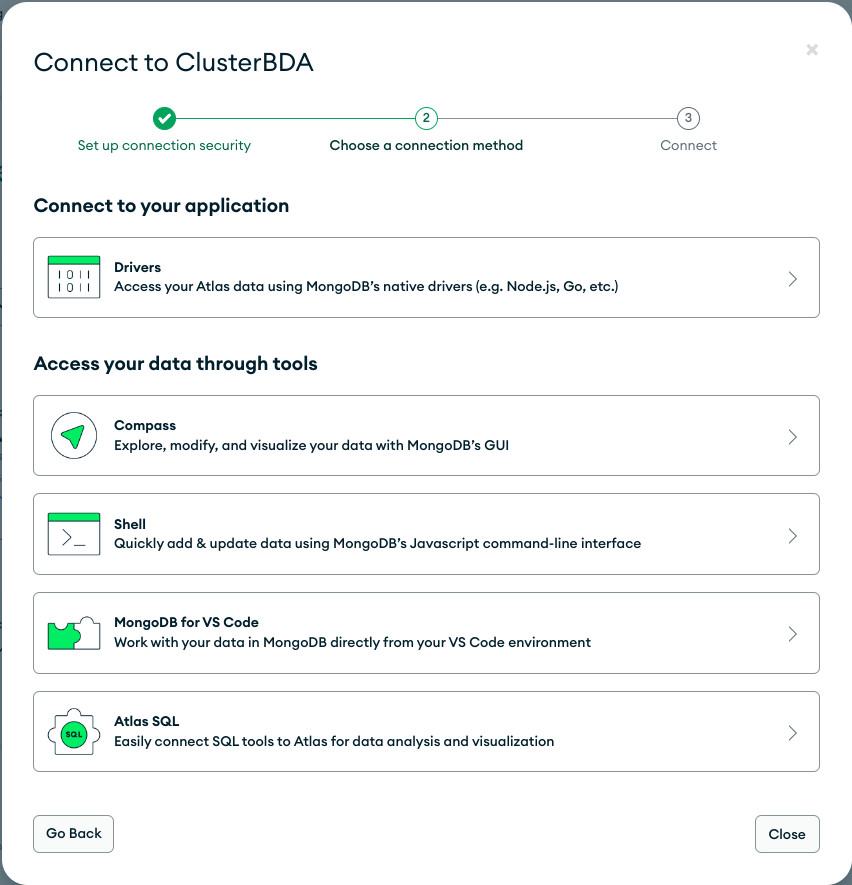
    <figcaption>Figura Atlas 11. Formas de conexión a Atlas. (Fuente: Propia)</figcaption>
</figure>

### 3.4 MongoDB Shell

Para esta conexión, solo necesitamos usar el comando `mongosh` con las credenciales configuradas anteriormente. Siguiendo los pasos dentro de **connect en la opción Mongo Shell** que nos da Mongo Atlas (figura anterior) 

<figure style="align: center; width:600px;">
    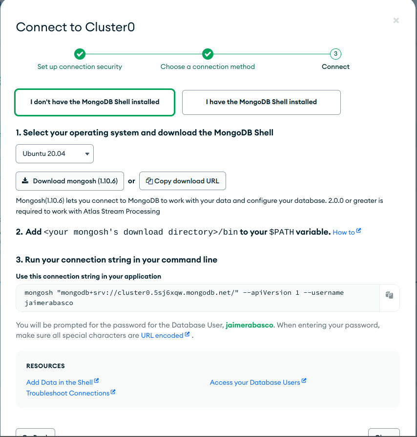
    <figcaption>Figura Atlas 12. Connect Mongo Shell. (Fuente: Propia)</figcaption>
</figure>

Y escribiendo después la contraseña establecida nos conectamos a nuestro al servicio cloud

<figure style="align: center; width:600px;">
    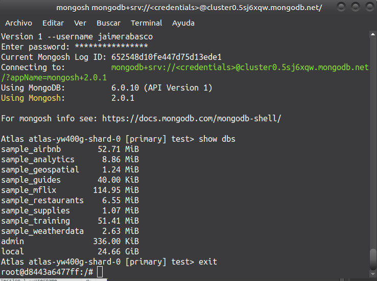
    <figcaption>Figura Atlas 13. Connect mongosh. (Fuente: Propia)</figcaption>
</figure>


### 3.5 MongoDB para VS Code

1. Para ello usamos la [extensión](https://marketplace.visualstudio.com/items?itemName=mongodb.mongodb-vscode) `MongoDB for VS Code` 

<figure style="align: center; width:600px;">
    
    <figcaption>Figura MongoDB for VSCode 1. Extensión. (Fuente: Propia)</figcaption>
</figure>

2. Damos a la opción de connect en nuestro MongoDB Atlas y seleccionamos MongoDB for VSCode. Seguimos los pasos que nos indican. Copiamos la url del punto 3 y le añadimos nuestra contraseña

<figure style="align: center; width:600px;">
    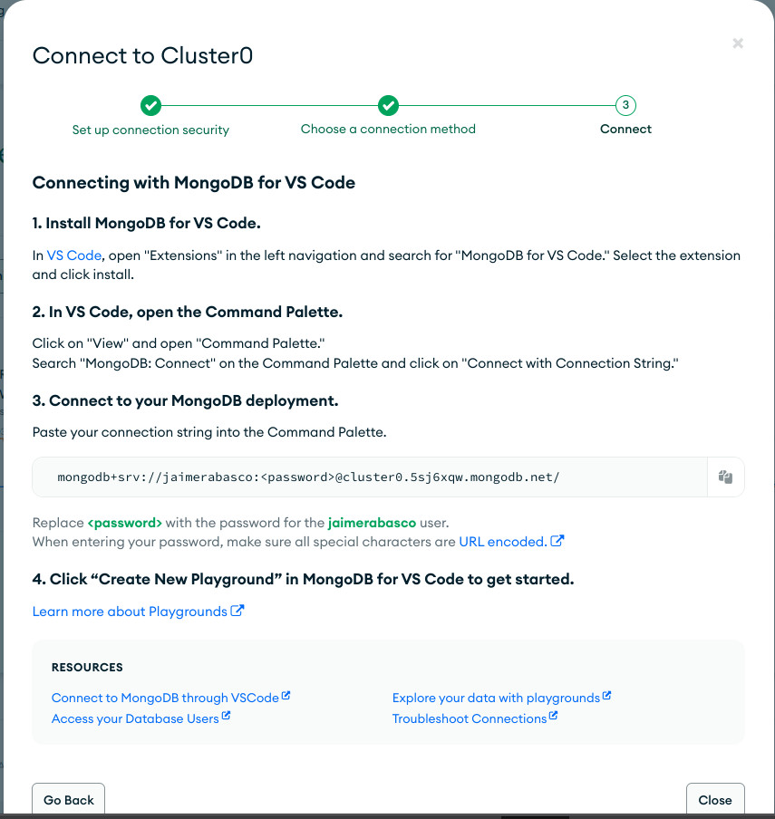
    <figcaption>Figura MongoDB for VSCode 2. Conectando con Mondo Atlas. (Fuente: Propia)</figcaption>
</figure>

3. Vamos a nuestra extensión y le damos a **connecting string** y añadimos la url con nuestra contraseña.


<figure style="align: center;">
    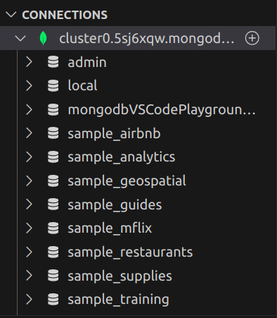
    <figcaption>Figura MongoDB for VSCode 3. Conectado con Mondo Atlas. (Fuente: Propia)</figcaption>
</figure>


4. Seguimos los pasos y creamos un **New Playground**. Como test, ejecutamos (_botón play arriba a la derecha_) el playground creado por defecto. Observa el resultado, la salida en consola y los nuevos datos creados en nuestra Cloud Database.

<figure style="align: center; width:600px;">
    
    <figcaption>Figura MongoDB for VSCode 4. Ejecutando playground. (Fuente: Propia)</figcaption>
</figure>

5. Observa el código del playground. Presta especial atención a las palabras reservadas `db, use, consolo.log(), print(), printjson()`. Para mas información de uso consulta la [documentación oficial](https://www.mongodb.com/docs/mongodb-vscode/playgrounds/)
   
6. También puedes ejecutar una shell de mongoDB usando botón derecho sobre la conexión y pulsando ***Launch MongoDB Shell***. _Para ello debes tener en tu sistema [MongoDB Shell](https://www.mongodb.com/docs/mongodb-shell/install/)_

<figure style="align: center; width:600px;">
    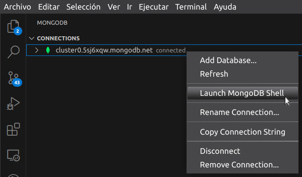
    <figcaption>Figura MongoDB for VSCode 5. MongoDB Shell en VSCode. (Fuente: Propia)</figcaption>
</figure>

### 3.6 MongoDB Compass

MongoDB [Compass](https://www.mongodb.com/es/products/tools/compass) es una potente GUI para consultar, agregar y analizar sus datos de MongoDB en un entorno visual. MongoDB Compass viene con 3 versiones diferentes:

- **Compass**: La **full version** de MongoDB Compass, con todas las características y capacidades.
- **Readonly Edition**: Esta versión se limita estrictamente a operaciones de lectura, y se eliminan todas las capacidades de escritura y eliminación (ideal para Analista de Datos).
- **Isolated Edition**: Esta versión deshabilita todas las conexiones de red excepto la conexión a la instancia de MongoDB.

!!! info end inline

    Compass es de uso gratuito y está disponible en origen, y puede ejecutarse en macOS, Windows y Linux.

Puedes ver toda la [documentación](https://www.mongodb.com/docs/compass/current/) y los pasos de [instalación](https://www.mongodb.com/docs/compass/current/install/) en la documentación oficial


Para **comprobar su funcionamiento**, vamos a conectarnos a nuestra Base de Datos en Atlas:

1. Instalamos siguiendo los pasos de la documentación oficial.
2. Vamos a las opciones de conexión y elegimos la opción compass. Copiamos el string de conexión añadiendo nuestra contraseña.

<figure style="align: center; width:600px;">
    
    <figcaption>Figura MongoDB Compass 1. Conexión mediante Compass. (Fuente: Propia)</figcaption>
</figure>

3. En Compass, abrimos la opción de conexión y copiamos nuestro string de conexión.

<figure style="align: center; width:600px;">
    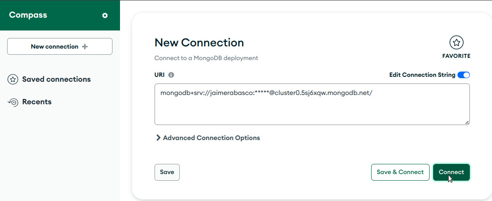
    <figcaption>Figura MongoDB Compass 2. String de conexión. (Fuente: Propia)</figcaption>
</figure>

4. Ya podemos usar la GUI de Compass.

<figure style="align: center; width:600px;">
    
    <figcaption>Figura MongoDB Compass 3. GUI de Compass 1. (Fuente: Propia)</figcaption>
</figure>

5. Visualizar las Base de Datos, Collections y Documentos. Debajo también se nos abre una conexión con `mongosh` para realizar las operaciones que queramos en terminal si lo deseamos (_la cual podemos minimizar_).

<figure style="align: center; width:600px;">
    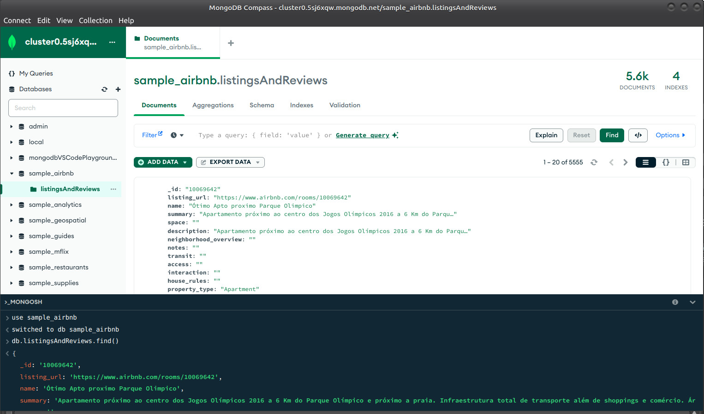
    <figcaption>Figura MongoDB Compass 4. GUI de Compass 2. (Fuente: Propia)</figcaption>
</figure>

### 3.7 MongoDB Tools

The [MongoDB Database Tools](https://www.mongodb.com/docs/database-tools/) son una colección de utilidades de línea de comandos para trabajar con una implementación de MongoDB. Las herramientas de base de datos incluyen los siguientes binarios:

1. **Binary Import / Export:**
   
  - `mongodump`: Crea una exportación binaria del contenido de un demonio _mongod_.
  - `mongorestore`: Restaura datos de un volcado de base de datos mongodump en un _mongod_ o _mongos_ (_Para un shared cluster, las instancias de _mongos_ proporcionan la interfaz entre las aplicaciones cliente y el clúster fragmentado.)_
  - `bsondump`: Convierte archivos _BSON dump_ into _JSON_.
  
2. **Data Import / Export:**
   
  - `mongoimport`: Importa el contenido desde un archivo externo E_xtended JSON, CSV, or TSV._
  - `mongoexport`:Produce una exportación JSON o CSV de datos almacenados en un instancia de _mongod_.
  
3. **Diagnostic Tools:**
   
  - `mongostat`: Proporciona una descripción general rápida del estado de una instancia de _mongod_ o _mongos_ actualmente en ejecución.
  - `mongotop`: Proporciona una descripción general del tiempo que una instancia de _mongod_ dedica a leer y escribir datos.
  
4. **GridFS Tools:**
   
  - `mongofiles`: admite la manipulación de archivos almacenados en su instancia de MongoDB en objetos _GridFS_.

Puedes optar por descargar estas herramientas en local o utilizar algunas de las opciones mostradas anteriormente. La instancia de MongoDB creada en Docker también tiene por defecto todas estas herramientas.


## 4. Operaciones CRUD

### 4.1 Create Operations

Las operaciones de creación o inserción agregan nuevos documentos a una colección. Si la colección no existe actualmente, las operaciones de inserción crearán la colección.

MongoDB proporciona los siguientes métodos para insertar documentos en una colección:

- db.collection.insertOne()
- db.collection.insertMany() 

En MongoDB, las operaciones de inserción tienen como objetivo una única colección. Todas las operaciones de escritura en MongoDB son **atómicas** al nivel de un solo documento.

<figure style="align: center; width: 600px;">
    
    <figcaption>Figura MongoDB Create Operations. (Fuente: MongoDB)</figcaption>
</figure>

#### Insertar un documento

`db.collection.insertOne()` inserta un único documento dentro de una collection.

!!! note Insert behavior

    El siguiente código inserta un nuevo documento en la colección de inventario. Si el documento no especifica un campo _id, MongoDB agrega el campo _id con un valor ObjectId al nuevo documento.

```json
db.inventory.insertOne(
   { item: "canvas", qty: 100, tags: ["cotton"], size: { h: 28, w: 35.5, uom: "cm" } }
)
```

`insertOne()` devuelve un documento que incluye el valor del campo _id del documento recién insertado. 

#### Insertar varios documentos

`db.collection.insertMany()` puede insertar múltiples documentos a una collection. Pasa un array of documentos al método.

```json
db.inventory.insertMany([
   { item: "journal", qty: 25, tags: ["blank", "red"], size: { h: 14, w: 21, uom: "cm" } },
   { item: "mat", qty: 85, tags: ["gray"], size: { h: 27.9, w: 35.5, uom: "cm" } },
   { item: "mousepad", qty: 25, tags: ["gel", "blue"], size: { h: 19, w: 22.85, uom: "cm" } }
])
```

### 4.2 Read Operations

En primer lugar, antes de aprender como se realizan consultas en MongoDB, vamos a ver cuales son los operadores que facilita MongoDB para poder realizar todo tipo de consultas. 

Seguidamente veremos como realizar consultas.

#### 4.2.1 Query Operators

Mostraremos un resumen de todos los operadores (salvo _aggregation operators_ que veremos más adelante cuando expliquemos agregaciones). Para más detalle, explicación y ejemplo de cada operador, la puedes encontrar en la [documentación oficial](https://www.mongodb.com/docs/manual/reference/operator/query/)

#### Query Selectors

1. **Comparison**

<figure style="align: center; width: 800px;">
    
    <figcaption>Figura MongoDB Operators 1. Comparison Operators (Fuente: MongoDB)</figcaption>
</figure>

2. **Logical**

<figure style="align: center; width: 800px;">
    
    <figcaption>Figura MongoDB Operators 2. Logical Operators _(Fuente: MongoDB)_</figcaption>
</figure>

3. **Element**

<figure style="align: center; width: 800px;">
    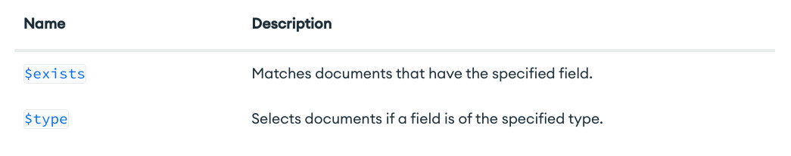
    <figcaption>Figura MongoDB Operators 3. Element Operators (Fuente: MongoDB)</figcaption>
</figure>

4. **Evaluation**

<figure style="align: center; width: 800px;">
    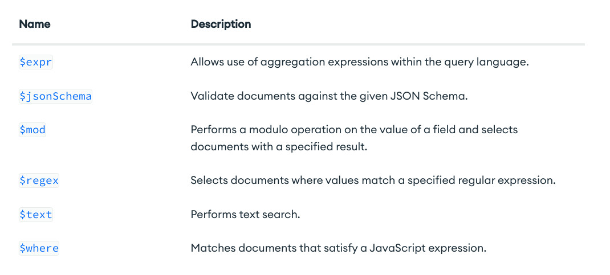
    <figcaption>Figura MongoDB Operators 4. Evaluation Operators (Fuente: MongoDB)</figcaption>
</figure>

5. **Geospatial**

<figure style="align: center; width: 800px;">
    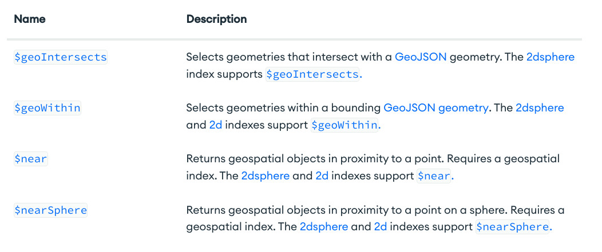
    <figcaption>Figura MongoDB Operators 5. Geospatial Operators (Fuente: MongoDB)</figcaption>
</figure>

6. **Array**

<figure style="align: center; width: 800px;">
    
    <figcaption>Figura MongoDB Operators 6. Array Operators (Fuente: MongoDB)</figcaption>
</figure>

7. **Bitwise**

<figure style="align: center; width: 800px;">
    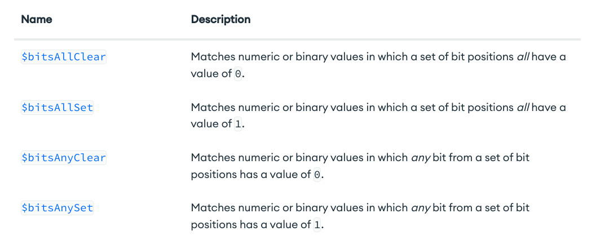
    <figcaption>Figura MongoDB Operators 7. Bitwise Operators (Fuente: MongoDB)</figcaption>
</figure>

#### Projection Operators

<figure style="align: center; width: 800px;">
    
    <figcaption>Figura MongoDB Operators 8. Projection Operators (Fuente: MongoDB)</figcaption>
</figure>

#### Miscellaneous Operators

<figure style="align: center; width: 800px;">
    
    <figcaption>Figura MongoDB Operators 9. Miscellaneous Operators (Fuente: MongoDB)</figcaption>
</figure>


#### 4.2.2 Consultas MondoDB

Para usar como ejemplo añadimos los siguientes documentos. Primero nos aseguramos de tener la collection vacía.

```
db.inventory.deleteMany({})
```

```json
db.inventory.insertMany([
   { item: "journal", qty: 25, size: { h: 14, w: 21, uom: "cm" }, status: "A" },
   { item: "notebook", qty: 50, size: { h: 8.5, w: 11, uom: "in" }, status: "A" },
   { item: "paper", qty: 100, size: { h: 8.5, w: 11, uom: "in" }, status: "D" },
   { item: "planner", qty: 75, size: { h: 22.85, w: 30, uom: "cm" }, status: "D" },
   { item: "postcard", qty: 45, size: { h: 10, w: 15.25, uom: "cm" }, status: "A" }
]);
```

#### Seleccionar todos los documentos de un Collection

Para seleccionar todos los documentos de la colección, pasamos un documento vacío como parámetro de filtro de consulta al método de búsqueda. Esta operación utiliza un predicado de filtro de {}:


=== "Mongosh"

    ```json
    db.inventory.find( {} )
    ```

=== "Equivalente en SQL"

    ```sql
    SELECT * FROM inventory
    ```

***Para poder realizar cualquier tipo de consulta/búsqueda usaremos dentro de las {} los filtros/operadores (vistos en el punto anterior) para realizar todo tipo de consultas***.

#### Especificando una condición de igualdad

Para especificar condiciones de igualdad, utiliza la expresión `<field>:<value>` como filtro de la consulta del documento:

```json
{ <field1>: <value1>, ... }
```

El siguiente ejemplo selecciona de la colección de inventario todos los documentos cuyo estado es "D":


=== "Mongosh"

    ```json
    db.inventory.find( { status: "D" } )
    ```

=== "Equivalente en SQL"

    ```sql
    SELECT * FROM inventory WHERE status = "D"
    ```

#### Especificando condiciones mediante operadores de consulta

Un filtro de consulta de un documento  puede utilizar los operadores de consulta para especificar condiciones de la siguiente forma:

```json
{ <field1>: { <operator1>: <value1> }, ... }
```

El siguiente ejemplo recupera todos los documentos de la colección donde el estado es "A" o "D":

=== "Mongosh"

    ```json
    db.inventory.find( { status: { $in: [ "A", "D" ] } } )
    ```
    _Podría usarse también el operador `$or`_

=== "Equivalente en SQL"

    ```sql
    SELECT * FROM inventory WHERE status in ("A", "D")
    ```
#### Usando condición `AND`

Una consulta compuesta puede especificar condiciones para más de un campo en los documentos de la colección. Implícitamente, una conjunción lógica `AND` conecta las cláusulas de una consulta compuesta de modo que la consulta selecciona los documentos de la colección que coinciden con todas las condiciones.

El siguiente ejemplo recupera todos los documentos de la colección donde el estado es igual a "A" y la cantidad es menor que `$lt` 30:

=== "Mongosh"

    ```json
    db.inventory.find( { status: "A", qty: { $lt: 30 } } )
    ```

=== "Equivalente en SQL"

    ```sql
    SELECT * FROM inventory WHERE status = "A" AND qty < 30
    ```
    
#### Usando condición `OR`

Con el operador `$or`, puedes especificar una consulta compuesta que una cada cláusula con una conjunción OR lógica para que la consulta seleccione los documentos de la colección que coincidan con al menos una condición.

El siguiente ejemplo recupera todos los documentos de la colección donde el estado es igual a "A" o la cantidad es menor que `$lt` 30:

=== "Mongosh"

    ```json
    db.inventory.find( { $or: [ { status: "A" }, { qty: { $lt: 30 } } ] } )
    ```

=== "Equivalente en SQL"

    ```sql
    SELECT * FROM inventory WHERE status = "A" OR qty < 30
    ```
  
#### Especificando condiciones `AND` y `OR`

En el siguiente ejemplo, el documento de consulta compuesta selecciona todos los documentos de la colección donde el estado es igual a "A" y la cantidad es menor que `$lt` 30 o el elemento comienza con el carácter p:

=== "Mongosh"

    ```json
    db.inventory.find( {
     status: "A",
     $or: [ { qty: { $lt: 30 } }, { item: /^p/ } ]
    } )
    ```

    Podría usarse otro operador de filtro:

    ```json
    db.inventory.find( {
     status: "A",
     $or: [ { qty: { $lt: 30 } }, { item: { $regex: '^p' } } ]
    } )
    ```

=== "Equivalente en SQL"

    ```sql
    SELECT * FROM inventory WHERE status = "A" AND ( qty < 30 OR item LIKE "p%")
    ```

Con esta introducción podemos tener una buena introducción a las _query operations_ de MongoDB. Pero existen otros muchos tipos:

- [Query on Embedded/Nested Documents](https://www.mongodb.com/docs/manual/tutorial/query-embedded-documents/)
- [Query an Array](https://www.mongodb.com/docs/manual/tutorial/query-arrays/)
- [Query an Array of Embedded Documents](https://www.mongodb.com/docs/manual/tutorial/query-array-of-documents/)
- [Project Fields to Return from Query](https://www.mongodb.com/docs/manual/tutorial/project-fields-from-query-results/)
- [Query for Null or Missing Fields](https://www.mongodb.com/docs/manual/tutorial/query-for-null-fields/)

Puedes consultarlas en la [documentación oficial](https://www.mongodb.com/docs/manual/tutorial/query-documents/)

### 4.3 Update Operations

Como en el caso de las consultas, vamos a ver primero los operadores de actualización y seguidamente como realizamos actualizaciones en MongoDB

#### 4.3.1 Update Operators

Los siguientes modificadores están disponibles para su uso en operaciones de actualización.

#### Sintaxis

```json
{
   <operator1>: { <field1>: <value1>, ... },
   <operator2>: { <field2>: <value2>, ... },
   ...
}
```

Para más detalle, explicación y ejemplo de cada operador, la puedes encontrar en la [documentación oficial. Update Operator](https://www.mongodb.com/docs/manual/reference/operator/update/)


1. **Field update operators**

<figure style="align: center; width: 800px;">
    
    <figcaption>Figura MongoDB Update Operators 1. Field (Fuente: MongoDB)</figcaption>
</figure>

2. **Array update operators**

<figure style="align: center; width: 800px;">
    
    <figcaption>Figura MongoDB Update Operators 2. Array (Fuente: MongoDB)</figcaption>
</figure>

3. **Modifiers update operators**

<figure style="align: center; width: 800px;">
    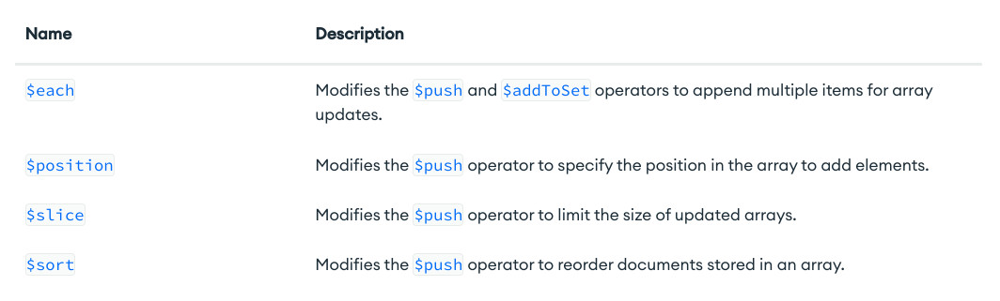
    <figcaption>Figura MongoDB Update Operators 3. Modifiers (Fuente: MongoDB)</figcaption>
</figure>

4. **Bitwise update operators**

<figure style="align: center; width: 800px;">
    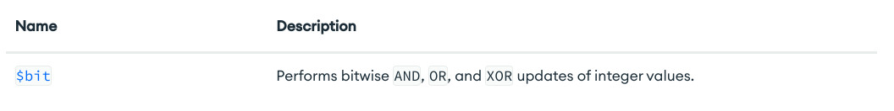
    <figcaption>Figura MongoDB Update Operators 4. Bitwise (Fuente: MongoDB)</figcaption>
</figure>

#### 4.3.2 Actualizaciones

Para usar como ejemplo añadimos los siguientes documentos. Primero nos aseguramos de tener la collection vacía.

```
db.inventory.deleteMany({})
```

```json
db.inventory.insertMany( [
   { item: "canvas", qty: 100, size: { h: 28, w: 35.5, uom: "cm" }, status: "A" },
   { item: "journal", qty: 25, size: { h: 14, w: 21, uom: "cm" }, status: "A" },
   { item: "mat", qty: 85, size: { h: 27.9, w: 35.5, uom: "cm" }, status: "A" },
   { item: "mousepad", qty: 25, size: { h: 19, w: 22.85, uom: "cm" }, status: "P" },
   { item: "notebook", qty: 50, size: { h: 8.5, w: 11, uom: "in" }, status: "P" },
   { item: "paper", qty: 100, size: { h: 8.5, w: 11, uom: "in" }, status: "D" },
   { item: "planner", qty: 75, size: { h: 22.85, w: 30, uom: "cm" }, status: "D" },
   { item: "postcard", qty: 45, size: { h: 10, w: 15.25, uom: "cm" }, status: "A" },
   { item: "sketchbook", qty: 80, size: { h: 14, w: 21, uom: "cm" }, status: "A" },
   { item: "sketch pad", qty: 95, size: { h: 22.85, w: 30.5, uom: "cm" }, status: "A" }
] );
```

MongoDB proporciona los siguientes métodos para actualizar documentos en una colección:

- db.collection.updateOne(<filter>, <update>, <options>)
- db.collection.updateMany(<filter>, <update>, <options>)
- db.collection.replaceOne(<filter>, <update>, <options>)

Para la actualización de documentos de una colletion usamos la siguiente sintaxis

```json
{
  <update operator>: { <field1>: <value1>, ... },
  <update operator>: { <field2>: <value2>, ... },
  ...
}
```

#### Update a Single Document

El siguiente ejemplo utiliza el método `db.collection.updateOne()` en la colección de inventario para actualizar **el primer documento** donde elemento es igual a "paper":

```json
db.inventory.updateOne(
   { item: "paper" },
   {
     $set: { "size.uom": "cm", status: "P" },
     $currentDate: { lastModified: true }
   }
)
```

La operación de actualización:

- utiliza el operador `$set` para actualizar el valor del campo s`ize.uom` a "cm" y el valor del campo de estado a "P",
- utiliza el operador `$currentDate` para actualizar el valor del campo _lastModified_ a la fecha actual. Si el campo _lastModified_ no existe, `$currentDate` creará el campo.

#### Update Multiple Documents

El siguiente ejemplo utiliza el método `db.collection.updateMany()` en la colección de _inventory_ para actualizar **todos los documentos** donde la cantidad es inferior a 50:

```json
db.inventory.updateMany(
   { "qty": { $lt: 50 } },
   {
     $set: { "size.uom": "in", status: "P" },
     $currentDate: { lastModified: true }
   }
)
```

La operación de actualización:

- utiliza el operador `$set` para actualizar el valor del campo `size.uom` a "in" y el valor del campo de estado a "P",
- utiliza el operador `$currentDate` para actualizar el valor del campo _lastModified_ a la fecha actual. Si el campo _lastModified_ no existe, `$currentDate` creará el campo.

#### Replace a Document

Para reemplazar todo el contenido de un documento excepto el campo `_id`, pase un documento completamente nuevo como segundo argumento a `db.collection.replaceOne()`.

!!! note ""

    Al reemplazar un documento, el documento de reemplazo debe consistir únicamente en pares de campo/valor; es decir, no incluir actualizar operadores expresiones.
    
    El documento de reemplazo puede tener campos diferentes a los del documento original. En el documento de reemplazo, puede omitir el campo `_id` ya que el campo `_id` **es inmutable**; sin embargo, si incluye el campo `_id`, debe tener el mismo valor que el valor actual.

El siguiente ejemplo reemplaza el primer documento de la colección de inventario donde elemento: "papel":

```json
db.inventory.replaceOne(
   { item: "paper" },
   { item: "paper", instock: [ { warehouse: "A", qty: 60 }, { warehouse: "B", qty: 40 } ] }
)
```

#### Otros ejemplos

```json
db.ships.updateOne({name : {$eq: 'USS-Enterprise-D'}}, {$set : {name: 'USS Something'}})
db.ships.updateOne({name : {$eq: 'USS Something'}}, {$set : {name: 'USS Prometheus', class: 'Prometheus'}})
db.ships.updateOne({name : {$eq: 'USS Prometheus'}}, {$unset : {operator: 1}})
```

#### 4.3.3 Métodos adicionales

MongoDB tiene otros métodos menos usados para la actualización de documentos en las colecciones:

- db.collection.findOneAndReplace()
- db.collection.findOneAndUpdate()
- db.collection.findAndModify()
- db.collection.bulkWrite()

Puedes obtener más información en la [documentación oficial. Update methods](https://www.mongodb.com/docs/manual/reference/update-methods/)


### 4.4 Delete Operations

Para usar como ejemplo añadimos los siguientes documentos. Primero nos aseguramos de tener la collection vacía.

```
db.inventory.deleteMany({})
```

```json
db.inventory.insertMany( [
   { item: "journal", qty: 25, size: { h: 14, w: 21, uom: "cm" }, status: "A" },
   { item: "notebook", qty: 50, size: { h: 8.5, w: 11, uom: "in" }, status: "P" },
   { item: "paper", qty: 100, size: { h: 8.5, w: 11, uom: "in" }, status: "D" },
   { item: "planner", qty: 75, size: { h: 22.85, w: 30, uom: "cm" }, status: "D" },
   { item: "postcard", qty: 45, size: { h: 10, w: 15.25, uom: "cm" }, status: "A" },
] );
```

MongoDB proporciona los siguientes métodos para borrar documentos en una colección:

- db.collection.deleteMany()
- db.collection.deleteOne()

#### Delete All Documents

Para eliminar todos los documentos de una colección, pasamos un documento de filtro vacío {} al método `db.collection.deleteMany()`.

```json
db.inventario.deleteMany({})
```

El método devuelve un documento con el estado de la operación.

#### Delete All Documents that Match a Condition

Podemos especificar criterios o filtros que identifiquen los documentos que se eliminarán. Los filtros utilizan la misma sintaxis que las **[operaciones de lectura](#421-query-operators)**.

Para especificar condiciones de igualdad, utilizamos expresiones `<campo>:<valor>` en el documento de filtro de consulta:

```json
{ <campo1>: <valor1>,... }
```

Una consulta de documento con filtro podemos utilizar los operadores de consulta para especificar condiciones de la siguiente forma:


```json
{ <campo1>: { <operador1>: <valor1> }, ... }
```

Entonces, para eliminar todos los documentos que coincidan con un criterio de eliminación, pasamos un filtro por parámetro al método `deleteMany()`.

Lo vemos en el siguiente ejemplo, donde eliminamos todos los documentos de la colección de inventario donde el campo de estado es "A":

```json
db.inventory.deleteMany({ status: "A" })
```

El método devuelve un documento con el estado de la operación.

#### Delete Only One Document that Matches a Condition

Para eliminar como máximo un único documento que coincida con un filtro específico (aunque varios documentos puedan coincidir con el filtro especificado), utilizamos el método `db.collection.deleteOne()`.

En el siguiente ejemplo elimina el primer documento cuyo estado es "D":

```json
db.inventory.deleteOne( {status: "D" } )
```

#### Otros Ejemplos

```
db.ships.deleteOne({name : 'USS Prometheus'})
db.ships.deleteOne({name:{$regex:'^A*'}})
```

## 5. Aggregations

Las operaciones de agregación procesan múltiples documentos y devuelven resultados calculados. Puede utilizar operaciones de agregación para:

- Agrupar valores desde varios documentos a la vez.
- Realice operaciones sobre los **datos agrupados** para devolver un único resultado.
- Analizar los cambios de datos a lo largo del tiempo.

Para realizar operaciones de agregación, puede utilizar:

- **Aggregation pipelines**, que son el método preferido para realizar agregaciones.
- **Single purpose aggregation methods**, que son simples pero carecen de las capacidades de una Aggregation pipelines.

Un proceso de agregación consta de **una o más etapas** que procesan documentos:

- Cada etapa realiza una operación en los documentos de entrada. Por ejemplo, una etapa puede filtrar documentos, agrupar documentos y calcular valores.
- Los documentos que salen de una etapa pasan a la siguiente etapa.
- Una Aggregation Pipelines puede devolver resultados por grupos de documentos. Por ejemplo, devuelva los valores total, promedio, máximo y mínimo.

Para poder realizar estas agrupaciones de datos por etapas MongoDB proporciona una larga lista de Operadores

### 5.1 Operator Aggregation Pipelines Stages

Hay una larga lista de operadores que te permiten establecer cada una de las etapas de los Aggregation Pipelines. En la documentación oficial tienes la [lista completa](https://www.mongodb.com/docs/manual/reference/operator/aggregation-pipeline/).

A continuación extraemos los más utilizados a modo de resumen:

<center>

| **Estado** | **Descripción** |
| :-- | :-- |
| **$project** | Cambia la forma de cada documento en la secuencia, por ejemplo agregando nuevos campos o eliminando campos existentes. Por cada documento de entrada, genera un documento. |
| **$match** | Filtra el _stream_ de documentos para permitir que solo los documentos coincidentes pasen sin modificaciones a la siguiente etapa del proceso. `$match` utiliza consultas estándar de MongoDB. Para cada documento de entrada, genera un documento (una coincidencia) o cero documentos (ninguna coincidencia). |
| **$group** | Agrupa los documentos de entrada por una expresión de identificador especificada y aplica las expresiones del acumulador, si se especifican, a cada grupo. Consume todos los documentos de entrada y genera un documento por cada grupo distinto. Los documentos de salida solo contienen el campo identificador y, si se especifica, campos acumulados. |
| **$sort** | Reordena el flujo de documentos según una clave de clasificación especificada. Sólo cambia el orden; los documentos permanecen sin modificaciones. Por cada documento de entrada, genera un documento. |
| **$skip** | Omite los primeros n documentos donde n es el número de omisión especificado y pasa los documentos restantes sin modificar a la canalización. Para cada documento de entrada, genera cero documentos (para los primeros n documentos) o un documento (si está después de los primeros n documentos). |
| **$limit** | Pasa los primeros n documentos sin modificar al _pipeline_, donde n es el límite especificado. Para cada documento de entrada, genera un documento (para los primeros n documentos) o cero documentos (después de los primeros n documentos). |
| **$unwind** | Deconstruye un campo de matriz a partir de los documentos de entrada para generar un documento para cada elemento. Cada documento de salida reemplaza la matriz con un valor de elemento. Para cada documento de entrada, genera n documentos donde n es el número de elementos de la matriz y puede ser cero para una matriz vacía. |

_Tabla 1: Operadores de aggregations más usados en MongoDB_
</center>


### 5.2 Aggregation Pipelines

Una vez vista la información sobre Agreggation vamos a aprender a usarlo usando pequeños ejemplos. Para ello vamos a tomar como base la siguiente colección `orders` de pedidos de pizzas. Recuerda asegurarte de tener la collection vacía.

```json
db.orders.deleteMany({})
```

!!! info

    Aggregation Pipelines que se ejecutan con el método `db.collection.aggregate()` no modifican los documentos de una colección, a menos que la canalización contenga una etapa `$merge` o `$out`.


```json
db.orders.insertMany( [
   { _id: 0, name: "Pepperoni", size: "small", price: 19,
     quantity: 10, date: ISODate( "2021-03-13T08:14:30Z" ) },
   { _id: 1, name: "Pepperoni", size: "medium", price: 20,
     quantity: 20, date : ISODate( "2021-03-13T09:13:24Z" ) },
   { _id: 2, name: "Pepperoni", size: "large", price: 21,
     quantity: 30, date : ISODate( "2021-03-17T09:22:12Z" ) },
   { _id: 3, name: "Cheese", size: "small", price: 12,
     quantity: 15, date : ISODate( "2021-03-13T11:21:39.736Z" ) },
   { _id: 4, name: "Cheese", size: "medium", price: 13,
     quantity:50, date : ISODate( "2022-01-12T21:23:13.331Z" ) },
   { _id: 5, name: "Cheese", size: "large", price: 14,
     quantity: 10, date : ISODate( "2022-01-12T05:08:13Z" ) },
   { _id: 6, name: "Vegan", size: "small", price: 17,
     quantity: 10, date : ISODate( "2021-01-13T05:08:13Z" ) },
   { _id: 7, name: "Vegan", size: "medium", price: 18,
     quantity: 10, date : ISODate( "2021-01-13T05:10:13Z" ) }
] )
```

#### Calcular la cantidad total del pedido

Este ejemplo contiene dos etapas y devuelve la cantidad total del pedido de pizzas de tamaño _"medium"_ agrupadas por nombre de pizza:

```json
db.orders.aggregate( [

   // Etapa 1: Filtramos los documentos por el tamaño de la pizza
   {
      $match: { size: "medium" }
   },

   // Etapa 2: Agrupe los documentos restantes por nombre de pizza y calcule la cantidad total
   {
      $group: { _id: "$name", totalQuantity: { $sum: "$quantity" } }
   }

] )
```

La etapa de `$match`:

- Filtra los documentos de pedido de pizza a pizzas de tamaño mediano.
- Pasa los documentos restantes a la etapa de `$group`.

La fase de `$group`:

- Agrupa los documentos restantes por nombre de pizza.
- Utiliza `$sum` para calcular la cantidad total del pedido para cada `$name` de pizza. El total se almacena en el campo `totalQuantity` devuelto por la aggregation pipeline.

La salida del ejemplo sería:

```json
[
   { _id: 'Cheese', totalQuantity: 50 },
   { _id: 'Vegan', totalQuantity: 10 },
   { _id: 'Pepperoni', totalQuantity: 20 }
]
```

#### Calcular el valor total del pedido y la cantidad promedio del pedido

El siguiente ejemplo calcula el valor total del pedido de pizza y la cantidad promedio del pedido entre dos fechas:

```json
db.orders.aggregate( [

   // Etapa 1: Filtramos los documentos de pedidos de pizza por rango de fecha
   {
      $match:
      {
         "date": { $gte: new ISODate( "2020-01-30" ), $lt: new ISODate( "2022-01-30" ) }
      }
   },

   // Etapa 2: Agrupamos los documentos recibidos por $match por fecha y calculamos los resultados
   {
      $group:
      {
         _id: { $dateToString: { format: "%Y-%m-%d", date: "$date" } },
         totalOrderValue: { $sum: { $multiply: [ "$price", "$quantity" ] } },
         averageOrderQuantity: { $avg: "$quantity" }
      }
   },

   // Etapa 3: Ordenamos los documentos por por totalOrderValue en orden descendente
   {
      $sort: { totalOrderValue: -1 }
   }

 ] )
```

La etapa de `$match`:

- Filtra los documentos de pedido de pizza en un rango de fechas especificado usando `$gte` y `$lt`.
- Pasa los documentos restantes a la fase de `$group`.

La etapa `$group`:

- Agrupa los documentos por fecha usando `$dateToString`.
- Para cada grupo, calcula:
  - Valor total del pedido usando `$sum` y `$multiply`.
  - Cantidad promedio de pedido usando `$avg`.
- Pasa los documentos agrupados a la etapa `$sort`.

La etapa de `$sort`:

- Ordena los documentos por el valor total del pedido para cada grupo en orden descendente (-1).
- Devuelve los documentos ordenados.

La salida del ejemplo sería:

```json
[
   { _id: '2022-01-12', totalOrderValue: 790, averageOrderQuantity: 30 },
   { _id: '2021-03-13', totalOrderValue: 770, averageOrderQuantity: 15 },
   { _id: '2021-03-17', totalOrderValue: 630, averageOrderQuantity: 30 },
   { _id: '2021-01-13', totalOrderValue: 350, averageOrderQuantity: 10 }
]
```

## 6. Ejemplo

Usando la collection de restaurantes cargada anteriormente, vamos a resolver como ejemplo, algunas operaciones:

1. Comprobamos la carga

    ```
    show dbs
    db.restaurantes.find()
    ```

2. Crear una consultar para encontrar qué restaurantes no tienen dirección (Todas tienen dirección)

    ```json
    db.restaurantes.find({address:{$exists:false}})
    ```

3. Contar el número de restaurantes que si tienen dirección

    ```json
    db.restaurantes.find({address:{$exists:true}}).count()
    ```

4. Crear una consulta para encontrar aquellos restaurantes de cocina italiana que se encuentren en la zona geográfica con código postal 10075

    ```json
    db.restaurantes.find({$and:[{"cuisine":"Italian"},{"address.zipcode":"10075"}]})
    ```
5. Encontrar aquellos restaurantes que tengan grado A, puntuación 11 y fecha 2014-10-01T00:00:00Z

    ```json
    db.restaurantes.find({grades:{"date":ISODate("2014-10-01T00:00:00Z"),"grade":"A","score":11}})
    ```

6. Contabiliza cuántos restaurantes tienen una puntuación menor o igual a 5

    ```json
    db.restaurantes.find({"grades.score":{$lte:5}}).count()
    ```

7. Obtener los nombres del segundo y el tercer restaurante de cocina italiana ordenados por nombre

    ```json
    db.restaurantes.find({"cuisine":"Italian"}).sort({name:1}).limit(2).skip(1)
    ```

8. Añadir una valoración al restaurante 41156888

    ```json
    db.restaurantes.find({"restaurant_id":"41156888"}) // Listamos primero para ver las que tiene actualmente
    db.restaurantes.updateOne({"restaurant_id":"41156888"},{$push:{grades: {"date":ISODate("2016-01-02T00:00:00.000Z"),"grade":"A","score":14}}})
    db.restaurantes.find({"restaurant_id":"41156888"}) // Comprobamos que se ha añadido correctamente
    ```
