# UD 2 - Procesado y Presentación Datos Almacenados - Neo4j

En esta sección se profundiza en una tecnología concreta de bases de datos orientadas a grafos. Aunque existe un amplio abanico de tecnologías que dan soporte a este tipo de bases de datos, como lo son OrientDB1[^1] , FlockDB[^2] o InfiniteGraph[^3] , en esta sección se profundiza en el trabajo con bases de datos orientadas a grafos utilizando Neo4j[^4] .

[^1]: [https://orientdb.org](https://orientdb.org)
[^2]: [https://github.com/twitter-archive/flockdb](https://github.com/twitter-archive/flockdb)
[^3]: [https://objectivity.com/infinitegraph/](https://objectivity.com/infinitegraph/)
[^4]: [https://neo4j.com](https://neo4j.com)


## 1. Introducción

### 1.1 ¿Qué es una Graph Database?

Una base de datos orientada a grafos **almacena nodos y relaciones en lugar de tablas o documentos**. Los datos se almacenan del mismo modo que se podrían esbozar ideas en una pizarra. Sus datos se almacenan sin restringirlos a un modelo predefinido, lo que permite una forma muy flexible de pensar y utilizarlos.

Para obtener más información sobre los fundamentos de los grafos, consulta los [conceptos de bases de datos orientados a grafos](https://neo4j.com/docs/getting-started/appendix/graphdb-concepts/).

### 1.2 Propiedades del modelo de grafo

En Neo4j, la información se organiza como nodos, relaciones y propiedades.

<figure style="align: center; width:600px;">
    
    <figcaption>Figura Neo4j Introducción 1: Bloques de construcción de un modelo de Base de datos de grafos</figcaption>
</figure>

Los **nodos** son las entidades del grafo:

- Los nodos se pueden etiquetar con _labels_ que representen sus diferentes roles en su dominio (por ejemplo, `Persona`).
- Los nodos pueden contener cualquier número de pares clave-valor o propiedades (por ejemplo, `nombre`).
- Las etiquetas de los nodos también pueden adjuntar metadatos (como índices o información de restricciones) a ciertos nodos.

Las **relaciones** proporcionan conexiones dirigidas y con nombre entre dos entidades de nodo (por ejemplo, Persona `LOVES` a Persona).

- Las relaciones siempre tienen una dirección, un tipo, un nodo inicial y un nodo final, y pueden tener propiedades, al igual que los nodos.
- Los nodos pueden tener cualquier número o tipo de relaciones sin sacrificar el rendimiento.
- Aunque las relaciones siempre son dirigidas, se pueden navegar eficientemente en cualquier dirección.

Si deseas obtener más información sobre cualquiera de estos, puede leer más en [Modelado de datos de grafos](https://neo4j.com/docs/getting-started/data-modeling/).
​
### 1.3 ¿Qué es Neo4j?

Neo4j es una ***base de datos de grafos nativa***, lo que significa que implementa un modelo de grafos real hasta el nivel de almacenamiento. Los datos se almacenan a medida que los escribe en la pizarra, en lugar de como una "abstracción de grafo" encima de otra tecnología. Más allá del grafo central, Neo4j también proporciona: transacciones ACID (_ojo, igual que las RDBMS)_, soporte de clúster y conmutación por error en tiempo de ejecución.

<figure style="align: center; width:600px;">
    
    <figcaption>Figura Neo4j Introducción 2: Ejemplo de esquema de grafo</figcaption>
</figure>

¿Qué hace que Neo4j sea el grafo con el que es más fácil trabajar?

- **Cypher®**, un lenguaje de consulta declarativo similar a SQL, pero optimizado para grafos. Ahora lo utilizan otras bases de datos como SAP HANA Graph y Redis Graph a través del [proyecto openCypher](https://opencypher.org/).
- **Recorridos de tiempo constante** en grafos grandes tanto en profundidad como en anchura debido a la representación eficiente de nodos y relaciones. Permite ampliar a miles de millones de nodos en hardware moderado.
- Esquema de grafo de propiedades **flexibles** que puede adaptarse con el tiempo, lo que permite materializar y agregar nuevas relaciones más adelante para atajar y acelerar los datos del dominio cuando el negocio necesita cambios.
- **[Controladores](https://neo4j.com/docs/create-applications/)** para lenguajes de programación populares, incluidos Java, JavaScript, .NET, Python y muchos más.


### 1.4 ¿Por qué Graph Database?

Vivimos en un mundo conectado y comprender la mayoría de los dominios requiere procesar conjuntos ricos de conexiones para comprender lo que realmente está sucediendo. A menudo encontramos que las conexiones entre elementos son tan importantes como los elementos mismos.

¿De qué otra manera la gente hace esto hoy? Si bien las bases de datos relacionales existentes pueden almacenar estas relaciones, las consultan con costosas operaciones `JOIN `o búsquedas cruzadas, a menudo ligadas a un esquema rígido. Resulta que las bases de datos "relacionales" no manejan de manera eficiente las relaciones. En una base de datos de grafos, no hay `JOIN` ni búsquedas. Las relaciones se almacenan de forma nativa junto con los elementos de datos (los nodos) en un formato mucho más flexible. Todo lo relacionado con el sistema está optimizado para recorrer los datos rápidamente; Millones de conexiones por segundo, por núcleo.

Las bases de datos de grafos abordan grandes desafíos que muchos de nosotros enfrentamos a diario. Los problemas de datos modernos a menudo implican relaciones de muchos a muchos con datos heterogéneos que establecen necesidades para:

- Navegar por jerarquías profundas.
- Encontrar conexiones ocultas entre elementos distantes.
- Descubrir las interrelaciones entre elementos.

Ya sea una red social, una red de pago o una red de carreteras, encontrarás que todo es un grafo interconectado de relaciones. Y cuando se quieren hacer preguntas sobre el mundo real, muchas preguntas se refieren a las relaciones más que a los elementos de datos individuales.

Vivimos en un mundo conectado y comprender la mayoría de los dominios requiere procesar conjuntos ricos de conexiones para comprender lo que realmente está sucediendo. A menudo encontramos que las conexiones entre elementos son tan importantes como los elementos mismos.

### 1.5. ¿Dónde y cómo se utiliza Neo4j?

Neo4j es utilizado hoy por miles de nuevas empresas, instituciones educativas y grandes empresas en todos los sectores, incluidos servicios financieros, gobiernos, energía, tecnología, comercio minorista y manufactura. Desde nuevas tecnologías innovadoras hasta impulsar negocios, los usuarios generan información con grafos, generan nuevos ingresos y mejoran su eficiencia general.

Puede encontrar más información sobre numerosos casos de uso en los que los datos conectados son más importantes en la [web de Neo4j - Casos de uso](https://neo4j.com/use-cases/).

<figure style="align: center; width:900px;">
    
    <figcaption>Figura Neo4j Introducción 3: Casos de uso</figcaption>
</figure>


## 2. Cypher

### 2.1 ¿Qué es Cypher?

Cypher es el lenguaje de consulta de grafos declarativos de Neo4j. Fue creado en 2011 por ingenieros de Neo4j como un lenguaje equivalente a SQL para bases de datos de grafos. Al igual que SQL, Cypher permite a los usuarios centrarse en qué recuperar del grafo, en lugar de cómo recuperarlo. Como tal, Cypher permite a los usuarios aprovechar todo el potencial de sus bases de datos de grafos al permitir consultas eficientes y expresivas que revelan conexiones y grupos de datos previamente desconocidos.

Cypher proporciona una forma visual de hacer coincidir patrones y relaciones. Se basa en el siguiente tipo de sintaxis ascii-art: `(nodos)-[:CONNECT_TO]→(otherNodes)`. Los paréntesis se utilizan para nodos circulares y `-[:ARROWS]→` para relaciones. Escribir una consulta es efectivamente como dibujar un patrón a través de los datos del grafo. En otras palabras, entidades como los nodos y sus relaciones se integran visualmente en las consultas. Esto convierte a Cypher en un lenguaje muy intuitivo tanto para leer como para escribir.

### 2.2 Diferencias en Cypher y SQL

Cypher y SQL son similares en muchos aspectos. Por ejemplo, comparten muchas de las mismas palabras clave, como `WHERE` y `ORDER BY`. Sin embargo, existen algunas diferencias importantes entre los dos:

#### Cypher es flexible en cuanto a esquemas

Si bien es posible y recomendable aplicar esquemas parciales utilizando índices y restricciones, Cypher y Neo4j ofrecen un mayor grado de flexibilidad de esquemas que SQL y una base de datos relacional. Más específicamente, los nodos y las relaciones en una base de datos Neo4j no necesitan tener una propiedad específica establecida porque otros nodos o relaciones en el mismo grafo tienen esa propiedad (a menos que haya una restricción de existencia creada en esa propiedad específica). Esto significa que no se requiere que los usuarios utilicen un esquema fijo para representar datos y que pueden agregar nuevos atributos y relaciones a medida que evolucionan sus grafos.

#### Orden de consulta

Las consultas SQL comienzan con lo que un usuario quiere devolver, mientras que las consultas Cypher terminan con la cláusula de devolución. Por ejemplo, considere las dos consultas siguientes (ambas buscan en una base de datos títulos de películas con una calificación superior a 7):

=== "SQL"

    ```sql
    SELECT movie.name
    FROM movie
    WHERE movie.rating > 7
    ```

=== "Cypher"

    ```cypher
    MATCH (movie:Movie)
    WHERE movie.rating > 7
    RETURN movie.title
    ```

#### Las consultas cifradas son más concisas

Debido a su método intuitivo, similar a una pizarra, para construir cláusulas, las consultas Cypher suelen ser más concisas que sus consultas SQL equivalentes. Por ejemplo, considere las siguientes dos consultas (ambas buscando en una base de datos los nombres de los actores de la película The Matrix):

=== "SQL"

    ```sql
    SELECT actors.name
    FROM actors
     	LEFT JOIN acted_in ON acted_in.actor_id = actors.id
        LEFT JOIN movies ON movies.id = acted_in.movie_id
    WHERE movies.title = "The Matrix"
    ```

=== "Cypher"

    ```cypher
    MATCH (actor:Actor)-[:ACTED_IN]->(movie:Movie {title: 'The Matrix'})
    RETURN actor.name
    ```
   
Toda la información de Cypher con Neo4j puedes consultarla en la [documentación oficial](https://neo4j.com/docs/cypher-manual/current/introduction/). También puedes consultar la [Cypher Cheat Sheet](https://neo4j.com/docs/cypher-cheat-sheet/5/neo4j-community/)

## 3. Instalación y uso


### 3.1 Docker

Vamos a explicar como levantar un contenedor Neo4j con Docker

1. Instalar Neo4j en Docker.
2. Vamos a la [imagen oficial de Ne4j en docker](https://hub.docker.com/_/neo4j)
3. Observa con detenimiento la información que nos facilita la imagen oficial para el despliegue y configuración de los contenedores
4. Seguimos los pasos, que tienen este formato
   
    ```
    docker run \
    --publish=7474:7474 --publish=7687:7687 \
    --volume=$HOME/neo4j/data:/data \
    neo4j
    ```

!!! danger

    Dadas las características de la imagen facilitada por Neo4j, hay que indicar la versión a usar en el contenedor en lugar de la última `latest`

5. Necesitaremos añadir el módulo **Graph Data Science** para poder realizar operaciones de grafos sobre nuestra Base de Datos y **APOC Cypher**. Por tanto consultamos la documentación que nos facilitan para ello

!!! warning inline end

    Para los **Sistemas Operativos Windows**, se necesita usar el carácter de escape `\` que permita interpretar al sistema operativo la doble comilla dentro de una comilla simple.

=== "Linux"

    ```
    docker run -it \
    --name neo4j-bda1 \
    --publish=7474:7474 --publish=7687:7687 \
    --env NEO4J_AUTH=none \
    --env NEO4J_PLUGINS='["apoc", "graph-data-science"]' \
    neo4j:5.13.0
    ```

=== "Windows"

    ```
    docker run -it --name neo4j-bda1 --publish=7474:7474 --publish=7687:7687 --env NEO4J_AUTH=none --env NEO4J_PLUGINS='[\"apoc\", \"graph-data-science\"]' neo4j:5.13.0
    ```

6. Entramos en neo4j => [http://localhost:7474/](http://localhost:7474/)
7. Conectamos sin usuario ni contraseña

<figure style="align: center; width:600px;">
    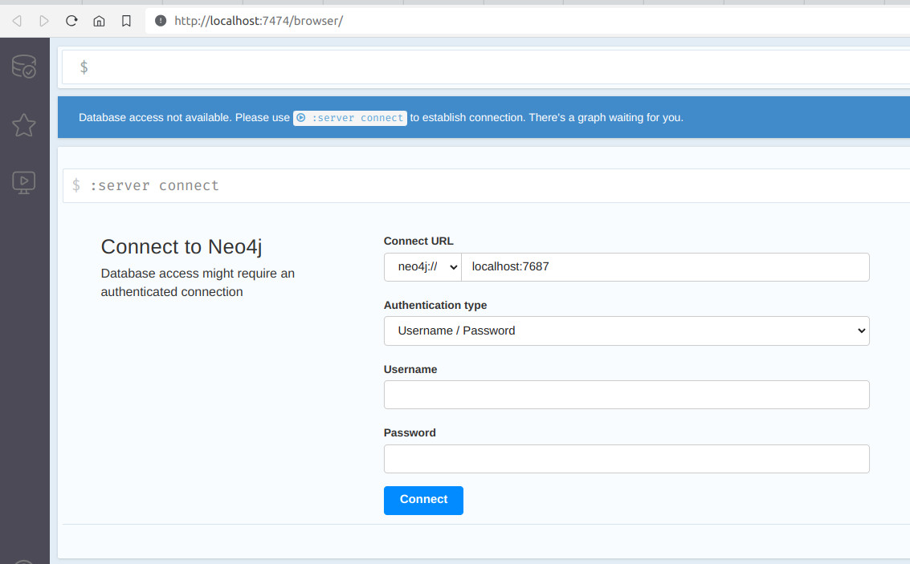
    <figcaption>Figura Docker Neo4j 1: Conexión al Neo4j</figcaption>
</figure>


### 3.2 Neo4j Aura

Neo4j Aura es una plataforma de grafos rápida, escalable, siempre activa y totalmente automatizada que se ofrece como un servicio en la nube.

Aura incluye **AuraDB**, la base de datos orientada a grafos como servicio para desarrolladores que crean aplicaciones inteligentes, y **AuraDS**, la ciencia de datos orientada a grafos como servicio para científicos de datos que crean modelos predictivos y flujos de trabajo analíticos.

Para más información consulta la [documentación oficial](https://neo4j.com/docs/aura/)


### 3.3 AuraDB

Neo4j AuraDB es un servicio de base de datos orientados a grafos en la nube (_Database as a service_) totalmente administrado.

Neo4j AuraDB es la **base de datos orientada a grafos** totalmente administrada como servicio (_Database as a service_) que ayuda a crear aplicaciones inteligentes basadas en el contexto más rápido con consultas ultrarrápidas, información en tiempo real, herramientas de desarrollo integradas, visualización de datos e integraciones respaldadas por la comunidad de desarrolladores de grafos más grande.

AuraDB es confiable, seguro y totalmente automatizado, lo que le permite concentrarse en crear aplicaciones de grafos sin preocuparse por la administración de la base de datos. Tiene versiones gratuitas (AuraDB Free) y de pago (AuraDB Professional and AuraDB Enterprise). Pero no podemos usar Graph Data Science (que nos interesa como analistas y científicos de datos)

Para más información consulta la [documentación oficial](https://neo4j.com/docs/aura/auradb/)


### 3.4 AuraDS

Neo4j AuraDS es la **solución de ciencia de datos como servicio** totalmente administrada para científicos de datos que unifica la superficie de aprendizaje automático (ML) y la base de datos orientada a grafos en un único espacio de trabajo, lo que facilita descubrir las conexiones en big data y responder preguntas críticas para el negocio.

No tiene versión gratuita. Para más información consulta la [documentación oficial](https://neo4j.com/docs/aura/aurads/)


### 3.5 Sandbox Neo4j

Para poder hacer uso de Neo4j de forma gratuita, Neo4j proporciona [Neo4j Sandbox](https://neo4j.com/sandbox/), una instancia gratuita de Neo4j basada en la nube, donde podemos aprender sobre Neo4j, probar sus ideas o jugar con los ejemplos de datos prediseñados.

1. Accedemos al servicio de [Neo4j sandbox](https://sandbox.neo4j.com/)
2. Nos registramos/logueamos en Neo4j
3. Nos muestra una serie de proyectos para crear una instancia sobre ellos.

<figure style="align: center; width:600px;">
    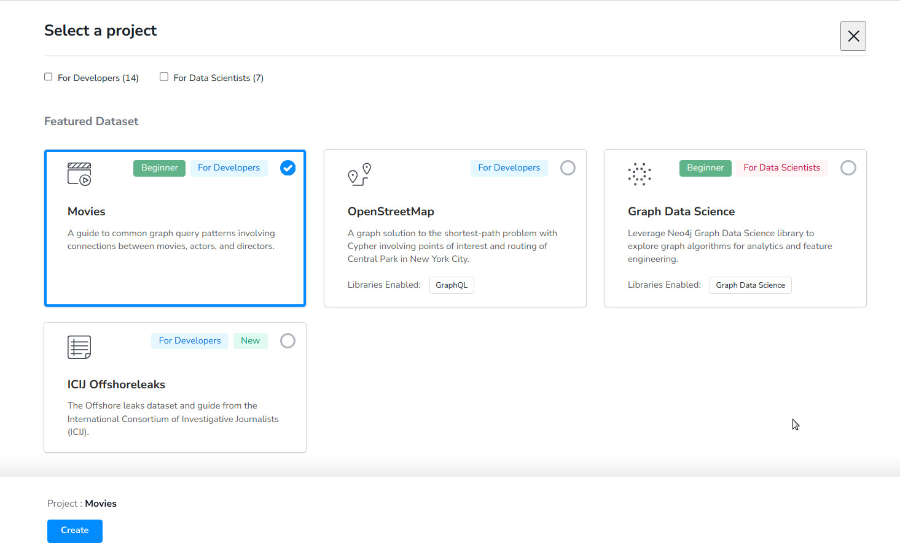
    <figcaption>Figura Neo4j Sandbox 1: Proyectos </figcaption>
</figure>

4. Elige uno.
5. Esperamos mientras crea la instancia

<figure style="align: center; width:600px;">
    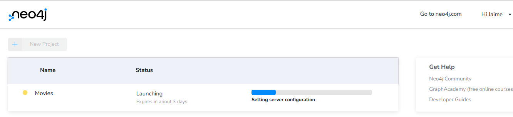
    <figcaption>Figura Neo4j Sandbox 2: Creando una instancia </figcaption>
</figure>

6. Desplegamos las opciones

<figure style="align: center; width:600px;">
    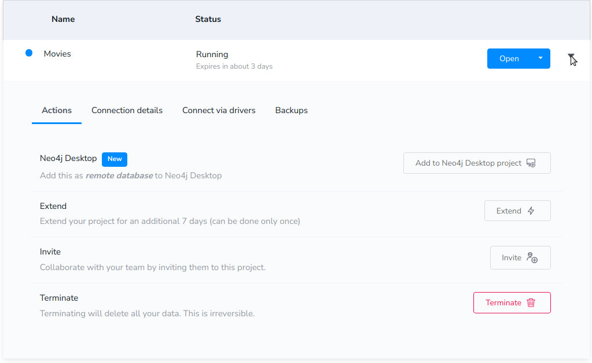
    <figcaption>Figura Neo4j Sandbox 3: Opciones de una instancia </figcaption>
</figure>

7. Vamos a _connection details_ y copiamos la contraseña

<figure style="align: center; width:600px;">
    
    <figcaption>Figura Neo4j Sandbox 4: Details project </figcaption>
</figure>

8. Abrimos la instancia en el navegador (tenemos varios opciones a elegir)

<figure style="align: center;">
    
    <figcaption>Figura Neo4j Sandbox 5: Abriendo una instancia </figcaption>
</figure>

1.  Se abre una nueva ventana con la instancia levantada para acceder a ella
2.   Tenemos varias opciones de acceso (Elige la que quieras)
    1.  Single sing on: Nos abrirá una nueva pestaña y nos pedirá nuestras credenciales de Neo4j
    2.  Username / Password: Neo4j (por defecto) / la copiada en el paso anterior de _connection details_

<figure style="align: center; width:600px;">
    
    <figcaption>Figura Neo4j Sandbox 6: Accediendo a una instancia </figcaption>
</figure>

11.  Se conecta a la base de datos. A la izquierda nos aparece una guía de uso, que dependerá de la instancia elegida.
12.  Ejecutamos la siguiente instrucción para ver es esquema del grafo `CALL db.schema.visualization()` y ejecutamos.

<figure style="align: center; width:600px;">
    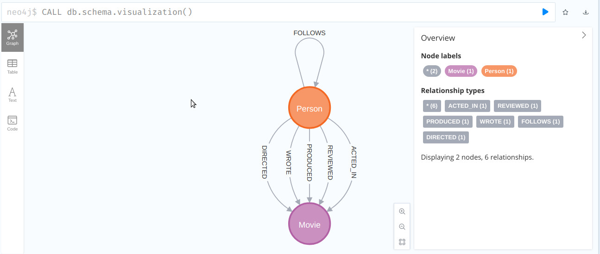
    <figcaption>Figura Neo4j Sandbox 7: Esquema de la base de datos </figcaption>
</figure>

13. Ejecutamos esta otra instrucción para ver toda la base de datos `match(n) return n`

<figure style="align: center; width:600px;">
    
    <figcaption>Figura Neo4j Sandbox 8: Datos de la base de datos </figcaption>
</figure>

14. Una consulta de ejemplo, donde buscamos todas las películas que se estrenaron después del año 2000 limitando el resultado a 5 elementos 

```cypher
MATCH (m:Movie)
WHERE m.released > 2000
RETURN m LIMIT 5
```

15. Podemos observar el resultado del grafo, la tabla resultante, en texto o el código

<figure style="align: center; width:600px;">
    
    <figcaption>Figura Neo4j Sandbox 9: Consulta a la base de datos </figcaption>
</figure>

## 4. Get started Neo4j

Para comenzar a trabajar con Neo4j, es necesario **crear un grafo o bien partir de un grafo ya existente** que se importa dentro del área de trabajo de Neo4j. A continuación, se muestra cómo implementar ambos procedimientos.

### 4.1 Importación de datos

Imaginemos un caso en el que se pretende importar un grafo a partir de un fichero .csv. En el ejemplo que se muestra a continuación, se dispone de dos ficheros .csv que contienen, respectivamente, **la definición de los nodos y de las aristas del grafo que se pretende importar**.

#### Definición y importación de los nodos

Así pues, el archivo csv siguiente muestra los nodos del grafo. Para cada nodo se almacena su identificador, latitud, longitud y población

```csv
id,latitude,longitude,population
"Amsterdam",52.379189,4.899431,821752
"Utrecht",52.092876,5.104480,334176
"Den Haag",52.078663,4.288788,514861
"Immingham",53.61239,-0.22219,9642
"Doncaster",53.52285,-1.13116,302400
"Hoek van Holland",51.9775,4.13333,9382
"Felixstowe",51.96375,1.3511,23689
"Ipswich",52.05917,1.15545,133384
"Colchester",51.88921,0.90421,104390
"London",51.509865,-0.118092,8787892
"Rotterdam",51.9225,4.47917,623652
"Gouda",52.01667,4.70833,70939
```
_Definición de nodos de un grafo_

Dados este fichero, es posible **importar los nodos del grafo**:

```cypher
 // Importamos los nodos
WITH "https://github.com/neo4j-graph-analytics/book/raw/master/data/transport-nodes.csv" AS uri
LOAD CSV WITH HEADERS FROM uri AS row
MERGE (place:Place {ciudad:row.id})
SET place.latitude = toFloat(row.latitude),
place.longitude = toFloat(row.latitude),
place.population = toInteger(row.population)
```
_Importación de nodos_

Así, en el listado anterior se define como identificador de recurso la dirección donde se encuentra el archivo que se pretende cargar, el cual es cargado a través de la instrucción **LOAD CSV**. La instrucción **MERGE** permite definir cada fila como nodo de un grafo de tipo lugar (place) y añadir a cada nodo la propiedad id cuyo valor será el identificador de la fila en la que se encuentra cada nodo dentro del fichero csv. Finalmente, los valores de latitud y longitud se convierten en valores de tipo real y la población en un valor de tipo entero.

#### Definición y importación de las relaciones de los nodos

Por su parte, el siguiente archivo csv especifica cada uno de los enlaces entre los nodos del grafo. Para cada uno de los enlaces se identifica el origen y destino del enlace, el tipo de relación que se define entre ellos y el coste. 

```csv
src,dst,relationship,cost
"Amsterdam","Utrecht","EROAD",46
"Amsterdam","Den Haag","EROAD",59
"Den Haag","Rotterdam","EROAD",26
"Amsterdam","Immingham","EROAD",369
"Immingham","Doncaster","EROAD",74
"Doncaster","London","EROAD",277
"Hoek van Holland","Den Haag","EROAD",27
"Felixstowe","Hoek van Holland","EROAD",207
"Ipswich","Felixstowe","EROAD",22
"Colchester","Ipswich","EROAD",32
"London","Colchester","EROAD",106
"Gouda","Rotterdam","EROAD",25
"Gouda","Utrecht","EROAD",35
"Den Haag","Gouda","EROAD",32
"Hoek van Holland","Rotterdam","EROAD",33
```
_Definición de aristas de un grafo_

Dado este fichero, es posible **importar las relaciones de los nodos del grafo**. Análogamente a la importación de nodos, a continuación mostramos el código necesario para la **importación del fichero que contiene los enlaces** entre los nodos del grafo.

```cypher
//Importamos las relaciones
WITH "https://github.com/neo4j-graph-analytics/book/raw/master/data/transport-relationships.csv" AS uri
LOAD CSV WITH HEADERS FROM uri AS row
MATCH (origin:Place {ciudad: row.src})
MATCH (destination:Place {ciudad: row.dst})
MERGE (origin)-[:EROAD {distance: toInteger(row.cost)}]->(destination)
```
_Importación de aristas_

La diferencia principal de este listado con respecto al anterior, es que en este se necesita identificar mediante la instrucción **MATCH** los nodos de origen y destino de cada uno de los enlaces, lo cual es posible mediante los atributos “src” y “dst” incluidos en el archivo .csv. Finalmente, se utiliza la sentencia **MERGE** para crear una relación entre “origin” y “destination” de tipo **EROAD** que contiene la propiedad “distance” cuyo valor es el coste que aparecía en el fichero .csv.

Podemos comprobarlo listando todo el grafo

```cypher
match(n) return n
```

<figure style="align: center; width:600px;">
    
    <figcaption>Figura Neo4j Importando Datos 1: Importando datos</figcaption>
</figure>

El grafo resultado es el siguiente

<figure style="align: center; width:600px;">
    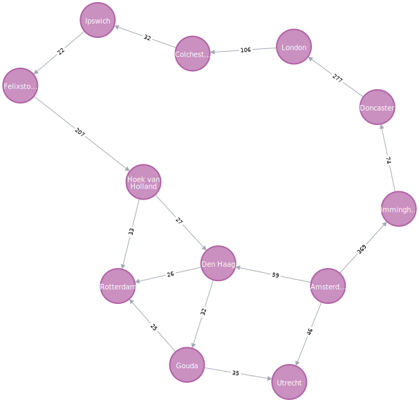
    <figcaption>Figura Neo4j Importando Datos 2: Grafo de ejemplo resultante </figcaption>
</figure>


### 4.2 Creación de grafos

Otra alternativa es la **creación de un grafo desde cero**, especificando para ello sus nodos y enlaces. La siguiente imagen muestra un ejemplo de un **grafo de coocurrencia de hashtags** en el que cada uno de los nodos es un hashtag y los enlaces entre ellos se producen cuando dos hashtags aparecieron en un mismo tweet. Sobre cada enlace, se puede apreciar un valor que indica en cuántos tweets concurrieron los hashtags conectados por medio de dicha arista.

<figure style="align: center; width:600px;">
    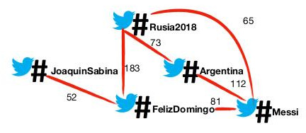
    <figcaption>Figura Neo4j Creación de un grafo 1: Grafo de ejemplo </figcaption>
</figure>

Para representar este grafo en Neo4j, se puede escribir el siguiente fragmento de código:

```cypher
CREATE
(JS:Hashtag {name: 'JoaquinSabina'}),
(RS:Hashtag {name: 'Rusia2018'}),
(AG:Hashtag {name: 'Argentina'}),
(FD:Hashtag {name: 'Feliz Domingo'}),
(MS:Hashtag {name: 'Messi'}),

(JS)-[:COOC {ntweet: 52}]->(FD),
(FD)-[:COOC {ntweet: 52}]->(JS),
(RS)-[:COOC {ntweet: 183}]->(FD),
(FD)-[:COOC {ntweet: 183}]->(RS),
(RS)-[:COOC {ntweet: 73}]->(AG),
(AG)-[:COOC {ntweet: 73}]->(RS),
(AG)-[:COOC {ntweet: 112}]->(MS),
(MS)-[:COOC {ntweet: 112}]->(AG),
(FD)-[:COOC {ntweet: 81}]->(MS),
(MS)-[:COOC {ntweet: 81}]->(FD)
```
_Creación grafo de co-ocurrencia de hashtags_

Tal y como se puede ver, en primer lugar se definen los nodos y sus propiedades y a continuación los enlaces y sus propiedades. **Todo grafo en Neo4j tiene aristas dirigidas, si bien es cierto que cuando se ejecutan las consultas puede no tenerse en cuenta la dirección de las aristas**. Por este motivo, se han especificado las aristas en ambas direcciones. En caso de querer crear una arista que sea interpretada como no dirigida, se debe crear sin el operador flecha que determina el sentido de la arista. Esto es posible hacerlo solo fuera de la instrucción **CREATE**. El listado 4.6 muestra cómo crear la primera relación del grafo solo que de forma no dirigida.

```cypher
MATCH(JS:Hashtag{name:'JoaquinSabina'})
MATCH(FD:Hashtag{name:'Feliz Domingo'})
MERGE (JS)-[:COOC{ntweet:52}]-(FD)
```
_Creación de una arista no dirigida_

Para **mostrar el grafo**, es posible utilizar el siguiente comando. La figura 4.3 muestra cómo quedaría el grafo creado en el listado 4.5.

```cypher
MATCH(n) return (n)
```

<figure style="align: center; width:600px;">
    
    <figcaption>Figura Neo4j Creación de un grafo 2: Visualización del grafo de co-ocurrencia de hashtags </figcaption>
</figure>

### 4.3 Eliminar nodos y grafos

Siguiendo con el ejemplo anterior, para eliminar un nodo creado, es posible utilizar el comando:

```cypher
MATCH(JS:Hashtag{name:'JoaquinSabina'}) delete (JS)
```

Sin embargo, **un nodo solo puede ser eliminado si se eliminan las relaciones** que contiene. Para ello, es posible utilizar el comando:

```cypher
MATCH(JS:Hashtag{name:'JoaquinSabina'}) detach delete (JS)
```

Mientras que, para eliminar todos los nodos y aristas, es posible escribir:

```cypher
MATCH(n) detach delete(n)
```

## 5. Neo4j Graph Data Science

La biblioteca **Neo4j Graph Data Science (GDS)** proporciona versiones paralelas implementadas de manera eficiente de **algoritmos de grafos** comunes, expuestos como procedimientos **Cypher**. Además, GDS incluye canales de aprendizaje automático para entrenar modelos predictivos supervisados para resolver problemas de grafos, como la predicción de relaciones faltantes.

Los algoritmos de grafos se utilizan para calcular métricas de grafos, nodos o relaciones. Pueden proporcionar información sobre entidades relevantes en el grafo (centralidades, clasificación) o estructuras inherentes como comunidades (detección de comunidades, partición de grafos, agrupación), etc.

Para **verificar la instalación** ejecuta:

```cypher
RETURN gds.version();
```

Para listar todos los procedimientos disponibles ejecuta:

```cypher
CALL gds.list();
```

La biblioteca Neo4j Graph Data Science contiene una gran cantidad de algoritmos, los cuales detallaremos a continuación.


## 6. Recorridos sobre grafos

Los recorridos sobre grafos son una utilidad imprescindible en el trabajo con esta estructura de datos. Del mismo modo, los recorridos también son una herramienta fundamental cuando se trabaja con bases de datos orientadas a grafos.

**Un recorrido sobre grafos es un procedimiento sistemático que permite explorar un grafo examinando todos sus vértices y aristas, comenzando desde un vértice inicial**. A la hora de recorrer un grafo, existen dos tipos de recorridos: el **recorrido en anchura** (denotado BFS, por sus siglas en inglés) y el **recorrido en profundidad** (denotado DFS, también por sus siglas en inglés).

### 6.1 Recorrido en anchura ([BFS](https://neo4j.com/docs/graph-data-science/current/algorithms/bfs/))

El recorrido en anchura, también conocido por sus siglas en inglés _Breadth First Search (BFS)_ es un procedimiento que permite recorrer un grafo, explorando todos sus nodos y aristas.

El recorrido en anchura parte de un nodo inicial. A continuación, el método comienza a explorar todos los nodos hijo del nodo inicial seleccionado que se encuentran a un salto. Una vez visitados, comienzan a explorarse los nodos hijo del siguiente nivel y así sucesivamente hasta haber recorrido el grafo completo. Este recorrido es muy utilizado cuando se busca un camino con el número mínimo de aristas entre dos vértices dados o cuando se busca un ciclo simple, es decir, una secuencia de nodos y aristas que se pueden describir circularmente en el que todos los nodos y aristas son distintos.

Por ejemplo, usando el grafo anterior del punto importación de datos. Es posible recorrerlo utilizando BFS escribiendo el siguiente código Neo4j que aparece en el listado 4.7. 

<figure style="align: center; width:600px;">
    
    <figcaption>Figura Neo4j Importando Datos 2: Grafo de ejemplo resultante </figcaption>
</figure>

!!! info inline end

    **Solamente hay que crear un `project graph` del algoritmo si es la misma configuración. Es decir, es reutilizable**

```
// Creamos el grafo. 
CALL gds.graph.project(
    'myGraph_BFR',
    'Place',
    'EROAD'
)
```

```
//Realizamos la búsqueda en anchura
MATCH (a:Place{id:'Doncaster'})
WITH id(a) AS startNode
CALL gds.bfs.stream('myGraph_BFR', {sourceNode: startNode})
YIELD path
UNWIND [ n in nodes(path) | n.id ] AS tags
RETURN tags
```
_Recorrido en anchura (BFS)_


En el código anterior, se define un grafo llamado _myGraph\_BFR_ el cual está formado por nodos de tipo Place y cuyas relaciones son del tipo **EROAD** y tienen una propiedad, denominada _distance_. A continuación, se define el nodo inicial con las sentencias **MATCH** y **WITH**. Después, se llama al método que realiza el recorrido BFS sobre el grafo anterior partiendo desde el nodo inicial para producir un camino (_path_). Finalmente, se devuelven todos los nodos que forman parte del camino, mostrando los identificadores de cada uno de ellos. El resultado del recorrido es: Doncaster, London, Colchester, Ipswich, Felixstowe, Hoek van Holand, Den Haag, Rotterdam, Gouda, Utrecht.

### 6.2 Recorrido en profundidad ([DFS](https://neo4j.com/docs/graph-data-science/current/algorithms/dfs/))

El recorrido en profundidad, también conocido por sus siglas en inglés _Depth First Search (DFS)_ es un procedimiento alternativo al recorrido en anchura para explorar un grafo, recorriendo todos sus nodos y aristas.

El procedimiento para recorrer un grafo mediante el método DFS es el siguiente: en primer lugar, se parte de un nodo inicial. A partir de él, se empiezan a recorrer todos sus hijos hasta el último nivel. Una vez llegados al último nivel del grafo, se vuelve hacia atrás recorriendo todos los hijos de los nodos de niveles anteriores. 

En Neo4j, el procedimiento para recorrer un grafo utilizando el recorrido DFS se muestra a continuación. El procedimiento, como se puede comprobar, es prácticamente idéntico al código BFS, solo que cambiando el método de recorrido. El resultado obtenido es: Doncaster, London, Colchester, Ipswich, Felixstowe, Hoek van Holland, Rotterdam, Den Haag, Gouda, Utrecht.

```
// Creamos el grafo. 
CALL gds.graph.project(
    'myGraph_DFS',
    'Place',
    'EROAD'
)
```

```
//Realizamos la búsqueda en Profundidad
MATCH (a:Place{ciudad:'Doncaster'})
WITH id(a) AS startNode
CALL gds.dfs.stream('myGraph_DFS', {sourceNode: startNode})
YIELD path
UNWIND [ n in nodes(path) | n.ciudad ] AS tags
RETURN tags
```
_Recorrido en profundidad (DFS)_

## 7. Caminos mínimos

El cálculo y la obtención de caminos mínimos dentro de un grafo es uno de los problemas clásicos en teoría de grafos con multitud de aplicaciones en el mundo real. **Un camino dentro de un grafo es un conjunto de nodos y aristas que conectan un par de nodos del grafo**. En el caso de los **grafos no pesados**, es decir, aquellos cuyas aristas no tienen coste, el cálculo del camino mínimo se obtiene **minimizando el número de saltos** entre el nodo origen y el nodo destino. En el caso de los **grafos pesados**, aquellos cuyas aristas tienen coste, el cálculo del camino mínimo se obtiene a través del camino en el que **la suma de los costes de sus aristas es mínima**.

Junto con los recorridos de grafos, los métodos de obtención de caminos mínimos son muy útiles cuando se trabaja en **entornos dinámicos**, donde aparecen y desaparecen continuamente aristas del grafo o sus costes cambian dinámicamente. El cálculo de caminos mínimos también es muy útil en aplicaciones que deben dar **respuestas en tiempo real**. Algunos ejemplos claros pueden ser encontrar rutas entre dos localidades, como ocurre en Google Maps u obtener los grados de separación entre una empresa y un empleado potencial al que se quiere contratar, como puede ocurrir en LinkedIn.

### 7.1 Algoritmo de Dijkstra

El **algoritmo de Dijkstra** es uno de los algoritmos más utilizados en teoría de grafos para la obtención de caminos mínimos. Este algoritmo tiene 2 versiones: uno que indica un nodo origen y el camino mínimo a todos los demás, y otro donde muestra el camino mínimo indicando un nodo origen y destino.

- **Algoritmo de Dijkstra: Single-Source Shortest Path (de un nodo a todos los demás)**

Dado el grafo de ciudades con el que se está trabajando a lo largo de este capítulo, el siguiente código permite obtener **los caminos mínimos entre un nodo del grafo y todos los demás nodos alcanzables([Single-Source Shortest Path](https://neo4j.com/docs/graph-data-science/current/algorithms/dijkstra-single-source/))**.

```
// Creamos el grafo. 
CALL gds.graph.project(
    'myGraph_Dijkstra',
    'Place',
    'EROAD',
    {
        relationshipProperties: 'distance'
    }
)
```

```
MATCH (source:Place {ciudad: 'Amsterdam'})
CALL gds.allShortestPaths.dijkstra.stream('myGraph_Dijkstra', {
    sourceNode: source,
    relationshipWeightProperty: 'distance'
})
YIELD index, sourceNode, targetNode, totalCost, nodeIds, costs, path
RETURN
    index,
    gds.util.asNode(sourceNode).ciudad AS sourceNodeName,
    gds.util.asNode(targetNode).ciudad AS targetNodeName,
    totalCost,
    [nodeId IN nodeIds | gds.util.asNode(nodeId).ciudad] AS nodeNames,
    costs,
    nodes(path) as path
ORDER BY index
```
_Ejecución del algoritmo de Dijkstra sobre el nodo Amsterdam_

En el listado anterior, se utiliza la sentencia **MATCH** para definir el nodo de origen y, posteriormente, se guarda el grafo incluyendo el nodo de origen y la propiedad de distancia que es la utilizada para obtener el camino mínimo.

- **Algoritmo de Dijkstra: Single Source-Target Shortest Path (de un nodo origen a otro destino)**

 A continuación, se producirá un conjunto de caminos en el que se mostrará información completa del nodo de origen, destino, coste total y camino recorrido así como los distintos costes parciales. En caso de querer obtener el **camino mínimo entre un par de nodos concretos([Single Source-Target Shortest Path](https://neo4j.com/docs/graph-data-science/current/algorithms/dijkstra-source-target/))**, es posible utilizar el siguiente código análogo al anterior.

```
MATCH (source:Place {ciudad: 'Amsterdam'}), (target:Place {ciudad: 'London'})
CALL gds.shortestPath.dijkstra.stream('myGraph_Dijkstra', {
    sourceNode: source,
    targetNode: target,
    relationshipWeightProperty: 'distance'
})
YIELD index, sourceNode, targetNode, totalCost, nodeIds, costs, path
RETURN
    index,
    gds.util.asNode(sourceNode).ciudad AS sourceNodeName,
    gds.util.asNode(targetNode).ciudad AS targetNodeName,
    totalCost,
    [nodeId IN nodeIds | gds.util.asNode(nodeId).ciudad] AS nodeNames,
    costs,
    nodes(path) as path
ORDER BY index
```
_Ejecución del algoritmo de Dijkstra sobre el par de nodos Amsterdam-London_

El camino mínimo entre Amsterdam y Londres es el formado por: Amsterdam Immingham, Doncaster, London. Este camino tiene un coste total de 720.

### 7.2 [Algoritmo A\*](https://neo4j.com/docs/graph-data-science/current/algorithms/astar/)

El **algoritmo A\* es una técnica de búsqueda informada** que permite, al igual que el algoritmo de Dijkstra, **calcular el camino mínimo entre dos nodos dados cualesquiera**. Al contrario que el algoritmo de Dijkstra, cuando se va a seleccionar el siguiente nodo del camino, la técnica A* no solo se tiene en cuanta la distancia ya calculada, sino que **este algoritmo combina la distancia calculada con el resultado de una función heurística**. Esta función toma un nodo como entrada y devuelve un valor que corresponde con el coste de llegar al nodo objetivo desde ese nodo. Esta técnica, que se conoce también como de **búsqueda informada**, continúa el recorrido del grafo en cada iteración desde el nodo con el menor coste combinado entre la distancia ya calculada y la función heurística. El siguiente código muestra cómo obtener el camino mínimo mediante el método A* entre Amsterdam y Londres.

```
// Creamos el grafo. 
CALL gds.graph.project(
    'myGraph_A',
    'Place',
    'EROAD',
    {
        nodeProperties: ['latitude', 'longitude', 'population'],
        relationshipProperties: 'distance'
    }
)
```

```
MATCH (source:Place {ciudad: 'Amsterdam'}), (target:Place {ciudad: 'London'})
CALL gds.shortestPath.astar.stream('myGraph_A', {
    sourceNode: source,
    targetNode: target,
    latitudeProperty: 'latitude',
    longitudeProperty: 'longitude',
    relationshipWeightProperty: 'distance'
})
YIELD index, sourceNode, targetNode, totalCost, nodeIds, costs, path
RETURN
    index,
    gds.util.asNode(sourceNode).ciudad AS sourceNodeName,
    gds.util.asNode(targetNode).ciudad AS targetNodeName,
    totalCost,
    [nodeId IN nodeIds | gds.util.asNode(nodeId).ciudad] AS nodeNames,
    costs,
    nodes(path) as path
ORDER BY index
```
_Ejecución del algoritmo A* sobre el par de nodos Amsterdam-London_

Como se puede ver, este fragmento de código es similar a los vistos anteriormente, solo que a la hora de guardar el grafo, se almacenan los propiedades de latitud y longitud, necesarias en Neo4j para ejecutar el algoritmo A*.

## 8. Medidas de centralidad

**La centralidad se define como la relevancia de un nodo dentro de un grafo**. Por tanto, el estudio de medidas de centralidad permite **identificar nodos relevantes dentro de un grafo**. Esta identificación permitirá entender el comportamiento de la red, qué nodos permiten viralizar con mayor rapidez el contenido de la red, desde qué nodos la información está más accesible, etc. El estudio de medidas de centralidad tiene multitud de aplicaciones, aunque son especialmente notables las relacionadas con los ámbitos de la **publicidad y el marketing**, donde el estudio de estas métricas permite identificar actores relevantes dentro de una red a los que se puede contratar para anunciar un producto o identificar sobre qué actores enviar información para alcanzar a más usuarios.

Respecto a las medidas de centralidad, no existe una única medida sino que, en función de los datos y del propósito que se pretende alcanzar, se utilizan unas métricas u otras. a continuación, se van a definir tres medidas de centralidad con las que se realizarán ejemplos en Neo4j: **centralidad de grado, cercanía e intermediación**. 

Para trabajar con medidas de centralidad, se va a importar un grafo social que servirá de ejemplo para el cálculo de estas métricas. El siguiente código muestra lo necesario para su creación. Por otra parte, mostramos la imagen del grafo importado.

```
// Importamos los nodos
WITH "https://github.com/neo4j-graph-analytics/book/raw/master/data/" AS base
WITH base + "social-nodes.csv" AS uri
LOAD CSV WITH HEADERS FROM uri AS row
MERGE (:User {id: row.id})

//Importamos las relaciones
WITH "https://github.com/neo4j-graph-analytics/book/raw/master/data/" AS base
WITH base + "social-relationships.csv" AS uri
LOAD CSV WITH HEADERS FROM uri AS row
MATCH (source:User {id: row.src})
MATCH (destination:User {id: row.dst})
MERGE (source)-[:FOLLOWS]->(destination)
```
_Listado 4.12: Importación de un grafo social_

<figure style="align: center; width:600px;">
    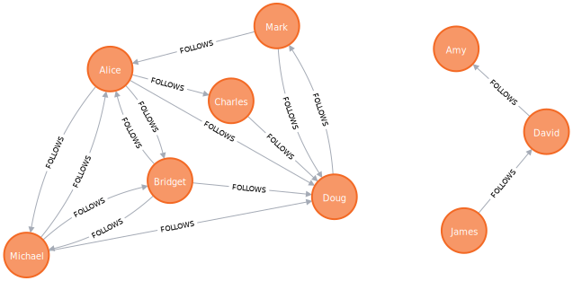
    <figcaption>Figura Neo4j. Medida de centralidad 1: Visualización de un grafo social </figcaption>
</figure>

### 8.1 Centralidad de grado ([Degree Centrality](https://neo4j.com/docs/graph-data-science/current/algorithms/degree-centrality/))

**El grado de un nodo en un grafo se define como el número de aristas o conexiones que entran o salen de un nodo**. Así pues, en un nodo de un grafo se distinguen dos grados: el **grado de entrada**, correspondiente al conjunto de conexiones que entran a un nodo y el **grado de salida**, que se corresponde con el conjunto de aristas que salen de un nodo. El primero indica la **prominencia** de un nodo dentro de la red, mientras que el segundo la **influencia** del nodo dentro del grafo. Esta medida de centralidad es muy utilizada para identificar actores prominentes o influyentes o para identificar conductas fraudulentas, caracterizadas en ocasiones por una actividad anormal. Para calcular la centralidad de grado en este grafo, se almacenará en primer lugar el grafo creado y, a continuación, se ejecutará el método que calcula la centralidad de grado según el siguiente código. El nodo con mayor grado es Doug, que tiene un grado de 5, seguido de Alice que tiene un grado de 3.

```
CALL gds.graph.project(
'myGraph_centralidad_grado',
'User',
{
    FOLLOWS: {
    orientation: 'REVERSE'
    }
}
)
```

Como no tenemos ninguna propiedad/coste/puntuación en la relación, no hay que indicarla. Si la quisiéramos tener en cuenta habría que añadirla dentro de follow de la siguiente forma:

```
CALL gds.graph.project(
'myGraph_centralidad_grado',
'User',
{
    FOLLOWS: {
    orientation: 'REVERSE',
    properties: ['score']
    }
}
)
```

La **centralidad de grado** de este grafo sería

```
CALL gds.degree.stream('myGraph_centralidad_grado')
YIELD nodeId, score
RETURN gds.util.asNode(nodeId).id AS id, score AS followers
ORDER BY followers DESC, id DESC
```
_Cálculo de la centralidad de grado_

### 8.2 Cercanía ([Closeness Centrality](https://neo4j.com/docs/graph-data-science/current/algorithms/closeness-centrality/))

**La cercanía es una medida de centralidad que determina qué nodos del grafo expanden rápida y eficientemente la información a través del grafo**. Para calcular esta medida, se obtiene **la suma del inverso de las distancias de un nodo al resto**. De esta forma, dado un nodo u la cercanía del mismo se calcula por medio de la siguiente ecuación:

<figure style="align: center;">
    
    <figcaption>Figura Neo4j. Ecuación de cercanía</figcaption>
</figure>

Donde _n_ es el número de nodos del grafo y _d(u, v)_ es la distancia del camino mínimo entre _u_ y _v_. **La cercanía es una métrica muy utilizada para estimar tiempos de llegada en redes logísticas, para descubrir actores en posiciones privilegiadas en redes sociales o para estudiar la prominencia de palabras en un documento en el campo de la minería de textos**. Para obtener la cercanía en el grafo social de ejemplo, se puede utilizar el fragmento de código mostrado en el listado 4.14. En el grafo de la imagen, Doug y David tienen una cercanía de 1.

```
CALL gds.graph.project(
    'myGraph_cercania',
    'User',
    'FOLLOWS'
)
```

```
CALL gds.beta.closeness.stream('myGraph_cercania')
YIELD nodeId, score
RETURN gds.util.asNode(nodeId).id AS id, score
ORDER BY score DESC
```
_Cálculo de la cercanía_

### 8.3 Intermediación ([Betweenness Centrality](https://neo4j.com/docs/graph-data-science/current/algorithms/betweenness-centrality/))

**La intermediación es una medida de centralidad que permite detectar la influencia que tiene un nodo o actor del grafo en el flujo de información o de recursos de la red**. El cálculo de la intermediación permite identificar a nodos que hacen de puentes entre distintas porciones del grafo. Esta medida de centralidad **es muy utilizada para la identificación de influencers y el estudio de la viralización de mensajes en redes sociales.** Intuitivamente, la intermediación de un nodo **será mayor en tanto en cuanto dicho nodo aparezca en los caminos mínimos de cualquier otro par de nodos**. Más formalmente, la intermediación puede calcularse según la siguiente ecuación.

<figure style="align: center;">
    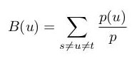
    <figcaption>Figura Neo4j. Ecuación de intermediacion</figcaption>
</figure>

Donde _u_ es el nodo del cual se calcula la intermediación _(B),s_ y _t_ son nodos del grafo, _p(u)_ es el número de caminos mínimos entre _s_ y _t_ que pasan por _u_ y _p_ es el número de caminos mínimos entre s y t. Para el cálculo de la intermediación, se puede utilizar el siguiente código. Al ejecutar este listado, se obtiene que Alice tiene la mayor intermediación, teniendo un valor de 10.

```
CALL gds.graph.project(
    'myGraph_intermediacion',
    'User',
    'FOLLOWS'
)
```

Como no tenemos ninguna propiedad/coste/puntución en la relación, no hay que indicarla. Si la quisiéramos tener en cuenta habría que añadirla dentro de follow de la siguiente forma:

```
CALL gds.graph.project(
    'myGraph_intermediacion',
    'User',
    {
        FOLLOWS:
        {
            properties: 'weight'
        }
    }
)
```

El **cálculo de la indeterminación** sería

```
CALL gds.betweenness.stream('myGraph_intermediacion')
YIELD nodeId, score
RETURN gds.util.asNode(nodeId).id AS id, score
ORDER BY score DESC
```
_Cálculo de la intermediación_

## 9. Detección de comunidades

A la hora de trabajar con grafos reales, que presentan una gran cantidad de nodos y enlaces, muchas veces se pretende **identificar comunidades** dentro del grafo para aplicar algoritmos sobre ellas. **Una comunidad es, por tanto, un conjunto de nodos que presentan más relaciones entre sí que con el resto de nodos fuera de la comunidad**. La detección e identificación de comunidades permite **identificar comportamientos emergentes y de rebaño dentro de una red**. De esta forma, es posible detectar y predecir hábitos de los usuarios. A continuación, se van a aplicar tres métodos de detección de comunidades sobre el grafo social de ejemplo que se ha utilizado en secciones anteriores.

### 9.1 Conteo de triángulos([Triangle Count](https://neo4j.com/docs/graph-data-science/current/algorithms/triangle-count/))

**Un triángulo es un conjunto de tres nodos que tienen relaciones entre sí**. El conteo de triángulos para un nodo dado, permite estudiar o inspeccionar de forma global un grafo y, aplicado sobre componentes conexas, permite inspeccionar regiones de un grafo. Para aplicar este método, es necesario almacenar el grafo teniendo en cuenta que las aristas deben almacenarse como **UNDIRECTED**. El siguiente código muestra el fragmento de código necesario para aplicar este método sobre el grafo social de ejemplo. La ejecución de este método da como resultado que Alice y Doug son aquellos que pertenecen a más triángulos, un total de 5.

```
CALL gds.graph.project(
    'myGraph_conteo_triangulo',
    'User',
    {
        FOLLOWS: {
        orientation: 'UNDIRECTED'
        }
    }
)
```

```
CALL gds.triangleCount.stream('myGraph_conteo_triangulo')
YIELD nodeId, triangleCount
RETURN gds.util.asNode(nodeId).id AS id, triangleCount
ORDER BY triangleCount DESC
```
_Ejecución del conteo de triángulos_

### 9.2 Coeficiente local de clustering ([Local Clustering Coefficient](https://neo4j.com/docs/graph-data-science/current/algorithms/local-clustering-coefficient/))

Este coeficiente **proporciona una medida cuantitativa del grado de agrupación de un nodo**. Para el cálculo del coeficiente local de clustering se utiliza el conteo de triángulos, de forma que se compara el grado de agrupación de un nodo con el grado máximo de agrupación que podría tener. Así pues, el coeficiente local de clustering se puede calcular mediante la siguiente ecuación.

<figure style="align: center;">
    
    <figcaption>Figura Neo4j Ecuación de coeficiente local</figcaption>
</figure>

Donde _u_ es un nodo, _R(u)_ es el número de relaciones que a través de los vecinos de _u_ (lo cual puede medirse con el número de triángulos que pasan por _u_ y _k(u)_ es el grado de _u_. El cálculo del coeficiente local de clustering puede realizarse por medio del siguiente código. Los actores Bridget, Charles, Mark y Michael tienen el mayor coeficiente local de clustering, que es 1. 

```
CALL gds.graph.project(
    'myGraph_LCC',
    'User',
    {
        FOLLOWS: {
        orientation: 'UNDIRECTED'
        }
    }
)
```

```
CALL gds.localClusteringCoefficient.stream('myGraph_LCC')
YIELD nodeId, localClusteringCoefficient
RETURN gds.util.asNode(nodeId).id AS id, localClusteringCoefficient
ORDER BY localClusteringCoefficient DESC
```
_Cálculo del coeficiente local de clustering_

Por último, **el coeficiente global de clustering se calcula como la suma normalizada de los coeficientes de clustering locales**. Así, estos coeficientes nos permiten encontrar medidas cuantitativas para detectar comunidades, pudiendo especificar incluso un umbral para establecer la comunidad (por ejemplo, especificar que los nodos han de estar conectados en un 40 %).

### 9.3 Componentes fuertemente conexas ([Strongly Connected Components](https://neo4j.com/docs/graph-data-science/current/algorithms/strongly-connected-components/))
_alpha a 04-11-2023_

**En un grafo dirigido, una componente fuertemente conexa es aquel grupo de nodos en el que cualquier nodo puede ser alcanzado por cualquier otro en ambas direcciones**. El estudio de las componentes fuertemente conexas en un grafo permite **estudiar la conectividad de la red**. Para realizar el cálculo de las componentes conexas, el cual se realiza en un tiempo de procesamiento proporcional al número de nodos, podemos utilizar el siguiente código. El resultado permite comprobar que hay un total de cuatro componentes fuertemente conexas en el grafo social.

```
CALL gds.graph.project(
    'myGraph_SCC',
    'User',
    'FOLLOWS'
)
```

```
CALL gds.alpha.scc.stream('myGraph_SCC', {})
YIELD nodeId, componentId
RETURN gds.util.asNode(nodeId).id AS Name, componentId AS Component
ORDER BY Component DESC
```
_Obtención de componentes fuertemente conexas_

## 10. Predicción de enlaces

Los grafos son estructuras de datos que representan sistemas dinámicos, que evolucionan a lo largo del tiempo. Por este motivo, es muy común que en un grafo cualquiera aparezcan y desaparezcan nuevos nodos y conexiones entre dichos nodos. **Los métodos de predicción de enlaces permiten predecir qué enlaces se formarán próximamente entre los nodos del grafo, permitiendo adelantarse a los acontecimientos y prevenir eventualidades**. Como norma general, los métodos de predicción de enlaces **se basan en medidas de cercanía y de centralidad** asumiendo que los nuevos enlaces se producirán, mayoritariamente, sobre/desde los nodos más relevantes. A continuación, se detalla el funcionamiento de tres métodos comúnmente utilizados en predicción de enlaces. 

### 10.1 Vecinos comunes ([Common Neighbors](https://neo4j.com/docs/graph-data-science/current/alpha-algorithms/common-neighbors/))
_alpha a 04-11-2023_

El método de vecinos comunes se basa en la idea genérica de que dos actores de la red que tienen una relación con un usuario común tendrán más posibilidad de conectarse entre sí que quienes no. Formalmente, dados dos nodos, la posibilidad de que se produzca un enlace entre los nodos _x_ e _y_ viene dada por la siguiente ecuación.

<figure style="align: center;">
    
    <figcaption>Figura Neo4j Ecuación de vecinos comunes</figcaption>
</figure>

Donde _N(x)_ es el conjunto de nodos adyacentes a _x_ y _N(y)_ es el conjunto de nodos adyacentes a _y_. Cuanto mayor es el valor de _CN_ calculado, existe mayor posibilidad de que se produzca un nuevo enlace entre _x_ e _y_. En el grafo social de ejemplo, el cálculo de vecinos comunes para Charles y Bridget se puede realizar a través del siguiente código. El resultado de este cálculo es 2.

```
MATCH (x:User{id:'Charles'})
MATCH (y:User{id:'Bridget'})
RETURN gds.alpha.linkprediction.commonNeighbors(x,y) AS score
```
_Obtención del valor de vecinos comunes para Charles y Bridget_

### 10.2 Adhesión preferencial ([Preferential Attachment](https://neo4j.com/docs/graph-data-science/current/alpha-algorithms/preferential-attachment/))
_alpha a 04-11-2023_

Este método se basa en la idea general de que cuanto más conectado está un nodo, es más probable que reciba nuevos enlaces. Formalmente, esta idea se puede expresar por medio de la siguiente ecuación.

<figure style="align: center;">
    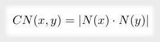
    <figcaption>Figura Neo4j Ecuación de adhesión preferencial</figcaption>
</figure>

En el grafo social de ejemplo, el cálculo de adhesión preferencial para Charles y Bridget se puede realizar a través del siguiente código. El resultado de este cálculo es 10.

```
MATCH (x:User{id:'Charles'})
MATCH (y:User{id:'Bridget'})
RETURN gds.alpha.linkprediction.preferentialAttachment(x, y) AS score
```
_Obtención del valor de adhesión preferencial para Charles y Bridget_

### 10.3 Asignación de recursos ([Resource Allocation](https://neo4j.com/docs/graph-data-science/current/alpha-algorithms/resource-allocation/))
_alpha a 04-11-2023_

Se trata de una métrica compleja que evalúa la cercanía de un par de nodos para determinar la posibilidad de que, entre ellos, se produzca un nuevo enlace. Para ello, se utiliza la expresión dada en la siguiente ecuación.

<figure style="align: center;">
    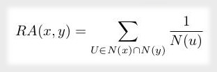
    <figcaption>Figura Neo4j Ecuación de asignación de recursos</figcaption>
</figure>

En el grafo social de ejemplo, el cálculo de la asignación de recursos para Charles y Bridget se puede realizar a través del siguiente código. El resultado de este cálculo es 0.309.

```
//No funciona ni en la documentación oficial (09-11-2022)
MATCH (x:User{id:'Charles'})
MATCH (y:User{id:'Bridget'})
RETURN gds.alpha.linkprediction.resourceAllocation(x, y) AS score
```
_Obtención del valor de asignación de recursos para Charles y Bridget_

## 11. Machine Learning

Existe también la posibilidad de trabajar con **Machine learning** en los sistema de Big Data orientados a grafos como Neo4j

Toda la documentación de los mismos se encuentra también en la [documentación oficial](https://neo4j.com/docs/graph-data-science/current/machine-learning/machine-learning/). Esta funcionalidad no forma parte de los Resultados de Aprendizaje de este módulo, ya que existe un módulo especifico para este tema. Aún así, podría ser interesante investigarlo e intentar integrarlo como una práctica opcional 😉

## 12. Ejemplo

1. Para esta práctica vamos a usar la herramienta SandBox Neo4j: https://sandbox.neo4j.com/
      - Crearemos un nuevo proyecto y elegiremos el proyecto de twitter.
      - Vamos obtener **conocimiento** a través de las relaciones la cuenta oficial de Twitter Neo4j (anteriormente se podía con la nuestra, actualmente no tienen habilitada esta opción)
      - ~~Seguimos los pases para dar acceso a Neo4j a nuestra cuenta. ***No olvides derogar el permiso al terminar el ejemplo***~~

2. El esquema del grafo que nos va a crear de nuestra cuenta de Twitter es la siguiente
   
<figure style="align: center;">
    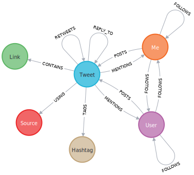
    <figcaption>Figura Neo4j Ejemplo. Data model Twitter</figcaption>
</figure>

- Quién te está mencionando en Twitter
- ¿Quiénes son tus seguidores más influyentes?
- Qué etiquetas usas con frecuencia
- La gente que tuitea sobre ti, pero no los sigues
- Enlaces de retweets interesantes
- Otras personas tuiteando con algunos de tus mejores hashtags

1. **Menciones**

La siguiente consulta de Cypher determina quién te está mencionando en Twitter (en este caso a la cuenta de Neo4j).

```
// Graph of some of your mentions
MATCH (u:User)-[p:POSTS]->(t:Tweet)-[:MENTIONS]->(m:Me)
WITH u,p,t,m, COUNT(m.screen_name) AS count
ORDER BY count DESC
RETURN u,p,t,m
LIMIT 10
```
Detalles de algunas de tus menciones

```
// Number of your mentions
MATCH (u:User)-[:POSTS]->(t:Tweet)-[:MENTIONS]->(m:Me)
RETURN m.screen_name AS screen_name, COUNT(m.screen_name) AS count 
```

4. **Seguidores más influyentes**

```
// Most influential followers
MATCH (follower:User)-[:FOLLOWS]->(u:User:Me)
RETURN follower.screen_name AS user, follower.followers AS followers
ORDER BY followers DESC
LIMIT 10
```

5. **Hashtags mas usados**

```
// The hashtags you have used most often
MATCH (h:Hashtag)<-[:TAGS]-(t:Tweet)<-[:POSTS]-(u:User:Me)
WITH h, COUNT(h) AS Hashtags
ORDER BY Hashtags DESC
RETURN h.name, Hashtags
LIMIT 10
```

6. **Recomendaciones de seguidores.** ¿Quién tuitea sobre ti, pero no lo sigues?

```
// Follower Recommendations - tweeting about you, but you don't follow
MATCH (ou:User)-[:POSTS]->(t:Tweet)-[mt:MENTIONS]->(me:User:Me)
WITH DISTINCT ou, me
WHERE (ou)-[:FOLLOWS]->(me) AND NOT (me)-[:FOLLOWS]->(ou)
RETURN ou.screen_name
```

7. **Enlaces de retweets interesantes.** ¿Qué enlaces retuiteas y con qué frecuencia se marcan como favoritos?

```
// Links from interesting retweets
MATCH
  (:Me)-[:POSTS]->
  (t:Tweet)-[:RETWEETS]->(rt)-[:CONTAINS]->(link:Link)
RETURN
  t.id_str AS tweet, link.url AS url, rt.favorites AS favorites
ORDER BY
  favorites DESC
LIMIT 10
```

Mismo que el anterior, pero mostrando el nombre del usuario del tweet original

```
// Links from interesting retweets
MATCH
  (u:Me)-[:POSTS]->(t:Tweet)-[:RETWEETS]->(rt)-[:CONTAINS]->(link:Link)
MATCH
  (u:Me)-[:POSTS]->(t_link:Tweet)-[:RETWEETS]->(rt)<-[:POSTS]-(m:User)
RETURN
  t.id_str AS tweet, link.url AS url, rt.favorites AS favorites, m.screen_name
ORDER BY
  favorites DESC
LIMIT 10
```

8.  **Hashtags comunes.** ¿Qué usuarios tuitean con algunos de tus mejores hashtags?

```
// Users tweeting with your top hashtags
MATCH
  (me:Me)-[:POSTS]->(tweet:Tweet)-[:TAGS]->(ht)
MATCH
  (ht)<-[:TAGS]-(tweet2:Tweet)<-[:POSTS]-(sugg:User)
WHERE
  sugg <> me
  AND NOT
  (tweet2)-[:RETWEETS]->(tweet)
WITH
  sugg, collect(distinct(ht)) as tags
RETURN
  sugg.screen_name as friend, size(tags) as common
ORDER BY
  common DESC
LIMIT 20
```