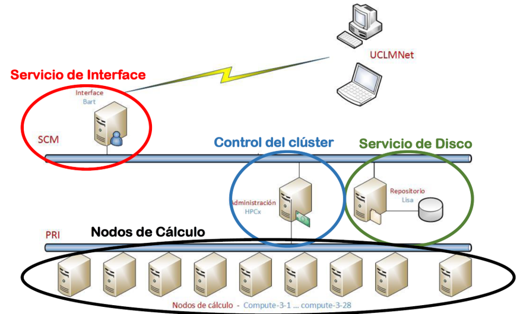
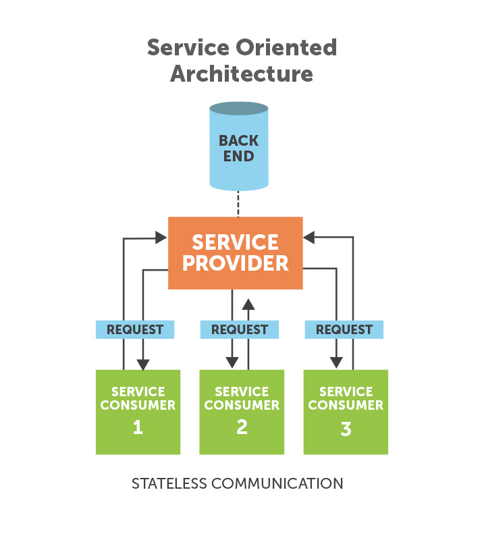
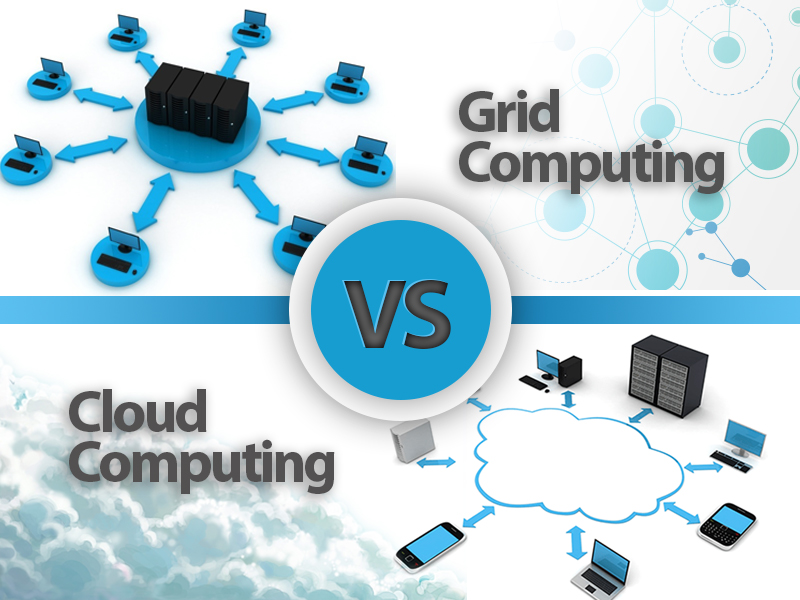
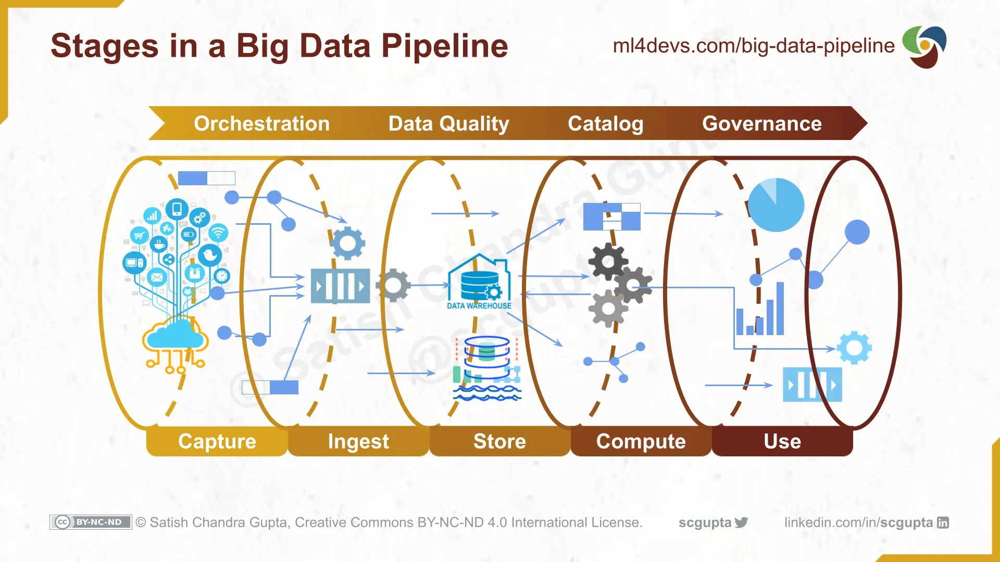
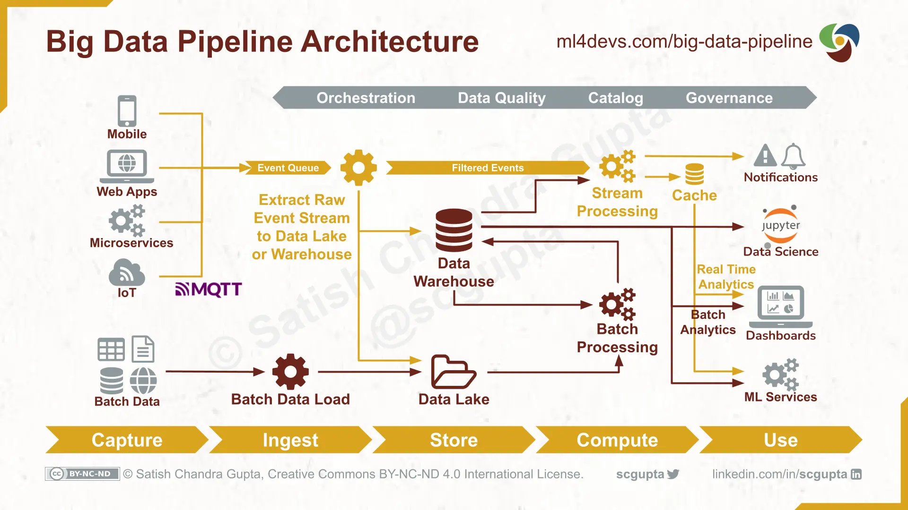
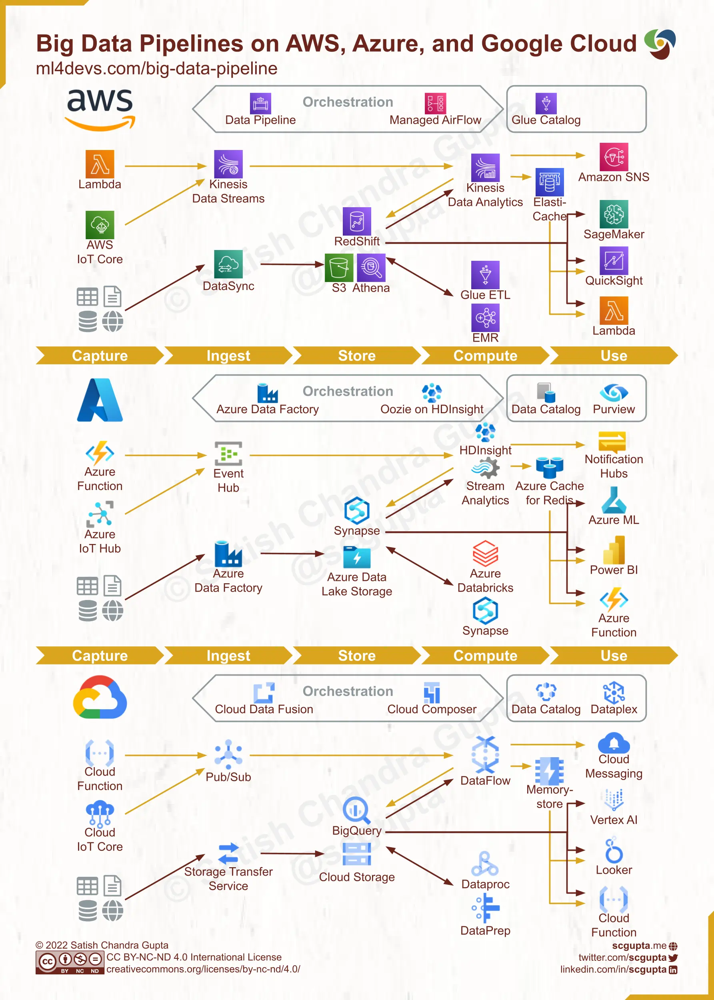

# UD 3 - Introducción a la Computación Paralela y Distribuida

## 3.1 Computación Paralela

_Evolución de computación desde Von Neuman a los sistemas actuales de computación_

Tanto el volumen de datos como la velocidad de procesamiento han seguido una trayectoria de aumento exponencial desde el inicio de la era digital, pero el primero ha aumentado a un ritmo mucho mayor que el segundo. De esta forma se hace imprescindible contar con nuevas herramientas como la computación o el procesamiento paralelo para conseguir salvar la brecha generada. Además de proporcionar una mayor capacidad de procesamiento para hacer frente a los requisitos de los grandes conjuntos de datos, el procesamiento paralelo tiene el potencial de aliviar el _cuello de botella de von Neumann_ cuando los datos necesarios no pueden ser suministrados al procesador a la velocidad requerida.

Los algoritmos y arquitecturas de procesamiento paralelo se estudian desde desde la década de 1950 como una forma de mejorar el rendimiento de los sistemas de información y, más recientemente, como una forma de mejorar su rendimiento manteniendo el consumo de energía bajo control.

Los primeros supercomputadores seguían una arquitectura de flujo de instrucciones único, flujo de datos múltiple **(SIMD)** que utiliza una única unidad de ejecución de instrucciones, con cada instrucción aplicada a múltiples elementos de datos simultáneamente. La otra clase principal de arquitecturas paralelas se conoce como **MIMD**, en la que hay múltiples flujos de instrucciones además de múltiples flujos de datos. Los superordenadores modernos, incluida la mayoría de las entradas de la lista Top500 Supercomputers, tienden a ser MIMD. Los superordenadores de gama alta suelen utilizarse para realizar cálculos numéricos intensivos con números en **coma flotante**. Por ello, su rendimiento se mide en operaciones de coma flotante por segundo, o **FLOPS**.

Por otro lado, la **ley de Moore** muestra el crecimiento exponencial en el número de transistores, los cuáles eran doblados aproximadamente cada 2 años. Hasta principios del siglo XXI, el aumento de la densidad de los chips iba acompañado de una mejora exponencial del rendimiento, debido a las correspondientes frecuencias de reloj más altas. Después, las líneas de tendencia de la frecuencia de reloj y el rendimiento comenzaron a aplanarse, sobre todo por el efecto de la disipación del calor, lo que dificultó la refrigeración de los circuitos superdensos. En ese momento, la atención a la mejora del rendimiento se trasladó al uso de múltiples procesadores independientes en el mismo chip, dando lugar a los procesadores multinúcleo. Esto provoca que el rendimiento sea más eficiente desde el punto de vista energético, dado que el consumo de energía es una función superlineal de el rendimiento de un solo núcleo.

Sin embargo, **la aparición del Big Data** requiere una reevaluación de la forma en que medir el rendimiento de los superordenadores. Mientras que la clasificación de FLOPS la entrada/salida y el ancho de banda de almacenamiento asumen un papel más importante en la determinación del rendimiento (un superordenador que realiza cálculos científicos puede recibir escasos parámetros de entrada y un conjunto de ecuaciones que definen un un modelo y luego realizar cálculos durante días o semanas, antes de arrojar las respuestas), **muchas aplicaciones Big Data requieren un flujo constante de nuevos datos que se introducen, se almacenan, se procesan y se ofrecen como resultados**, con lo que posiblemente se ponga a prueba la memoria y el ancho de banda de E/S, capacidades que suelen ser más limitadas que la velocidad de cálculo.

Por tanto, en los últimos años, se han introducido muchos modelos abstractos de procesamiento paralelo en un esfuerzo por para representar con precisión los **recursos de procesamiento, almacenamiento y comunicación**, junto con sus interacciones, permitiendo a los desarrolladores de aplicaciones paralelas visualizar y aprovechar las ventajas disponibles, **sin tener que ocuparse en detalles específicos de la máquina**. Con un **alto nivel de abstracción** podemos distinguir los enfoques de **procesamiento paralelo de datos y de control**.

El **paralelismo de datos** implica la partición de un gran conjunto de datos entre múltiples nodos de procesamiento, cada uno de ellos operando sobre una parte asignada de los datos, antes de que los resultados parciales se terminen combinando. A menudo, en las aplicaciones Big Data el mismo conjunto de operaciones debe ejecutarse en cada subconjunto de datos, por lo que el procesamiento SIMD es la alternativa más eficiente. En la práctica, sin embargo, la sincronización de un gran número de nodos de procesamiento introduce sobrecargas e ineficiencias que reducen las ganancias de velocidad. Por eso puede ser beneficioso dirigir los nodos de procesamiento para que ejecuten un único programa en múltiples de datos de forma asíncrona, con una coordinación dispersa.

En los esquemas basados en el **paralelismo de control** varios nodos operan independientemente resolviendo subproblemas, sincronizándose entre sí mediante el envío de mensajes informativos y de sincronización. Dicha independencia permite emplear recursos heterogéneos y recursos específicos de la aplicación sin interferencias cruzadas ni recursos más lentos obstaculicen el progreso de los más rápidos. La Ley de Amdahl (Gene Amdahl, 1867) dice que a no ser que un programa secuencial pudiera ser completamente paralelizado, el speedup o aceleración que se obtendrá será muy limitado independientemente del número de núcleos disponibles.

## 3.2 Computación Distribuida

Un **sistema distribuido es una colección de ordenadores autónomos enlazados por una red de ordenadores y soportados por un software que hace que la colección actúe como un servicio integrado**.

Algunos de los aspectos más importantes a tener en cuenta dentro de un sistema distribuido actual son los siguientes:

- **Apertura**: El sistema debe ser ampliable, es decir, debe existir la posibilidad de añadir nuevos recursos y servicios compartidos y que éstos se puedan poner a disposición de los diferentes componentes que forman el sistema.

- **Concurrencia**: Los distintos componentes de un sistema distribuido pueden demandar acceder a un recurso simultáneamente. Es necesario que el sistema esté diseñado para permitirlo.

- **Escalabilidad**: Un sistema es escalable si mantiene su eficiencia cuando hay un incremento significativo en el número de recursos y el número de usuarios.

- **Heterogeneidad**: El sistema distribuido puede estar formado por una variedad de diferentes redes, sistemas operativos, hardware, etc. A pesar de estas diferencias, los componentes deben poder interactuar entre sí.

- **Tolerancia a fallos**: Cualquier sistema puede fallar. En el caso de un sistema distribuido a pesar del fallo de un componente tiene que ser posible que el sistema siga funcionando.

- **Transparencia**: La transparencia permite que ciertos aspectos del sistema sean invisibles a las aplicaciones, por ejemplo, la ubicación, el acceso, la concurrencia, la gestión de los fallos, la replica de la información, etc.

Los sistemas computacionales distribuidos son sistemas de computación de alto rendimiento que están formados por conjuntos de ordenadores interconectados mediante una red que ofrecen funcionalidades diversas algunas de ellas propias de la supercomputación, tales como la computación paralela. Entre estos sistemas cabe destacar los basados en **Grid** o en arquitecturas **Cloud** (en la nube) y de forma más básica, los denominados **Clusters**.

Los **Clusters** están formados por colecciones de computadores de similares características interconectados mediante una red (ver [figura5.1]). Los computadores hacen uso de un mismo sistema operativo y un middleware que se encarga de abstraer y virtualizar los diferentes computadores del sistema dando la visión al usuario de un sistema operativo único. Los _clusters_ son sistemas dedicados a la supercomputación. El sistema operativo de un cluster es estándar y, por lo tanto, es el _middleware_ quien provee de librerías que permiten la computación paralela.

<figure style="align: center; ">
    
    <figcaption>Figura 3.1: Esquema de organización de un servicio de supercomputación en Cluster . Fuente: Universidad de Castilla La Mancha </figcaption>
</figure>

## 3.3 Grid Computing

Se define **Grid Computing** como una infraestructura persistente que soporta la computación y actividades de datos intensivas a través de múltiples organizaciones virtuales. Evidentemente, todas las implementaciones de _Grid Computing_ se basan en la comunicación a través de Internet mediante distintos protocolos. Actualmente existen dos aproximaciones para la implementación de arquitecturas en Grid: **Arquitecturas SOA** y **Arquitecturas Peer-to-Peer**. 

Las **arquitecturas SOA** (Service Oriented Architecture) están basadas en la agregación de servicios a los que se accede remotamente de forma independiente de las plataformas en las que se ejecutan y del lenguaje en los que están implementados. Un **servicio** es un programa autocontenido con una función y un interfaz bien definido. Este tipo de servicios se adapta muy bien a los sistemas _Grid_ ya que ofrece, entre otras ventajas, una alta portabilidad al permitir interactuar servicios de sistemas heterogéneos a través de interfaces que son independientes de las plataformas donde están alojados; interoperabilidad a través de protocolos estándar de redes, y a su vez, permiten el uso de clientes ligeros que aíslan a los consumidores de la complejidad de los servicios.

<figure style="align: center; ">
    
    <figcaption>Figura 3.2: Arquitecturas SOA </figcaption>
</figure>

Las **arquitecturas Peer-To-Peer** son agregaciones de programas equivalentes que se ejecutan sobre plataformas heterogéneas y que comparten parte de su memoria y capacidad de cómputo. Estas plataformas presentan una alta tolerancia a errores, dado que cada nodo tiene la misma función que el resto. Este tipo de arquitecturas son más habituales en un tipo de computación conocido como _Volunteer Computing_.

**Escalabilidad**

La tecnología _Grid_ permite de una forma muy fácil la escalabilidad, puesto que los nodos que actúan en ella son independientes a los demás. Esto permite que, si alguno de los nodos falla, se pueden delegar las tareas que estuviera realizando al resto de nodos, lo que permite seguir con la ejecución del programa y evitar paradas que puedan afectar a la efectividad de la obtención de los resultados deseados.

Además, este tipo de estructuración permite que se puedan escalar los recursos para cada computador o nodo de forma independiente en caso de que fuera necesario, sin tener que afectar al resto de computadoras. En el caso de actualizaciones que deban sufrir los equipos para obtener nuevos fragmentos de programas o mejoras acerca de ciertos aspectos, esta tecnología permite realizarlas de forma sencilla. Esto se consigue mediante la obtención de los recursos que vayan a verse afectados por estas actualizaciones y son puestas _offline_ y retiradas de la red. Mientras tanto, las tareas que suelan llevar son delegadas al resto de computadoras que se encuentren en las otras localizaciones. Esto permite que las actualizaciones se procedan en forma de cascada, haciendo que el trabajo en los proyectos que se estén llevando a cabo no se vea afectado.

**Ventajas e Inconvenientes**

Algunas de las ventajas que ofrece el _Grid Computing_ son las siguientes:

- Es robusta en cuanto a sucesos que pudieran afectar a parte de su infraestructura, por ejemplo, catástrofes naturales. Los entornos Grid son bastante modulares e independientes, lo que reduce sus puntos vulnerables a fallo.

- Es una manera muy eficaz de utilizar los recursos de una manera óptima y eficiente en una organización.

- Puede utilizarse para balanceos de carga y conexiones de red que sean redundantes ofreciendo muchas facilidades en cuanto a la escalabilidad y actualización y siendo muy conveniente para ejecutar programas o tareas de forma paralela.

Algunas de las desventajas que tiene esta tecnología son: los riesgos de seguridad que ofrece la participación de diferentes entidades heterogéneas y la necesidad de una interconexión de altas prestaciones.

<figure style="align: center; ">
    
    <figcaption>Figura 3.3: Grid Computing vs Cloud Computing</figcaption>
</figure>

## 3.4 Cloud Computing

La computación en nube o Cloud Computing es una de las tecnologías actuales de mayor implantación. El concepto de computación en la nube supone el siguiente paso evolutivo de la computación distribuida superando los sistemas legacy y evolucionando hacia los sistemas distribuidos a gran escala. El objetivo de este modelo informático es hacer un mejor uso de los recursos distribuidos, ponerlos en común para lograr un mayor rendimiento y poder abordar problemas de computación a gran escala.

En la computación en la nube se deben abordar diferentes retos como: **la virtualización, la escalabilidad, la interoperabilidad, la calidad del servicio, la tolerancia a errores y los modelos de nube**.

Básicamente, la nube puede definirse mediante tres modelos distintos:

- **Nube privada**: Los datos y procesos se gestionan dentro de la organización sin las restricciones de ancho de banda de la red, los requerimientos de seguridad y los requisitos legales que supone el uso de los servicios de la nube pública a través de redes públicas y abiertas. Algunos ejemplos son Amazon VPC.

- **Nube pública**: Describe la computación en nube en el sentido tradicional, los recursos son facilitados de forma dinámica sobre una base de auto-servicio a través de aplicaciones web/servicios web, desde un proveedor externo que comparte recursos. Algunos ejemplos son _Azure_ o _Amazon EC2_.

- **Nube híbrida**: El entorno está formado por múltiples proveedores internos y/o externos. Algunos ejemplos son _RightScale, Asigra Hybrid Cloud Backup, Carpathia, Skytap y Elastra_.

La arquitectura en la nube o _arquitectura cloud_ subyacen en una infraestructura que se se utiliza sólo cuando se necesita para extraer los recursos necesarios bajo demanda y realizar un trabajo específico, para luego ceder los recursos innecesarios. Los servicios son accesibles en cualquier parte del mundo, y la nube aparece como un único punto de acceso para todas las necesidades informáticas de los usuarios. Las arquitecturas en la nube abordan las principales dificultades que rodean el procesamiento de datos a gran escala. Existen diferentes categorías de servicios en la nube, como infraestructura, plataforma y aplicaciones. Estos servicios se prestan y consumen en tiempo real a través de Internet.

### 3.4.1 Software como servicio - Software as a Service (SaaS)

El software como servicio es una plataforma multiusuario. Utiliza recursos comunes y una instancia única tanto del código objeto de una aplicación como de la base de datos subyacente para dar soporte a varios clientes simultáneamente. Este servicio es el nuevo método en la distribución de software de aplicaciones. Algunos ejemplos de los principales proveedores son SalesForce.com, NetSuite, Oracle, IBM y Microsoft, etc.

### 3.4.2 Plataforma como servicio PaaS - Platform as a Service (PaaS)

La plataforma como servicio proporciona a los desarrolladores una plataforma que incluye todos los sistemas y entornos, que comprende el ciclo de vida completo de desarrollo, prueba despliegue y alojamiento de aplicaciones web como un servicio prestado con una base en la nube. Proporciona una forma más fácil de desarrollar aplicaciones empresariales y diversos servicios a través de Internet. El PaaS se plantea para facilitar el mantenimiento de la infraestructura de trabajo de los diferentes sistemas. Su aplicación debe reducir el tiempo de desarrollo al ofrecer un amplio abanico de herramientas y servicios fácilmente disponibles, y con una rápida capacidad de escalado.

### 3.4.3 Infraestructura como servicio - Infrastructure as a Service (IaaS)

Infraestructura como servicio ofrece acceso basado en la web a almacenamiento y potencia de cálculo. Por ello, no se necesita gestionar o controlar la infraestructura subyacente de la nube, pero si que se tiene control sobre los sistemas operativos, el almacenamiento y las aplicaciones desplegadas. Además de una mayor flexibilidad, una de las principales ventajas de IaaS es el esquema de pago basado en el uso. Esto permite a los clientes pagar a medida que crecen. Otra ventaja importante es la de utilizar siempre la última tecnología.

El camino hacia la computación en nube está impulsado por muchos factores, como la _ubicuidad del acceso_ (todo lo que se necesita es un navegador), la _facilidad de gestión_ (no hay necesidad de mejorar la experiencia del usuario, ya que no se necesita configuración o copia de seguridad), y una _menor inversión_ (solución empresarial asequible desplegada sobre la base del pago por uso del hardware, con un software de sistemas proporcionado por los proveedores de la nube). Además, la computación en nube ofrece muchas ventajas a los proveedores, como una infraestructura fácil de gestionar dado que el centro de datos tiene un hardware y un software de sistema homogéneos.

### 3.4.4 Soluciones Cloud Compiting

- **Amazon Elastic Map Reduce (EMR)**
    - [Sitio Oficial](https://aws.amazon.com/es/emr/)
    - [¿Qué es Amazon EMR?](https://docs.aws.amazon.com/es_es/emr/latest/ManagementGuide/emr-what-is-emr.html)
- **Microsoft Azure HDInsight**
    - [Sitio Oficial](https://azure.microsoft.com/es-es/products/hdinsight/)
    - [¿Qué es Azure HDInsight?](https://learn.microsoft.com/es-es/azure/hdinsight/hdinsight-overview)
- **Google Dataproc**
    - [Sitio Oficial](https://cloud.google.com/dataproc?hl=es)
    - [¿Qué es Dataproc?](https://cloud.google.com/dataproc/docs/concepts/overview?hl=es-419)

### 3.4.5 Principales Servicios de Datos en Cloud

Para comprender mejor los servicios que ofrecen los proveedores cloud, podemos clasificarlos en varios grupos en función de sus características:

- **Ingesta**
- **Procesamiento**
- **Almacenamiento**
- **Análisis**

En la siguiente tabla se muestran estos grupos de servicios, con la categoría a la que pertenecen, las alternativas en los principales proveedores de servicios cloud (HDInsight, AWS y GCP) y su opción Open Source.

| **GRUPO** | **CATEGORÍA** | **AZURE** | **AWS** | **GCP** | **OPEN SOURCE** |
| -- | -- | -- | -- | -- | -- |
| Ingesta | ETL | Data Factory | Glue | Dataprep | Apache NiFi |
| Ingesta | Message Queue | Streaming | EventHub | Kinesis | Pub/Sub | Apache Kafka |
| Ingesta | Scheduling | Logic Apps, Batch | Stepfunctions, Cloudwatch, EventBridge | Cloud Scheduler, Cloud Batch, Cloud Workflows, Cloud Composer | Apache Airflow |
| Procesamiento | Procesamiento | Functions, Data Factory, Databricks | Lambda, EMR, Glue, Databricks | Cloud Functions, DataProc, DataFlow | Apache Flink, Apache Spark, Apache Hadoop |
| Almacenamiento | Relacional | Azure SQL DB | RDS | CloudSQL, BigTable | MySQL, MariaDB, PostgreSQL |
| Almacenamiento | NoSQL | CosmosDB | DynamoDB, DocumentDB | Datastore, Firestore | Elasticsearch, Apache Cassandra, MongoDB |
| Almacenamiento | OLAP, Data Warehouse | Synapse Analytics, Snowflake | Redshift, Athena, Snowflake | BigQuery, Snowflake | Apache Druid, Apache Hive, Presto |
| Almacenamiento | Objetos | Blob Storage | S3 | Cloud Storage | Minio, Ceph |
| Almacenamiento | Cache | Cache for Redis | ElastiCache | Memorystore | Memcached, Redis |
| Almacenamiento | Grafo | CosmosDB | Neptune | Vertex AI | Neo4j |
| Análisis | Machine Learning | Azure ML | SageMaker | Cloud datalab, Vertex AI | Tensorflow, Keras, PyTorch |
| Análisis | Business Intelligence | PowerBI | Quicksight | Data Studio, Looker | Grafana, Apache Superset |

## 3.5 Big Data Pipeline

Una **pipeline de datos** es una construcción lógica que representa un proceso dividido en fases. Las pipelines de datos se caracterizan por definir el conjunto de pasos o fases y las tecnologías involucradas en un proceso de movimiento o procesamiento de datos. Por tanto, **el proceso de extremo a extremo de recopilar datos, convertirlos en conocimientos, entrenar un modelo, difundir conocimientos y aplicar el modelo cuando y donde sea necesario la acción para lograr el objetivo empresarial está unido por un _data pipeline_**.

### 3.5.1 Etapas

Un proceso de big data tiene cinco etapas:

- **Captura** de datos de fuentes internas y externas. Las fuentes de datos (aplicaciones móviles, sitios web, aplicaciones web, microservicios, dispositivos IoT, etc.) están instrumentadas para capturar datos relevantes.
- **Ingerir** datos a través de trabajos por lotes o flujos. Las fuentes instrumentadas bombean los datos a varios puntos de entrada (HTTP, MQTT, cola de mensajes, etc.). También puede haber trabajos para importar datos de servicios como Google Analytics. Los datos pueden tener dos formas: blobs por lotes y secuencias.
- **Almacenar** en Data Lake o Data Warehouse. A menudo, los datos/eventos sin procesar se almacenan en Data Lakes y se limpian, se eliminan duplicados y anomalías y se transforman para ajustarse al esquema. Finalmente, estos datos listos para consumir se almacenan en un Data Warehouse.

- **Procesamiento de análisis** informáticos y/o funciones de aprendizaje automático. Aquí es donde ocurren el análisis, la ciencia de datos y el aprendizaje automático. La computación puede ser una combinación de procesamiento por lotes (batch) y/o en flujo (streaming). Los modelos y los conocimientos se almacenan en el almacén de datos.
- **Uso** en dashboards, ciencia de datos y aprendizaje automático. La información se entrega a través de dashboards, correos electrónicos, SMS, notificaciones, microservicios, etc. 

<figure style="align: center; ">
    
    <figcaption>Figura 3.4: Estados de un BigData Pipeline</figcaption>
</figure>

### 3.5.2. Arquitectura

Hay varias opciones de arquitecturas que ofrecen diferentes compensaciones de rendimiento y costes. Es decir, habrá distintas soluciones arquitectónicas dependiendo del tipo de soporte, análisis y BI que necesitemos y recursos de los que dispongamos en cada caso.Para decidir que arquitectura, deberías hacerte algunas preguntas para identificar requisitos, como por ejemplo::

- ¿Necesita información en tiempo real o por lotes?
- ¿Cuál es la tolerancia al estancamiento de su aplicación?
- ¿Cuáles son las restricciones de costes?
- ...
  
Como ejemplo general que abarca un gran numero de escenarios de arquitecturas, tomamos [Lambda Architecture](https://en.wikipedia.org/wiki/Lambda_architecture), cuya arquitectura de procesamiento de datos está diseñada para manejar cantidades masivas de datos en batch y streaming.

<figure style="align: center; ">
    
    <figcaption>Figura 3.5: Arquitectura de un BigData Pipeline</figcaption>
</figure>

### 3.5.3 Data Pipeline en la nube

En la imagen se muestra Los Data Pipeline en los diferentes servicios de Cloud Computing. Cada uno de ellos se corresponde estrechamente con la arquitectura general de big data pipeline analizada anteriormente. Podemos utilizarlos como referencia para seleccionar tecnologías adecuadas a nuestras necesidades.

<figure style="align: center; width:900px;">
    
    <figcaption>Figura 3.3: BigData Pipeline on AWS, Azure and GCP</figcaption>
</figure>

## 3.6 Sistemas de Archivos Distribuidos

El sistema de archivos es un subsistema de un sistema operativo cuyo objetivo es organizar, recuperar y almacenar datos archivos. Un **sistema de archivos distribuido (DFS) es un sistema de archivos con archivos compartidos en recursos de almacenamiento dispersos en una red**. El DFS hace fácil compartir archivos entre aplicaciones cliente de forma controlada y autorizada. Asimismo, los usuarios pueden beneficiarse de los servicios de un DFS ya que pueden localizar todos los archivos compartidos dentro de un único servidor o nombre de dominio.

Una gran variedad de aplicaciones de análisis Big Data dependen de entornos distribuidos para analizar grandes cantidades de datos. A medida que aumenta la cantidad de datos, la necesidad de proporcionar soluciones de almacenamiento fiables y eficientes se ha convertido en una de las principales preocupaciones de los administradores de infraestructuras de Big Data. Los sistemas y métodos tradicionales de almacenamiento no son óptimos debido a sus restricciones de precio o rendimiento, mientras que el DFS se ha desarrollado con el fin de facilitar  compartir archivos tanto en redes locales (LAN) como en redes de área amplia (WAN).

Una de las principales características de los DFS es la **transparencia** que hace que los archivos se lean, se almacenen y se gestionen en las máquinas cliente, mientras que el procesamiento real se produce en los servidores, es decir, el DFS implementa sus políticas de control de acceso y almacenamiento a sus clientes de forma centralizada proporcionando su servicios a través de la red.

El objetivo principal de la transparencia en el DFS es ocultar a los clientes el hecho de que los procesos y los recursos están distribuidos físicamente en la red y proporcionar una visión común de un sistema de archivos centralizado. Es decir, el DFS pretende ser **invisible/transparente** para los clientes, que consideran que el DFS es similar a un sistema de archivos local.

Además de la transparencia, otro de los factores fundamentales en los DFS es la **fiabilidad**. Dado que el lugar de uso de los archivos puede ser diferente de su lugar de almacenamiento, los modos de fallo son sustancialmente más complejos en los DFS en comparación con los sistemas de archivos locales. La replica y la codificación de borrado son dos técnicas típicas para lograr una alta fiabilidad.

Los DFS utilizan la replica haciendo varias copias de un archivo de datos en diferentes servidores. Cuando un cliente solicita el archivo, accede de forma transparente a una de las copias. Dentro de la estrategia de **réplica** la ubicación de las réplicas juega un papel crítico en tanto en el rendimiento como en la fiabilidad de los DFS. Las réplicas se almacenan en diferentes servidores según de acuerdo con un esquema de colocación. Muchos DFS (por ejemplo **HDFS**) utiliza por defecto la replica aleatoria en la que las réplicas se almacenan aleatoriamente en diferentes nodos, en diferentes racks, en diferentes ubicación geográfica, de modo que si se produce un fallo en cualquier parte del sistema, los datos siguen estando disponibles.

Sin embargo, utilizando esta estrategia, no se puede separar eficazmente el _clúster_ en niveles mientras se mantiene la consistencia del mismo y, por lo tanto, es bastante susceptible a la pérdida frecuente de datos debido a fallos. La implementación de _HDFS_  limita la colocación de réplicas de bloques a grupos más pequeños de nodos, lo que reduce la probabilidad de pérdida de bloques con múltiples fallos de nodos. 

El procedimiento de replica dispersa múltiples copias de un archivo, y los cambios tienen que propagarse a todas las réplicas. Esto hace que la consistencia de los datos sea un aspecto clave en el funcionamiento de los DFS.

!!! info "**HDFS (Hadoop File System)** es uno de los sistemas de archivos distribuidos más populares en la actualidad. Características"

    **Arquitectura**: Un clúster HDFS consiste en un único nodo de nombres (namenode), que es el nodo maestro que gestiona el espacio de nombres del sistema de archivos y regula el acceso a los archivos por parte de los clientes. El flujo de datos se dividido en bloques distribuidos entre los datanodes, que gestionan el almacenamiento en los nodos en los que se ejecutan.

    **Acceso**: HDFS utiliza una librería de código que permite a los clientes leer, escribir y eliminar archivos y crear y eliminar directorios.

    **Replica**: HDFS divide los datos en bloques que se replican a través de los datanodes de acuerdo con una política de colocación, por la cual cada datanode tiene como máximo una copia de un bloque y cada rack tiene como máximo dos copias del bloque.

    **Tolerancia a fallos**: Cada datanode compara la versión del software yel ID del espacio de nombres con los del namenode. Si no coinciden, el datanode se apaga para preservar la integridad del sistema.

## 3.7 Tolerancia a fallos en Big Data

Todos los sistemas de Big Data necesitan manejar los fallos de software y hardware que se producen en el sistema después de su desarrollo, lo que beneficiará a los sistemas de diferentes maneras, incluyendo: recuperación de fallos, menor coste, mayor rendimiento, etc. La tolerancia a fallos es una configuración que evita que un ordenador o dispositivo de red falle en caso de un problema o error inesperado. Para hacer que un computador o una red tolerante a fallos requiere que los usuarios o las empresas piensen en cómo puede fallar un ordenador o dispositivo de red y tomen medidas que ayuden a prevenir ese tipo de fallos.

El comportamiento de los sistemas Big Data se puede dividir en:

- **Batch Processing**: Procesamiento por lotes de datos en reposo. En este escenario, los datos de origen se cargan en los dispositivos de almacenamiento de datos, ya sea por la propia aplicación de origen o por un flujo de trabajo de orquestación (_orchestation workflow_). A continuación, los datos se procesan en el lugar por un trabajo paralelizado, que también puede ser iniciado por el flujo de trabajo de orquestación.

- **Stream Processing**: Procesamiento continuo de datos en tiempo real, es decir, en cuando existe disponibilidad de datos estos se procesan de manera secuencial. Se establecen unos flujos de datos infinitos y sin límites de tiempo.

Dentro de estos dos escenarios se pueden definir diferentes estrategias de tolerancia a fallos como se explica a continuación.

### 3.7.1 Tolerancia a fallos en batch

En el modelo de cálculo por lotes de Hadoop, las aplicaciones de dos principales mecanismos para hacer frente a los fallos son la replica de datos y el mecanismo de rollback (reversión).

- **Replica de datos (Data Replication)**: En el mecanismo de replica los datos estarán en varios nodos de datos diferentes. Cuando se necesita la replica de datos, cualquier nodo de datos, cuya comunicación no esté ocupada puede copiar los datos. La principal ventaja de esta tecnología es que puede recuperarse instantáneamente de un fallo. El inconveniente es que se produce un consumo de una alta cantidad de recursos y la posibilidad de que los datos sean inconsistentes.

- **Mecanismo de reversión (Rollback Mechanism)**: El informe de la copia (_copy report_) se guardará periódicamente. Si se produce un fallo el sistema se limita a volver a un punto de control (_checkpoint_) y, a continuación, vuelve a iniciar la operación desde ese punto. El método adopta el concepto de _rollback_, es decir, el sistema volverá al trabajo anterior. Este método aumenta el tiempo de ejecución de todo el sistema, porque el _rollback_ necesita hacer una copia de seguridad y comprobar que se guarda un estado consistente. En comparación con la replica supone más tiempo pero menos recursos.

### 3.7.2 Tolerancia a fallos en Streaming

En el sistema de _streaming_, hay tres tipos de estrategia para realizar la gestión de los fallos: la espera pasiva, la espera activa y la copia de seguridad ascendente.

- **Espera pasiva (Passive Standby)**: El sistema hará regularmente una copia de seguridad del último estado en el nodo maestro a una copia del nodo réplica. Cuando se produzca un fallo, el estado del sistema se restaurará a partir de los datos de la copia de seguridad. La estrategia de replicación pasiva admite el caso de que la carga de datos sea mayor, pero el tiempo de recuperación se incrementa. Los datos de copia de seguridad pueden guardarse en un sistema de almacenamiento distribuido para reducir el tiempo de recuperación.

<figure style="align: center; ">
    
    <figcaption>Figura 3.7: Esquema de nodos en streaming. Upstream Nu y downstream Nd </figcaption>
</figure>

- **Espera activa (Active Standby)**: Cuando el sistema transmite datos para el nodo maestro, también transmite una copia de los datos para una replica del nodo al mismo tiempo. Cuando el nodo maestro falla, una de las réplicas del nodo asume completamente el trabajo, y los nodos suplentes necesitan la asignación de los mismos recursos del sistema. De esta manera, el tiempo de recuperación del fallo es más corto, pero el rendimiento de los datos es menor. También desperdicia más recursos del sistema.

- **Copia de seguridad ascendente (Upstream Backup)**. Cada nodo maestro almacena su propio estado y los datos de salida en un archivo de registro. Cuando un nodo maestro falla, el nodo maestro anterior en el flujo (upstream) reproducirá una copia de los datos en un archivo de registro al nodo correspondiente con el fin de recalcular las operaciones. Esta estrategia necesita más tiempo para reconstruir el estado de la recuperación, por lo que el tiempo de recuperación de fallos tiende a ser largo. La estrategia de copia de seguridad ascendente es una mejor opción en unas circunstancias de escasez de recursos.

