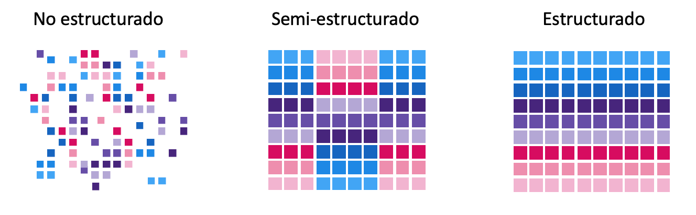

# UD 4 - Apache Hadoop - Plataforma y Ecosistema

**Apache Hadoop** es un framework de software que soporta **aplicaciones distribuidas** bajo una licencia libre. Permite a las aplicaciones trabajar con miles de nodos y petabytes de datos.

Fue inicialmente concebido para resolver un problema de escalabilidad en Nutch, un motor de búsqueda Open Source que pretendía indexar mil millones de páginas web.

<figure style="align: center; width:600px;">
    
    <figcaption>Figura 1 Hadoop: Componentes básicos de Hadoop</figcaption>
</figure>

Al mismo tiempo, Google había publicado los documentos que describían su novedoso sistema de archivos distribuidos, el Google File System (GFS), y MapReduce, un framework de computación para procesamiento paralelo. La exitosa implementación de estos conceptos en Nutch resultó en dos proyectos separados, el segundo se convirtió en Hadoop, un proyecto Apache de primera clase.

!!! Note "**Hadoop**"

    El nombre de Hadoop no es ningún acrónimo, sino un nombre inventado. Su creador se lo puso por un elefante amarillo de peluche que tenía su hijo. Pensó que un nombre corto, relativamente fácil de deletrear y pronunciar sería adecuado

Si Big Data es la filosofía de trabajo para grandes volúmenes de datos, [Apache Hadoop](http://hadoop.apache.org/) es la tecnología catalizadora. **Hadoop** puede escalar hasta miles de ordenadores creando un clúster con un almacenamiento del orden de petabytes de información.

!!! info "¿Qué es Hadoop?"

    Apache Hadoop es una **plataforma opensource** que ofrece la capacidad de **almacenar y procesar**, a "bajo" **coste**, grandes **volúmenes** de datos, sin importar su **estructura**, en un entorno **distribuido, escalable y tolerante a fallos**, basado en la utilización de hardware commodity y en un paradigma del **procesamiento a los datos**. 

Hadoop es una **plataforma**, lo que significa que es la base sobre la que construir aplicaciones. Se podría hacer el símil de Hadoop como una caja de herramientas que proporciona un conjunto de herramientas con las que construir una gran variedad de aplicaciones que requieran almacenar y procesar grandes volúmenes de datos. La selección de qué herramienta utilizar para cada aplicación la realizaremos en función de las necesidades de cada caso de uso.

Otras soluciones, como MongoDB u otras bases de datos NoSQL no se consideran plataformas, ya que tienen un único propósito y ofrecen un tipo de funcionalidad.

Hadoop aglutina una serie de **herramientas** para el procesamiento distribuido de grandes conjuntos de datos a través de clústers de ordenadores utilizando modelos de programación sencillos.

Sus características son:

- **Confiable**: Crea múltiples copias de los datos de manera automática y, en caso de fallo, vuelve a desplegar la lógica de procesamiento.
- **Tolerante a fallos**: Tras detectar un fallo aplica una recuperación automática. Cuando un componente se recupera, vuelve a formar parte del clúster. En Hadoop los fallos de hardware se tratan como una regla, no como una excepción.
- **Heterogeneo**: Los datos que pueden almacenarse y procesarse en Hadoop pueden ser de cualquier tipo: estructurados, semiestructurados o datos no estructurados.

<figure style="align: center;">
    
    <figcaption>Figura 2 Hadoop: Datos heterogéneos</figcaption>
</figure>

- **Portable**: Se puede instalar en todo tipos de hardware y sistemas operativos.
- **Escalable**: Los datos y su procesamiento se distribuyen sobre un clúster de ordenadores (escalado horizontal), desde un único servidor a miles de máquinas, cada uno ofreciendo computación y almacenamiento local.

<figure style="align: center;">
    
    <figcaption>Figura 3 Hadoop: Escalable</figcaption>
</figure>

- **Distribuido**: Hadoop se basa en una infraestructura que tiene muchos servidores (también llamados nodos) que trabajan conjuntamente para almacenar y para procesar los datos, a diferencia de los sistemas centralizados, donde todo se realiza en un único servidor.

## 1. Componentes y Ecosistema

<figure style="align: center; width:600px;">
    
    <figcaption>Figura 4 Hadoop: Ecosistema Hadoop</figcaption>
</figure>

El **núcleo de Hadoop** se compone de:

- **Hadoop Common**: un conjunto de utilidades comunes
- **HDFS (Hadoop Distributed File System)**: un sistema de ficheros distribuidos (**capa de almacenamiento**) que almacena los datos en una estructura basada en espacios de nombres (directorios, subdirectorios, etc)
- **YARN**: un gestor de recursos (**capa de procesamiento**) para el manejo del clúster y la planificación de procesos, que permite ejecutar aplicaciones sobre los datos almacenados en HDFS
- **MapReduce**: un sistema para procesamiento paralelo de grandes conjuntos de datos, con aplicaciones que lo utilizan de forma transparente.

!!! note 

    Sin embargo, normalmente se identifica el nombre Hadoop con todo el ecosistema de componentes independientes que suelen incluirse para dotar a Hadoop de funcionalidades necesarias en proyectos Big Data empresariales, como puede ser la ingesta de información, el acceso a datos con lenguajes estándar, o las capacidades de administración y monitorización.
    Estos componentes suelen ser proyectos opensource de Apache.. 

Estos elementos permiten trabajar casi de la misma forma que si tuviéramos un sistema de fichero local en nuestro ordenador personal, pero realmente los datos están repartidos entre miles de servidores.

Las aplicaciones se desarrollan a alto nivel, sin tener constancia de las características de la red. De esta manera, los científicos de datos se centran en la analítica y no en la programación distribuida.

Sobre este conjunto de herramientas existe un ecosistema "infinito" con tecnologías que facilitan el acceso, gestión y extensión del propio Hadoop.

- [Accumulo](https://accumulo.apache.org/): Base de datos NoSQL que ofrece funcionalidades de acceso aleatorio y atómico.
- **[Ambari](https://ambari.apache.org/)**: Herramienta utilizada para instalar, configurar, mantener y monitorizar Hadoop.
- [Atlas](https://atlas.apache.org/): Herramienta de gobierno de datos de Hadoop.
- [Phoenix](https://phoenix.apache.org/): Capa que permite acceder a los datos de HBase mediante interfaz SQL.
- **[Flume](https://flume.apache.org/)**: Servicio distribuido y altamente eficiente para distribuir, agregar y recolectar grandes cantidades de información procedentes de sistemas _real-time_ en Hadoop. Es útil para cargar y mover información como ficheros de logs, datos de Twitter/Reddit, etc. Utiliza una arquitectura de tipo streaming con un flujo de datos muy potente y personalizables
- **[HBase](https://hbase.apache.org/)**: Es el sistema de almacenamiento NoSQL basado en columnas para Hadoop.
    - Es una base de datos de código abierto, distribuida y escalable para el almacenamiento de Big Data.
    - Escrita en Java, implementa y proporciona capacidades similares sobre Hadoop y HDFS.
    - El objetivo de este proyecto es el de trabajar con grandes tablas, de miles de millones de filas y columnas, sobre un clúster Hadoop.
- **[Hive](https://hive.apache.org/)**: Permite acceder a ficheros de datos estructurados o semiestructurados que están en HDFS como si fueran una tabla de una base de datos relacional, utilizando un lenguaje similar a SQL (_HiveSQL_). Simplifica enormemente el desarrollo y la gestión con Hadoop.
- **[Impala](https://impala.apache.org/)**: Herramienta con funcionalidad similar a Hive (tratamiento de los datos de HDFS mediante SQL) pero con un rendimiento elevado (tiempos de respuesta menores).
- **[Kafka](https://kafka.apache.org/)**: Sistema de mensajería que permite recoger eventos en tiempo real así como su procesamiento.
- [Mahout](https://mahout.apache.org/): Conjunto de librerías para desarrollo y ejecución de modelos de machine learning utilizando las capacidades de computación de Hadoop.
- **[Oozie](https://oozie.apache.org/)**: Herramienta que permite definir flujos de trabajo en Hadoop así como su orquestación y planificación.
- **[Pig](https://pig.apache.org/)**: Lenguaje de alto de nivel para analizar grandes volúmenes de datos. Trabaja en paralelo, lo que permite gestionar gran cantidad de información. Realmente es un compilador que genera comandos MapReduce, mediante el lenguaje textual denominado Pig Latin.
- **[Spark](https://spark.apache.org/)**: Aunque habitualmente no se asocia al ecosistema Hadoop, Apache Spark ha sido el mejor complemento de Hadoop en los últimos años. Apache Spark es un motor de procesamiento masivo de datos muy eficiente a gran escala que ofrece funcionalidades para ingeniería de datos, machine learning, grafos, etc. _Implementa procesamiento en tiempo real al contrario que MapReduce, lo que provoca que sea más rápido_. Para ello, en vez de almacenar los datos en disco, trabaja de forma masiva en memoria. Puede trabajar de forma autónoma, sin necesidad de Hadoop.
- **[Sqoop](https://sqoop.apache.org/)**: Componente para importar o exportar datos estructurados desde bases de datos relacionales a Hadoop y viceversa.
- [Storm](https://storm.apache.org/): Sistema de procesamiento real-time de eventos con baja latencia.
- [Zeppelin](https://zeppelin.apache.org/): Aplicación web de notebooks que permite a los Data Scientists realizar análisis y evaluar código de forma sencilla, así como la colaboración entre equipos.
- **[ZooKeeper](https://zookeeper.apache.org/)**: Herramienta técnica que permite sincronizar el estado de los diferentes servicios distribuidos de Hadoop.

## 2. Distribuciones Hadoop

No te preocupes si ves muchos componentes y piensas que es imposible dominar todos. En la realidad, los proyectos suelen utilizar sólo una pequeña parte de los componentes dependiendo de las necesidades. En negrita encuentras los más utilizados, además de los componentes core: HDFS y YARN.

Cada componente es un proyecto Apache independiente, lo que impacta, entre otros a:

- **Política de versionado (periodicidad, identificación, …)**: cada componente sigue su propio camino en cuanto a cuándo se publican las nuevas versiones, qué mejoras o evoluciones incluyen, etc.
- **Dependencias del proyecto con otras versiones de componentes del ecosistema y librerías externas**: los componentes suelen tener dependencias entre ellos. Por ejemplo, Hive tiene dependencia de HDFS, o Phoenix de HBase. Las dependencias suelen ser difíciles de gestionar, por ejemplo, porque una versión de Phoenix requiere una versión específica de HBase.
- **Roadmap y estrategia del proyecto**: al tener grupos de trabajo diferentes, cada proyecto tiene su propia estrategia en cuanto a cómo evolucionar la solución, cuándo adaptarse a cambios externos, etc. y no siempre están alineados.
- **Commiters / desarrolladores**: los desarrolladores de cada proyecto son diferentes.

Por este motivo, realizar una instalación de toda una plataforma Hadoop con sus componentes asociados de forma independiente (lo que se denomina Hadoop Vanila) resulta muy complicado. Por ejemplo, al instalar la versión X de Phoenix necesitas la versión Y de HBase, pero otro componente (Hive, por ejemplo), requiere la versión Z de HBase.

La misma dificultad ocurre para la **resolución de incidencias** que puedan ocurrir en la plataforma cuando se ejecuta en producción.

Para solventar las dificultades mencionadas, surgen las **distribuciones comerciales de Hadoop**, que contienen en un único paquete la mayor parte de componentes del ecosistema, resolviendo dependencias, añadiendo incluso utilidades, e incorporando la posibilidad de contratar soporte empresarial 24x7

### 2.1 Distribuciones: Cloudera

!!! note inline end

    **Cloudera** es la principal distribución que existe actualmente (hubo otras, como MAPR y HortonWorks, pero desaparece MAPR y Hortonworks se une a Cloudera)

Utiliza la mayor parte de componentes de Apache, en algún caso realizando algunas modificaciones, y añade algún componente
propietario (Cloudera Manager, Cloudera Navigator, etc.). _[CDN Cloudera](https://www.cloudera.com/products/open-source/apache-hadoop/key-cdh-components.html)_ y como [descargarlo](https://www.cloudera.com/downloads/cdh.html)

<figure style="align: center;">
    
    <figcaption>Figura 5 Hadoop: Distribución Cloudera. Fuente: Cloudera</figcaption>
</figure>

!!! note "CDH Cloudera" 

    **CDH (Cloudera’s Distribution including Apache Hadoop)** es la distribución de Cloudera con Apache Hadoop orientada a empresas. La última versión es Cloudera 6 (CDH 6). Está disponible como paquetes RPM y paquetes para Debian, Ubuntu o Suse. Cloudera proporciona CDH en varias modalidades.

    La versión más completa y empresarial es Cloudera Enterprise, que incluye suscripciones por cada nodo del clúster, Cloudera Manager y el soporte técnico. Por otro lado, Cloudera Express es una versión más sencilla, sin actualizaciones o herramientas de disaster recovery. Por último, existe una versión gratuita de CDH: Cloudera Community. Permite desplegar un clúster con un número de nodos limitado.

    Es posible ejecutar Cloudera desde un contenedor Docker. Proporciona una imagen Docker con CDH y Cloudera Manager que sirve como entorno para aprender Hadoop y su ecosistema de una forma sencilla y sin necesidad de Hardware potente. También es útil para desarrollar aplicaciones o probar sus funcionalidades.


### 2.2 Soluciones Cloud Computing

- **Amazon Elastic Map Reduce (EMR)**
    - [Sitio Oficial](https://aws.amazon.com/es/emr/)
    - [¿Qué es Amazon EMR?](https://docs.aws.amazon.com/es_es/emr/latest/ManagementGuide/emr-what-is-emr.html)
- **Microsoft Azure HDInsight**
    - [Sitio Oficial](https://azure.microsoft.com/es-es/products/hdinsight/)
    - [¿Qué es Azure HDInsight?](https://learn.microsoft.com/es-es/azure/hdinsight/hdinsight-overview)
- **Google Dataproc**
    - [Sitio Oficial](https://cloud.google.com/dataproc?hl=es)
    - [¿Qué es Dataproc?](https://cloud.google.com/dataproc/docs/concepts/overview?hl=es-419)

## 3. Arquitectura

Hadoop se basa en un modelo de despliegue distribuido y está diseñado para ejecutar sistemas de procesamiento en el mismo clúster que almacena los datos (_data local computing_). 

Pese a que hay un conjunto de servidores trabajando en paralelo y de forma conjunta, para un usuario externo todos ellos actúan como si fuera una sola máquina, es decir, un usuario del sistema de ficheros (**HDFS**) verá la estructura de directorios, subdirectorios y ficheros, pero no tendrá que conocer en qué servidores está cada fichero (lo mismo ocurre con cualquier otro componente que se ejecuta en toda la infraestructura)

**Su filosofía es almacenar todos los datos en un lugar y procesarlos en el mismo lugar, esto es, mover el procesamiento al almacén de datos y no mover los datos al sistema de procesamiento.**

!!! note inline end

    **Cluster y Nodo:** Al conjunto de servidores que trabajan para implementar las funcionalidades de Apache Hadoop se le denomina **clúster**, y a cada uno de los servidores que forman parte del clúster se le denomina **nodo**.
    A partir de ahora, cuando usemos la palabra "clúster de Hadoop" debes pensar en el conjunto de servidores que forman la plataforma que está en ejecución, y cuando usemos la palabra "nodo" debes pensar en cada uno de los servidores que componen el clúster.

Esto lo logra mediante un entorno distribuido de datos y procesos. El procesamiento se realiza en paralelo a través de nodos de datos en un sistema de ficheros distribuidos (HDFS), donde se distingue entre:

- Nodos **worker**: Realizan los trabajos. Tratan con los datos locales y los procesos de aplicación. Por ejemplo, para el almacenamiento, cada worker se ocupará de almacenar una parte, mientras que para la ejecución de trabajos, cada worker realiza una parte del trabajo. Su número dependerá de las necesidad de nuestros sistemas, pero pueden estar comprendido entre 4 y 10.000. Su hardware es relativamente barato (_commodity hardware_) mediante servidores X86.
- Nodos **master**: Encargados de los procesos de gestión global, es decir, controlar la ejecución o el almacenamiento de los trabajos y/o datos. Son los nodos que controlan el trabajo que realizan los nodos worker, por ejemplo, asignando a cada worker una parte del proceso o de los datos a almacenar, vigilando que están realizando el trabajo y no están caídos, rebalanceando el trabajo a otros nodos en caso de que un worker tenga problemas, etc. Normalmente se necesitan 3.
- Nodos **edge**: Hacen de puente entre el clúster y la red exterior y proporcionan interfaces, ya que normalmente un clúster Hadoop no tiene conexión con el resto de servidores e infraestructura de la empresa, por lo que toda la comunicación desde el exterior hacia el clúster se canaliza a través de los nodos frontera, que además, ofrecen las APIs para poder invocar a servicios del clúster.

<figure style="align: center;">
    
    <figcaption>Figura 6 Hadoop: Arquitectura Hadoop</figcaption>
</figure>

El hardware típico donde se ejecuta un cluster Hadoop sería:

!!! note inline end

    **Commodity Hardware:** A veces el concepto hardware commodity suele confundirse con hardware doméstico, cuando lo que hace referencia es a hardware no específico, que no tiene unos requerimientos en cuanto a disponibilidad o resiliencia exigentes

- Nodos _master_: 12 HDs x 2-3 TB JBOD (_Just a bunch of disks = sólo un montón de discos_) - 2CPUs x 8 cores - 256 GB RAM
- Nodos _worker_: 2 HDs x 2-3 TB RAID - 2CPUs x 8 cores - 256 GB RAM
- Nodos _edge_: 2 HDs x 2-3 TB RAID - 2CPUs x 8 cores - 256 GB RAM

## 4. Uso de Hadoop

Es importante analizar y tener en cuenta en que casos reales es aconsejable el uso de Hadoop y cuando no lo es.

### ¿Cuándo Usar Hadoop?

- Cuando el **volumen** de datos es mayor que la capacidad de los sistemas tradicionales (no cabe en una máquina).
- Cuando hay un problema de **variedad** de datos, porque son diversos o porque cambian frecuentemente.
- Cuando se requiere una **escalabilidad** que no pueden ofrecer los sistemas tradicionales, por volumen, por velocidad de proceso, por rendimiento global, y no se requiere un nivel de transaccionalidad elevado.
- Cuando se pretende tener **una plataforma** con la capacidad de almacenamiento y procesamiento de un gran volumen de datos para cubrir diferentes casos de uso (con la misma plataforma).

### ¿Cuándo no usar Hadoop?

- Cuando los sistemas tradicionales son capaces de dar soporte a los casos de uso y cuando los formatos/tipos de datos son fijos o no cambian apenas.
- Cuando se tiene requisitos de transaccionalidad muy estrictos, es decir, cuando se pretende cubrir la operativa de una empresa (por ejemplo, en un banco: las transferencias, movimientos, pagos, etc.).
- Cuando sólo se requiere resolver un caso de uso "Big Data" muy específico.

## 5. Instalación Hadoop Core

Para trabajar en esta y las siguientes sesiones, vamos a utilizar una máquina virtual. A partir de la OVA de VirtualBox, podrás entrar con el usuario hadoop y la contraseña hadoop.

También puedes instalar el software del curso, se recomienda crear una máquina virtual con cualquier distribución Linux. En mi caso, yo lo he probado en la versión Ubuntu Mate 22.04 LTS y la versión 3.3.4 de Hadoop. Puedes seguir las instrucciones de esta sección.

Ayúdate también de la información de la [página oficial](https://hadoop.apache.org/docs/stable/hadoop-project-dist/hadoop-common/SingleCluster.html)

!!! note inline end

    Para trabajar en local tenemos montada una solución que se conoce como pseudo-distribuida, porque es al mismo tiempo maestro y esclavo. En el mundo real o si utilizamos una solución cloud tendremos un nodo maestro y múltiples nodos esclavos.


### 5.1 Instalación

1. Java™ debe ser instalado. Las versiones de Java recomendadas se encuentran descritas en [HadoopJavaVersions](https://cwiki.apache.org/confluence/display/HADOOP/Hadoop+Java+Versions).

```
sudo apt-get install openjdk-11-jdk
/usr/bin/java
```

2. ssh debe estar instalado y sshd debe estar ejecutándose para usar las secuencias de comandos de Hadoop que administran los demonios ssh remotos de Hadoop, ya que vamos a usar las secuencias de comandos de inicio y detección opcionales.

```
sudo apt-get install ssh
```

3. Abre la terminal en el directorio `$HOME`

4. Para obtener la distribución de Apache Haddop, descarga la versión estable más reciente desde [Apache Download Mirrors](https://www.apache.org/dyn/closer.cgi/hadoop/common/)

```
wget https://downloads.apache.org/hadoop/common/hadoop-3.3.4/hadoop-3.3.4.tar.gz
```

5. Una vez descargado, desempaquetamos el archivo descargado con el comando tar y entra dentro de la carpeta:

```
tar -xzf hadoop-3.3.4.tar.gz
cd hadoop-3.3.4
```

6. Edita el siguiente archivo `etc/hadoop/hadoop-env.sh` para definir la variable de entorno de Java y añadela.

```
# Technically, the only required environment variable is JAVA_HOME.
export JAVA_HOME=/usr/lib/jvm/java-11-openjdk-amd64/
```

7. Para poder usar los comandos de HDFS en cualquier lugar del sistema, sin tener que hacerlo desde el directorio de Hadoop (por ejemplo /home/hadoop/hadoop-3.3.4/bin), creamos las variables de entorno y añadimos al PATH. Para ello abrimos el archivo `~/.bashrc` y añadimos al final el siguiente código y ejecuta el comando `source ~/.bashrc`

```title="~/.bashrc"
export HADOOP_HOME=$HOME/hadoop-3.3.4
export HADOOP_INSTALL=$HADOOP_HOME
export HADOOP_MAPRED_HOME=$HADOOP_HOME
export HADOOP_COMMON_HOME=$HADOOP_HOME
export HADOOP_HDFS_HOME=$HADOOP_HOME
export HADOOP_YARN_HOME=$HADOOP_HOME
export HADOOP_COMMON_LIB_NATIVE_DIR=$HADOOP_HOME/lib/native
export PATH=$PATH:$HADOOP_HOME/sbin:$HADOOP_HOME/bin
export HADOOP_OPTS="-Djava.library.path=$HADOOP_HOME/lib/native"
```

8. Ejecuta el siguiente comando. Si no da error, podemos continuar

```
bin/hadoop
```

### 5.2 Configuración (Pseudo-Distributed Operation)

Hadoop se puede ejecutar en un solo nodo en un modo pseudo-distributed donde cada demonio de Hadoop se ejecuta en un proceso Java separado.

Los archivos que vamos a revisar a continuación se encuentran dentro de la carpeta `$HADOOP_HOME/etc/hadoop`.

1. El archivo que contiene la configuración general del clúster es el archivo `core-site.xml`. En él se configura cual será el sistema de ficheros, que normalmente será hdfs, indicando el dominio del nodo que será el maestro de datos (namenode) de la arquitectura.

```xml title="core-site.xml"
<configuration>
    <property>
        <name>fs.defaultFS</name>
        <value>hdfs://bda-iesgrancapitan:9000</value>
    </property>
</configuration>
```
