# UD 4 - Apache Hadoop - HDFS

**Hadoop Distributed File System (HDFS)** Es el componente principal del ecosistema Hadoop. Hace posible almacenar conjuntos de datos masivos con tipos de datos estructurados, semi-estructurados y no estructurados como imágenes, vídeo, datos de sensores, etc.

Es un sistema de almacenamiento distribuido y tolerante a fallos que puede almacenar gran cantidad de datos, escalar de forma incremental y sobrevivir a fallos de hardware sin perder datos. Se basa en el [paper](https://static.googleusercontent.com/media/research.google.com/es//archive/gfs-sosp2003.pdf) que publicó Google detallando su Google File System en 2003.

Está optimizado para obtener un alto rendimiento y trabajar con máxima eficiencia cuando se leen _archivos grandes_. Para obtener este rendimiento, utiliza tamaños de bloque inusualmente grandes y optimización de localización de los datos para reducir la E/S de red.

Con el fin de ofrecer una visión de los recursos como una sola unidad crea una capa de abstracción como un sistema de ficheros único. **Está basado en la idea de que mover el procesamiento es mucho más rápido, fácil y eficiente que mover grandes cantidades de datos, que pueden producir altas latencias y congestión en la red**.

## 1. Características HDFS

- **Es un sistema de ficheros distribuido**, es decir, se ejecuta sobre diferentes nodos que trabajan en conjunto ofreciendo a los usuarios y aplicaciones que utilizan el sistema, un interfaz como si sólo hubiera un único servidor por detrás.
- Está diseñado para ejecutarse sobre **hardware commodity**, es decir, no requiere unos servidores específicos o costosos. Esto conlleva la necesidad de poder sobreponerse a los fallos que pudieran tener los servidores o algunas partes de los servidores.
- Está optimizado para almacenar **ficheros de gran tamaño** y para hacer operaciones de lectura o escritura masivas. Su objetivo es cubrir los casos de uso de analítica masiva, no los casos de uso que dan soporte a las operaciones de las empresas.
- Tiene capacidad para **escalar horizontalmente** hasta volúmenes de Petabytes y miles de nodos, y está diseñado para poder dar soporte a **múltiples clientes** con acceso concurrente. La escalabilidad se consigue añadiendo más servidores
- No establece **ninguna restricción sobre los tipos de datos** que se almacenan en el sistema, ya que éstos pueden ser estructurados, semiestructurados o no disponer de ninguna estructura, como el caso de imágenes o vídeos.
- HDFS tiene una orientación **"write-once, read many"**, que significa "se escribe una vez, se lee muchas veces", es decir, asume que un archivo una vez escrito en HDFS **no se modificará**, aunque se puede acceder a él muchas veces. Así pues, los datos, una vez escritos en HDFS son _immutables_. Cada fichero de HDFS solo permite añadir contenido (append-only). Una vez se ha creado y escrito en él, solo podemos añadir contenido o eliminarlo. Es decir, a priori, no podemos modificar los datos.

_Recuerda las características con esta imagen_

<figure style="align: center; width:600px;">
    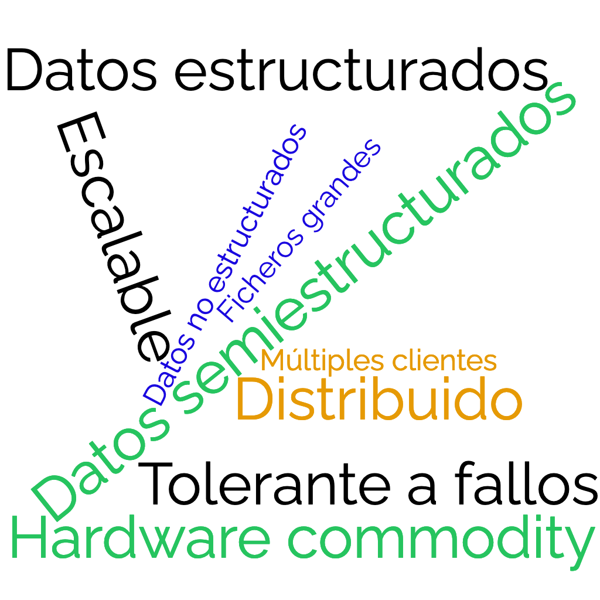
    <figcaption>Figura 1 HDFS: Características HDFS. (Fuente: Ministerio de Educación)</figcaption>
</figure>

## 2. Bloques

Un bloque es la cantidad mínima de datos que puede ser leída o escrita. En HDFS, los ficheros se dividen en bloques, como en la mayoría de sistemas de ficheros. Sin embargo, el **tamaño de un bloque en HDFS es** muy grande, **de 128 megabytes por defecto**. En el sistema operativo de un PC (Windows, Linux, etc.), el tamaño suele ser de 512 bytes o 4 kilobytes, es decir, unas 50.000 veces más pequeño que en HDFS.

_El bloque es la unidad mínima de lectura_, lo que significa que aunque tengamos un fichero que ocupa 1 kilobyte, tendremos que leer o escribir 128 megabytes cada vez que queramos operar con el fichero. Para ficheros grandes, por ejemplo, de 500 gigabytes, la ventaja que aporta es que hay que buscar y leer o escribir muchos menos bloques. Esta característica explica por qué Hadoop está diseñado para ficheros grandes y lecturas masivas, y por qué tiene un mal rendimiento para operaciones pequeñas.

Por lo tanto, cuando queremos escribir un fichero en HDFS, lo primero que se hace es dividir el fichero en bloques. A continuación, los bloques son almacenados en diferentes nodos, no siendo necesario que los bloques de un mismo fichero estén en un mismo nodo. Además, un aspecto importante es que cada bloque se replica (se copia) en más de un nodo, lo que se conoce como el **factor de replica**. _El factor de replica por defecto en HDFS es 3_, lo que significa que cada bloque tiene 3 copias almacenadas en 3 nodos diferentes. **La replicación es el mecanismo con el que se consigue, entre otras cosas, la tolerancia a fallos**.

Al tener varias réplicas de cada bloque en diferentes nodos, en caso de que un nodo se caiga, o que un disco de un nodo se corrompa, HDFS dispondrá de otras copias, por lo que no se perderán los datos. 

<figure style="align: center;width:600px;">
    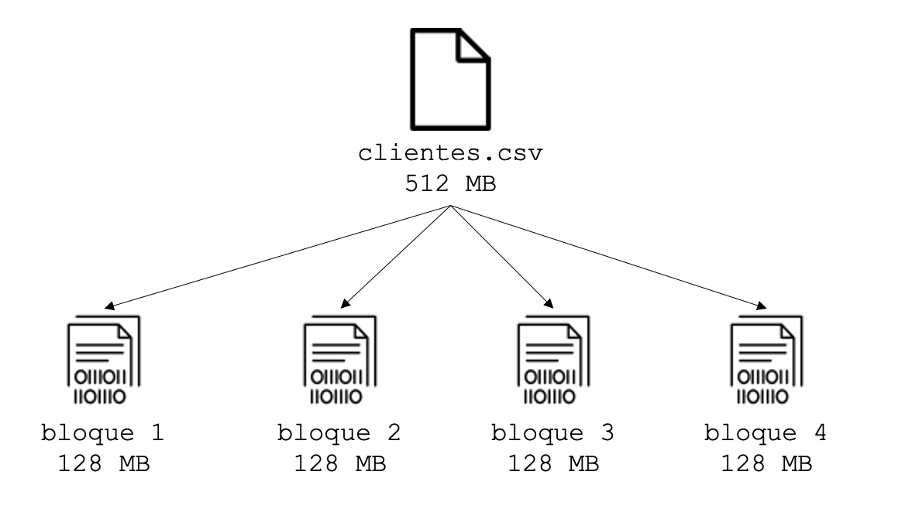
    <figcaption>Figura 2 HDFS: Bloques HDFS. (Fuente: Ministerio de Educación)</figcaption>
</figure>

En el ejemplo anterior, si se cayera el nodo 3, HDFS dispondría de otras dos copias por cada bloque que almacena del fichero.

<figure style="align: center;width:800px;">
    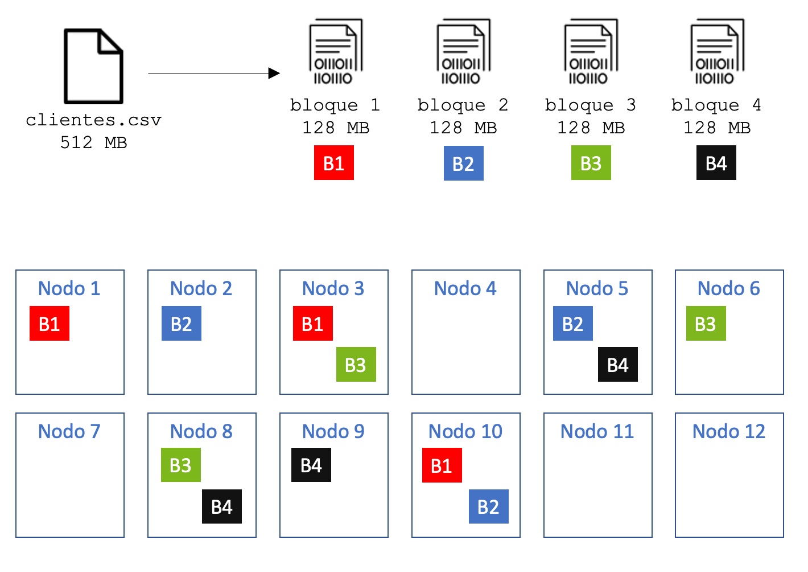
    <figcaption>Figura 3 HDFS: Factor Replicación HDFS. (Fuente: Ministerio de Educación)</figcaption>
</figure>

El factor de replica puede configurarse a nivel de fichero o directorio, es decir, podemos elegir un factor de replica diferente para los ficheros o directorios que consideremos. Cuanto mayor sea el factor de replica, más difícil será que perdamos los datos e incluso mejorará el rendimiento en las lecturas, porque para leer un bloque, HDFS podrá utilizar cualquier nodo. Sin embargo, un factor de replica alto hace que las escrituras tengan peor rendimiento, al tener que hacer muchas copias en cada escritura, y además, consumirá más espacio real en disco.

## 3. Arquitectura HDFS

La arquitectura de HDFS consta de distintos servicios y tipos de nodo, aunque fundamentalmente son tres tipos:

- **NameNode**(NN): Nodo de Nombres.
- **Secondary NameNode**(SNN): Nodo de Nombres Secundario.
- **DataNode**(DN): Nodos de Datos

**NameNode**

El nodo Namenode actúa de maestro, manteniendo la metainformación de todo el sistema de ficheros, esto es:

- Almacena el espacio de nombres HDFS
- La estructura de directorios, subdirectorios y los ficheros
- La información de los ficheros: tamaño, fecha de modificación, propietario, permisos, etc.
- El factor de replica de cada fichero.
- Los bloques que componen cada fichero.
- La ubicación de los distintos bloques (en qué nodo se encuentran).

!!! note inline end

    _La información es almacenada tanto en disco, para garantizar la durabilidad en caso de una caída del servidor, como en memoria, para poder acceder a la información lo más rápido posible y optimizar el rendimiento._

NameNode se compone principalmente de dos ficheros:

- **FsImage:** Contiene la estructura de directorio completa (espacio de nombres) de HDFS con detalles sobre la ubicación de los datos en los bloques de datos y qué bloques están almacenados en qué nodo. NameNode utiliza este archivo cuando se inicia.
- **EditLog:** Es un _registro de transacciones_ que registra los cambios en el sistema de archivos HDFS o cualquier acción realizada en el clúster HDFS, como la adición de un nuevo bloque, la replicación, la eliminación, etc. En resumen, registra los cambios desde que se creó la última FsImage

Cuando se inicia un NameNode, lee el estado HDFS de un archivo de imagen, fsimage, y luego aplica las ediciones del archivo de registro de ediciones. Seguidamente escribe un nuevo estado HDFS en el fsImage y comienza la operación normal con un archivo de edición vacío.

!!! example

    Por ejemplo, la creación de un nuevo archivo en HDFS hace que NameNode inserte un registro en EditLog para indicarlo. De manera similar, cambiar el factor de replica de un archivo hace que se inserte un nuevo registro en EditLog. El NameNode utiliza un archivo en su sistema de archivos del sistema operativo anfitrión local para almacenar el EditLog. Todo el espacio de nombres del sistema de archivos, incluida la asignación de bloques a archivos y las propiedades del sistema de archivos, se almacena en un archivo denominado FsImage. La FsImage también se almacena como un archivo en el sistema de archivos local de NameNode.

Además de gestionar la **metainformación**, **coordina** todas las **lecturas** y **escrituras**, y controla el funcionamiento de los Datanodes, es decir, detecta si hay algún fallo en algún nodo y toma las acciones necesarias en caso de que alguno esté caído o con fallos.

Es importante que el Namenode sea robusto y no tenga caídas. Por este motivo, se utiliza hardware más resiliente que en el caso de los Datanodes.

**Secondary NameNode**

Para mejorar la **tolerancia a fallos**, suele existir un nodo secundario del maestro, denominado **Secondary Namenode**.

El NameNode es el único punto de fallo en HDFS ya que, si el Namenode falla, se pierde todo el sistema de archivos HDFS. Para reducir este riesgo esto, Hadoop implementó el Secondary Namenode en la versión 3.

Secondary Namenode no es un **nodo de respaldo**. Su principal función es almacenar una copia de los ficheros ***fsimage*** y ***editlog***. Comprueba los metadatos del sistema de archivos almacenados en NameNode. Esto es lo que se llama _checkpointing_. El proceso que sigue el NameNode secundario para fusionar periódicamente los archivos fsimage y edits log es el siguiente:

1. El NameNode secundario obtiene los últimos archivos fsImage y editLog del NameNode primario.
2. El NameNode secundario aplica cada transacción del archivo editLog a fsImage para crear un nuevo archivo FsImage fusionado.
3. El archivo fsImage fusionado se transfiere de nuevo al NameNode primario.

<figure style="align: center;">
    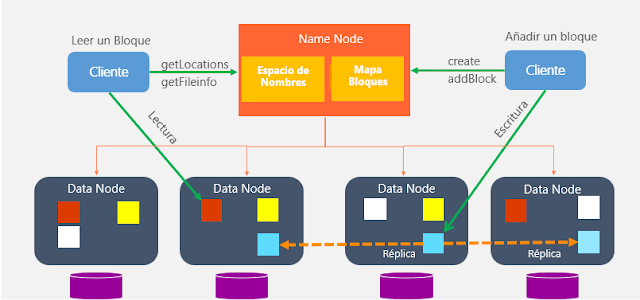
    <figcaption>Figura 4 HDFS: Relación entre NameNode y DataNode. (Fuente: Telefónica Tech)</figcaption>
</figure>

**DataNode**

Los **Datanodes** son los servicios que se encuentran en los **nodos worker**, y su labor principal es almacenar o leer los bloques que componen los ficheros que están almacenados en HDFS, con las siguientes particularidades:

- Habrá más de uno en cada clúster. Por cada Namenode podemos tener miles de Datanodes.
- Almacena y lee bloques de datos. El Datanode sólo conoce los bloques que contiene, pero no sabe a qué fichero pertenecen o dónde se encuentran el resto de bloques del fichero. Toda esta información sólo está en el Namenode. Por eso es crítico para HDFS.
- Envían al Namenode la lista de los bloques que almacenan, para que el Namenode pueda tener una lista actualizada de los bloques y su ubicación.
- Almacenan un checksum por cada bloque para detectar si el bloque
está corrupto y garantizar su integridad.
- Envía un latido (_heartbeat_) al Namenode, que es un mensaje corto indicando que está levantado


**Resumen**

<figure style="align: center;">
    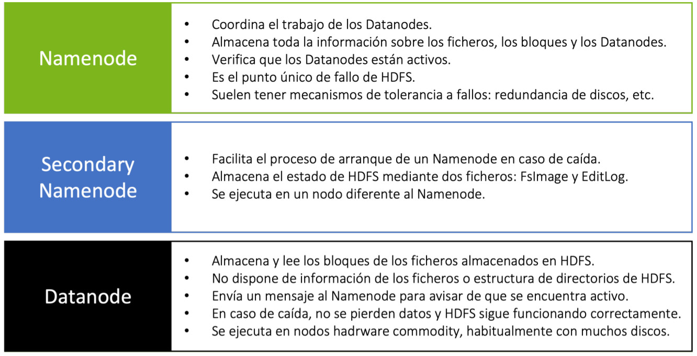
    <figcaption>Figura 5 HDFS: Resumen Nodos HDFS. (Fuente: Ministerio de Educación)</figcaption>
</figure>

## 4. Funcionamiento (Lectura y Escritura)

Los datos que se escriben en HDFS son ***immutables***, es decir, no pueden ser modificados.

Esto significa que HDFS sólo permite añadir contenido a los ficheros, así que por ejemplo, si en un fichero de 256 megabytes se pretende modificar un carácter, HDFS creará un nuevo bloque con el cambio y lo escribirá por completo, borrando el bloque anterior. 

Esto, junto con la característica del tamaño de bloque de **128 megabytes**, que es la **unidad mínima de lectura**, hace que el rendimiento de HDFS para operaciones sencillas sobre registros aleatorios sea muy pobre. Recuerda que HDFS está pensado para _ficheros grandes y lecturas masivas_. 

HDFS proporciona dos tipos de operaciones básicas con los ficheros: **leer y escribir un fichero**

**Lectura**

En el caso de las lecturas, un ***esquema simplificado*** de esta operación sería:

<figure style="align: center;">
    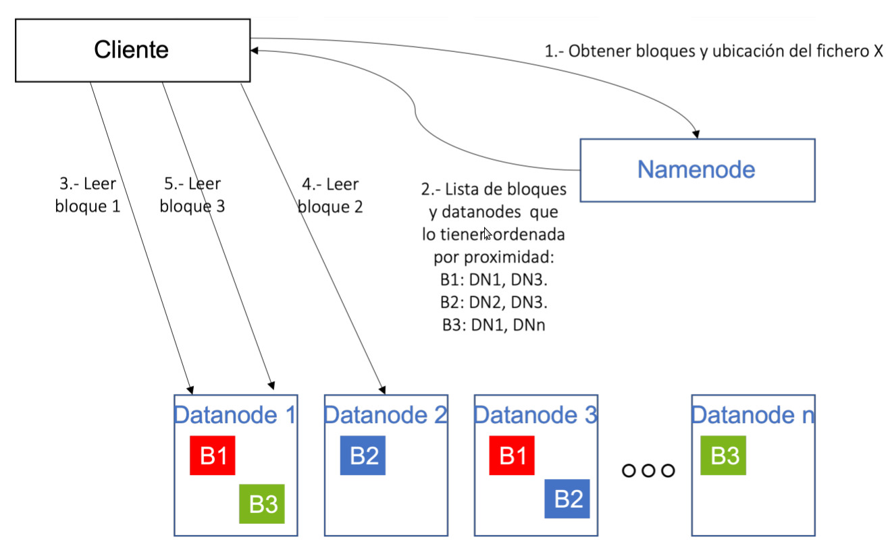
    <figcaption>Figura 6 HDFS: Lectura HDFS. (Fuente: Ministerio de Educación)</figcaption>
</figure>

1. El cliente que desea leer un fichero de HDFS, mediante una librería instalada en su equipo, realiza una llamada al Namenode para conocer qué bloques forman un fichero (llamemos X al fichero), así como los Datanodes que contienen cada uno de los bloques.
2. El Namenode retorna dicha información, y ordena para cada bloque los Datanodes que contienen dicho bloque en función de la distancia al cliente (un algoritmo evalúa la distancia entre el cliente y cada Datanode). El objetivo de esta lista ordenada es intentar reducir el tiempo de acceso a cada Datanode desde el cliente.
3. Con la información recibida del Namenode, el cliente se comunica directamente con el Datanode 1 para solicitarle el primer bloque.
4. El cliente se comunica con el Datanode 2 para obtener el bloque 2.
5. El cliente se comunica con el Datanode 1 para obtener el bloque 3. 

!!! info

    Es preciso indicar que durante la operación, la única responsabilidad del Namenode es devolver al cliente la lista de bloques y la ubicación de los mismos, pero no interviene en las lecturas. Es decir, para realizar las lecturas de cada bloque, **el cliente se comunica directamente con los Datanodes, sin que los datos pasen por el Namenode**. Esto hace que el Namenode no sea cuello de botella del proceso, y pueda atender múltiples peticiones en paralelo, ya que no le supone mucho esfuerzo de computación atender las diferentes solicitudes de los clientes.

**Escritura**

En el caso de las escrituras, un esquema simplificado de esta operación sería:

<figure style="align: center;">
    
    <figcaption>Figura 7 HDFS: Escritura HDFS. (Fuente: Ministerio de Educación)</figcaption>
</figure>

1. El cliente, que desea escribir un fichero, invoca a un servicio del Namenode para solicitar la creación del fichero, indicándole en la llamada el nombre y la ruta en la que desea guardarlo.
2. El Namenode realiza una serie de verificaciones, como los permisos del usuario/cliente en el directorio, si el fichero ya existe, etc. En caso de que todas las verificaciones sean correctas, devuelve un OK, en caso contrario un KO.
3. El cliente comienza a generar los bloques en los que se dividirá el fichero utilizando una librería de HDFS.
4. Para cada bloque que desea escribir el cliente, se invoca al Namenode para obtener el Datanode en el que escribir el bloque.
5. El Namenode devuelve la lista de Datanodes en los que escribir el bloque, y el cliente escribe dicho bloque en el primer Datanode obtenido, realizando una comunicación directamente con dicho Datanode.
6. Una vez escrito el bloque en el primer Datanode, éste es responsable de comunicarse con el siguiente Datanode en la cadena para que escriba una copia del bloque. Una vez todos los Datanodes han escrito la réplica, se devuelve un "Ok" al cliente para que escriba el siguiente bloque.

!!! info

    Al igual que en el caso de la lectura, es importante señalar que el Namenode no recibe en ningún momento los datos del fichero, sino que se limita a resolver las cuestiones relacionadas con la ubicación de cada bloque. De esta manera, liberando al Namenode de la operativa de escritura, permite optimizar el funcionamiento y que el Namenode no se convierta en el cuello de botella de HDFS en las escrituras de fichero.

## 5. Factor de replica

Como sabemos, la replicación es un concepto muy importante en HDFS, ya que nos permite tener una mayor tolerancia a fallos, pero tiene otras implicaciones en cuanto al rendimiento como acabamos de ver.

Sin embargo, tiene una implicación directa en la capacidad de almacenamiento. Veámoslo.

En un clúster, la capacidad de almacenamiento total viene dado por la suma de la capacidad de todos los discos que hay en los Datanodes. Por ejemplo, en un clúster de 20 nodos, con 12 discos de 3 terabytes por nodo, tendremos una capacidad de 36 terabytes por nodo, y 720 terabytes en total.

Ahora bien, si todos los ficheros de HDFS van a tener un factor de
replicación 3 significará que cada fichero ocupará el triple, al haber 3 copias para cada datos. Esto hace que la capacidad total del clúster baje hasta 240 terabytes.

Además, cuando calculamos la capacidad real de un clúster, hay que dejar otro espacio para que las aplicaciones o los usuarios puedan guardar datos parciales de sus operaciones, logs, etc. Normalmente se reserva un 30 o 40% para este propósito, así que nuestro clúster de 20 nodos y 36 terabytes por nodo, tendrá una capacidad real de unos 150 terabytes. Sigue siendo una capacidad alta, _pero está lejos de los 720 terabytes iniciales_.

Con esto, podemos afirmar por lo tanto que:

1. Un factor de replica alto:
  * Mejora la tolerancia a fallos.
  * Mejora la velocidad de lectura porque se pueden utilizar más Datanodes para recuperar un bloque.
  * Reduce la velocidad de las escrituras porque cada bloque hay que almacenarlo en más Datanodes.
  * Reduce la capacidad total de almacenamiento de un clúster.

2. Un factor de replica bajo:
  * Incrementa el riesgo de perder algún dato si se corrompen los Datanodes que almacenan un bloque.
  * Reduce la velocidad de lectura porque hay que leer cada bloque de uno o pocos Datanodes que lo contienen, y a lo mejor esos Datanodes están ocupados con otras operaciones.
  * Incrementa la velocidad de escritura, al tener que escribir cada bloque en pocos Datanodes.
  * Incrementa (o mejor dicho, reduce menos) la capacidad total de almacenamiento del clúster.

Con estos puntos enumerados, normalmente se aplican estas reglas para calcular el **factor de replica óptimo**:

- Para datos temporales, que se van a escribir y quizás no se lean nunca, y que no son críticos, el factor de replica suele ser bajo (1 ó 2).
- Para datos críticos, que es importante que no se puedan perder, y que suelen ser accedidos muchas veces, como por ejemplo una tabla maestra, el factor de replica suele ser alto (incluso teniendo una copia por cada Datanode si es accedida muchas veces y no ocupa mucho).
- Para el resto de ficheros, se suele dejar el factor de replica por defecto.

## 6. Manejo y uso de HDFS

!!! example inline end

    Para una primera aproximación y para empezar a familiarizarnos con Apache Hadoop y HDFS usaremos la siguiente [imagen de Cloudera](https://bit.ly/3k3bmWx) _(Necesitas pertenecer a IES Gran Capitán)_

HDFS soporta operaciones similares a los sistemas Unix:

- Lectura, escritura o borrado de ficheros.
- Creación, listado o borrado de directorios.
- Usuarios, grupos y permisos.

En cuanto a los interfaces con los que poder usar el sistema de ficheros, ofrece diferentes interfaces, siendo los principales los mencionados a continuación:

- **Cliente de línea de comandos**: HDFS dispone de un amplio número de comandos que pueden ser ejecutados en consola. 
- **Java API**: HDFS está escrito en Java de forma nativa y ofrece un API que puede ser utilizado por aplicaciones con el mismo lenguaje.
- **RestFul API(WebHDFS)**: para poder utilizar HDFS desde otros lenguajes, HDFS ofrece su funcionalidad mediante un servicio HTTP mediante el protocolo WebHDFS. Este interfaz, sin embargo, ofrece un rendimiento inferior al API de Java al utilizar HTTP como capa de transporte, por lo que no debería utilizarse para operaciones masivas o con alto volumen de datos.
- **NFS interface (HDFS NFS Gateway)**: es posible montar HDFS en el sistema de archivos de un cliente local utilizando la puerta de enlace NFSv3 de Hadoop.
- **Librería C**: HDFS ofrece una librería escrita en C, llamada libhdfs, que tiene un buen rendimiento, pero que no suele ofrecer toda la funcionalidad del API Java.

**Cliente de línea de comandos**

Una vez dentro del sistema, el comando _hadoop fs_ nos proporcionará todas las funcionalidades sobre HDFS. Si se introduce sólo el comando, nos ofrecerá la lista de opciones o comandos disponibles. Algunos de los comandos más utilizados son los siguientes:

!!! info inline end

    <figure style="align: center;">
        
        <figcaption>Figura 8 HDFS: HDFS DFS</figcaption>
    </figure>

    `hadoop fs` es soportado por cualquier sistema de archivos genérico que puede apuntar a cualquier sistema de archivos como local, HDFS, FTP, S3, etc. En cambio `hdfs dfs` es exclusivo de HDFS y es el usado en las versiones actuales. 

!!! note 

    En la distribución de cloudera, el sistema de archivos local por defecto está localizado en /home/cloudera y la localización por defecto de HDFS es /user/cloudera

En el caso concreto de interactuar con el sistema de ficheros de Hadoop se utiliza el comando dfs, el cual requiere de otro argumento (empezando con un guion) el cual será uno de los comandos Linux para interactuar con el shell. Podéis consultar la lista de comandos en la [documentación oficial](https://hadoop.apache.org/docs/current/hadoop-project-dist/hadoop-common/FileSystemShell.html).

- **Listar contenidos de un directorio**: Para ver los contenidos del directorio HDFS el comando es el siguiente:

    `hdfs dfs -ls /user/cloudera`

- **Crear un directorio**: Para crear un nuevo directorio dentro del sistema de ficheros HDFS.

    `hdfs dfs -mkdir /user/cloudera/prueba`

!!! warning 

    Atención a los permisos necesarios para crear directorios en diferentes puntos del sistema de archivos


- **Copiar un fichero** del sistema de archivos local al sistema de archivos HDFS. Se podrá verificar esa copia mediante el comando     _hdfs dfs -ls_ o mediante la operación cat que se menciona a continuación.

    `hdfs dfs -copyFromLocal /home/cloudera/fichero /user/cloudera`

    _Por defecto, el destino de cualquier operación HJDFS es /user/cloudera, de manera que es opcional especificar esa parte de la ruta salvo que sea diferente a la de por defecto._

- **Visualización del contenido de un archivo**: Para ver el contenido de un archivo ubicado en el sistema de archivo HDFS la operación será la siguiente:

    `hdfs dfs -cat /user/cloudera/prueba/fichero`

- **Extraer un fichero** del sistema de archivos HDFS: Con el fin de copiar a nuestros sistema de archivos local un archivo del sistema de archivos de HDFS se utilizará alguno de los siguientes comandos.
    `hdfs dfs -copyToLocal /user/cloudera/prueba/fichero`
    `hdfs dfs -get /user/cloudera/prueba/fichero`

- **Mover ficheros** dentro de HDFS: Para mover ficheros almacenados en HDFS a otros directorios de HDFS se podría utilizar el siguiente comando:

    `hdfs dfs -mv /user/cloudera/prueba/fichero /user/cloudera/`

    Se permiten múltiples orígenes de ficheros, lo que obliga a que el destino sea un directorio. El movimiento de ficheros entre diferentes sistemas de archivos no está permitido.

- **Copiar ficheros** dentro de HDFS: Copia un fichero entre diferentes localizaciones dentro de HDFS. También, como mv permite copiar desde diferentes orígenes, pero siempre con un directorio de destino final.

    `hdfs dfs -cp -f /user/cloudera/prueba/fichero /user/cloudera/`

    _la opción -f permitirá sobreescribir el destino si éste existe previamente._

- **Put**: Permite copiar uno o varios orígenes desde el sistema de archivos local al sistema de archivos distribuido.

    `hdfs dfs -put /user/cloudera/prueba/fichero /user/cloudera/`

    También permite leer desde la entrada estándar (stdin) y escribe en el sistema de archivos destino.

    `hdfs dfs -put - /user/cloudera/entrada`

- **Añadir contenido al final del fichero**: A veces es necesario hacer operaciones de concatenación de ficheros, etc., para ello existe la operación _appendToFile_ que permite hacer esta operación.
    `hdfs dfs -appendToFile fichero_tail /user/cloudera/fichero`

- **Mezcla de ficheros**: se utiliza para combinar varios archivos (o directorios) del sistema de archivos distribuido y luego ponerlo en un solo archivo de salida en nuestro sistema de archivos local. Dispone de una opción -nl con el fin de añadir una nueva línea al final de cada fichero.

    `hdfs dfs -getmerge -nl file1.txt file2.txt /home/cloudera/output.txt`

- **Borrado de ficheros**: La operación rm permitirá borrar los ficheros especificados como argumentos. Con la opción -R se borrarán el directorio y los subdirectorios de forma recursiva.

    `hdfs dfs -rm -r /user/cloudera/prueba`

- **Cambio de permisos a los ficheros**: De la misma forma que en Linux la operación chmod permitirá realizar cambios en los permisos de uso de los ficheros. Con la opción -R hace que el cambio se propague recursivamente a través de la estructura de directorios.

    `hdfs dfs -chmod -R 777 /user/cloudera/prueba`

- **Comprobar uso de disco**: Servirá para comprobar cuando espacio de disco se está usando en HDFS. Si estamos interesados únicamente en el uso de disco de nuestro directorio de usuario el comando será:

    `hdfs dfs -du`

    Si por el contrario queremos conocer cuando espacio de disco está disponible en todo el cluster, el comando será:

    `hdfs dfs -df`

- **Contar número de directorios**: El siguiente comando permite  obtener la información del número de directorios , ficheros y tamaño de los mismos.

    `hdfs dfs -count /user/cloudera`

- **Crea un fichero vacío**:

    `hdfs dfs -touchz /user/cloudera/emptyfile`

- **setrep**: Modifica el factor de replica de un fichero o un directorio. Ya sabes que el factor de replica por defecto es 3. Con este comando se puede modificar para un fichero o directorio concreto.

    `hdfs dfs -setrep 6 /user/cloudera/changerepfile`

!!! tip "Recuerda"

    Recuerda diferencia entre trabajar con HDFS o trabajar con el disco local de la máquina en la que tienes abierto un terminal, que suele ser el nodo frontera. Este esquema te permitirá ver la diferencia:

    <figure style="align: center;">
        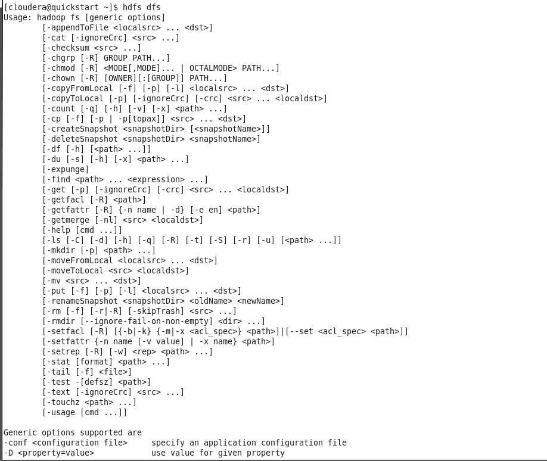
        <figcaption>Figura 9 HDFS: Comandos HDFS</figcaption>
    </figure>

    Cuando accedemos por terminal a una máquina, que suele ser la máquina frontera, y navegamos por su sistema de ficheros, lo estaremos haciendo sobre el disco o los discos que tiene esa máquina. Cuando ejecutamos el comando `hdfs dfs` , éste se ejecutará sobre el sistema de ficheros de HDFS, que es diferente al de la máquina en la que estamos.

    Cuando queremos subir un fichero a HDFS, lo habitual es copiarlo primero en la máquina frontera, y posteriormente subirlo a Hadoop con el comando put.


## 7. Instalando HDFS

!!! note inline end

    Recordamos de nuevo la instalación de Hadoop vista en el punto anterior

### 7.1 Instalación

1. **Java™** debe ser instalado. Las versiones de Java recomendadas se encuentran descritas en [HadoopJavaVersions](https://cwiki.apache.org/confluence/display/HADOOP/Hadoop+Java+Versions).

```bash
sudo apt-get install openjdk-8-jdk
/usr/bin/java -version
```

2. **ssh** debe estar instalado y sshd debe estar ejecutándose para usar las secuencias de comandos de Hadoop que administran los demonios ssh remotos de Hadoop, ya que vamos a usar las secuencias de comandos de inicio y detección opcionales.

```bash
sudo apt-get install ssh
```

3. Abre una terminal

4. Para obtener la distribución de Apache Hadoop, descarga la versión estable más reciente desde [Apache Download Mirrors](https://www.apache.org/dyn/closer.cgi/hadoop/common/)

```bash
wget https://dlcdn.apache.org/hadoop/common/hadoop-3.3.6/hadoop-3.3.6.tar.gz
```

5. Una vez descargado, desempaquetamos el archivo descargado con el comando tar y entra dentro de la carpeta:

```bash
sudo tar -xzf hadoop-3.3.6.tar.gz -C /opt
cd /opt/hadoop-3.3.6
```

6. Edita el siguiente archivo `etc/hadoop/hadoop-env.sh` para definir la variable de entorno de Java y añádela.

```bash
# Technically, the only required environment variable is JAVA_HOME.
export JAVA_HOME=/usr/lib/jvm/java-8-openjdk-amd64/
```

7. Para poder usar los comandos de HDFS en cualquier lugar del sistema, sin tener que hacerlo desde el directorio de Hadoop (por ejemplo `/opt/hadoop-3.3.6/bin`), creamos las variables de entorno y añadimos al PATH. Para ello abrimos el archivo `~/.bashrc` y añadimos al final el siguiente código y ejecuta el comando `source ~/.bashrc`

```bash title="~/.bashrc"
export HADOOP_HOME=/opt/hadoop-3.3.6
export HADOOP_INSTALL=$HADOOP_HOME
export HADOOP_MAPRED_HOME=$HADOOP_HOME
export HADOOP_COMMON_HOME=$HADOOP_HOME
export HADOOP_HDFS_HOME=$HADOOP_HOME
export HADOOP_YARN_HOME=$HADOOP_HOME
export HADOOP_COMMON_LIB_NATIVE_DIR=$HADOOP_HOME/lib/native
export PATH=$PATH:$HADOOP_HOME/sbin:$HADOOP_HOME/bin
export HADOOP_OPTS="-Djava.library.path=$HADOOP_HOME/lib/native"
```

8. Ejecuta el siguiente comando. Si no da error, podemos continuar

```bash
hadoop version
```

Nos debe salir la versión de hadoop

```bash
Hadoop 3.3.6
Source code repository https://github.com/apache/hadoop.git -r 1be78238728da9266a4f88195058f08fd012bf9c
Compiled by ubuntu on 2023-06-18T08:22Z
Compiled on platform linux-x86_64
Compiled with protoc 3.7.1
From source with checksum 5652179ad55f76cb287d9c633bb53bbd
This command was run using /opt/hadoop-3.3.6/share/hadoop/common/hadoop-common-3.3.6.jar
```

### 7.2 Configuración (Pseudo-Distributed Operation)

Hadoop se puede ejecutar en un solo nodo en un modo pseudo-distributed donde cada demonio de Hadoop se ejecuta en un proceso Java separado.

Los archivos que vamos a revisar a continuación se encuentran dentro de la carpeta `$HADOOP_HOME/etc/hadoop`.

1. El archivo que contiene la configuración general del clúster es el archivo `core-site.xml`. En él se configura cual será el sistema de ficheros, que normalmente será hdfs, indicando el dominio del nodo que será el maestro de datos (namenode) de la arquitectura. Podéis sustituir el nombre del dominio `bda-iesgrancapitan` por el que queráis

```xml title="core-site.xml"
<configuration>
    <property>
        <name>fs.defaultFS</name>
        <value>hdfs://bda-iesgrancapitan:9000</value>
    </property>
</configuration>
```

2. El siguiente paso es configurar el archivo `hdfs-site.xml` donde se indica tanto el factor de replica como la ruta donde se almacenan tanto los metadatos (namenode) como los datos en sí (datanode):

```xml title="hdfs-site.xml"
<configuration>
    <property>
        <name>dfs.replication</name>
        <value>1</value>
    </property>
</configuration>
```

3. **Opcional:** Si quieres especificar la ruta donde se almacenan los metadatos(namenode) y los datos(datanode) donde el propio hadoop los configura por defecto puedes hacerlo cambiando dichos parámetros correspondientes. Todos lo parámetros por defecto susceptibles de cambio se encuentran en este [recurso](https://hadoop.apache.org/docs/stable/hadoop-project-dist/hadoop-hdfs/hdfs-default.xml)

!!! note inline end

    Si tuviésemos un clúster, en el nodo maestro sólo configuraríamos la ruta del namenode y en cada uno de los nodos esclavos, únicamente la ruta del datanode.

```xml title="hdfs-site.xml"
<configuration>
    <property>
        <name>dfs.replication</name>
        <value>1</value>
    </property>

    <property>
        <name>dfs.namenode.name.dir</name>
        <value>/opt/hadoop/hadoop_data/hdfs/namenode</value>
    </property>

    <property>
        <name>dfs.datanode.data.dir</name>
        <value>/opt/hadoop/hadoop_data/hdfs/datanode</value>
    </property>
</configuration>
```

4. Crea los directorios de `hadoop-data` configurados anteriormente en `hdfs-site.xml` para cuando ejecutemos **hadoop** y configura los permisos oportunos.

```bash
sudo mkdir -p /opt/hadoop
sudo chown -R hadoop:hadoop /opt/hadoop
```

5. Comprobamos que podemos entrar por ssh al localhost sin un passphrase:

```bash
ssh localhost
exit //Si hemos podido acceder
```

6. Si no puedes entrar por ssh al localhost sin un passphrase, ejecuta los siguientes comandos:

```bash
ssh-keygen -t rsa -P '' -f ~/.ssh/id_rsa
cat ~/.ssh/id_rsa.pub >> ~/.ssh/authorized_keys
chmod 0600 ~/.ssh/authorized_keys
```

7. Añade a `/etc/hosts`el nombre de tu dominio indicado en `core-site.xml` para que no te de error de resolución de nombres. En mi caso añado la siguiente linea y reinicia el servicio:

```bash
127.0.0.1   bda-iesgrancapitan
```

### 7.3 Ejecución

1. Ejecuta el siguiente comando

```bash
hdfs namenode -format
```

2. Debería darte una salida como la siguiente

```bash hl_lines="7 11"
WARNING: /opt/hadoop-3.3.6/logs does not exist. Creating.
2023-11-27 11:51:42,564 INFO namenode.NameNode: STARTUP_MSG: 
/************************************************************
STARTUP_MSG: Starting NameNode
STARTUP_MSG:   host = hadoop-VirtualBox/127.0.1.1
STARTUP_MSG:   args = [-format]
STARTUP_MSG:   version = 3.3.6
......
......
2023-11-27 11:51:44,678 INFO namenode.FSImage: Allocated new BlockPoolId: BP-693156123-127.0.1.1-1701082304668
2023-11-27 11:51:45,014 INFO common.Storage: Storage directory /opt/hadoop/hadoop_data/hdfs/namenode has been successfully formatted.
2023-11-27 11:51:45,164 INFO namenode.FSImageFormatProtobuf: Saving image file /opt/hadoop/hadoop_data/hdfs/namenode/current/fsimage.ckpt_0000000000000000000 using no compression
2023-11-27 11:51:45,253 INFO namenode.FSImageFormatProtobuf: Image file /opt/hadoop/hadoop_data/hdfs/namenode/current/fsimage.ckpt_0000000000000000000 of size 401 bytes saved in 0 seconds .
2023-11-27 11:51:45,386 INFO namenode.NNStorageRetentionManager: Going to retain 1 images with txid >= 0
2023-11-27 11:51:45,430 INFO namenode.FSNamesystem: Stopping services started for active state
2023-11-27 11:51:45,431 INFO namenode.FSNamesystem: Stopping services started for standby state
2023-11-27 11:51:45,452 INFO namenode.FSImage: FSImageSaver clean checkpoint: txid=0 when meet shutdown.
2023-11-27 11:51:45,452 INFO namenode.NameNode: SHUTDOWN_MSG
```

3. Iniciando el demonio Namenode y Datanode

```bash
start-dfs.sh
```

4. Debería darte una salida como la siguiente

```bash
hadoop@hadoop-VirtualBox:/opt/hadoop-3.3.6$ start-dfs.sh 
Starting namenodes on [bda-iesgrancapitan]
Starting datanodes
Starting secondary namenodes [hadoop-VirtualBox]
hadoop@hadoop-VirtualBox:/opt/hadoop-3.3.6$ jps
16401 Jps
15970 NameNode
16085 DataNode
16283 SecondaryNameNode
```

5. Accede desde el navegador a `http://bda-iesgrancapitan:9870/` para acceder al interfaz web de HDFS


<figure style="align: center;">
    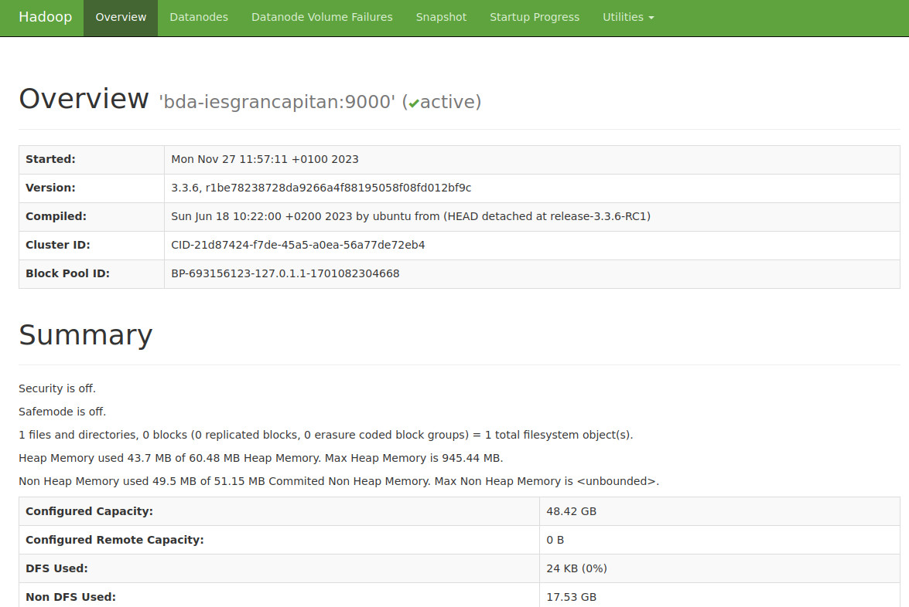
    <figcaption>Figura 1 Instalando HDFS: Interfaz Web. (Fuente: Propia)</figcaption>
</figure>


### 7.4 Usando HDFS

Vamos a investigar cuál es el funcionamiento interno de HDFS estudiado en teoría.

Para ello vamos a añadir a HDFS un [fichero de gran volumen](https://files.grouplens.org/datasets/tag-genome-2021/). Accede al enlace y descarga el archivo [genome_2021.zip](https://files.grouplens.org/datasets/tag-genome-2021/genome_2021.zip)

1. Descargamos el archivo en el sistema de archivos local

```bash
wget https://files.grouplens.org/datasets/tag-genome-2021/genome_2021.zip
```
2. Vamos a observar la salida de logs en cada uno de los siguientes pasos, que nos va a servir para afianzar como como funciona HDFS. Observamos el log del namenode. En mi caso:

```bash
tail -f $HADOOP_HOME/logs/hadoop-hadoop-namenode-hadoop-VirtualBox.log
```

3. Lo añadimos a HDFS

```bash
hdfs dfs -copyFromLocal genome_2021.zip /
```

La salida del log nos indica la división en bloques y la adición de la transacción en el EditLog ()

```bash hl_lines="1 6 30 36"
2023-11-27 11:58:19,590 INFO org.apache.hadoop.hdfs.server.namenode.FileJournalManager: Finalizing edits file /opt/hadoop/hadoop_data/hdfs/namenode/current/edits_inprogress_0000000000000000001 -> /opt/hadoop/had
oop_data/hdfs/namenode/current/edits_0000000000000000001-0000000000000000002
2023-11-27 11:58:19,608 INFO org.apache.hadoop.hdfs.server.namenode.FSEditLog: Starting log segment at 3
2023-11-27 11:58:20,224 INFO org.apache.hadoop.hdfs.server.namenode.TransferFsImage: Sending fileName: /opt/hadoop/hadoop_data/hdfs/namenode/current/fsimage_0000000000000000000, fileSize: 401. Sent total: 401 by
tes. Size of last segment intended to send: -1 bytes.
2023-11-27 11:58:20,496 INFO org.apache.hadoop.hdfs.server.namenode.TransferFsImage: Sending fileName: /opt/hadoop/hadoop_data/hdfs/namenode/current/edits_0000000000000000001-0000000000000000002, fileSize: 42. S
ent total: 42 bytes. Size of last segment intended to send: -1 bytes.
2023-11-27 11:58:21,070 INFO org.apache.hadoop.hdfs.server.namenode.ImageServlet: Rejecting a fsimage due to small time delta and txnid delta. Time since previous checkpoint is 395 expecting at least 2700 txnid 
delta since previous checkpoint is 2 expecting at least 1000000
2023-11-27 12:37:53,007 INFO org.apache.hadoop.hdfs.server.namenode.FSEditLog: Number of transactions: 2 Total time for transactions(ms): 83 Number of transactions batched in Syncs: 0 Number of syncs: 2 SyncTime
s(ms): 217 
2023-11-27 12:37:53,265 INFO org.apache.hadoop.hdfs.StateChange: BLOCK* allocate blk_1073741825_1001, replicas=127.0.0.1:9866 for /genome_2021.zip._COPYING_
2023-11-27 12:37:55,015 INFO org.apache.hadoop.hdfs.StateChange: BLOCK* allocate blk_1073741826_1002, replicas=127.0.0.1:9866 for /genome_2021.zip._COPYING_
2023-11-27 12:37:58,097 INFO org.apache.hadoop.hdfs.StateChange: BLOCK* allocate blk_1073741827_1003, replicas=127.0.0.1:9866 for /genome_2021.zip._COPYING_
2023-11-27 12:38:00,850 INFO org.apache.hadoop.hdfs.StateChange: BLOCK* allocate blk_1073741828_1004, replicas=127.0.0.1:9866 for /genome_2021.zip._COPYING_
2023-11-27 12:38:03,102 INFO org.apache.hadoop.hdfs.StateChange: BLOCK* allocate blk_1073741829_1005, replicas=127.0.0.1:9866 for /genome_2021.zip._COPYING_
2023-11-27 12:38:07,189 INFO org.apache.hadoop.hdfs.StateChange: BLOCK* allocate blk_1073741830_1006, replicas=127.0.0.1:9866 for /genome_2021.zip._COPYING_
2023-11-27 12:38:09,171 INFO org.apache.hadoop.hdfs.StateChange: BLOCK* allocate blk_1073741831_1007, replicas=127.0.0.1:9866 for /genome_2021.zip._COPYING_
2023-11-27 12:38:13,229 INFO org.apache.hadoop.hdfs.StateChange: BLOCK* allocate blk_1073741832_1008, replicas=127.0.0.1:9866 for /genome_2021.zip._COPYING_
2023-11-27 12:38:16,796 INFO org.apache.hadoop.hdfs.StateChange: BLOCK* allocate blk_1073741833_1009, replicas=127.0.0.1:9866 for /genome_2021.zip._COPYING_
2023-11-27 12:38:18,812 INFO org.apache.hadoop.hdfs.StateChange: BLOCK* allocate blk_1073741834_1010, replicas=127.0.0.1:9866 for /genome_2021.zip._COPYING_
2023-11-27 12:38:22,466 INFO org.apache.hadoop.hdfs.StateChange: BLOCK* allocate blk_1073741835_1011, replicas=127.0.0.1:9866 for /genome_2021.zip._COPYING_
2023-11-27 12:38:26,859 INFO org.apache.hadoop.hdfs.StateChange: BLOCK* allocate blk_1073741836_1012, replicas=127.0.0.1:9866 for /genome_2021.zip._COPYING_
2023-11-27 12:38:28,264 INFO org.apache.hadoop.hdfs.StateChange: BLOCK* allocate blk_1073741837_1013, replicas=127.0.0.1:9866 for /genome_2021.zip._COPYING_
2023-11-27 12:38:31,502 INFO org.apache.hadoop.hdfs.StateChange: BLOCK* allocate blk_1073741838_1014, replicas=127.0.0.1:9866 for /genome_2021.zip._COPYING_
2023-11-27 12:38:33,935 INFO org.apache.hadoop.hdfs.StateChange: BLOCK* allocate blk_1073741839_1015, replicas=127.0.0.1:9866 for /genome_2021.zip._COPYING_
2023-11-27 12:38:36,202 INFO org.apache.hadoop.hdfs.StateChange: DIR* completeFile: /genome_2021.zip._COPYING_ is closed by DFSClient_NONMAPREDUCE_-294249091_1
2023-11-27 12:43:41,454 INFO org.apache.hadoop.http.HttpServer2: Process Thread Dump: jsp requested
2023-11-27 12:58:22,096 INFO org.apache.hadoop.hdfs.server.namenode.FSNamesystem: Roll Edit Log from 127.0.0.1
2023-11-27 12:58:22,096 INFO org.apache.hadoop.hdfs.server.namenode.FSEditLog: Rolling edit logs
2023-11-27 12:58:22,096 INFO org.apache.hadoop.hdfs.server.namenode.FSEditLog: Ending log segment 3, 51
2023-11-27 12:58:22,096 INFO org.apache.hadoop.hdfs.server.namenode.FSEditLog: Number of transactions: 50 Total time for transactions(ms): 83 Number of transactions batched in Syncs: 27 Number of syncs: 23 SyncTimes(ms): 18260 
2023-11-27 12:58:22,164 INFO org.apache.hadoop.hdfs.server.namenode.FSEditLog: Number of transactions: 50 Total time for transactions(ms): 83 Number of transactions batched in Syncs: 27 Number of syncs: 24 SyncTimes(ms): 18327 
2023-11-27 12:58:22,164 INFO org.apache.hadoop.hdfs.server.namenode.FileJournalManager: Finalizing edits file /opt/hadoop/hadoop_data/hdfs/namenode/current/edits_inprogress_0000000000000000003 -> /opt/hadoop/hadoop_data/hdfs/namenode/current/edits_0000000000000000003-0000000000000000052
2023-11-27 12:58:22,178 INFO org.apache.hadoop.hdfs.server.namenode.FSEditLog: Starting log segment at 53
2023-11-27 12:58:22,546 INFO org.apache.hadoop.hdfs.server.namenode.TransferFsImage: Sending fileName: /opt/hadoop/hadoop_data/hdfs/namenode/current/fsimage_0000000000000000000, fileSize: 401. Sent total: 401 bytes. Size of last segment intended to send: -1 bytes.
2023-11-27 12:58:22,796 INFO org.apache.hadoop.hdfs.server.namenode.TransferFsImage: Sending fileName: /opt/hadoop/hadoop_data/hdfs/namenode/current/edits_0000000000000000003-0000000000000000052, fileSize: 2741. Sent total: 2741 bytes. Size of last segment intended to send: -1 bytes.
2023-11-27 12:58:23,463 INFO org.apache.hadoop.hdfs.server.common.Util: Combined time for file download and fsync to all disks took 0,11s. The file download took 0,00s at 0,00 KB/s. Synchronous (fsync) write to disk of /opt/hadoop/hadoop_data/hdfs/namenode/current/fsimage.ckpt_0000000000000000052 took 0,11s.
2023-11-27 12:58:23,466 INFO org.apache.hadoop.hdfs.server.namenode.TransferFsImage: Downloaded file fsimage.ckpt_0000000000000000052 size 740 bytes.
2023-11-27 12:58:23,580 INFO org.apache.hadoop.hdfs.server.namenode.NNStorageRetentionManager: Going to retain 2 images with txid >= 0
```

<figure style="align: center;">
    
    <figcaption>Figura 2 Instalando HDFS: SecondaryNamenode y Namenode. (Fuente: Ministerio de Educación)</figcaption>
</figure>

4. Como puedes observar en el log, se generan un conjunto de ficheros en la carpeta `current`, que contienen un conjunto de ficheros cuyos prefijos son:
   
   - _edits_000NNN_: histórico de cambios que se van produciendo.
   - _edits_inprogress_NNN_: cambios actuales en memoria que no se han persistido.
   - _fsimagen_000NNN_: snapshot en el tiempo del sistema de ficheros.
   
5. Si accedes a la carpeta HDFS `/opt/hadoop/hadoop_data/hdfs/namenode/current` desde nuestro sistema de archivos, puedes observarlos también

```bash
hadoop@hadoop-VirtualBox:/opt/hadoop/hadoop_data/hdfs/namenode/current$ ls
edits_0000000000000000001-0000000000000000002
edits_0000000000000000003-0000000000000000052
edits_inprogress_0000000000000000053
fsimage_0000000000000000000
fsimage_0000000000000000000.md5
fsimage_0000000000000000052
fsimage_0000000000000000052.md5
seen_txid
VERSION
```

6. Por otro lado, si accedemos a la carpeta HDFS `/opt/hadoop/hadoop_data/hdfs/datanode` desde nuestro sistema de archivos, y entramos dentro de su subdirectorio creado después de la transacción, también podemos observar la generación de los diferentes bloques

```bash
hadoop@hadoop-VirtualBox:/opt/hadoop/hadoop_data/hdfs/datanode/current/BP-693156123-127.0.1.1-1701082304668/current/finalized/subdir0/subdir0$ ls -l 
total 1897632
-rw-rw-r-- 1 hadoop hadoop 134217728 nov 27 12:37 blk_1073741825
-rw-rw-r-- 1 hadoop hadoop   1048583 nov 27 12:37 blk_1073741825_1001.meta
-rw-rw-r-- 1 hadoop hadoop 134217728 nov 27 12:37 blk_1073741826
-rw-rw-r-- 1 hadoop hadoop   1048583 nov 27 12:37 blk_1073741826_1002.meta
-rw-rw-r-- 1 hadoop hadoop 134217728 nov 27 12:38 blk_1073741827
-rw-rw-r-- 1 hadoop hadoop   1048583 nov 27 12:38 blk_1073741827_1003.meta
-rw-rw-r-- 1 hadoop hadoop 134217728 nov 27 12:38 blk_1073741828
-rw-rw-r-- 1 hadoop hadoop   1048583 nov 27 12:38 blk_1073741828_1004.meta
-rw-rw-r-- 1 hadoop hadoop 134217728 nov 27 12:38 blk_1073741829
-rw-rw-r-- 1 hadoop hadoop   1048583 nov 27 12:38 blk_1073741829_1005.meta
-rw-rw-r-- 1 hadoop hadoop 134217728 nov 27 12:38 blk_1073741830
-rw-rw-r-- 1 hadoop hadoop   1048583 nov 27 12:38 blk_1073741830_1006.meta
-rw-rw-r-- 1 hadoop hadoop 134217728 nov 27 12:38 blk_1073741831
-rw-rw-r-- 1 hadoop hadoop   1048583 nov 27 12:38 blk_1073741831_1007.meta
-rw-rw-r-- 1 hadoop hadoop 134217728 nov 27 12:38 blk_1073741832
-rw-rw-r-- 1 hadoop hadoop   1048583 nov 27 12:38 blk_1073741832_1008.meta
-rw-rw-r-- 1 hadoop hadoop 134217728 nov 27 12:38 blk_1073741833
-rw-rw-r-- 1 hadoop hadoop   1048583 nov 27 12:38 blk_1073741833_1009.meta
-rw-rw-r-- 1 hadoop hadoop 134217728 nov 27 12:38 blk_1073741834
-rw-rw-r-- 1 hadoop hadoop   1048583 nov 27 12:38 blk_1073741834_1010.meta
-rw-rw-r-- 1 hadoop hadoop 134217728 nov 27 12:38 blk_1073741835
-rw-rw-r-- 1 hadoop hadoop   1048583 nov 27 12:38 blk_1073741835_1011.meta
-rw-rw-r-- 1 hadoop hadoop 134217728 nov 27 12:38 blk_1073741836
-rw-rw-r-- 1 hadoop hadoop   1048583 nov 27 12:38 blk_1073741836_1012.meta
-rw-rw-r-- 1 hadoop hadoop 134217728 nov 27 12:38 blk_1073741837
-rw-rw-r-- 1 hadoop hadoop   1048583 nov 27 12:38 blk_1073741837_1013.meta
-rw-rw-r-- 1 hadoop hadoop 134217728 nov 27 12:38 blk_1073741838
-rw-rw-r-- 1 hadoop hadoop   1048583 nov 27 12:38 blk_1073741838_1014.meta
-rw-rw-r-- 1 hadoop hadoop  48980391 nov 27 12:38 blk_1073741839
-rw-rw-r-- 1 hadoop hadoop    382667 nov 27 12:38 blk_1073741839_1015.meta
```

7. Comprobamos toda esta información y mucha más adicional a través de la interfaz web de HDFS `http://bda-iesgrancapitan:9870/` (que es mayor que la que vimos con Cloudera, cuya versión de Hadoop es inferior)

### 7.5 Administración

HDFS también permite administración desde linea de comandos. El más usado es la opción `hdfs dfsadmin`

Puedes ver todas las opciones en la [documentación oficial](https://hadoop.apache.org/docs/stable/hadoop-project-dist/hadoop-hdfs/HDFSCommands.html#dfsadmin).

```bash
hadoop@hadoop-VirtualBox:~$ hdfs dfsadmin
Usage: hdfs dfsadmin
Note: Administrative commands can only be run as the HDFS superuser.
	[-report [-live] [-dead] [-decommissioning] [-enteringmaintenance] [-inmaintenance] [-slownodes]]
	[-safemode <enter | leave | get | wait | forceExit>]
	[-saveNamespace [-beforeShutdown]]
	[-rollEdits]
	[-restoreFailedStorage true|false|check]
	[-refreshNodes]
	[-setQuota <quota> <dirname>...<dirname>]
	[-clrQuota <dirname>...<dirname>]
	[-setSpaceQuota <quota> [-storageType <storagetype>] <dirname>...<dirname>]
	[-clrSpaceQuota [-storageType <storagetype>] <dirname>...<dirname>]
	[-finalizeUpgrade]
	[-rollingUpgrade [<query|prepare|finalize>]]
	[-upgrade <query | finalize>]
	[-refreshServiceAcl]
	[-refreshUserToGroupsMappings]
	[-refreshSuperUserGroupsConfiguration]
	[-refreshCallQueue]
	[-refresh <host:ipc_port> <key> [arg1..argn]
	[-reconfig <namenode|datanode> <host:ipc_port|livenodes> <start|status|properties>]
	[-printTopology]
	[-refreshNamenodes datanode_host:ipc_port]
	[-getVolumeReport datanode_host:ipc_port]
	[-deleteBlockPool datanode_host:ipc_port blockpoolId [force]]
	[-setBalancerBandwidth <bandwidth in bytes per second>]
	[-getBalancerBandwidth <datanode_host:ipc_port>]
	[-fetchImage <local directory>]
	[-allowSnapshot <snapshotDir>]
	[-disallowSnapshot <snapshotDir>]
	[-shutdownDatanode <datanode_host:ipc_port> [upgrade]]
	[-evictWriters <datanode_host:ipc_port>]
	[-getDatanodeInfo <datanode_host:ipc_port>]
	[-metasave filename]
	[-triggerBlockReport [-incremental] <datanode_host:ipc_port> [-namenode <namenode_host:ipc_port>]]
	[-listOpenFiles [-blockingDecommission] [-path <path>]]
	[-help [cmd]]

Generic options supported are:
-conf <configuration file>        specify an application configuration file
-D <property=value>               define a value for a given property
-fs <file:///|hdfs://namenode:port> specify default filesystem URL to use, overrides 'fs.defaultFS' property from configurations.
-jt <local|resourcemanager:port>  specify a ResourceManager
-files <file1,...>                specify a comma-separated list of files to be copied to the map reduce cluster
-libjars <jar1,...>               specify a comma-separated list of jar files to be included in the classpath
-archives <archive1,...>          specify a comma-separated list of archives to be unarchived on the compute machines

The general command line syntax is:
command [genericOptions] [commandOptions]
```

Vamos a probar algunas de ellas:

- `hdfs dfsadmin -report`: Realiza un resumen del sistema HDFS, donde podemos comprobar el estado de los diferentes nodos. Es similar al que aparece en el interfaz web.
- `hdfs dfsadmin -listOpenFiles`: Comprueba si hay algún fichero abierto.
- `hdfs dfsadmin -printTopology`: Muestra la topología, identificando los nodos que tenemos y al rack al que pertenece cada nodo.
- `hdfs dfsadmin -safemode enter`: Pone el sistema en modo seguro, el cual evita la modificación de los recursos del sistema de archivos.
- `hdfs dfsadmin -safemode leave`: Sale del modo seguro.

Otro ejemplo:

- `hdfs fsck`: Comprueba el estado del sistema de ficheros. Si queremos comprobar el estado de un determinado directorio, lo indicamos mediante un segundo parámetro: `hdfs fsck /`

```bash
hadoop@hadoop-VirtualBox:~$ hdfs fsck /
onnecting to namenode via http://bda-iesgrancapitan:9870/fsck?ugi=hadoop&path=%2F
FSCK started by hadoop (auth:SIMPLE) from /127.0.0.1 for path / at Mon Nov 27 13:14:05 CET 2023


Status: HEALTHY
 Number of data-nodes:	1
 Number of racks:		1
 Total dirs:			1
 Total symlinks:		0

Replicated Blocks:
 Total size:	1928028583 B
 Total files:	1
 Total blocks (validated):	15 (avg. block size 128535238 B)
 Minimally replicated blocks:	15 (100.0 %)
 Over-replicated blocks:	0 (0.0 %)
 Under-replicated blocks:	0 (0.0 %)
 Mis-replicated blocks:		0 (0.0 %)
 Default replication factor:	1
 Average block replication:	1.0
 Missing blocks:		0
 Corrupt blocks:		0
 Missing replicas:		0 (0.0 %)
 Blocks queued for replication:	0

Erasure Coded Block Groups:
 Total size:	0 B
 Total files:	0
 Total block groups (validated):	0
 Minimally erasure-coded block groups:	0
 Over-erasure-coded block groups:	0
 Under-erasure-coded block groups:	0
 Unsatisfactory placement block groups:	0
 Average block group size:	0.0
 Missing block groups:		0
 Corrupt block groups:		0
 Missing internal blocks:	0
 Blocks queued for replication:	0
FSCK ended at Mon Nov 27 13:14:06 CET 2023 in 13 milliseconds


The filesystem under path '/' is HEALTHY
```

También existen otros comandos interesantes como: `balancer`, `cacheadmin`, `datanode`, `namenode`,... 

Puedes consultar la lista completa en la [documentación oficial](https://hadoop.apache.org/docs/stable/hadoop-project-dist/hadoop-hdfs/HDFSCommands.html#Administration_Commands)


### 7.6 Snapshots

Mediante ***Snapshots*** podemos guardar la instantánea de como se encuentra todo nuestros datos dentro del sistema de ficheros, que puede servir como copia de seguridad, para un futuro backup.

Vamos a realizar un ejemplo. Creamos un directorio dentro de nuestro HDFS y copiamos nuestro fichero de genoma 2021 dentro de él:

```bash
hdfs dfs -mkdir /bda
hdfs dfs -cp /genome_2021.zip /bda
hdfs dfs -ls /bda
```
Activamos el uso de snapshot en el directorio que queramos obtener una instantánea:

```bash
hdfs dfsadmin -allowSnapshot /bda
```

Procedemos a crear una instantánea indicando la carpeta y el nombre que va a tener

```bash
hdfs dfs -createSnapshot /bda snapshot_bda_1
```

Se crea una carpeta oculta dentro de la carpeta que contendrá la información `/bda/.snapshot/snapshot_bda_1`

Puedes verlo también desde la interfaz web de HDFS en su apartado de Snapshot

<figure style="align: center;">
    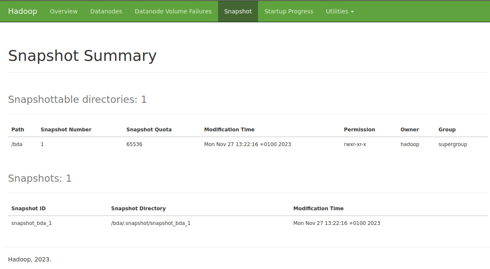
    <figcaption>Figura 3 Instalando HDFS: Snapshot. (Fuente: Propia)</figcaption>
</figure>

Vamos a borrar el archivo que hemos copiado y comprobamos

```bash
hdfs dfs -rm /bda/genome_2021.zip
//Deleted /bda/genome_2021.zip
hdfs dfs -ls /bda/
```
Para recuperar el fichero usamos el snapshot creado anteriormente

```bash
hdfs dfs -cp /bda/.snapshot/snapshot_bda_1/genome_2021.zip /bda/genome_2021.zip
```

Para comprobar los directorios que actualmente soportan snapshot hacemos un ls de los mismos con su comando correspondiente:

```bash
hdfs lsSnapshottableDir
```

Por último, para borrar un snapshot:

```bash
hdfs dfs -deleteSnapshot /bda snapshot_bda_1
```

Y si queremos desabilitarlo los snapshot:

```bash
hdfs dfsadmin -disallowSnapshot /bda
```

### 7.7 Navegación WebUI HDFS

Desde el apartado `Browser Directory` del Web IU `http://bda-iesgrancapitan:9870/explorer.html` podemos acceder al sistema de ficheros y su contenido de HDFS, incluidos los bloques.

<figure style="align: center;">
    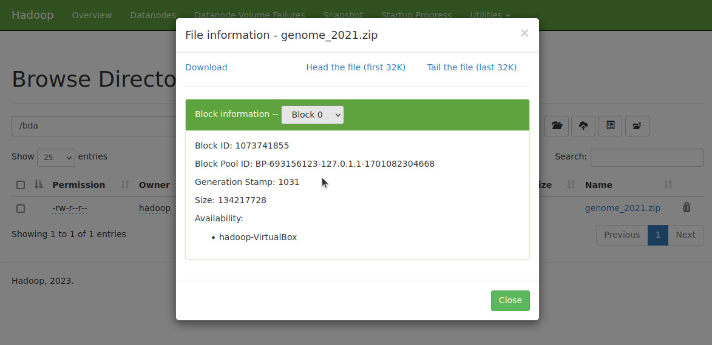
    <figcaption>Figura 4 Instalando HDFS: Navegación WebUI. (Fuente: Propia)</figcaption>
</figure>


### 7.8 Permisos WebUI HDFS

Como hemos comentado en el punto anterior, podemos acceder al sistema de ficheros y su contenido de HDFS. Pero si intentamos borrar algún contenido nos salta un error de permisos: `Permission denied: user=dr.who, access=WRITE, inode="/bda":hadoop:supergroup:drwxr-xr-x`. Esto es debido a que, por defecto, los recursos vía web se realizan desde el usuario `dr.who`

<figure style="align: center;">
    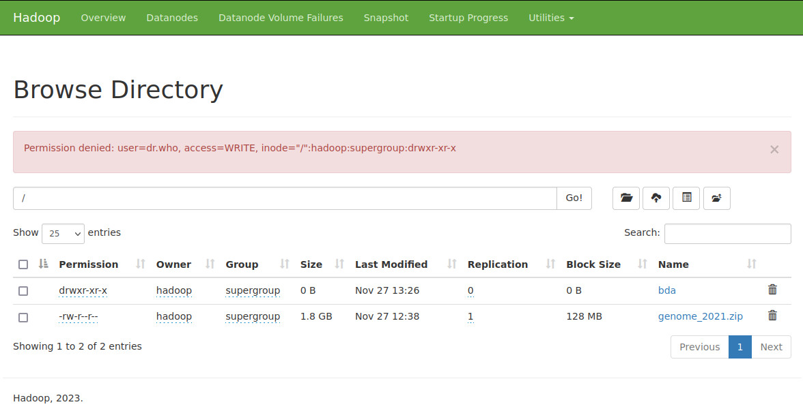
    <figcaption>Figura 5 Instalando HDFS: Permisos WebUI. (Fuente: Propia)</figcaption>
</figure>

Para poder tener permisos para ello podemos modificar los permisos:

```bash
hdfs dfs -mkdir /bda/prueba_permisos
hdfs dfs -chmod 777 /bda/prueba_permisos
hdfs dfs -cp /bda/genome_2021.zip /bda/prueba_permisos/
//Ya podríamos borrar cualquier archivo dentro del directorio pruebas_permisos desde la WebUI
```

Otra posibilidad es modificar el archivo de configuraciónb `core-site.xml` y añadir la propiedad para modificar el usuario estático, en mi caso, el usuario `hadoop`

```xml title="core-site.xml"
<property>
    <name>hadoop.http.staticuser.user</name>
    <value>hadoop</value>
</property>
```

### 7.9 Acceso a HDFS a través de Python

Para ello, usaremos la libreria [HdfsCLI](https://pypi.org/project/hdfs/). La instalamos mediante `pip`

```bash
pip install hdfs
```

Para nuestro ejemplo, vamos a descargar un ejemplo con formato csv y añadirlo a nuestro HDFS

```bash
wget https://www.ine.es/jaxi/files/tpx/csv_bdsc/53938.csv
hdfs dfs -mkdir /bda/python
hdfs dfs -copyFromLocal 53938.csv  /bda/python/
hdfs dfs -ls /bda/python
```

[Teniendo como referencia la documentación](https://hdfscli.readthedocs.io/en/latest/quickstart.html#python-bindings), vamos a conectarnos a HDFS y copiar un archivo

Creamos un fichero python con el siguiente código:

```python
from hdfs import InsecureClient

# Datos de conexión
HDFS_HOSTNAME = 'bda-iesgrancapitan'
HDFS_PORT = 9870
HDFS_CONNECTION = f'http://{HDFS_HOSTNAME}:{HDFS_PORT}'

# En nuestro caso, al no usar Kerberos, creamos una conexión no segura
hdfs_client = InsecureClient(HDFS_CONNECTION)

#Lectura
# Leemos el fichero de '53938.csv' que tenemos en HDFS
fichero = '/bda/python/53938.csv'
with hdfs_client.read(fichero) as reader:
    texto = reader.read()

print(texto)

#Escritura
# Escribimos los elementos de la lista en formato csv
datos="dni,nombre,apellidos,direccion,cp\n"
lista = [['123', 'Nombre1', 'Apellidos1', 'Mikasa1', '14000'],
         ['456', 'Nombre4', 'Apellidos4', 'Mikasa4', '41000'],
         ['789', 'Nombre7', 'Apellidos7', 'Mikasa7', '19000']]
for i in range(0, len(lista), 1):
    for j in range(0, len(lista[i]), 1):
        if(j<len(lista[i])-1):
            datos+=f'{lista[i][j]},'
        else:
            datos+=f'{lista[i][j]}\n'
hdfs_client.write("/bda/python/datos.csv", datos)
```

Ejecutamos el fichero

```bash
python3 prueba_hdfs_Python.py
```

Comprobamos la cración del nuevo fichero

```bash
hadoop@hadoop-VirtualBox:~$ hdfs dfs -ls /bda/python/
Found 2 items
-rw-r--r--   1 hadoop supergroup      60116 2023-11-27 13:55 /bda/python/53938.csv
-rw-r--r--   1 hadoop supergroup        145 2023-11-27 13:56 /bda/python/datos.csv
```

Adicionalmente, esta librería te da [funcionalidad opcional](https://pypi.org/project/hdfs/) para `avro`, `dataframe` (con Pandas) y `Kerberos`. Estos casos son los más habituales en el mundo real.
