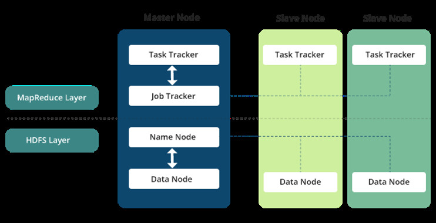
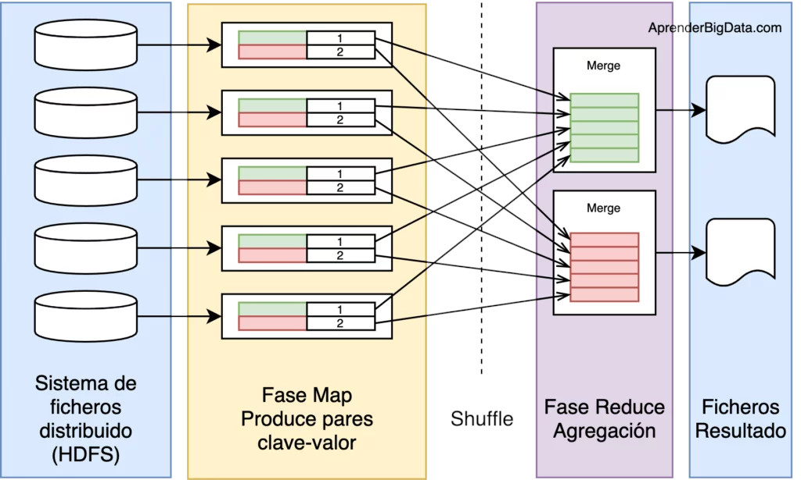
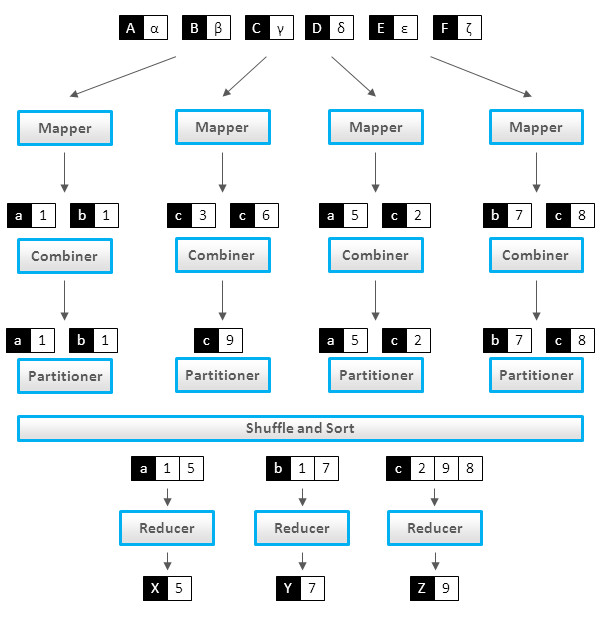
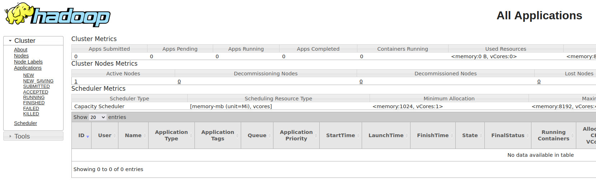
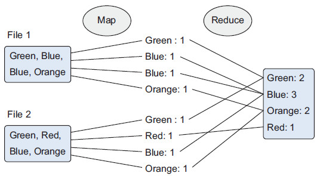
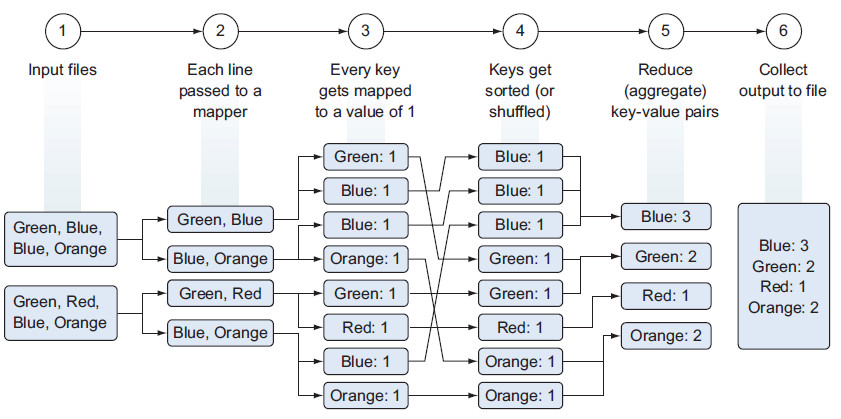
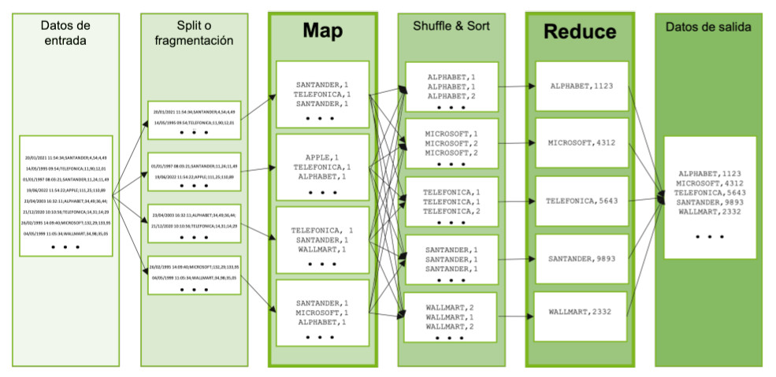
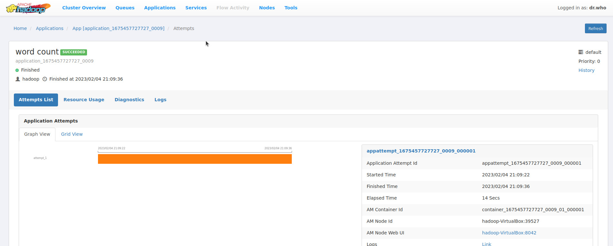

# UD 4 - Apache Hadoop - MapReduce

## 1. Introducción

!!! Info "**MapReduce**"

    Hadoop MapReduce es un **framework** para escribir fácilmente aplicaciones que procesan **grandes cantidades de datos** en **paralelo** en **grandes clústeres** (miles de nodos) de **hardware commodity** de manera **confiable** y **tolerante a fallos**.

MapReduce está diseñado para poder procesar grandes cantidades de datos, ya que sigue una filosofía **Divide y Vencerás (DYV)**, que consiste en que para resolver un problema complejo, la mejor forma de hacerlo es dividirlo en fragmentos muy pequeños que pueden ser solucionados de forma independiente, resolverlo por separado e ir construyendo con las soluciones parciales la solución final.

Para el caso del procesamiento de datos de mucho volumen, la aproximación Divide y Vencerás que hace MapReduce consiste en dividir todo el conjunto de datos de entrada en pequeños fragmentos, procesarlos por separado, e ir agrupando los resultados parciales.

Para ello, usa un paradigma de programación funcional en dos fases, la de **mapeo** y la de **reducción**, y define el algoritmo que utiliza Hadoop para paralelizar las tareas. Un algoritmo MapReduce divide los datos, los procesa en paralelo, los reordena, combina y agrega de vuelta los resultados mediante un formato **clave/valor**.

!!! Note inline end

    Hadoop Aunque MapReduce ha sido utilizado ampliamente por toda la comunidad de desarrolladores o proyectos Big Data, la realidad es que hoy en día cada vez se usa menos, como puede verse en este gráfico de tendencia de búsquedas en Google:

    <figure style="align: center; width:600px;">
        
        <figcaption>Figura4.1_MapReduce: Historial de Búsquedas en Google</figcaption>
    </figure>

    Sin embargo, es importante entender y comprender bien MapReduce por dos motivos:

    - Utiliza un modelo de programación que es común en otras herramientas o frameworks Big Data.
    - Muchas herramientas que se ejecutan sobre Hadoop, como puede ser el caso de Hive, pese a que ofrecen funcionalidad de alto nivel, como puede ser la capacidad de hacer consultas en formato SQL, por debajo ejecutan MapReduce. Entender MapReduce es fundamental para poder depurar o resolver problemas en la ejecución de trabajos con este tipo de herramientas.

Estos subprocesos asociados a la tarea se ejecutan de manera **distribuida**, en diferentes nodos de procesamiento o esclavos. Para controlar y gestionar su ejecución, existe un proceso **Master** o **Job Tracker**. También es el encargado de aceptar los nuevos trabajos enviados al sistema por los clientes.

<figure style="align: center; width:600px;">
    
    <figcaption>Figura4.2_MapReduce WorkFlow (Recuerda que Yarn está entre ambas)</figcaption>
</figure>

Este sistema de procesamiento se apoya en tecnologías de almacenamiento de datos distribuidas, en cuyos nodos se ejecutan estas operaciones de tipo map y reduce. El sistema de ficheros distribuido de Hadoop es HDFS (Hadoop Distributed File System), encargado de almacenar los ficheros divididos en bloques de datos. HDFS proporciona la división previa de los datos en bloques que necesita MapReduce para ejecutar. Los resultados del procesamiento se pueden almacenar en el mismo sistema de almacenamiento o bien en una base de datos o sistema externo.

<figure style="align: center; width:600px;">
    
    <figcaption>Figura4.3_MapReduce_Esquema de fases de MapReduce</figcaption>
</figure>

## 2. Fases y Funcionamiento

Un trabajo de MapReduce se compone de cinco etapas distintas, ejecutadas en orden:

1. Envío del trabajo, aceptación y distribución en el clúster.
2. Ejecución de la fase **map**:Se ejecuta en subtareas llamadas _mappers_. Estos componentes son los responsables de generar pares _clave-valor_ ***filtrando, agrupando, ordenando o transformando los datos originales***. Los pares de datos intermedios, no se almacenan en HDFS.
3. Ejecución de la fase **shuffle**: Puede no ser necesaria. Es el paso intermedio entre Map y reduce que ayuda a recoger los datos y ordenarlos de manera conveniente para el procesamiento. Con esta fase, se pretende agregar las ocurrencias repetidas en cada uno de los mappers.
4. Ejecución de la fase **order**. Ordena y/o baraja los datos a partir de la clave.
5. Ejecución de la fase **reduce**: Gestiona la agregación de los valores producidos por todos los mappers del sistema (o por la fase shuffle) de tipo clave-valor en función de su clave. Por último, cada reducer genera su fichero de salida de forma independiente, generalmente escrito en HDFS.

De todas estas fases debes saber que el programador sólo suele programar la fase ***map*** y ***reduce***, siendo el resto de fases ejecutadas de forma automática por MapReduce en base a los parámetros de configuración.

<figure style="align: center; width:600px;">
    
    <figcaption>Figura4.4_MapReduce_Framework MapReduce</figcaption>
</figure>

En un trabajo Hadoop MapReduce, se dividen los datos de entrada en fragmentos independientes que son procesados por los mappers en paralelo. A continuación, se ordenan los resultados del map, que son la entrada para los reducers. Generalmente, las entradas y salidas de los trabajos se almacenan en un sistema de ficheros, siendo los nodos de almacenamiento y de cómputo los mismos. También es muy común que la lógica de la aplicación no se pueda descomponer en una única ejecución de MapReduce, por lo que se encadenan varias de estas fases, tratando los resultados de una como entrada para los mappers de la siguiente fase.

Esta característica, permite ejecutar las tareas de cada fragmento en el nodo donde se almacena, reduciendo el tiempo de acceso a los datos y los movimientos entre nodos del clúster.

El framework también se encarga de gestionar los recursos, planificar, reiniciar y monitorizar las tareas con el gestor de **Hadoop YARN**, que tiene un único _Resource Manager_ y un _Node Manager_ en cada nodo del clúster.

## 3. WebUI

Podemos observar los trabajos realizados desde la Interfaz WebUI en el puerto 8088 `http://bda-iesgrancapitan:8088`

<figure style="align: center;">
    
    <figcaption>Figura4.5_MapReduce_WebUI</figcaption>
</figure>

## 4. Ejemplos

Para explicar el funcionamiento de MapReduce, se van a utilizar los siguientes ejemplos:

### 4.1 Ejemplo 1

El siguiente gráfico muestra un ejemplo de una empresa que fabrica juguetes de colores. Cuando un cliente compra un juguete desde la página web, el pedido se almacena como un fichero en Hadoop con los colores de los juguetes adquiridos. Para averiguar cuantas unidades de cada color debe preparar la fábrica, se emplea un algoritmo MapReduce para contar los colores:

<figure style="align: center;">
    
    <figcaption>Figura4.6_MapReduce_Ejemplo1_Map y Reduce</figcaption>
</figure>

Siguiendo MapReduce:

- Fase de _mapeo_ **(Map)**: Los documentos se parten en pares de clave/valor. Hasta que no se reduzca, podemos tener muchos duplicados.
- Fase de _reducción_ **(Reduce)**: Es en cierta medida similar a un "group by" de SQL. Las ocurrencias similares se agrupan, y dependiendo de la función de reducción, se puede crear un resultado diferente. En nuestro ejemplo queremos contar los colores, y eso es lo que devuelve nuestra función.

Es un proceso de procesamiento costoso. Los pasos serían los siguientes: _Recuerda que la gestión de la capa de procesamiento la realiza YARN_:

<figure style="align: center; width:600px;">
    
    <figcaption>Figura4.7_MapReduce_Ejemplo1 Detallado</figcaption>
</figure>

1. Lectura desde HDFS de los ficheros de entrada.
2. Pasar cada línea de forma separada al mapeador, teniendo tantos mapeadores como bloques de datos que tengamos.
3. El mapeador parsea los colores (claves) de cada fichero y produce un nuevo fichero para cada color con el número de ocurrencias encontradas (valor), es decir, mapea una clave (color) con un valor (número de ocurrencias).
4. Para facilitar la agregación, se ordenan y/o barajan los datos a partir de la clave.
5. La fase de reducción suma las ocurrencias de cada color y genera un fichero por clave con el total de cada color.
6. Las claves se unen en un único fichero de salida que se persiste en HDFS.

### 4.2 Ejemplo 2

Imagina que tenemos un fichero de muchos terabytes de datos con todas las cotizaciones de todas las empresas de todas las bolsas del mundo desde hace 30 años, con una cotización cada minuto. Cada línea del fichero tiene el siguiente formato:

`Fecha y hora (día/mes/año hora:minutos:segundos);nombre de la empresa;valor de cotización actual;valor de cotización anterior`

Por ejemplo, algunas de las líneas del fichero podrían ser las siguientes:

```
20/01/2021 11:54:34;SANTANDER;4,54;4,49
14/05/1995 09:54;TELEFONICA;11,90;12,01
01/01/1997 08:03:21;SANTANDER;11,24;11,49
19/06/2022 11:54:22;APPLE;111,25;114,89
23/04/2003 16:32:11;ALPHABET;34,49;36,44;
21/12/2020 10:10:56;TELEFONICA;14,31;14;29
26/02/1995 14:09:40;MICROSOFT;132,29;133,95
04/05/1999 11:05:34;WALLMART;34,98;35,05
```

Tomando una media de 35.000 empresas cotizadas en el mundo, es decir, 35.000 cotizaciones por minuto serían 25.200.000 cotizaciones al día, y un total de **275.940.000.000 líneas** en el fichero por los 30 años a 365 días por cada año, que son unos **25 terabytes de datos en un único fichero**.

Nuestro objetivo es averiguar cuántas veces ha tenido cada empresa un incremento en su cotización, es decir, si una cotización es superior a su valor anterior, sumaremos uno, y si la cotización es inferior, no lo sumaremos. Es decir, el resultado sería una lista de la siguiente forma:

```
SANTANDER 3888981
TELEFONICA 3331923
```

Intentar este cálculo leyendo el fichero de forma secuencial y teniendo un contador para cada empresa sería un proceso que llevaría días de procesamiento, así que vamos a utilizar MapReduce para realizar este proceso.

Como se describió anteriormente, el primer paso es crear la aplicación, por ejemplo, utilizando lenguaje Java, y enviar el programa al clúster Hadoop utilizando el API de MapReduce para enviar trabajos.

El ***ResourceManager*** de YARN tomará el trabajo y en función de la situación del clúster en cuanto al número de contenedores disponibles, arrancará un ***ApplicationsMaster*** que lanzará la aplicación ***MapReduce***.

Una vez arrancada la aplicación, en primer lugar decidirá cómo partir el fichero de entrada en fragmentos para que los datos puedan ser procesados en paralelo. El componente que realiza esta división de los ficheros de entrada se denomina **InputFormat**.

Por cada fragmento del fichero de entrada, se crea una tarea **map** que ejecutará la función **map** desarrollada en diferentes nodos y en paralelo, es decir, cada fragmento será procesado en paralelo por diferentes nodos.

La función **map** toma cada línea, que es separada por el _InputFormat_, la lee, y emite un resultado parcial, que será `[Nombre de la empresa, 1]`, en los casos en los que vea que el valor actual es mayor que el valor anterior. Esta función se ejecutará tantas veces como líneas tenga el fragmento de fichero asignado, y en tantos nodos como fragmentos se haya dividido el fichero.

Es decir, para cada nodo, tendremos, por ejemplo, este resultado:

```
SANTANDER, 1
WALLMART, 1
TELEFONICA, 1
APPLE, 1
ALPHABET, 1
...
```

Y tendremos tantos resultados de éstos como fragmentos del fichero haya, y en tantos nodos/servidores como se haya ejecutado la función.

A continuación se ejecutan las fases de **shuffle** y **sort** de forma automática y transparente para el desarrollador, donde se toman los resultados parciales, se ordenan por una **clave**, que en este caso será el nombre de la empresa, se **combinan** y se **ordenan**, juntando todos los valores de cada empresa, es decir, teniendo la lista de valores con el siguiente formato:

```
SANTANDER, 1
SANTANDER, 2
SANTANDER, 1
...
TELEFONICA, 1
TELEFONICA, 1
...
APPLE, 1
...
ALPHABET, 1
ALPHABET, 1
ALPHABET, 1
...
```

Por último, se divide la lista ordenada en diferentes particiones, siendo cada partición un conjunto de datos con la misma clave, y se llaman a la función **reduce** desarrollada por el usuario, que tomará los diferentes valores emitidos por la fase **map**, pero ya ordenados y unidos, e irá haciendo la suma de cada empresa, dando como resultado pares `[Nombre de la empresa, número de veces que se ha encontrado una cotización incrementada]`.

MapReduce, por último tomará todos los resultados de las funciones reduce y las unirá, formando el resultado final, que será la lista total de empresas con el número de veces en las que la cotización sube.

El ejemplo puede parecer sencillo, pero permite entender cómo funciona MapReduce para dividir un procesamiento en diferentes bloques de ejecución que se ejecutan en paralelo.

En la siguiente imagen puede verse de forma gráfica el ejemplo anterior:

<figure style="align: center;">
    
    <figcaption>Figura4.8_MapReduce_Ejemplo2 Detallado</figcaption>
</figure>

!!! Note "Sobre los ejemplos"

    Quizás los ejemplos te parezcan muy sencillos y puedes pensar que MapReduce no resuelve problemas muy complejos. La realidad es que MapReduce permite resolver problemas de procesamiento de datos realmente complejos, pero requiere en primer lugar un estudio de problema y una división en problemas más sencillos que pueden resolverse en paralelo.

    Además, cuando tienes que resolver un problema muy complejo, lo habitual es desarrollar un flujo de ejecución en el que se concatenan varios procesos MapReduce, donde el primer proceso hace una parte del trabajo, su resultado lo coge otro proceso MapReduce que realiza otra parte, etc. hasta llegar a tener todo el problema resuelto.

    La esencia de MapReduce para resolver un problema es intentar descomponerlo en problemas más sencillos en los que cada problema se resuelve con una primera fase en la que se toman todos los datos de entrada uno a uno, se realiza alguna operación con ellos, y los resultados son combinados y ejecutados por otra fase de ejecución que realiza una operación con la que se devuelve el resultado.


## 5. Ejercicios

Vamos a ver 2 ejercicios para poner en práctica lo aprendido en MapReduce

### 5.1 Ejercicio 1

En este ejercicio, vamos a crear nuestro primer programa MapReduce. Asegurate de que tienes Apache Hadoop instalado y funcionando. Si no, accede al recurso correspondiente.


1. Creamos un directorio en local donde vamos a desarrollar cada uno de los códigos fuente en Java

```
mkdir -p $HOME/bda/MapReduce/ejercicios
cd $HOME/bda/MapReduce/ejercicios
```

2. Descargamos el fichero fuente para el ejercicio en local. Contiene información relacionada con ventas, el nombre del producto, el precio, el modo de pago, la ciudad, el país del cliente, etc; alojado en este gist de github

```
wget https://gist.githubusercontent.com/jaimerabasco/cb528c32b4c4092e6a0763d8b6bc25c0/raw/54b30a89f3b608d0837bd1fc10bc31e64ba4c7c8/Ventas_Enero23.csv
```
***El objetivo será descubrir el número de productos vendidos en cada país.***

3. Generamos las clases necesarias para nuestro objetivo en MapReduce

```java title="VentasMapper.java"
package VentasPais;

import java.io.IOException;

import org.apache.hadoop.io.IntWritable;
import org.apache.hadoop.io.LongWritable;
import org.apache.hadoop.io.Text;
import org.apache.hadoop.mapred.*;

public class VentasMapper extends MapReduceBase implements Mapper<LongWritable, Text, Text, IntWritable> {
	private final static IntWritable one = new IntWritable(1);

	public void map(LongWritable key, Text value, OutputCollector<Text, IntWritable> output, Reporter reporter) throws IOException {

		String valueString = value.toString();
		String[] SingleData_porPais = valueString.split(",");
		output.collect(new Text(SingleData_porPais[7]), one);
	}
}
```

```java title="VentasPaisDriver.java"
package VentasPais;

import org.apache.hadoop.fs.Path;
import org.apache.hadoop.io.*;
import org.apache.hadoop.mapred.*;

public class VentasPaisDriver {
	public static void main(String[] args) {
		JobClient my_client = new JobClient();
		// Creamos el objeto configuraciób para el trabajo
		JobConf job_conf = new JobConf(VentasPaisDriver.class);

		// Configuramos un nombre del trabajo
		job_conf.setJobName("VentaPorPais");

		// Especificamos el tipo de dato de clave y valor de salida
		job_conf.setOutputKeyClass(Text.class);
		job_conf.setOutputValueClass(IntWritable.class);

		// Especificamos nombres de la clase Mapper y Reducer
		job_conf.setMapperClass(VentasPais.VentasMapper.class);
		job_conf.setReducerClass(VentasPais.VentasPaisReducer.class);

		// Especificamos formato del tipo de dato de entrada y salida
		job_conf.setInputFormat(TextInputFormat.class);
		job_conf.setOutputFormat(TextOutputFormat.class);

		// Cambiamos la entrada y salida de directorios usando entrada como argumentos:
		//arg[0] = nombre del directorio de entrada en HDFS,
		//arg[1] = nombre del directorio de salida que se va a crear para almacenar el fichero de salida
		
		FileInputFormat.setInputPaths(job_conf, new Path(args[0]));
		FileOutputFormat.setOutputPath(job_conf, new Path(args[1]));

		my_client.setConf(job_conf);
		try {
			// Ejecuta el job 
			JobClient.runJob(job_conf);
		} catch (Exception e) {
			e.printStackTrace();
		}
	}
}
```

```java title="VentasPaisReducer.java"
package VentasPais;

import java.io.IOException;
import java.util.*;

import org.apache.hadoop.io.IntWritable;
import org.apache.hadoop.io.Text;
import org.apache.hadoop.mapred.*;

public class VentasPaisReducer extends MapReduceBase implements Reducer<Text, IntWritable, Text, IntWritable> {

	public void reduce(Text t_key, Iterator<IntWritable> values, OutputCollector<Text,IntWritable> output, Reporter reporter) throws IOException {
		Text key = t_key;
		int frequencyPorPais = 0;
		while (values.hasNext()) {
			// reemplazamos el tipo de valor con el tipo real de nuestro valor
			IntWritable value = (IntWritable) values.next();
			frequencyPorPais += value.get();
			
		}
		output.collect(key, new IntWritable(frequencyPorPais));
	}
}
```

4. Copia el fichero del "Ventas_Enero23.csv" a HDFS

```
hdfs dfs -mkdir -p /bda/mapreduce/ejercicios
hdfs dfs -copyFromLocal Ventas_Enero23.csv /bda/mapreduce/ejercicios
```

5. Generamos los .class para crear el paquete jar

```
javac -cp `hadoop classpath` -d . VentasMapper.java VentasPaisReducer.java VentasPaisDriver.java
```

_Se genera un directorio con los .class_ 

6. Creamos un archivo llamado `Manifest.txt` con el siguiente contenido, donde indicamos el nombre de la clase main

```
Main-Class: VentasPais.VentasPaisDriver
```
_Incluye también un salto de línea al final_

7. Generamos el .jar

```
jar cfm VentasProductosPorPais.jar Manifest.txt VentasPais/*.class
```

8. Ejecutamos la aplicación creada indicando el input de entrada(_Ventas_Enero23.csv_) y la salida

```
hadoop jar VentasProductosPorPais.jar /bda/mapreduce/ejercicios/Ventas_Enero23.csv /bda/mapreduce/ejercicios/salida_ventas
```
_Puedes usar también el comando `yarn jar`_

```
2023-02-04 21:03:11,414 INFO client.DefaultNoHARMFailoverProxyProvider: Connecting to ResourceManager at bda-iesgrancapitan/127.0.0.1:8032
2023-02-04 21:03:11,510 INFO client.DefaultNoHARMFailoverProxyProvider: Connecting to ResourceManager at bda-iesgrancapitan/127.0.0.1:8032
2023-02-04 21:03:11,651 WARN mapreduce.JobResourceUploader: Hadoop command-line option parsing not performed. Implement the Tool interface and execute your application with ToolRunner to remedy this.
2023-02-04 21:03:11,797 INFO mapreduce.JobResourceUploader: Disabling Erasure Coding for path: /tmp/hadoop-yarn/staging/hadoop/.staging/job_1675457727727_0007
2023-02-04 21:03:12,237 INFO mapred.FileInputFormat: Total input files to process : 1
2023-02-04 21:03:12,899 INFO mapreduce.JobSubmitter: number of splits:2
2023-02-04 21:03:13,263 INFO mapreduce.JobSubmitter: Submitting tokens for job: job_1675457727727_0007
2023-02-04 21:03:13,264 INFO mapreduce.JobSubmitter: Executing with tokens: []
2023-02-04 21:03:13,370 INFO conf.Configuration: resource-types.xml not found
2023-02-04 21:03:13,370 INFO resource.ResourceUtils: Unable to find 'resource-types.xml'.
2023-02-04 21:03:13,407 INFO impl.YarnClientImpl: Submitted application application_1675457727727_0007
2023-02-04 21:03:13,432 INFO mapreduce.Job: The url to track the job: http://hadoop-VirtualBox:8088/proxy/application_1675457727727_0007/
2023-02-04 21:03:13,433 INFO mapreduce.Job: Running job: job_1675457727727_0007
2023-02-04 21:03:18,539 INFO mapreduce.Job: Job job_1675457727727_0007 running in uber mode : false
2023-02-04 21:03:18,542 INFO mapreduce.Job:  map 0% reduce 0%
2023-02-04 21:03:23,625 INFO mapreduce.Job:  map 100% reduce 0%
2023-02-04 21:03:28,697 INFO mapreduce.Job:  map 100% reduce 100%
2023-02-04 21:03:30,721 INFO mapreduce.Job: Job job_1675457727727_0007 completed successfully
2023-02-04 21:03:30,771 INFO mapreduce.Job: Counters: 54
	File System Counters
		FILE: Number of bytes read=17747
		FILE: Number of bytes written=863934
		FILE: Number of read operations=0
		FILE: Number of large read operations=0
		FILE: Number of write operations=0
		HDFS: Number of bytes read=127607
		HDFS: Number of bytes written=661
		HDFS: Number of read operations=11
		HDFS: Number of large read operations=0
		HDFS: Number of write operations=2
		HDFS: Number of bytes read erasure-coded=0
	Job Counters 
		Launched map tasks=2
		Launched reduce tasks=1
		Data-local map tasks=2
		Total time spent by all maps in occupied slots (ms)=6860
		Total time spent by all reduces in occupied slots (ms)=2325
		Total time spent by all map tasks (ms)=6860
		Total time spent by all reduce tasks (ms)=2325
		Total vcore-milliseconds taken by all map tasks=6860
		Total vcore-milliseconds taken by all reduce tasks=2325
		Total megabyte-milliseconds taken by all map tasks=7024640
		Total megabyte-milliseconds taken by all reduce tasks=2380800
	Map-Reduce Framework
		Map input records=999
		Map output records=999
		Map output bytes=15743
		Map output materialized bytes=17753
		Input split bytes=252
		Combine input records=0
		Combine output records=0
		Reduce input groups=58
		Reduce shuffle bytes=17753
		Reduce input records=999
		Reduce output records=58
		Spilled Records=1998
		Shuffled Maps =2
		Failed Shuffles=0
		Merged Map outputs=2
		GC time elapsed (ms)=182
		CPU time spent (ms)=1510
		Physical memory (bytes) snapshot=792735744
		Virtual memory (bytes) snapshot=8214552576
		Total committed heap usage (bytes)=663748608
		Peak Map Physical memory (bytes)=323776512
		Peak Map Virtual memory (bytes)=2735558656
		Peak Reduce Physical memory (bytes)=210231296
		Peak Reduce Virtual memory (bytes)=2747248640
	Shuffle Errors
		BAD_ID=0
		CONNECTION=0
		IO_ERROR=0
		WRONG_LENGTH=0
		WRONG_MAP=0
		WRONG_REDUCE=0
	File Input Format Counters 
		Bytes Read=127355
	File Output Format Counters 
		Bytes Written=661
```

9. Vemos el fichero resultante y comprobamos si hemos obtenido los datos que teníamos como objetivo

```
hdfs dfs -cat /bda/mapreduce/ejercicios/salida_ventas/part-00000
```
```
rgentina	1
Australia	38
Austria	7
Bahrain	1
Belgium	8
Bermuda	1
Brazil	5
Bulgaria	1
CO	1
Canada	76
Cayman Isls	1
China	1
Costa Rica	1
Country	1
Czech Republic	3
Denmark	15
Dominican Republic	1
Finland	2
France	27
Germany	25
Greece	1
Guatemala	1
Hong Kong	1
Hungary	3
Iceland	1
India	2
Ireland	49
Israel	1
Italy	15
Japan	2
Jersey	1
Kuwait	1
Latvia	1
Luxembourg	1
Malaysia	1
Malta	2
Mauritius	1
Moldova	1
Monaco	2
Netherlands	22
New Zealand	6
Norway	16
Philippines	2
Poland	2
Romania	1
Russia	1
South Africa	5
South Korea	1
Spain	12
Sweden	13
Switzerland	36
Thailand	2
The Bahamas	2
Turkey	6
Ukraine	1
United Arab Emirates	6
United Kingdom	100
United States	462
```

### 5.2 Ejercicio 2

Vamos a realizar un ejercicio de ejemplo de uso de MapReduce. En este caso vamos a usar una de las aplicaciones que ya vienen dentro de MapReduce, que es el contador de palabras

1. Primero descargamos un fichero en local. En este caso vamos a contar las palabras de "El quijote". Descárgalo de este gist alojado en github

```
wget https://gist.githubusercontent.com/jaimerabasco/cb528c32b4c4092e6a0763d8b6bc25c0/raw/54b30a89f3b608d0837bd1fc10bc31e64ba4c7c8/El_Quijote.txt
```

2. Crea en HDFS la carpeta donde vas a alojar el fichero

```
hdfs dfs -mkdir /bda/mapreduce
hdfs dfs -mkdir /bda/mapreduce/ejercicios
```

3. Copia el fichero del "El quijote" a HDFS

```
hdfs dfs -copyFromLocal El_Quijote.txt /bda/mapreduce/ejercicios
```

5. Listamos la lista de ejemplos que nos dispone MapReduce

```
hadoop jar $HADOOP_HOME/share/hadoop/mapreduce/hadoop-mapreduce-examples-3.3.4.jar
```

6. Vemos muchos de ellos. Para este ejercicio nos interesa wordcount

```
An example program must be given as the first argument.
Valid program names are:
  aggregatewordcount: An Aggregate based map/reduce program that counts the words in the input files.
  aggregatewordhist: An Aggregate based map/reduce program that computes the histogram of the words in the input files.
  bbp: A map/reduce program that uses Bailey-Borwein-Plouffe to compute exact digits of Pi.
  dbcount: An example job that count the pageview counts from a database.
  distbbp: A map/reduce program that uses a BBP-type formula to compute exact bits of Pi.
  grep: A map/reduce program that counts the matches of a regex in the input.
  join: A job that effects a join over sorted, equally partitioned datasets
  multifilewc: A job that counts words from several files.
  pentomino: A map/reduce tile laying program to find solutions to pentomino problems.
  pi: A map/reduce program that estimates Pi using a quasi-Monte Carlo method.
  randomtextwriter: A map/reduce program that writes 10GB of random textual data per node.
  randomwriter: A map/reduce program that writes 10GB of random data per node.
  secondarysort: An example defining a secondary sort to the reduce.
  sort: A map/reduce program that sorts the data written by the random writer.
  sudoku: A sudoku solver.
  teragen: Generate data for the terasort
  terasort: Run the terasort
  teravalidate: Checking results of terasort
  wordcount: A map/reduce program that counts the words in the input files.
  wordmean: A map/reduce program that counts the average length of the words in the input files.
  wordmedian: A map/reduce program that counts the median length of the words in the input files.
  wordstandarddeviation: A map/reduce program that counts the standard deviation of the length of the words in the input files.
```

7. Vemos los parametros que necesitamos para wordcount

```
hadoop jar $HADOOP_HOME/share/hadoop/mapreduce/hadoop-mapreduce-examples-3.3.4.jar wordcount
Usage: wordcount <in> [<in>...] <out>
```

8. Ejecuta el ejemplo de contar palabras sobre el "El quijote". Hay que indicar el fichero de entrada y de salida

```
hadoop jar $HADOOP_HOME/share/hadoop/mapreduce/hadoop-mapreduce-examples-3.3.4.jar wordcount /bda/mapreduce/ejercicios/El_Quijote.txt /bda/mapreduce/ejercicios/salida_quijote
```

_Si no tienes levantado Yarn tendrás esta salida, ya que se ejecutará MapReduce sobre HDFS_
```
/bda/mapreduce/ejercicios/El_Quijote.txt /bda/mapreduce/ejercicios/salida_quijote
2023-01-28 19:51:13,025 INFO impl.MetricsConfig: Loaded properties from hadoop-metrics2.properties
2023-01-28 19:51:13,088 INFO impl.MetricsSystemImpl: Scheduled Metric snapshot period at 10 second(s).
2023-01-28 19:51:13,088 INFO impl.MetricsSystemImpl: JobTracker metrics system started
2023-01-28 19:51:13,335 INFO input.FileInputFormat: Total input files to process : 1
2023-01-28 19:51:13,403 INFO mapreduce.JobSubmitter: number of splits:1
2023-01-28 19:51:13,558 INFO mapreduce.JobSubmitter: Submitting tokens for job: job_local1429842606_0001
2023-01-28 19:51:13,558 INFO mapreduce.JobSubmitter: Executing with tokens: []
2023-01-28 19:51:13,747 INFO mapreduce.Job: The url to track the job: http://localhost:8080/
2023-01-28 19:51:13,748 INFO mapreduce.Job: Running job: job_local1429842606_0001
2023-01-28 19:51:13,751 INFO mapred.LocalJobRunner: OutputCommitter set in config null
2023-01-28 19:51:13,767 INFO output.FileOutputCommitter: File Output Committer Algorithm version is 2
2023-01-28 19:51:13,767 INFO output.FileOutputCommitter: FileOutputCommitter skip cleanup _temporary folders under output directory:false, ignore cleanup failures: false
2023-01-28 19:51:13,768 INFO mapred.LocalJobRunner: OutputCommitter is org.apache.hadoop.mapreduce.lib.output.FileOutputCommitter
2023-01-28 19:51:13,915 INFO mapred.LocalJobRunner: Waiting for map tasks
2023-01-28 19:51:13,916 INFO mapred.LocalJobRunner: Starting task: attempt_local1429842606_0001_m_000000_0
2023-01-28 19:51:13,938 INFO output.FileOutputCommitter: File Output Committer Algorithm version is 2
2023-01-28 19:51:13,939 INFO output.FileOutputCommitter: FileOutputCommitter skip cleanup _temporary folders under output directory:false, ignore cleanup failures: false
2023-01-28 19:51:14,006 INFO mapred.Task:  Using ResourceCalculatorProcessTree : [ ]
2023-01-28 19:51:14,023 INFO mapred.MapTask: Processing split: hdfs://bda-iesgrancapitan:9000/bda/mapreduce/ejercicios/El_Quijote.txt:0+2161176
2023-01-28 19:51:14,081 INFO mapred.MapTask: (EQUATOR) 0 kvi 26214396(104857584)
2023-01-28 19:51:14,081 INFO mapred.MapTask: mapreduce.task.io.sort.mb: 100
2023-01-28 19:51:14,081 INFO mapred.MapTask: soft limit at 83886080
2023-01-28 19:51:14,081 INFO mapred.MapTask: bufstart = 0; bufvoid = 104857600
2023-01-28 19:51:14,081 INFO mapred.MapTask: kvstart = 26214396; length = 6553600
2023-01-28 19:51:14,084 INFO mapred.MapTask: Map output collector class = org.apache.hadoop.mapred.MapTask$MapOutputBuffer
2023-01-28 19:51:14,375 INFO mapred.LocalJobRunner: 
2023-01-28 19:51:14,376 INFO mapred.MapTask: Starting flush of map output
2023-01-28 19:51:14,376 INFO mapred.MapTask: Spilling map output
2023-01-28 19:51:14,376 INFO mapred.MapTask: bufstart = 0; bufend = 3688770; bufvoid = 104857600
2023-01-28 19:51:14,376 INFO mapred.MapTask: kvstart = 26214396(104857584); kvend = 24677300(98709200); length = 1537097/6553600
2023-01-28 19:51:14,652 INFO mapred.MapTask: Finished spill 0
2023-01-28 19:51:14,674 INFO mapred.Task: Task:attempt_local1429842606_0001_m_000000_0 is done. And is in the process of committing
2023-01-28 19:51:14,678 INFO mapred.LocalJobRunner: map
2023-01-28 19:51:14,683 INFO mapred.Task: Task 'attempt_local1429842606_0001_m_000000_0' done.
2023-01-28 19:51:14,687 INFO mapred.Task: Final Counters for attempt_local1429842606_0001_m_000000_0: Counters: 24
	File System Counters
		FILE: Number of bytes read=281190
		FILE: Number of bytes written=1528151
		FILE: Number of read operations=0
		FILE: Number of large read operations=0
		FILE: Number of write operations=0
		HDFS: Number of bytes read=2161176
		HDFS: Number of bytes written=0
		HDFS: Number of read operations=5
		HDFS: Number of large read operations=0
		HDFS: Number of write operations=1
		HDFS: Number of bytes read erasure-coded=0
	Map-Reduce Framework
		Map input records=37863
		Map output records=384275
		Map output bytes=3688770
		Map output materialized bytes=605631
		Input split bytes=135
		Combine input records=384275
		Combine output records=40067
		Spilled Records=40067
		Failed Shuffles=0
		Merged Map outputs=0
		GC time elapsed (ms)=21
		Total committed heap usage (bytes)=328204288
	File Input Format Counters 
		Bytes Read=2161176
2023-01-28 19:51:14,688 INFO mapred.LocalJobRunner: Finishing task: attempt_local1429842606_0001_m_000000_0
2023-01-28 19:51:14,689 INFO mapred.LocalJobRunner: map task executor complete.
2023-01-28 19:51:14,692 INFO mapred.LocalJobRunner: Waiting for reduce tasks
2023-01-28 19:51:14,693 INFO mapred.LocalJobRunner: Starting task: attempt_local1429842606_0001_r_000000_0
2023-01-28 19:51:14,697 INFO output.FileOutputCommitter: File Output Committer Algorithm version is 2
2023-01-28 19:51:14,697 INFO output.FileOutputCommitter: FileOutputCommitter skip cleanup _temporary folders under output directory:false, ignore cleanup failures: false
2023-01-28 19:51:14,698 INFO mapred.Task:  Using ResourceCalculatorProcessTree : [ ]
2023-01-28 19:51:14,700 INFO mapred.ReduceTask: Using ShuffleConsumerPlugin: org.apache.hadoop.mapreduce.task.reduce.Shuffle@3a3e72d4
2023-01-28 19:51:14,702 WARN impl.MetricsSystemImpl: JobTracker metrics system already initialized!
2023-01-28 19:51:14,716 INFO reduce.MergeManagerImpl: MergerManager: memoryLimit=1064304640, maxSingleShuffleLimit=266076160, mergeThreshold=702441088, ioSortFactor=10, memToMemMergeOutputsThreshold=10
2023-01-28 19:51:14,733 INFO reduce.EventFetcher: attempt_local1429842606_0001_r_000000_0 Thread started: EventFetcher for fetching Map Completion Events
2023-01-28 19:51:14,751 INFO mapreduce.Job: Job job_local1429842606_0001 running in uber mode : false
2023-01-28 19:51:14,751 INFO mapreduce.Job:  map 100% reduce 0%
2023-01-28 19:51:14,752 INFO reduce.LocalFetcher: localfetcher#1 about to shuffle output of map attempt_local1429842606_0001_m_000000_0 decomp: 605627 len: 605631 to MEMORY
2023-01-28 19:51:14,759 INFO reduce.InMemoryMapOutput: Read 605627 bytes from map-output for attempt_local1429842606_0001_m_000000_0
2023-01-28 19:51:14,760 INFO reduce.MergeManagerImpl: closeInMemoryFile -> map-output of size: 605627, inMemoryMapOutputs.size() -> 1, commitMemory -> 0, usedMemory ->605627
2023-01-28 19:51:14,761 INFO reduce.EventFetcher: EventFetcher is interrupted.. Returning
2023-01-28 19:51:14,761 INFO mapred.LocalJobRunner: 1 / 1 copied.
2023-01-28 19:51:14,761 INFO reduce.MergeManagerImpl: finalMerge called with 1 in-memory map-outputs and 0 on-disk map-outputs
2023-01-28 19:51:14,765 INFO mapred.Merger: Merging 1 sorted segments
2023-01-28 19:51:14,765 INFO mapred.Merger: Down to the last merge-pass, with 1 segments left of total size: 605620 bytes
2023-01-28 19:51:14,795 INFO reduce.MergeManagerImpl: Merged 1 segments, 605627 bytes to disk to satisfy reduce memory limit
2023-01-28 19:51:14,796 INFO reduce.MergeManagerImpl: Merging 1 files, 605631 bytes from disk
2023-01-28 19:51:14,796 INFO reduce.MergeManagerImpl: Merging 0 segments, 0 bytes from memory into reduce
2023-01-28 19:51:14,796 INFO mapred.Merger: Merging 1 sorted segments
2023-01-28 19:51:14,797 INFO mapred.Merger: Down to the last merge-pass, with 1 segments left of total size: 605620 bytes
2023-01-28 19:51:14,797 INFO mapred.LocalJobRunner: 1 / 1 copied.
2023-01-28 19:51:14,922 INFO Configuration.deprecation: mapred.skip.on is deprecated. Instead, use mapreduce.job.skiprecords
2023-01-28 19:51:15,166 INFO mapred.Task: Task:attempt_local1429842606_0001_r_000000_0 is done. And is in the process of committing
2023-01-28 19:51:15,170 INFO mapred.LocalJobRunner: 1 / 1 copied.
2023-01-28 19:51:15,171 INFO mapred.Task: Task attempt_local1429842606_0001_r_000000_0 is allowed to commit now
2023-01-28 19:51:15,245 INFO output.FileOutputCommitter: Saved output of task 'attempt_local1429842606_0001_r_000000_0' to hdfs://bda-iesgrancapitan:9000/bda/mapreduce/ejercicios/salida_quijote
2023-01-28 19:51:15,246 INFO mapred.LocalJobRunner: reduce > reduce
2023-01-28 19:51:15,246 INFO mapred.Task: Task 'attempt_local1429842606_0001_r_000000_0' done.
2023-01-28 19:51:15,248 INFO mapred.Task: Final Counters for attempt_local1429842606_0001_r_000000_0: Counters: 30
	File System Counters
		FILE: Number of bytes read=1492484
		FILE: Number of bytes written=2133782
		FILE: Number of read operations=0
		FILE: Number of large read operations=0
		FILE: Number of write operations=0
		HDFS: Number of bytes read=2161176
		HDFS: Number of bytes written=448985
		HDFS: Number of read operations=10
		HDFS: Number of large read operations=0
		HDFS: Number of write operations=3
		HDFS: Number of bytes read erasure-coded=0
	Map-Reduce Framework
		Combine input records=0
		Combine output records=0
		Reduce input groups=40067
		Reduce shuffle bytes=605631
		Reduce input records=40067
		Reduce output records=40067
		Spilled Records=40067
		Shuffled Maps =1
		Failed Shuffles=0
		Merged Map outputs=1
		GC time elapsed (ms)=0
		Total committed heap usage (bytes)=328204288
	Shuffle Errors
		BAD_ID=0
		CONNECTION=0
		IO_ERROR=0
		WRONG_LENGTH=0
		WRONG_MAP=0
		WRONG_REDUCE=0
	File Output Format Counters 
		Bytes Written=448985
2023-01-28 19:51:15,251 INFO mapred.LocalJobRunner: Finishing task: attempt_local1429842606_0001_r_000000_0
2023-01-28 19:51:15,252 INFO mapred.LocalJobRunner: reduce task executor complete.
2023-01-28 19:51:15,753 INFO mapreduce.Job:  map 100% reduce 100%
2023-01-28 19:51:15,754 INFO mapreduce.Job: Job job_local1429842606_0001 completed successfully
2023-01-28 19:51:15,796 INFO mapreduce.Job: Counters: 36
	File System Counters
		FILE: Number of bytes read=1773674
		FILE: Number of bytes written=3661933
		FILE: Number of read operations=0
		FILE: Number of large read operations=0
		FILE: Number of write operations=0
		HDFS: Number of bytes read=4322352
		HDFS: Number of bytes written=448985
		HDFS: Number of read operations=15
		HDFS: Number of large read operations=0
		HDFS: Number of write operations=4
		HDFS: Number of bytes read erasure-coded=0
	Map-Reduce Framework
		Map input records=37863
		Map output records=384275
		Map output bytes=3688770
		Map output materialized bytes=605631
		Input split bytes=135
		Combine input records=384275
		Combine output records=40067
		Reduce input groups=40067
		Reduce shuffle bytes=605631
		Reduce input records=40067
		Reduce output records=40067
		Spilled Records=80134
		Shuffled Maps =1
		Failed Shuffles=0
		Merged Map outputs=1
		GC time elapsed (ms)=21
		Total committed heap usage (bytes)=656408576
	Shuffle Errors
		BAD_ID=0
		CONNECTION=0
		IO_ERROR=0
		WRONG_LENGTH=0
		WRONG_MAP=0
		WRONG_REDUCE=0
	File Input Format Counters 
		Bytes Read=2161176
	File Output Format Counters 
		Bytes Written=448985
```

_Si tienes levantado Yarn tendrás esta otra salida, ya que se ejecutará MapReduce sobre YARN, y podrás observarlo también desde su WebUI_

```
hadoop jar $HADOOP_HOME/share/hadoop/mapreduce/hadoop-mapreduce-examples-3.3.4.jar wordcount /bda/mapreduce/ejercicios/El_Quijote.txt /bda/mapreduce/ejercicios/salida_quijote2
2023-02-04 21:09:20,088 INFO client.DefaultNoHARMFailoverProxyProvider: Connecting to ResourceManager at bda-iesgrancapitan/127.0.0.1:8032
2023-02-04 21:09:20,424 INFO mapreduce.JobResourceUploader: Disabling Erasure Coding for path: /tmp/hadoop-yarn/staging/hadoop/.staging/job_1675457727727_0009
2023-02-04 21:09:20,983 INFO input.FileInputFormat: Total input files to process : 1
2023-02-04 21:09:21,577 INFO mapreduce.JobSubmitter: number of splits:1
2023-02-04 21:09:21,924 INFO mapreduce.JobSubmitter: Submitting tokens for job: job_1675457727727_0009
2023-02-04 21:09:21,924 INFO mapreduce.JobSubmitter: Executing with tokens: []
2023-02-04 21:09:22,056 INFO conf.Configuration: resource-types.xml not found
2023-02-04 21:09:22,057 INFO resource.ResourceUtils: Unable to find 'resource-types.xml'.
2023-02-04 21:09:22,109 INFO impl.YarnClientImpl: Submitted application application_1675457727727_0009
2023-02-04 21:09:22,137 INFO mapreduce.Job: The url to track the job: http://hadoop-VirtualBox:8088/proxy/application_1675457727727_0009/
2023-02-04 21:09:22,138 INFO mapreduce.Job: Running job: job_1675457727727_0009
2023-02-04 21:09:27,287 INFO mapreduce.Job: Job job_1675457727727_0009 running in uber mode : false
2023-02-04 21:09:27,292 INFO mapreduce.Job:  map 0% reduce 0%
2023-02-04 21:09:31,461 INFO mapreduce.Job:  map 100% reduce 0%
2023-02-04 21:09:36,541 INFO mapreduce.Job:  map 100% reduce 100%
2023-02-04 21:09:38,606 INFO mapreduce.Job: Job job_1675457727727_0009 completed successfully
2023-02-04 21:09:38,702 INFO mapreduce.Job: Counters: 54
	File System Counters
		FILE: Number of bytes read=605631
		FILE: Number of bytes written=1763627
		FILE: Number of read operations=0
		FILE: Number of large read operations=0
		FILE: Number of write operations=0
		HDFS: Number of bytes read=2161310
		HDFS: Number of bytes written=448985
		HDFS: Number of read operations=8
		HDFS: Number of large read operations=0
		HDFS: Number of write operations=2
		HDFS: Number of bytes read erasure-coded=0
	Job Counters 
		Launched map tasks=1
		Launched reduce tasks=1
		Data-local map tasks=1
		Total time spent by all maps in occupied slots (ms)=2239
		Total time spent by all reduces in occupied slots (ms)=2213
		Total time spent by all map tasks (ms)=2239
		Total time spent by all reduce tasks (ms)=2213
		Total vcore-milliseconds taken by all map tasks=2239
		Total vcore-milliseconds taken by all reduce tasks=2213
		Total megabyte-milliseconds taken by all map tasks=2292736
		Total megabyte-milliseconds taken by all reduce tasks=2266112
	Map-Reduce Framework
		Map input records=37863
		Map output records=384275
		Map output bytes=3688770
		Map output materialized bytes=605631
		Input split bytes=135
		Combine input records=384275
		Combine output records=40067
		Reduce input groups=40067
		Reduce shuffle bytes=605631
		Reduce input records=40067
		Reduce output records=40067
		Spilled Records=80134
		Shuffled Maps =1
		Failed Shuffles=0
		Merged Map outputs=1
		GC time elapsed (ms)=64
		CPU time spent (ms)=2160
		Physical memory (bytes) snapshot=482865152
		Virtual memory (bytes) snapshot=5471391744
		Total committed heap usage (bytes)=309329920
		Peak Map Physical memory (bytes)=286822400
		Peak Map Virtual memory (bytes)=2733633536
		Peak Reduce Physical memory (bytes)=196042752
		Peak Reduce Virtual memory (bytes)=2737758208
	Shuffle Errors
		BAD_ID=0
		CONNECTION=0
		IO_ERROR=0
		WRONG_LENGTH=0
		WRONG_MAP=0
		WRONG_REDUCE=0
	File Input Format Counters 
		Bytes Read=2161175
	File Output Format Counters 
		Bytes Written=448985
```

9. Comprobamos la ejecución en WebUI de Yarn. Recuerda acceder al puerto `8088`

<figure style="align: center;">
    
    <figcaption>Figura4.9_MapReduce_Ejemplo2 WebUI Yarn</figcaption>
</figure>


10.  Leemos el fichero de salida. Aquí están listados todas las palabras de El Quijote y cuantas veces aparece cada palabra

```
hdfs dfs -cat /bda/mapreduce/ejercicios/salida_quijote2/part-r-00000
```
