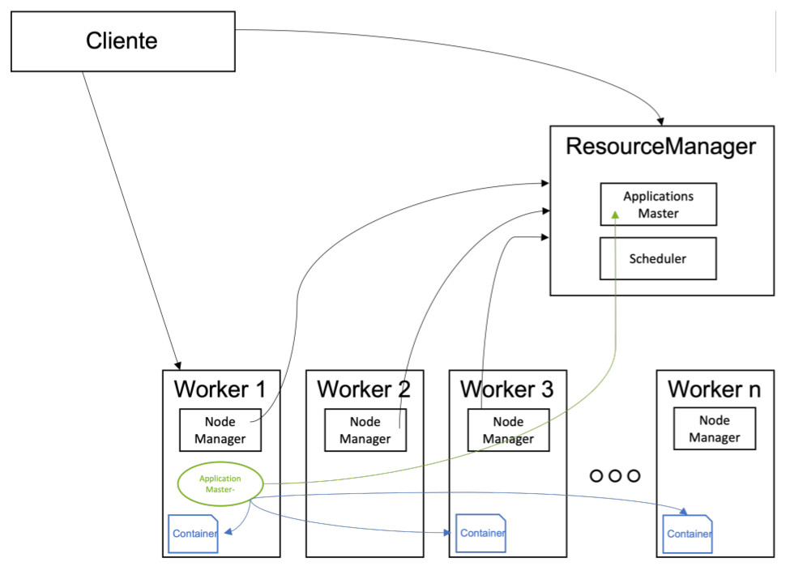

# UD 4 - Apache Hadoop - Yarn

!!! Info "**Introducción**"

    Seguimos adentrándonos en lo que es Apache Hadoop. Ya hemos entendido que Apache Hadoop ofrece una capa de almacenamiento, que es HDFS, con la que podrá almacenar todos los datos. Hemos entendido cómo funciona HDFS y qué aspectos debe tener en cuenta para dimensionar correctamente su plataforma.
    El siguiente paso en su camino por entender Hadoop es conocer la capacidad que ofrece Hadoop para procesar todos los datos almacenados en HDFS. Es el turno de conocer YARN. YARN será la base sobre la que se ejecutarán todas las aplicaciones de procesamiento o análisis de datos, así que es un punto importante a conocer.

**YARN** es el acrónimo de **Yet Another Resource Negotiator**, es decir, según su acrónimo es un gestor de recursos.

En las primeras versiones de Hadoop, todo el procesamiento se realizaba con _MapReduce_, y que, pese a que su funcionamiento era correcto, ya que era capaz de ofrecer la capacidad de desarrollar aplicaciones complejas que procesaran un gran volumen de datos, tenía varios problemas:

- Restringía mucho el tipo de aplicaciones que los desarrolladores podían realizar, ya que había que ceñirse a las operaciones y forma de ejecución que MapReduce ofrecía, por lo que era difícil utilizar los datos de HDFS para otro tipo de usos como el procesamiento en tiempo real.
- MapReduce es un modelo de programación muy poco eficiente, lo que hace que los casos de uso que requieren respuestas rápidas no sean viables.
- La concurrencia en la ejecución de aplicaciones no estaba bien resuelta, por lo que cuando un usuario o aplicación lanzaba un trabajo MapReduce, se podría decir que el resto tenía que esperar a que terminara la tarea para poder lanzar nuevos trabajos.

<figure style="align: center; width:600px;">
    
    <figcaption>Figura 4.1_Yarn: Arquitectura YARN Hadoop </figcaption>
</figure>


Por este motivo, en la versión 2 de Hadoop se introdujo YARN. El objetivo de YARN era poder independizar el almacenamiento del procesamiento, abrir Hadoop a cualquier tipode aplicación que quiera trabajar con los datos de HDFS, y dar la posibilidad de quemúltiples usuarios puedan trabajar con la plataforma.

<figure style="align: center; width:600px;">
    
    <figcaption>Figura 4.2_Yarn: Arquitectura YARN Hadoop </figcaption>
</figure>

## 1. Contenedores

En YARN es importante conocer el concepto de **contenedor**, que es la unidad mínima de recursos de ejecución para las aplicaciones, y que representa una cantidad específica de memoria, núcleos de procesamiento (cores) y otros recursos (disco, red), para procesar
sus aplicaciones.

Todas las tareas de las aplicaciones YARN se ejecutan en contenedores. Cada trabajo puede contener múltiples tareas y cada una de las tareas se ejecuta en su propio contenedor. Por otro lado, al iniciar un trabajo, YARN puede asignar a cada tarea un conjunto de contenedores dependiendo de la demanda de la aplicación (al lanzar la tarea se le puede indicar el número de contenedores que necesita) y a la disponibilidad de los contenedores que hay en el clúster en ese momento (si hay menos contenedores disponibles de los solicitados, YARN se encargará de aplicar las reglas de prioridad para asignar contenedores que a lo mejor están siendo usados por otras aplicaciones).

Los contenedores se pueden configurar en cuanto al tamaño de memoria y la cantidad de elementos de procesamiento. La cantidad de tareas y, por lo tanto, la cantidad de aplicaciones de YARN que puede ejecutar en cualquier momento, está limitada por la cantidad de contenedores que tiene un clúster.

<figure style="align: center; width:600px;">
    
    <figcaption>Figura 4.3_Yarn: Nodos y Servicios YARN </figcaption>
</figure>

Existe un nodo maestro, el **ResourceManager**, que coordina, asigna y controla la ejecución de todas las tareas, y nodos worker que disponen de un servicio **NodeManager**, que monitoriza el estado de ejecución de las tareas en el worker, así como el estado de
los recursos/contenedores en dicho nodo.

### 1.1 ResourceManager

Este servicio sería el equivalente al Namenode en HDFS, ya que es el maestro que controla la ejecución de todas las tareas que están en ejecución, o las solicitudes de ejecución existentes.

Cuando un cliente quiere ejecutar una aplicación en YARN, se comunica con el **ResourceManager**, que será el encargado de asignarle los recursos en base a las políticas de prioridad asignadas y los recursos disponibles, distribuir la aplicación (el ejecutable) por los diferentes nodos worker que realizarán la ejecución, controlar la ejecución para detectar si ha habido una caída de una de las tareas, para relanzarla en otro nodo, y liberar los recursos una vez la ejecución haya finalizado.

El ResourceManager tiene dos componentes principales::

- El **ApplicationMaster**, que es el servicio que recibe las peticiones de ejecución por parte de los clientes, distribuye las aplicaciones por los nodos worker, asigna los recursos, coordina la ejecución de las tareas, monitoriza la ejecución, solventa los fallos en las ejecuciones, y libera los recursos una vez las tareas han finalizado.

- El **Scheduler**, que es el servicio que asigna prioridades y establece los **recursos/containers** que disfrutará cada aplicación. Este planificador no monitoriza el estado de ninguna aplicación ni les ofrece garantías de ejecución, ni recuperación por fallos de la aplicación o el hardware, sólo planifica. Este componente realiza su planificación a partir de los requisitos de recursos necesarios por las aplicaciones (CPU, memoria, disco y red).

<figure style="align: center; width:600px;">
    
    <figcaption>Figura 4.4_Yarn: Arquitectura YARN </figcaption>
</figure>

### 1.2 Node Manager

El servicio NodeManager se ejecuta en cada nodo worker y proporciona los recursos computacionales necesarios para las aplicaciones en forma de **contenedores**. Implementa Heartbeats para mantener informado del estado al _Resource Manager_. Realiza las siguientes
funciones:

- Monitoriza y proporciona información sobre el consumo de recursos (CPU/memoria) por parte de los contenedores al _ResourceManager_.
- Envía mensajes para notificar al _ResourceManager_ su actividad (no está caído) así como la información sobre su estado a nivel de recursos.
- Supervisa el ciclo de vida de los contenedores de aplicaciones.
- Supervisa la ejecución de las distintas tareas en contenedores y termina aquellas tareas que se han quedado bloqueadas.
- Almacena un log (fichero en HDFS) con todas las operaciones que se realizan en el nodo.
- Lanza procesos _ApplicationMaster_, que coordinan los trabajos para cada aplicación.

!!! Info inline end

    Los **NodeManager**, al igual que los Datanodes en HDFS, son tolerantes a fallos, por lo que en caso de caída de alguno de ellos, el ResourceManager detectará que no funciona y redirigirá la ejecución de las aplicaciones al resto de nodos activos.

### 1.3 AplicationMaster

Existe un proceso **ApplicationMaster** por aplicación. Este proceso se encarga de negociar con el _ResourceManager_ los recursos necesarios para la ejecución de las tareas de su aplicación.

El _ApplicationMaster_ se ejecuta en uno de los nodos worker, para garantizar la escalabilidad de YARN, ya que si se ejecutaran todos los _ApplicationMaster_ en el nodo maestro, junto con el _ResourceManager_, éste sería un cuello de botella para poder escalar
o poder lanzar un gran número de aplicaciones sobre el clúster.

Asimismo, a diferencia del _ResourceManager_ y los NodeManager, el _ApplicationMaster_ es específico para una aplicación por lo que, cuando la aplicación finaliza, el proceso _ApplicationMaster_ termina. En el caso de los servicios _ResourceManager_ y NodeManager, siempre se están ejecutando aunque no haya aplicaciones activas en el clúster. Cada vez que se inicia una nueva aplicación, _ResourceManager_ asigna un contenedor que ejecuta _ApplicationMaster_ en uno de los nodos del clúster.

## 2. Funcionamiento

YARN, en concreto, el _ResourceManager_, es invocado por los clientes cuando quieren lanzar una aplicación en el clúster para su ejecución.

<figure style="align: center; width:600px;">
    
    <figcaption>Figura 4.5_Yarn: Funcionamiento YARN </figcaption>
</figure>


La secuencia de ejecución de una aplicación es la siguiente:

!!! note inline end

    Como has visto tanto en YARN como en HDFS, en Hadoop se intenta que los nodos maestros hagan el menor número de operaciones posibles para cada tarea, con el objetivo de poder escalar. Si por cada tarea a ejecutar necesitaran realizar un gran número de tareas, la capacidad de escalar se vería muy reducida, ya que los nodos master son los únicos que pueden realizar este tipo de tareas, siendo el límite del sistema Hadoop la capacidad máxima que puede tener un nodo maestro.

1. El cliente se comunica con el _ResourceManager_ para solicitarle la ejecución de una aplicación. En la llamada, le envía el código/ejecutable de la aplicación, así como unos parámetros sobre los recursos necesarios para dicha ejecución.
2. El _ApplicationMaster_, tras chequear con el Scheduler la disponibilidad de recursos y su prioridad, pide al NodeManager de un nodo la creación de un container que ejecutará el _ApplicationMaster_ de la aplicación.
3. El NodeManager crea el contenedor y arranca su ejecución.
4. El _ResourceManager_ se comunica con el _ApplicationMaster_ para solicitarle los contenedores necesarios para la ejecución de la aplicación en caso necesario.
5. El _ApplicationMaster_ se comunica con los contenedores donde se está ejecutando distintas tareas para controlar su ejecución, y va notificando el status de la ejecución al _ResourceManager_.
6. El NodeManager, asimismo, envía información al _ResourceManager_ sobre el consumo de recursos y notificando que el nodo está activo.

YARN soporta la reserva de recursos mediante el [Reservation System](https://hadoop.apache.org/docs/stable/hadoop-yarn/hadoop-yarn-site/ReservationSystem.html), un componente que permite a los usuarios especificar un perfil de recurso y restricciones temporales (deadlines) y posteriormente reservar recursos para asegurar la ejecución predecibles de las tareas importantes. Este sistema registra los recursos a lo largo del tiempo, realiza control de admisión para las reservas, e informa dinámicamente al planificador para asegurarse que se produce la reserva.

Para conseguir una alta escalabilidad (del orden de miles de nodos), YARN ofrece el concepto de [YARN Federation](https://hadoop.apache.org/docs/stable/hadoop-yarn/hadoop-yarn-site/Federation.html). Esta funcionalidad permite conectar varios clústeres YARN y hacerlos visibles como un clúster único. De esta forma puede ejecutar trabajos muy pesados y distribuidos.

## 3. Configuración

Para configurar YARN, primero editaremos el archivo `yarn-site.xml` para indicar quien va a ser el nodo maestro, así como el manager y la gestión para hacer el MapReduce:

!!! tip inline end

    Recuerda que los archivos de configuración se encuentran dentro de la carpeta `$HADOOP_HOME/etc/hadoop`.

```xml title="yarn-site.xml"
<configuration>
    <property>
        <name>yarn.webapp.ui2.enable</name>
        <value>true</value>
    </property>  
    <property>
        <name>yarn.resourcemanager.hostname</name>
        <value>bda-iesgrancapitan</value>
    </property>
    <property>
        <name>yarn.nodemanager.aux-services</name>
        <value>mapreduce_shuffle</value>
    </property>
    <property>
        <name>yarn.nodemanager.aux-services.mapreduce_shuffle.class</name>
        <value>org.apache.hadoop.mapred.ShuffleHandler</value>
    </property>
    <property>
        <name>yarn.log-aggregation-enable</name>
        <value>true</value>
    </property>   
</configuration>
```

**Mención especial tiene la configuración del parámetro `yarn.application.classpath`. Si no tenemos bien configurado este parámetro, no funcionará MapReducev2 ejecutado sobre Yarn, ya que no encontrará las librerías necesarías para su correcta ejecución.**

Para obtener la ruta correcta del classpath de Hadoop ejecutamos la siguiente instrucción

```
echo `hadoop classpath`
```

Y es esta salida la que tenemos que poner como valor de la propiedad. En mi caso:

```
/opt/hadoop-3.3.6/etc/hadoop:/opt/hadoop-3.3.6/share/hadoop/common/lib/*:/opt/hadoop-3.3.6/share/hadoop/common/*:/opt/hadoop-3.3.6/share/hadoop/hdfs:/opt/hadoop-3.3.6/share/hadoop/hdfs/lib/*:/opt/hadoop-3.3.6/share/hadoop/hdfs/*:/opt/hadoop-3.3.6/share/hadoop/mapreduce/*:/opt/hadoop-3.3.6/share/hadoop/yarn:/opt/hadoop-3.3.6/share/hadoop/yarn/lib/*:/opt/hadoop-3.3.6/share/hadoop/yarn/*
```
También hay que tener en cuenta, que si te conectas desde otra máquina, hay que dar permiso de acceso desde fuera de la máquina con la siguiente propiedad:

```xml title="yarn-site.xml"
    <property>
        <name>yarn.resourcemanager.webapp.address</name>
        <value>0.0.0.0:8088</value>
    </property> 
```

Por tanto, la configuración final del archivo de configuración `yarn-site.xml` sería: 

```xml title="yarn-site.xml"
<configuration>
    <property>
        <name>yarn.webapp.ui2.enable</name>
        <value>true</value>
    </property>  
    <property>
        <name>yarn.resourcemanager.hostname</name>
        <value>bda-iesgrancapitan</value>
    </property>
    <property>
        <name>yarn.nodemanager.aux-services</name>
        <value>mapreduce_shuffle</value>
    </property>
    <property>
        <name>yarn.nodemanager.aux-services.mapreduce_shuffle.class</name>
        <value>org.apache.hadoop.mapred.ShuffleHandler</value>
    </property>
    <property>
        <name>yarn.log-aggregation-enable</name>
        <value>true</value>
    </property>
    <property>
        <name>yarn.application.classpath</name>
        <value>/opt/hadoop-3.3.6/etc/hadoop:/opt/hadoop-3.3.6/share/hadoop/common/lib/*:/opt/hadoop-3.3.6/share/hadoop/common/*:/opt/hadoop-3.3.6/share/hadoop/hdfs:/opt/hadoop-3.3.6/share/hadoop/hdfs/lib/*:/opt/hadoop-3.3.6/share/hadoop/hdfs/*:/opt/hadoop-3.3.6/share/hadoop/mapreduce/*:/opt/hadoop-3.3.6/share/hadoop/yarn:/opt/hadoop-3.3.6/share/hadoop/yarn/lib/*:/opt/hadoop-3.3.6/share/hadoop/yarn/*</value>
    </property>
    <property>
        <name>yarn.resourcemanager.webapp.address</name>
        <value>0.0.0.0:8088</value>
    </property>      
</configuration>
```

Y finalmente el archivo `mapred-site.xml` para indicar que utilice YARN como framework MapReduce:

```xml title="mapred-site.xml"
<configuration>
    <property>
        <name>mapreduce.framework.name</name>
        <value>yarn</value>
    </property>
</configuration>
```
_Si prefieres usar la versión anterior y ejecutar MapReduce sobre HDFS, elimina esta propiedad_


Levantamos YARN

```
hadoop@hadoop-VirtualBox:~/hadoop-3.3.4/sbin$ start-yarn.sh 
Starting resourcemanager
Starting nodemanagers
```

Al habilitar en la configuración la WebUI de Yarn, podemos acceder a su API Web en el puerto `8088`. Podemos acceder a 2 versiones de WebUI.

1. Versión antigua de Hadoop Yarn. En mi caso

```
http://bda-iesgrancapitan:8088/cluster
```

<figure style="align: center; width:600px;">
    
    <figcaption>Figura 4.6_Yarn: WebUI YARN Antigua</figcaption>
</figure>

2. Versión actual de Hadoop Yarn. En mi caso:

```
http://bda-iesgrancapitan:8088/ui2 
```
<figure style="align: center; width:600px;">
    
    <figcaption>Figura 4.7_Yarn: WebUI YARN Nueva</figcaption>
</figure>

Ya podemos acceder a la interfaz de YARN. Además de en el log, podemos observar aquí todos los trabajos que se van realizando. Lo comprobaremos cuando lancemos alguna aplicación MapReduce en la siguiente parte del tema

## 4. Ejercicio
Para comprobar la ejecución de Yarn sobre MapReduce, vamos a realizar el mismo ejercicio de contar las palabras de "El Quijote" que hicimos en el apartado anterior de MapReduce y observemos los cambios.

1. Ejecutamos de nuevo el programa `wordcount`
2. En esta ocasión, debe ejecutarse sobre Yarn

```bash
hadoop jar $HADOOP_HOME/share/hadoop/mapreduce/hadoop-mapreduce-examples-3.3.6.jar wordcount /bda/mapreduce/ejercicios/El_Quijote.txt /bda/mapreduce/ejercicios/salida_quijote_yarn
```

3. Vemos como a generado un **job** nuevo

```bash hl_lines="11"
2023-11-27 19:23:23,184 INFO client.DefaultNoHARMFailoverProxyProvider: Connecting to ResourceManager at bda-iesgrancapitan/127.0.0.1:8032
2023-11-27 19:23:24,179 INFO mapreduce.JobResourceUploader: Disabling Erasure Coding for path: /tmp/hadoop-yarn/staging/hadoop/.staging/job_1701109095543_0001
2023-11-27 19:23:25,308 INFO input.FileInputFormat: Total input files to process : 1
2023-11-27 19:23:25,860 INFO mapreduce.JobSubmitter: number of splits:1
2023-11-27 19:23:26,161 INFO mapreduce.JobSubmitter: Submitting tokens for job: job_1701109095543_0001
2023-11-27 19:23:26,161 INFO mapreduce.JobSubmitter: Executing with tokens: []
2023-11-27 19:23:26,352 INFO conf.Configuration: resource-types.xml not found
2023-11-27 19:23:26,352 INFO resource.ResourceUtils: Unable to find 'resource-types.xml'.
2023-11-27 19:23:26,859 INFO impl.YarnClientImpl: Submitted application application_1701109095543_0001
2023-11-27 19:23:26,908 INFO mapreduce.Job: The url to track the job: http://hadoop-VirtualBox:8088/proxy/application_1701109095543_0001/
2023-11-27 19:23:26,912 INFO mapreduce.Job: Running job: job_1701109095543_0001
2023-11-27 19:23:39,204 INFO mapreduce.Job: Job job_1701109095543_0001 running in uber mode : false
2023-11-27 19:23:39,211 INFO mapreduce.Job:  map 0% reduce 0%
2023-11-27 19:23:48,367 INFO mapreduce.Job:  map 100% reduce 0%
2023-11-27 19:23:55,455 INFO mapreduce.Job:  map 100% reduce 100%
2023-11-27 19:23:56,495 INFO mapreduce.Job: Job job_1701109095543_0001 completed successfully
2023-11-27 19:23:56,589 INFO mapreduce.Job: Counters: 54
	File System Counters
		FILE: Number of bytes read=605631
		FILE: Number of bytes written=1763985
		FILE: Number of read operations=0
		FILE: Number of large read operations=0
		FILE: Number of write operations=0
		HDFS: Number of bytes read=2161310
		HDFS: Number of bytes written=448985
		HDFS: Number of read operations=8
		HDFS: Number of large read operations=0
		HDFS: Number of write operations=2
		HDFS: Number of bytes read erasure-coded=0
	Job Counters 
		Launched map tasks=1
		Launched reduce tasks=1
		Data-local map tasks=1
		Total time spent by all maps in occupied slots (ms)=6062
		Total time spent by all reduces in occupied slots (ms)=4465
		Total time spent by all map tasks (ms)=6062
		Total time spent by all reduce tasks (ms)=4465
		Total vcore-milliseconds taken by all map tasks=6062
		Total vcore-milliseconds taken by all reduce tasks=4465
		Total megabyte-milliseconds taken by all map tasks=6207488
		Total megabyte-milliseconds taken by all reduce tasks=4572160
	Map-Reduce Framework
		Map input records=37863
		Map output records=384275
		Map output bytes=3688770
		Map output materialized bytes=605631
		Input split bytes=135
		Combine input records=384275
		Combine output records=40067
		Reduce input groups=40067
		Reduce shuffle bytes=605631
		Reduce input records=40067
		Reduce output records=40067
		Spilled Records=80134
		Shuffled Maps =1
		Failed Shuffles=0
		Merged Map outputs=1
		GC time elapsed (ms)=113
		CPU time spent (ms)=1740
		Physical memory (bytes) snapshot=368336896
		Virtual memory (bytes) snapshot=5014446080
		Total committed heap usage (bytes)=230821888
		Peak Map Physical memory (bytes)=237412352
		Peak Map Virtual memory (bytes)=2503553024
		Peak Reduce Physical memory (bytes)=130924544
		Peak Reduce Virtual memory (bytes)=2510893056
	Shuffle Errors
		BAD_ID=0
		CONNECTION=0
		IO_ERROR=0
		WRONG_LENGTH=0
		WRONG_MAP=0
		WRONG_REDUCE=0
	File Input Format Counters 
		Bytes Read=2161175
	File Output Format Counters 
		Bytes Written=448985
```

4. Observamos como la WebUI Yarn muestra la ejecución del **job**

<figure style="align: center; width:600px;">
    
    <figcaption>Figura 4.8_Yarn: WebUI YARN Wordcount</figcaption>
</figure>

5. Detalle de la ejecución del _job wordcount_

<figure style="align: center; width:600px;">
    
    <figcaption>Figura 4.8_Yarn: WebUI YARN detalle Wordcount job</figcaption>
</figure>

6. Leemos el fichero de salida. Aquí están listados todas las palabras de El Quijote y cuantas veces aparece cada palabra

```bash
hdfs dfs -cat /bda/mapreduce/ejercicios/salida_quijote_yarn/part-r-00000
```