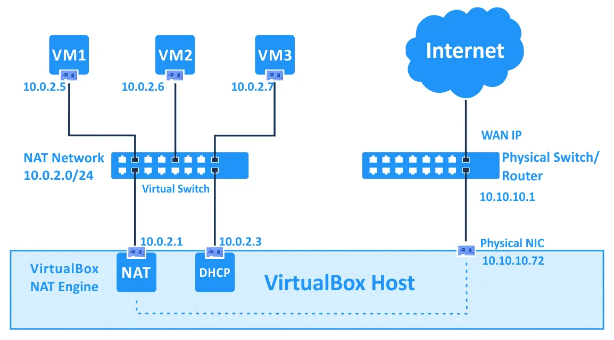
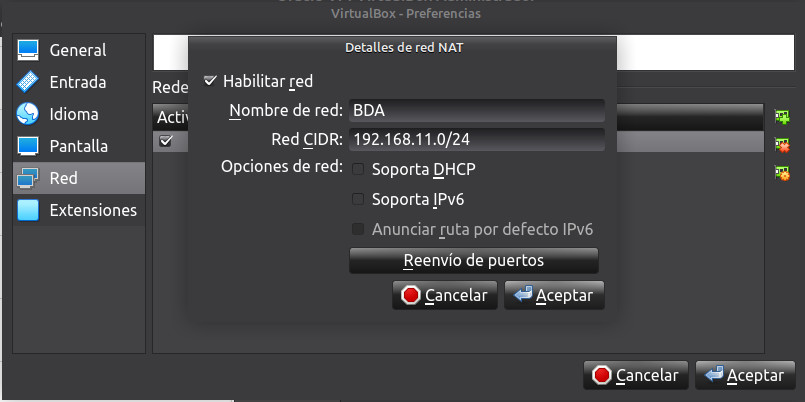
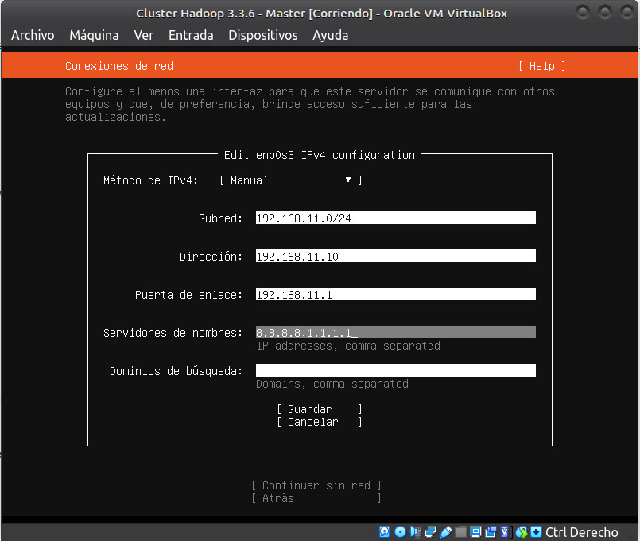
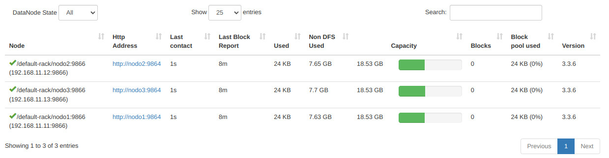

# UD 4 - Apache Hadoop - Cluster

En este recurso vamos a explicar como se instala y configura un cluster con Apache Hadoop

## 1. Pre-requisitos

Debemos tener instalado VirtualBox. 

### 1.1 Configurar Red NAT

Para crear nuestro cluster, vamos a configurar un **red NAT** para que los nodos tenga conexión entre ellos y salida a Internet a través del Host

!!! success

    Hemos elegido esta configuración de red por varios motivos.

    1. Puedas usar tu cluster en tu portátil independientemente de la red o lugar en la que estés conectado
    
    2. Sería más sencillo hacerla en **modo bridge**, pero no tenemos IPs suficientes debido al alto número de alumnado, y habría que configurar las IPs cada vez que te conectes a una red distinta a la de clase.
    
    3. En todo caso, si decides optar por esta opción, sólo tienes que adaptar los pasos a tu configuración de red. Sería algo más sencilla.

Para ello, explicamos con una imagen como funciona VirtualBox en este tipo de configuración de red

<figure style="align: center; width:900px;">
    
    <figcaption>Figura 1 Cluster Hadoop: Red NAT Virtualbox. (Fuente: medium.com/@sidlors)</figcaption>
</figure>

Puedes observar que podemos configurar nuestra propia subred, dentro de las cuales, hay 2 ips que VirtualBox asigna estáticas dentro de la red: la **puerta de enlace**(primera de la red) y el **DHCP** (tercera de la red). Para más información, consulta la [documentación oficial de VirtualBox](https://www.virtualbox.org/manual/UserManual.html#network_nat_service)

Teniendo en cuenta esto, vamos a configurar nuestra propia subred, que será la `192.168.11.0/24`

1. Abrimos la configuración de VirtualBox para crear una nueva red NAT en `Preferencias -> Redes -> Redes NAT -> Agregar nueva red NAT`

2. Creamos una nueva Red NAT llamada `BDA`. Usaremos la red `192.168.11.0/24` con DHCP Deshabilitado. Puedes elegir cualquier otra si quieres.

<figure style="align: center;">
    
    <figcaption>Figura 2 Cluster Hadoop: Red NAT. (Fuente: Propia)</figcaption>
</figure>

3. Una vez configurada la Red NAT, podemos empezar a instalar y configurar el cluster.

### 1.2 Configuración de las máquinas

Vamos a crear una primera máquina que después clonaremos y cambiaremos las configuraciones necesarias. Las máquinas tendrán la siguiente configuración (***siempre que sea posible***):

- **Nombre**: master (las otras 3 máquinas se llamarán nodo1, nodo2 y nodo3)
- **RAM**: 4GB (_yo por ejemplo, no puedo darle más de 3GB_)
- **Núcleos**: 2
- **Disco duro**: 50GB
- **Interfaz de red**: Red NAT ("BDA"): 192.0.11.10 (las s de las otras 3 máquinas serán 192.0.11.11, 192.0.11.12 y 192.0.11.13)
- **Sistema operativo**: Ubuntu server 22.04
- **Usuario**: hadoop

### 1.3 Configuración de red 

Habiendo entendido correctamente lo explicado en los puntos anteriores,podemos configurar la interfaz de red de forma manual, con la siguiente configuración:

- **Subred**: `192.168.11.0/24`
- **Direción Ip**: `192.168.11.10`
- **Puerta de enlace**: `192.168.11.1` 
- **DNS**: `8.8.8.8,1.1.1.1`

<figure style="align: center;">
    
    <figcaption>Figura 3 Cluster Hadoop: Interfaz de Red Nodo Master. (Fuente: Propia)</figcaption>
</figure>


### 1.4 Acceso a las máquinas

Para un manejo más cómodo e intuitivo de las máquinas, podemos preparar cada nodo para que sea accesible desde nuestro anfitrión y conectarnos mediante ssh a cada una de las máquinas.

Para ello debemos añadir otro interfaz de red en modo "Adaptador sólo anfitrión"  

!!! warning

    Si tienes como anfitrión un equipo linux y no puedes configurar un "adaptador sólo anfitrión" debes crearlo y levantarlo manualmente

    ```bash
    sudo vboxmanage hostonlyif create
    sudo ifconfig vboxnet0 up
    ```

    Se creara una interfaz de red 192.168.56.0/24. Puedes cambiarla y configurarla también manualmente

    ```bash
    sudo vboxmanage hostonlyif ipconfig vboxnet0 --ip 10.0.2.18
    ```

    Puedes crear todas las que quieras por este proceso. Si se actualiza el kernel de Linux o la versión de Virtualbox se debe repetir este proceso. Para mas información accede a la [documentación oficial de VirtualBox](https://www.virtualbox.org/manual/UserManual.html#vboxmanage-hostonlyif)

    Ahora, una vez dentro de la máquina virtual, no olvides configurar la ip de esta subred.
    
    1. Abrimos el archivo `/etc/netplan/00-instaler-config.yaml` y añadir la configuración. Por ejemplo, terminado en la misma ip que la Red NAT
    2. Esta sería la configuración completa


    ```yaml title="00-instaler-config.yaml"
    network:
    ethernets:
        enp3s0:
            addresses:
            - 192.168.11.10/24
            nameservers:
                addresses: [8.8.8.8, 1.1.1.1]
            routes:
            - to: default
              via: 192.168.11.1
        enp8s0:
            addresses:
            - 192.168.56.10/24
    version: 2
    ``` 
    3. Aplicamos la nueva configuración

    ```bash
    sudo netplan apply
    ```


## 2. Nodo Master

Creamos en VirtualBox el nodo `master` configurando el Interfaz de red como Red NAT (opcionalmente otra interfaz red sólo anfitrión) y elegimos la que acabamos de crear `BDA`

### 2.1 Instalación

1. **Java™** debe ser instalado. Las versiones de Java recomendadas se encuentran descritas en [HadoopJavaVersions](https://cwiki.apache.org/confluence/display/HADOOP/Hadoop+Java+Versions).

```bash
sudo apt-get install openjdk-8-jdk
/usr/bin/java -version
```

2. **ssh** debe estar instalado y sshd debe estar ejecutándose para usar las secuencias de comandos de Hadoop que administran los demonios ssh remotos de Hadoop, ya que vamos a usar las secuencias de comandos de inicio y detección opcionales. Si no lo has hecho durante la instalación, hazlo ahora.

```bash
sudo apt-get install ssh
```

3. Para obtener la distribución de Apache Hadoop, descarga la versión estable más reciente desde [Apache Download Mirrors](https://www.apache.org/dyn/closer.cgi/hadoop/common/)

```bash
wget https://dlcdn.apache.org/hadoop/common/hadoop-3.3.6/hadoop-3.3.6.tar.gz
```

4. Una vez descargado, desempaquetamos el archivo descargado con el comando tar y entra dentro de la carpeta:

```bash
sudo tar -xzf hadoop-3.3.6.tar.gz -C /opt
cd /opt/hadoop-3.3.6
```

5. Edita el siguiente archivo `etc/hadoop/hadoop-env.sh` para definir la variable de entorno de Java y añádela.

```bash
# Technically, the only required environment variable is JAVA_HOME.
export JAVA_HOME=/usr/lib/jvm/java-8-openjdk-amd64/
```

7. Para poder usar los comandos de HDFS en cualquier lugar del sistema, sin tener que hacerlo desde el directorio de Hadoop (por ejemplo `/opt/hadoop-3.3.6/bin`), creamos las variables de entorno y añadimos al PATH. Para ello abrimos el archivo `~/.bashrc` y añadimos al final el siguiente código y ejecuta el comando `source ~/.bashrc`

```bash title="~/.bashrc"
export HADOOP_HOME=/opt/hadoop-3.3.6
export HADOOP_INSTALL=$HADOOP_HOME
export HADOOP_MAPRED_HOME=$HADOOP_HOME
export HADOOP_COMMON_HOME=$HADOOP_HOME
export HADOOP_HDFS_HOME=$HADOOP_HOME
export HADOOP_YARN_HOME=$HADOOP_HOME
export HADOOP_COMMON_LIB_NATIVE_DIR=$HADOOP_HOME/lib/native
export PATH=$PATH:$HADOOP_HOME/sbin:$HADOOP_HOME/bin
export HADOOP_OPTS="-Djava.library.path=$HADOOP_HOME/lib/native"
```

8. Ejecuta el siguiente comando. Si no da error, podemos continuar

```bash
hadoop version
```

Nos debe salir la versión de hadoop

```bash
Hadoop 3.3.6
Source code repository https://github.com/apache/hadoop.git -r 1be78238728da9266a4f88195058f08fd012bf9c
Compiled by ubuntu on 2023-06-18T08:22Z
Compiled on platform linux-x86_64
Compiled with protoc 3.7.1
From source with checksum 5652179ad55f76cb287d9c633bb53bbd
This command was run using /opt/hadoop-3.3.6/share/hadoop/common/hadoop-common-3.3.6.jar
```

### 2.2 Configuración

Los archivos que vamos a revisar a continuación se encuentran dentro de la carpeta `$HADOOP_HOME/etc/hadoop`.

1. El archivo que contiene la configuración general del clúster es el archivo `core-site.xml`. En él se configura cual será el sistema de ficheros, que normalmente será hdfs, indicando el dominio del nodo que será el maestro de datos (namenode) de la arquitectura. Podéis sustituir el nombre del dominio `bda-iesgrancapitan` por el que queráis. En mi caso sera `cluster-bda`

```xml title="core-site.xml"
<configuration>
    <property>
        <name>fs.defaultFS</name>
        <value>hdfs://cluster-bda:9000</value>
    </property>
</configuration>
```

2. El siguiente paso es configurar el archivo `hdfs-site.xml` donde se indica tanto el factor de replica como la ruta donde se almacenan tanto los metadatos (namenode) como los datos en sí (datanode). Aquí puedes consultar todos los parámetros por defecto susceptibles de cambio se encuentran en este [recurso](https://hadoop.apache.org/docs/stable/hadoop-project-dist/hadoop-hdfs/hdfs-default.xml)


```xml title="hdfs-site.xml"
<configuration>
    <property>
        <name>dfs.replication</name>
        <value>1</value>
    </property>

    <property>
        <name>dfs.namenode.name.dir</name>
        <value>/opt/hadoop/hadoop_data/hdfs/namenode</value>
    </property>

    <property>
        <name>dfs.datanode.data.dir</name>
        <value>/opt/hadoop/hadoop_data/hdfs/datanode</value>
    </property>
</configuration>
```

3. Crea los directorios de `hadoop-data` configurados anteriormente en `hdfs-site.xml` para cuando ejecutemos **hadoop** y configura los permisos oportunos.

```bash
sudo mkdir -p /opt/hadoop
sudo chown -R hadoop:hadoop /opt/hadoop
```

4. Configuramos **MapReduce**

```xml title="mapred-site.xml"
<configuration>
    <property>
        <name>mapreduce.framework.name</name>
        <value>yarn</value>
    </property>
</configuration>
```

5. Configuramos **Yarn**

Primero obtenemos la ruta correcta del classpath de Hadoop ejecutamos la siguiente instrucción

```
echo `hadoop classpath`
```

Y es esta salida la que tenemos que poner como valor de la propiedad. En mi caso:

```
/opt/hadoop-3.3.6/etc/hadoop:/opt/hadoop-3.3.6/share/hadoop/common/lib/*:/opt/hadoop-3.3.6/share/hadoop/common/*:/opt/hadoop-3.3.6/share/hadoop/hdfs:/opt/hadoop-3.3.6/share/hadoop/hdfs/lib/*:/opt/hadoop-3.3.6/share/hadoop/hdfs/*:/opt/hadoop-3.3.6/share/hadoop/mapreduce/*:/opt/hadoop-3.3.6/share/hadoop/yarn:/opt/hadoop-3.3.6/share/hadoop/yarn/lib/*:/opt/hadoop-3.3.6/share/hadoop/yarn/*
```

Por tanto la configuración final será


```xml title="yarn-site.xml"
<configuration>
    <property>
        <name>yarn.webapp.ui2.enable</name>
        <value>true</value>
    </property>  
    <property>
        <name>yarn.resourcemanager.hostname</name>
        <value>cluster-bda</value>
    </property>
    <property>
        <name>yarn.nodemanager.aux-services</name>
        <value>mapreduce_shuffle</value>
    </property>
    <property>
        <name>yarn.nodemanager.aux-services.mapreduce_shuffle.class</name>
        <value>org.apache.hadoop.mapred.ShuffleHandler</value>
    </property>
    <property>
        <name>yarn.log-aggregation-enable</name>
        <value>true</value>
    </property>
    <property>
        <name>yarn.application.classpath</name>
        <value>/opt/hadoop-3.3.6/etc/hadoop:/opt/hadoop-3.3.6/share/hadoop/common/lib/*:/opt/hadoop-3.3.6/share/hadoop/common/*:/opt/hadoop-3.3.6/share/hadoop/hdfs:/opt/hadoop-3.3.6/share/hadoop/hdfs/lib/*:/opt/hadoop-3.3.6/share/hadoop/hdfs/*:/opt/hadoop-3.3.6/share/hadoop/mapreduce/*:/opt/hadoop-3.3.6/share/hadoop/yarn:/opt/hadoop-3.3.6/share/hadoop/yarn/lib/*:/opt/hadoop-3.3.6/share/hadoop/yarn/*</value>
    </property>
    <property>
        <name>yarn.resourcemanager.webapp.address</name>
        <value>0.0.0.0:8088</value>
    </property>      
</configuration>
```

1. Añade a `/etc/hosts`el nombre de tu dominio indicado en `core-site.xml` para que no te de error de resolución de nombres. En mi caso añado la siguiente linea:

```bash
192.168.11.10   cluster-bda
192.168.11.10   master
192.168.11.11   nodo1
192.168.11.12   nodo2
192.168.11.13   nodo3
```

7. Reiniciamos el servicio

```bash
sudo systemctl restart systemd-resolved.service
```

8. Generamos las claves ssh:

```bash
ssh-keygen -t rsa -P '' -f ~/.ssh/id_rsa
cat ~/.ssh/id_rsa.pub >> ~/.ssh/authorized_keys
```

9. Comprobamos que podemos acceder por ssh

```bash
ssh cluter-bda
#exit
ssh master
#exit
```


10. Configura el archivo `$HADOOP_HOME/etc/hadoop/workers` que le indica a hadoop los nodos que van a actuar como workers.

```title="workers"
nodo1
nodo2
nodo3
```

### 2.3 Ejecución

1. Ejecuta el siguiente comando

```bash
hdfs namenode -format
```

2. Comprobamos la correcta configuración

3. Iniciando el demonio Namenode y Datanode

```bash
start-dfs.sh
```

4. Iniciando Yarn
   
```bash
start-yarn.sh
```

5. Nos debe levantar el servicio correctamente, indicando que no puede conectarse a los nodos 1, 2 y 3, ya que todavía no los hemos creado.

```bash
nodo3: ssh: Could not resolve hostname nodo3: Temporary failure in name resolution
nodo2: ssh: Could not resolve hostname nodo2: Temporary failure in name resolution
nodo1: ssh: Could not resolve hostname nodo1: Temporary failure in name resolution
```

6. Accede desde el navegador del anfitrión con la ip configurada en la Interfaz de red solo anfitrión. En mi caso a `http://192.168.56.11:9870/` para acceder al interfaz web de HDFS


7. Accede también a la WebUI de Yarn `http://192.168.56.11:8088/ui2 `

8. Paramos hadoop

```bash
stop-all.sh
```

## 3. Nodos

### 3.1 Clonación de la máquina master

1. Paramos la máquina `master`
2. Clonamos la máquina 3 veces para crear los 3 nodos del cluster.
3. A la hora de clonar, genera nuevas direcciones MAC para los interfaces de red
4. Clonación completa

### 3.2 Configuración nodos

Tenemos que cambiar algunas configuraciones en nuestros nodos:
- El nombre del hostname
- Configuración de red

1. Cambiamos el nombre del host:

```bash
sudo hostnamectl set-hostname nodo1
```

2. Actualizamos `/etc/hosts` y sustituimos `master` por `nodo1`

3. Accedemos a la configuración de red a través de netplan en el fichero `/etc/netplan/00-instaler-config.yaml` y cambiamos la configuración de las 2 interfaces de red con las ips correspondientes

4. Esta sería la configuración completa

```yaml title="00-instaler-config.yaml"
network:
ethernets:
    enp3s0:
        addresses:
        - 192.168.11.11/24
        nameservers:
            addresses: [8.8.8.8, 1.1.1.1]
        routes:
        - to: default
            via: 192.168.11.1
    enp8s0:
        addresses:
        - 192.168.56.11/24
version: 2
``` 

5. Aplicamos la nueva configuración

```bash
sudo netplan apply
```

6. Reiniciamos

```bash
reboot
```

7. Realizamos las mismas operaciones en el `nodo2` y `nodo3` con sus correspondientes IPs

## 4. Cluster

### 4.1 Configuración ssh

Por último, nos queda crear las correspondientes claves ssh de los nodos para que exista una correcta comunicación entre todos los nodos del cluster.

1. Todos los nodos del cluster deben tener todas las claves públicas del resto de nodos, para su correcto funcionamiento. Por tanto, vamos a ir generando una por una en cada nodo del cluster y las vamos añadiendo a medida que recorremos el cluster. Finalmente, el fichero resultante en el último nodo del cluster contendrá todas las claves. Este deberá ser copiado en todos los nodos los cluster. Vamos a ver el paso a paso para entenderlo mejor.
   
2. Entramos en el `master` y generamos las claves ssh:

```bash
ssh-keygen -t rsa -P '' -f ~/.ssh/id_rsa
cat ~/.ssh/id_rsa.pub >> ~/.ssh/authorized_keys
```

3. La copiamos en el siguiente nodo. En nuestro caso `nodo1`

```bash
scp ~/.ssh/authorized_keys hadoop@nodo1:~/.ssh/authorized_keys
```

4. Accedemos al nodo `nodo1` por ssh. _Como `nodo1` ya conoce la clave de master, no nos pide contraseña. Así también vamos comprobando que la configuración es correcta en cada nodo_.

```bash
ssh nodo1
```

5. Generamos las claves ssh del `nodo1`:

```bash
ssh-keygen -t rsa -P '' -f ~/.ssh/id_rsa
cat ~/.ssh/id_rsa.pub >> ~/.ssh/authorized_keys
```

6. Comprobamos que tenemos todas las claves generadas hasta ahora

```bash
cat ~/.ssh/authorized_keys
```

```bash
ssh-rsa AAAAB3NzaC1yc2EAAAADAQABAAABgQCTyaPCHbtoUIIu/L+9ykq65descImdc1eXv7WUkDL803hDsedzBiMYW4UrNjr2ZhJAPjiUtnqM3xnlYdgJ2T5sWdSO45Dh3IIRufSCOJNvWG0PMM2klAokhqoW2Vhbh50z/2AXdRU00cMd+uE1ETLBg8kvTc+RDc94ctzdlG9hQpe6psRJ2xoG1kJ8DpvXExrynTgTPbIlGiU8K3Z3+fh5WHOwJOjXu1zNMMTNsKRBf39zW0gkyZOcRpjgg4VO2T2esbXffihRLWgCnYjQf683ctoS8nZEigoQkMV8EgRtcvCnBYYmPy5VL155DqN3c1luR0rOOLxB3WSfAm+rod/jd1SLU1nQzhRryFfWu5YEns+hSO7gZG4RzNtfKVVO78xubiprab2gg2ySIvQH4qE8ytqRq44zn7P/KvkenXRk/PRZaBsSXTejLxORTyo0iR4ssWsoMJDPqmGDQ9xPVobROG0ZDiQ2TWAE/B1ww463a2HHXh58zCcrAc+MW5hJNv0= hadoop@master
ssh-rsa AAAAB3NzaC1yc2EAAAADAQABAAABgQC8Y4ksoigj130KJcNRoVZTJ9ehdWkXyb9VMlTi6YZ9WHdvDafJtW2oILCm9PTvOlAjaCJ7D8na5b/CC7BYk2lNAKgw+wQBG9TekCV+HZHcFrXuw6UkdyqQ29rujgyYBqg7dZHtJk8lMBJXY7N/fkSk10uSTNQ3AlqBa6vR23CWVMFhHrkM314/GFcP2aSLoFnIVEm4eyWSPL+5dFchM74EuxJpgP5NqfLrR/nTLQpXn8FJDjj5cxlCGSA/HV82SxJk0TAw4tPH3+q4zuLTzTMkUk8flUPWcon626vt+5wS0cdHo4A0UPsYs10MQ0YiEp00FUFWoQeTVGKvDkRwuMXHjkM+axIiqY9CPIEKT+5O8H/pIJyH0onGOpz4sUhiyj/UzQz4B5J/ky/CAA+TTy2ZWjSX9HN9Sr/0cyVlrjNcIZSpck+XqielhfuRjudEzt9emFCPI1ylRhrE4xt5XfCUSTPp8TnwSrzxGJuIHNbFTaVQ/g2CpkDoBe3xaJ/UaHU= hadoop@nodo1
```

7. La copiamos en el siguiente nodo. En nuestro caso `nodo2`

```bash
scp ~/.ssh/authorized_keys hadoop@nodo2:~/.ssh/authorized_keys
```

8. Accedemos al nodo `node2` por ssh.

```bash
ssh nodo2
```

9. Generamos las claves ssh del `nodo2`:

```bash
ssh-keygen -t rsa -P '' -f ~/.ssh/id_rsa
cat ~/.ssh/id_rsa.pub >> ~/.ssh/authorized_keys
```

10. Comprobamos que tenemos todas las claves generadas hasta ahora

```bash
cat ~/.ssh/authorized_keys
```

11. La copiamos en el siguiente nodo. En nuestro caso `nodo3`

```bash
scp ~/.ssh/authorized_keys hadoop@nodo3:~/.ssh/authorized_keys
```

12. Accedemos al nodo `nodo3` por ssh.

```bash
ssh nodo3
```

13. Generamos las claves ssh del `nodo2`:

```bash
ssh-keygen -t rsa -P '' -f ~/.ssh/id_rsa
cat ~/.ssh/id_rsa.pub >> ~/.ssh/authorized_keys
```

14. Comprobamos que tenemos todas las claves generadas hasta ahora

```bash
cat ~/.ssh/authorized_keys
```

15.  Una vez terminado todo nuestro cluster, la copiamos en todos los nodos.

```bash
scp ~/.ssh/authorized_keys hadoop@nodo2:~/.ssh/authorized_keys
scp ~/.ssh/authorized_keys hadoop@nodo1:~/.ssh/authorized_keys
scp ~/.ssh/authorized_keys hadoop@master:~/.ssh/authorized_keys
```

16. Por último, entramos a cada uno de los nodos y cambiamos los permisos de `~/.ssh/authorized_keys`.

```bash
chmod 0600 ~/.ssh/authorized_keys
```

17. Cerramos todas las conexiones ssh

### 4.2 Preparando los nodos del cluster

1. Ahora nos queda hacer una correcta gestión de las carpetas de namenode y datanode. Recuerda que los archivos de datanode deben estar en los workers

2. Por tanto, en cada uno de los nodos workers(`nodo1`,`nodo2`,`nodo3`), borramos la carpeta `namenode` y el interior de la carpeta `datanode`, donde tenemos el directorio `current`

```bash
sudo rm -rf /opt/hadoop/hadoop_data/hdfs/namenode
sudo rm -rf /opt/hadoop/hadoop_data/hdfs/datanode/current
```

3. Siguiendo la lógica, en el nodo `master` eliminamos el directorio `datanode`

```bash
sudo rm -rf /opt/hadoop/hadoop_data/hdfs/datanode
```

4. Desde el nodo `master`, damos de nuevo formato a HDFS

```bash
hdfs namenode -format
```

### 4.3 Levantamos el cluster

1. Iniciando el demonio Namenode y Datanode

```bash
start-dfs.sh
```

2. Vemos como arranca `namenode` y `secondarynamenode` en el nodo master y el datanode

```bash
Starting namenodes on [cluster-bda]
Starting datanodes
Starting secondary namenodes [master]
```

3. Iniciamos Yarn
   
```bash
start-yarn.sh
```

4. Se inician el `resourcemanager` y el `nodemanagers`

```bash
Starting resourcemanager
Starting nodemanagers
```

5. Arrancamos también el servidor de historial de trabajos (JobHistory Server) en un clúster de Hadoop

```bash
mapred --daemon start historyserver
```

6. Comprobamos con `jps`. Vemos que se ejecutan los servicios que se tienen que ejecutar en el nodo `master`

```bash
2946 ResourceManager
2741 SecondaryNameNode
2553 NameNode
3324 Jps
3263 JobHistoryServer
```

7. Comprobamos con `jps` en cualquier nodo worker(`nodo1`,`nodo2`,`nodo3`). También vemos que se ejecutan los servicios que se tienen que ejecutar en los nodos worker.

```bash
2790 Jps
2554 DataNode
2702 NodeManager
```

8. Comprobamos con nuestra interfaz web de HDFS

<figure style="align: center;">
    
    <figcaption>Figura 4 Cluster Hadoop: Interfaz Web Datanodes Cluster. (Fuente: Propia)</figcaption>
</figure>

9. Ya podemos utilizar el cluster. Compruébalo realizando alguno de los ejemplos desarrollados en los puntos anteriores

