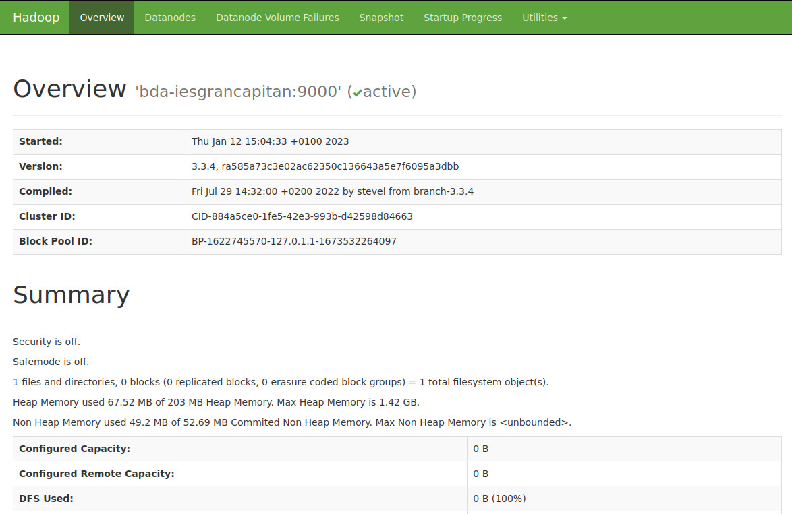
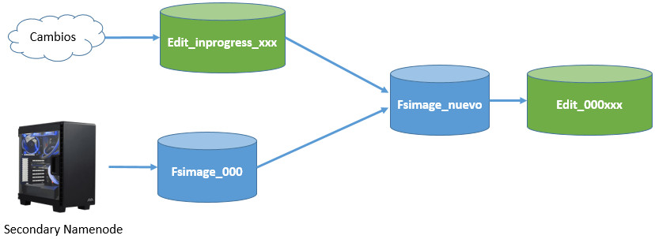
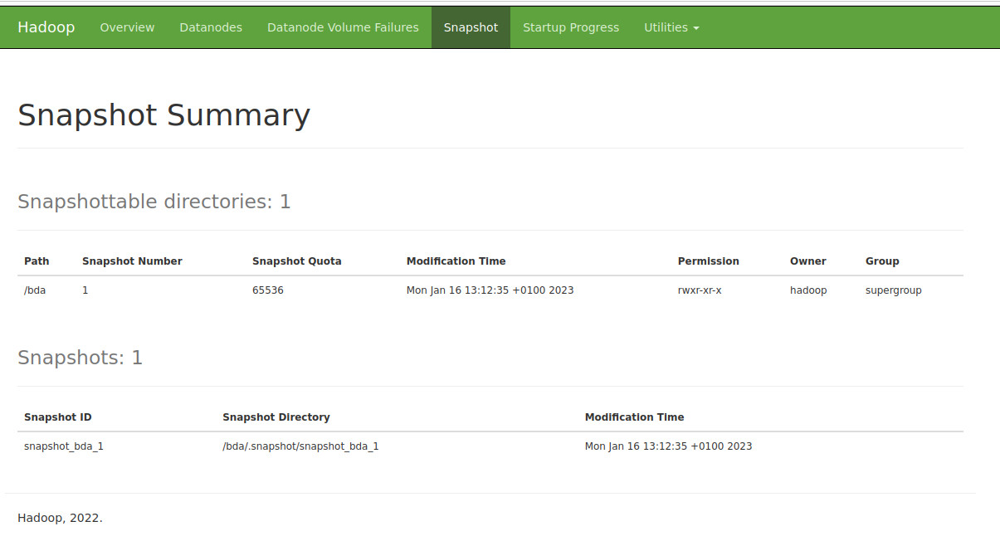

# Big Data Aplicado
## UD 6 - Apache Hadoop
### Instalación Apache Hadoop Ubuntu 22.04 - HUE

**HUE (Hadoop User Experience)** es una interfaz de usuario web para la gestión de Hadoop, además de una plataforma para construir aplicaciones a medida sobre esta librería UI.

Para simplificar el proceso de creación, mantenimiento y ejecución de muchos tipos de trabajos de Hadoop, Hue (Hadoop User Experience) ofrece una GUI web para los usuarios de Hadoop. Básicamente, se compone de varias aplicaciones que interactúan con los componentes de Hadoop, y también tiene un SDK abierto para permitir la creación de nuevas aplicaciones.

**Es un proyecto de Cloudera** que se abrió como proyecto opensource. Fue desarrollado ya que muchas de las operaciones en el ecosistema de Hadoop se operan a través de una interfaz de línea de comandos solamente.

Instalación
https://docs.gethue.com/administrator/installation/

https://docs.gethue.com/administrator/installation/dependencies/
https://docs.gethue.com/administrator/installation/install/
https://docs.gethue.com/administrator/installation/cloud/

Elige el release. En nuestro caso la [4.10.0] (https://docs.gethue.com/releases/release-notes-4.10.0/)

Descarga HUE [tallbar](https://cdn.gethue.com/downloads/hue-4.10.0.tgz)

```
wget https://cdn.gethue.com/downloads/hue-4.11.0.tgz
tar -xzf hue-4.11.0.tgz
```


https://docs.gethue.com/releases/


Configuración


Ayúdate también de la información de la [página oficial](https://hadoop.apache.org/docs/stable/hadoop-project-dist/hadoop-common/SingleCluster.html)

!!! note inline end

    Para trabajar en local tenemos montada una solución que se conoce como pseudo-distribuida, porque es al mismo tiempo maestro y esclavo. En el mundo real o si utilizamos una solución cloud tendremos un nodo maestro y múltiples nodos esclavos.


### Instalación

1. Java™ debe ser instalado. Las versiones de Java recomendadas se encuentran descritas en [HadoopJavaVersions](https://cwiki.apache.org/confluence/display/HADOOP/Hadoop+Java+Versions).

```
sudo apt-get install openjdk-11-jdk
/usr/bin/java
```

2. ssh debe estar instalado y sshd debe estar ejecutándose para usar las secuencias de comandos de Hadoop que administran los demonios ssh remotos de Hadoop, ya que vamos a usar las secuencias de comandos de inicio y detección opcionales.

```
sudo apt-get install ssh
```

3. Abre la terminal en el directorio `$HOME`

4. Para obtener la distribución de Apache Haddop, descarga la versión estable más reciente desde [Apache Download Mirrors](https://www.apache.org/dyn/closer.cgi/hadoop/common/)

```
wget https://downloads.apache.org/hadoop/common/hadoop-3.3.4/hadoop-3.3.4.tar.gz
```

5. Una vez descargado, desempaquetamos el archivo descargado con el comando tar y entra dentro de la carpeta:

```
tar -xzf hadoop-3.3.4.tar.gz
cd hadoop-3.3.4
```

6. Edita el siguiente archivo `etc/hadoop/hadoop-env.sh` para definir la variable de entorno de Java y añadela.

```
# Technically, the only required environment variable is JAVA_HOME.
export JAVA_HOME=/usr/lib/jvm/java-11-openjdk-amd64/
```

7. Para poder usar los comandos de HDFS en cualquier lugar del sistema, sin tener que hacerlo desde el directorio de Hadoop (por ejemplo /home/hadoop/hadoop-3.3.4/bin), creamos las variables de entorno y añadimos al PATH. Para ello abrimos el archivo `~/.bashrc` y añadimos al final el siguiente código y ejecuta el comando `source ~/.bashrc`

```
export HADOOP_HOME=$HOME/hadoop-3.3.4
export HADOOP_INSTALL=$HADOOP_HOME
export HADOOP_MAPRED_HOME=$HADOOP_HOME
export HADOOP_COMMON_HOME=$HADOOP_HOME
export HADOOP_HDFS_HOME=$HADOOP_HOME
export HADOOP_YARN_HOME=$HADOOP_HOME
export HADOOP_COMMON_LIB_NATIVE_DIR=$HADOOP_HOME/lib/native
export PATH=$PATH:$HADOOP_HOME/sbin:$HADOOP_HOME/bin
export HADOOP_OPTS="-Djava.library.path=$HADOOP_HOME/lib/native"
```

8. Ejecuta el siguiente comando. Si no da error, podemos continuar

```
bin/hadoop
```

### Configuración (Pseudo-Distributed Operation)

Hadoop se puede ejecutar en un solo nodo en un modo pseudo-distributed donde cada demonio de Hadoop se ejecuta en un proceso Java separado.

Los archivos que vamos a revisar a continuación se encuentran dentro de la carpeta `$HADOOP_HOME/etc/hadoop`.

1. El archivo que contiene la configuración general del clúster es el archivo `core-site.xml`. En él se configura cual será el sistema de ficheros, que normalmente será hdfs, indicando el dominio del nodo que será el maestro de datos (namenode) de la arquitectura.

```xml title="core-site.xml"
<configuration>
    <property>
        <name>fs.defaultFS</name>
        <value>hdfs://bda-iesgrancapitan:9000</value>
    </property>
</configuration>
```

2. El siguiente paso es configurar el archivo `hdfs-site.xml` donde se indica tanto el factor de replica como la ruta donde se almacenan tanto los metadatos (namenode) como los datos en sí (datanode):

```xml title="hdfs-site.xml"
<configuration>
    <property>
        <name>dfs.replication</name>
        <value>1</value>
    </property>
</configuration>
```

3. **Opcional:** Si quieres especificar la ruta donde se almacenan los metadatos(namenode) y los datos(datanode) donde el propio hadoop los configura por defecto puedes hacerlo cambiando dichos parámetroscorrespondintes. Todos lo parámetros por defecto subceptibles de cambio se encuentran en este [recurso](https://hadoop.apache.org/docs/stable/hadoop-project-dist/hadoop-hdfs/hdfs-default.xml)

!!! note inline end

    Si tuviésemos un clúster, en el nodo maestro sólo configuraríamos la ruta del namenode y en cada uno de los nodos esclavos, únicamente la ruta del datanode.

```xml title="hdfs-site.xml"
<configuration>
    <property>
        <name>dfs.replication</name>
        <value>1</value>
    </property>

    <property>
        <name>dfs.namenode.name.dir</name>
        <value>/home/hadoop/hadoop_data/hdfs/namenode</value>
    </property>

    <property>
        <name>dfs.datanode.data.dir</name>
        <value>/home/hadoop/hadoop_data/hdfs/datanode</value>
    </property>
</configuration>
```

4. Comprobamos que podemos entrar por ssh al localhost sin un passphrase:

```
ssh localhost
exit //Si hemos podido acceder
```

5. Si no puedes, ejecuta los siguientes comandos:

```
ssh-keygen -t rsa -P '' -f ~/.ssh/id_rsa
cat ~/.ssh/id_rsa.pub >> ~/.ssh/authorized_keys
chmod 0600 ~/.ssh/authorized_keys
```

6. Añade a `/etc/hosts`el nombre de tu dominio indicado en `core-site.xml` para que no te de error de resolución de nombres. En mi caso añado la siguiente linea y reinicia el servicio:

```
127.0.0.1   bda-iesgrancapitan
```

### Ejecución

1. Ejecuta el siguiente comando

```
bin/hdfs namenode -format
```

2. Debería darte una salida como la siguiente

```
WARNING: /home/hadoop/hadoop-3.3.4/logs does not exist. Creating.
2023-01-12 13:44:51,867 INFO namenode.NameNode: STARTUP_MSG: 
/************************************************************
STARTUP_MSG: Starting NameNode
STARTUP_MSG:   host = hadoop-VirtualBox/127.0.1.1
STARTUP_MSG:   args = [-format]
STARTUP_MSG:   version = 3.3.4
......
.....
2023-01-12 13:44:54,306 INFO namenode.FSImage: Allocated new BlockPoolId: BP-721308298-127.0.1.1-1673527494283
2023-01-12 13:44:54,613 INFO common.Storage: Storage directory /tmp/hadoop-hadoop/dfs/name has been successfully formatted.
2023-01-12 13:44:54,707 INFO namenode.FSImageFormatProtobuf: Saving image file /tmp/hadoop-hadoop/dfs/name/current/fsimage.ckpt_0000000000000000000 using no compression
2023-01-12 13:44:54,867 INFO namenode.FSImageFormatProtobuf: Image file /tmp/hadoop-hadoop/dfs/name/current/fsimage.ckpt_0000000000000000000 of size 401 bytes saved in 0 seconds .
2023-01-12 13:44:55,026 INFO namenode.NNStorageRetentionManager: Going to retain 1 images with txid >= 0
2023-01-12 13:44:55,066 INFO namenode.FSNamesystem: Stopping services started for active state
2023-01-12 13:44:55,066 INFO namenode.FSNamesystem: Stopping services started for standby state
2023-01-12 13:44:55,071 INFO namenode.FSImage: FSImageSaver clean checkpoint: txid=0 when meet shutdown.
2023-01-12 13:44:55,072 INFO namenode.NameNode: SHUTDOWN_MSG: 
```

3. Iniciando el demonio Namenode y Datanode

```
sbin/start-dfs.sh
```

4. Debería darte una salida como la siguiente

```
hadoop@hadoop-VirtualBox:~/hadoop-3.3.4$ sbin/start-dfs.sh
Starting namenodes on [bda-iesgrancapitan]
Starting datanodes
Starting secondary namenodes [hadoop-VirtualBox]
hadoop@hadoop-VirtualBox:~/hadoop-3.3.4$ jps
11760 NameNode
12087 SecondaryNameNode
12128 DataNode
12205 Jps
```

5. Accede desde el navegador a `http://bda-iesgrancapitan:9870/` para acceder al interfaz web de HDFS


<figure style="align: center;">
    
    <figcaption>Figura1_Instalando Hadoop HDFS Interfaz Web</figcaption>
</figure>


### Usando HDFS

Vamos a investigar cuál es el funcionamiento interno de HDFS estudiado en la teoría.

Siguiendo la configuración de la máquina, hemos configurado que la carpeta de almacenamiento de datos en nuestro HDFS es `/home/hadoop/hadoop_data/hdfs/datanode`

Para ello vamos a añadir a HDFS un [fichero de gran volumen](https://files.grouplens.org/datasets/tag-genome-2021/). Accede al enlace y descarga el archivo [genome_2021.zip](https://files.grouplens.org/datasets/tag-genome-2021/genome_2021.zip)

1. Descargamos el archivo en el sistema de archivos local

```
wget https://files.grouplens.org/datasets/tag-genome-2021/genome_2021.zip
```
2. Lo añadimos a HDFS

```
hdfs dfs -copyFromLocal genome_2021.zip /
```

La salida del log nos indica la división en bloques y la adición de la transacción en el EditLog ()

```
2023-01-13 13:40:56,578 INFO org.apache.hadoop.hdfs.StateChange: BLOCK* allocate blk_1073741825_1001, replicas=127.0.0.1:9866 for /genome_2021.zip._COPYING_
2023-01-13 13:40:58,349 INFO org.apache.hadoop.hdfs.StateChange: BLOCK* allocate blk_1073741826_1002, replicas=127.0.0.1:9866 for /genome_2021.zip._COPYING_
2023-01-13 13:41:00,221 INFO org.apache.hadoop.hdfs.StateChange: BLOCK* allocate blk_1073741827_1003, replicas=127.0.0.1:9866 for /genome_2021.zip._COPYING_
2023-01-13 13:41:03,110 INFO org.apache.hadoop.hdfs.StateChange: BLOCK* allocate blk_1073741828_1004, replicas=127.0.0.1:9866 for /genome_2021.zip._COPYING_
2023-01-13 13:41:05,395 INFO org.apache.hadoop.hdfs.StateChange: BLOCK* allocate blk_1073741829_1005, replicas=127.0.0.1:9866 for /genome_2021.zip._COPYING_
2023-01-13 13:41:09,824 INFO org.apache.hadoop.hdfs.StateChange: BLOCK* allocate blk_1073741830_1006, replicas=127.0.0.1:9866 for /genome_2021.zip._COPYING_
2023-01-13 13:41:12,710 INFO org.apache.hadoop.hdfs.StateChange: BLOCK* allocate blk_1073741831_1007, replicas=127.0.0.1:9866 for /genome_2021.zip._COPYING_
2023-01-13 13:41:14,747 INFO org.apache.hadoop.hdfs.StateChange: BLOCK* allocate blk_1073741832_1008, replicas=127.0.0.1:9866 for /genome_2021.zip._COPYING_
2023-01-13 13:41:19,451 INFO org.apache.hadoop.hdfs.StateChange: BLOCK* allocate blk_1073741833_1009, replicas=127.0.0.1:9866 for /genome_2021.zip._COPYING_
2023-01-13 13:41:22,834 INFO org.apache.hadoop.hdfs.StateChange: BLOCK* allocate blk_1073741834_1010, replicas=127.0.0.1:9866 for /genome_2021.zip._COPYING_
2023-01-13 13:41:24,414 INFO org.apache.hadoop.hdfs.StateChange: BLOCK* allocate blk_1073741835_1011, replicas=127.0.0.1:9866 for /genome_2021.zip._COPYING_
2023-01-13 13:41:28,848 INFO org.apache.hadoop.hdfs.StateChange: BLOCK* allocate blk_1073741836_1012, replicas=127.0.0.1:9866 for /genome_2021.zip._COPYING_
2023-01-13 13:41:31,031 INFO org.apache.hadoop.hdfs.StateChange: BLOCK* allocate blk_1073741837_1013, replicas=127.0.0.1:9866 for /genome_2021.zip._COPYING_
2023-01-13 13:41:34,196 INFO org.apache.hadoop.hdfs.StateChange: BLOCK* allocate blk_1073741838_1014, replicas=127.0.0.1:9866 for /genome_2021.zip._COPYING_
2023-01-13 13:41:40,687 INFO org.apache.hadoop.hdfs.StateChange: BLOCK* allocate blk_1073741839_1015, replicas=127.0.0.1:9866 for /genome_2021.zip._COPYING_
2023-01-13 13:41:40,688 INFO org.apache.hadoop.hdfs.server.namenode.FSEditLog: Number of transactions: 46 Total time for transactions(ms): 15 Number of transactions batched in Syncs: 21 Number of syncs: 24 SyncTimes(ms): 18313 
2023-01-13 13:41:41,902 INFO org.apache.hadoop.hdfs.StateChange: DIR* completeFile: /genome_2021.zip._COPYING_ is closed by DFSClient_NONMAPREDUCE_-534012830_1
2023-01-13 13:41:43,199 INFO org.apache.hadoop.hdfs.server.namenode.FSNamesystem: Roll Edit Log from 127.0.0.1
2023-01-13 13:41:43,199 INFO org.apache.hadoop.hdfs.server.namenode.FSEditLog: Rolling edit logs
2023-01-13 13:41:43,199 INFO org.apache.hadoop.hdfs.server.namenode.FSEditLog: Ending log segment 1, 49
2023-01-13 13:41:43,323 INFO org.apache.hadoop.hdfs.server.namenode.FSEditLog: Number of transactions: 50 Total time for transactions(ms): 15 Number of transactions batched in Syncs: 22 Number of syncs: 29 SyncTimes(ms): 19270 
2023-01-13 13:41:43,327 INFO org.apache.hadoop.hdfs.server.namenode.FileJournalManager: Finalizing edits file /home/hadoop/hadoop_data/hdfs/namenode/current/edits_inprogress_0000000000000000001 -> /home/hadoop/hadoop_data/hdfs/namenode/current/edits_0000000000000000001-0000000000000000050
2023-01-13 13:41:43,464 INFO org.apache.hadoop.hdfs.server.namenode.FSEditLog: Starting log segment at 51
2023-01-13 13:42:43,940 INFO org.apache.hadoop.hdfs.server.namenode.FSNamesystem: Roll Edit Log from 127.0.0.1
2023-01-13 13:42:43,940 INFO org.apache.hadoop.hdfs.server.namenode.FSEditLog: Rolling edit logs
2023-01-13 13:42:43,940 INFO org.apache.hadoop.hdfs.server.namenode.FSEditLog: Ending log segment 51, 51
2023-01-13 13:42:43,940 INFO org.apache.hadoop.hdfs.server.namenode.FSEditLog: Number of transactions: 2 Total time for transactions(ms): 0 Number of transactions batched in Syncs: 0 Number of syncs: 2 SyncTimes(ms): 200 
2023-01-13 13:42:43,986 INFO org.apache.hadoop.hdfs.server.namenode.FSEditLog: Number of transactions: 2 Total time for transactions(ms): 0 Number of transactions batched in Syncs: 0 Number of syncs: 3 SyncTimes(ms): 245 
2023-01-13 13:42:43,989 INFO org.apache.hadoop.hdfs.server.namenode.FileJournalManager: Finalizing edits file /home/hadoop/hadoop_data/hdfs/namenode/current/edits_inprogress_0000000000000000051 -> /home/hadoop/hadoop_data/hdfs/namenode/current/edits_0000000000000000051-0000000000000000052
2023-01-13 13:42:43,989 INFO org.apache.hadoop.hdfs.server.namenode.FSEditLog: Starting log segment at 53
2023-01-13 13:43:44,278 INFO org.apache.hadoop.hdfs.server.namenode.FSNamesystem: Roll Edit Log from 127.0.0.1
2023-01-13 13:43:44,278 INFO org.apache.hadoop.hdfs.server.namenode.FSEditLog: Rolling edit logs
2023-01-13 13:43:44,278 INFO org.apache.hadoop.hdfs.server.namenode.FSEditLog: Ending log segment 53, 53
2023-01-13 13:43:44,279 INFO org.apache.hadoop.hdfs.server.namenode.FSEditLog: Number of transactions: 2 Total time for transactions(ms): 2 Number of transactions batched in Syncs: 0 Number of syncs: 2 SyncTimes(ms): 169 
2023-01-13 13:43:44,409 INFO org.apache.hadoop.hdfs.server.namenode.FSEditLog: Number of transactions: 2 Total time for transactions(ms): 2 Number of transactions batched in Syncs: 0 Number of syncs: 3 SyncTimes(ms): 298 
2023-01-13 13:43:44,414 INFO org.apache.hadoop.hdfs.server.namenode.FileJournalManager: Finalizing edits file /home/hadoop/hadoop_data/hdfs/namenode/current/edits_inprogress_0000000000000000053 -> /home/hadoop/hadoop_data/hdfs/namenode/current/edits_0000000000000000053-0000000000000000054
2023-01-13 13:43:44,415 INFO org.apache.hadoop.hdfs.server.namenode.FSEditLog: Starting log segment at 55
2023-01-13 13:44:44,726 INFO org.apache.hadoop.hdfs.server.namenode.FSNamesystem: Roll Edit Log from 127.0.0.1
2023-01-13 13:44:44,726 INFO org.apache.hadoop.hdfs.server.namenode.FSEditLog: Rolling edit logs
2023-01-13 13:44:44,726 INFO org.apache.hadoop.hdfs.server.namenode.FSEditLog: Ending log segment 55, 55
2023-01-13 13:44:44,727 INFO org.apache.hadoop.hdfs.server.namenode.FSEditLog: Number of transactions: 2 Total time for transactions(ms): 1 Number of transactions batched in Syncs: 0 Number of syncs: 2 SyncTimes(ms): 179 
2023-01-13 13:44:44,897 INFO org.apache.hadoop.hdfs.server.namenode.FSEditLog: Number of transactions: 2 Total time for transactions(ms): 1 Number of transactions batched in Syncs: 0 Number of syncs: 3 SyncTimes(ms): 349 
2023-01-13 13:44:44,899 INFO org.apache.hadoop.hdfs.server.namenode.FileJournalManager: Finalizing edits file /home/hadoop/hadoop_data/hdfs/namenode/current/edits_inprogress_0000000000000000055 -> /home/hadoop/hadoop_data/hdfs/namenode/current/edits_0000000000000000055-0000000000000000056
2023-01-13 13:44:44,899 INFO org.apache.hadoop.hdfs.server.namenode.FSEditLog: Starting log segment at 57
```

<figure style="align: center;">
    
    <figcaption>Figura2_SecondaryNamenode y Namenode</figcaption>
</figure>

3. Como puedes observar en el log, se generan un conjunto de ficheros en la carpeta `current`, que continen un conjunto de ficheros cuyos prefijos son: 
   - _edits_000NNN_: histórico de cambios que se van produciendo.
   - _edits_inprogress_NNN_: cambios actuales en memoria que no se han persistido.
   - _fsimagen_000NNN_: snapshot en el tiempo del sistema de ficheros.
   
4. Si accedes a la carpeta HDFS `/home/hadoop/hadoop_data/hdfs/namenode/current` desde nuestro sistema de archivos, puedes observarlos también

```
hadoop@hadoop-VirtualBox:~/hadoop_data/hdfs/namenode/current$ ls
edits_0000000000000000001-0000000000000000050
edits_0000000000000000051-0000000000000000052
edits_0000000000000000053-0000000000000000054
edits_0000000000000000055-0000000000000000056
edits_0000000000000000057-0000000000000000058
edits_0000000000000000059-0000000000000000060
edits_0000000000000000061-0000000000000000062
edits_0000000000000000063-0000000000000000064
edits_0000000000000000065-0000000000000000066
edits_0000000000000000067-0000000000000000068
edits_0000000000000000069-0000000000000000070
edits_0000000000000000071-0000000000000000072
edits_0000000000000000073-0000000000000000074
edits_0000000000000000075-0000000000000000076
edits_inprogress_0000000000000000077
fsimage_0000000000000000000
fsimage_0000000000000000000.md5
seen_txid
VERSION
```

5. Por otro lado, si accedemos a la carpeta HDFS `/home/hadoop/hadoop_data/hdfs/datanode` desde nuestro sistema de archivos, y entramos dentro de su subdirectorio creado después de la transacción, también podemos observar la generación de los diferentes bloques

```
hadoop@hadoop-VirtualBox:~/hadoop_data/hdfs/datanode/current/BP-844695326-127.0.1.1-1673613552206/current/finalized/subdir0/subdir0$ ls -lh
total 1,9G
-rw-rw-r-- 1 hadoop hadoop 128M ene 13 13:40 blk_1073741825
-rw-rw-r-- 1 hadoop hadoop 1,1M ene 13 13:40 blk_1073741825_1001.meta
-rw-rw-r-- 1 hadoop hadoop 128M ene 13 13:41 blk_1073741826
-rw-rw-r-- 1 hadoop hadoop 1,1M ene 13 13:41 blk_1073741826_1002.meta
-rw-rw-r-- 1 hadoop hadoop 128M ene 13 13:41 blk_1073741827
-rw-rw-r-- 1 hadoop hadoop 1,1M ene 13 13:41 blk_1073741827_1003.meta
-rw-rw-r-- 1 hadoop hadoop 128M ene 13 13:41 blk_1073741828
-rw-rw-r-- 1 hadoop hadoop 1,1M ene 13 13:41 blk_1073741828_1004.meta
-rw-rw-r-- 1 hadoop hadoop 128M ene 13 13:41 blk_1073741829
-rw-rw-r-- 1 hadoop hadoop 1,1M ene 13 13:41 blk_1073741829_1005.meta
-rw-rw-r-- 1 hadoop hadoop 128M ene 13 13:41 blk_1073741830
-rw-rw-r-- 1 hadoop hadoop 1,1M ene 13 13:41 blk_1073741830_1006.meta
-rw-rw-r-- 1 hadoop hadoop 128M ene 13 13:41 blk_1073741831
-rw-rw-r-- 1 hadoop hadoop 1,1M ene 13 13:41 blk_1073741831_1007.meta
-rw-rw-r-- 1 hadoop hadoop 128M ene 13 13:41 blk_1073741832
-rw-rw-r-- 1 hadoop hadoop 1,1M ene 13 13:41 blk_1073741832_1008.meta
-rw-rw-r-- 1 hadoop hadoop 128M ene 13 13:41 blk_1073741833
-rw-rw-r-- 1 hadoop hadoop 1,1M ene 13 13:41 blk_1073741833_1009.meta
-rw-rw-r-- 1 hadoop hadoop 128M ene 13 13:41 blk_1073741834
-rw-rw-r-- 1 hadoop hadoop 1,1M ene 13 13:41 blk_1073741834_1010.meta
-rw-rw-r-- 1 hadoop hadoop 128M ene 13 13:41 blk_1073741835
-rw-rw-r-- 1 hadoop hadoop 1,1M ene 13 13:41 blk_1073741835_1011.meta
-rw-rw-r-- 1 hadoop hadoop 128M ene 13 13:41 blk_1073741836
-rw-rw-r-- 1 hadoop hadoop 1,1M ene 13 13:41 blk_1073741836_1012.meta
-rw-rw-r-- 1 hadoop hadoop 128M ene 13 13:41 blk_1073741837
-rw-rw-r-- 1 hadoop hadoop 1,1M ene 13 13:41 blk_1073741837_1013.meta
-rw-rw-r-- 1 hadoop hadoop 128M ene 13 13:41 blk_1073741838
-rw-rw-r-- 1 hadoop hadoop 1,1M ene 13 13:41 blk_1073741838_1014.meta
-rw-rw-r-- 1 hadoop hadoop  47M ene 13 13:41 blk_1073741839
```

6. Comprobamos toda esta información y mucha más adicional a través de la interfaz web de HDFS `http://bda-iesgrancapitan:9870/` (que es mayor que la que vimos con Cloudera, cuya versión de Hadoop es inferior)

### Administración

HDFS también permite administración desde linea de comandos. El más usado es la opción ´hdfs dfsadmin`

Puedes ver todas las opciones en la [documentación oficial](https://hadoop.apache.org/docs/stable/hadoop-project-dist/hadoop-hdfs/HDFSCommands.html#dfsadmin).

```
hadoop@hadoop-VirtualBox:~$ hdfs dfsadmin
Usage: hdfs dfsadmin
Note: Administrative commands can only be run as the HDFS superuser.
	[-report [-live] [-dead] [-decommissioning] [-enteringmaintenance] [-inmaintenance]]
	[-safemode <enter | leave | get | wait | forceExit>]
	[-saveNamespace [-beforeShutdown]]
	[-rollEdits]
	[-restoreFailedStorage true|false|check]
	[-refreshNodes]
	[-setQuota <quota> <dirname>...<dirname>]
	[-clrQuota <dirname>...<dirname>]
	[-setSpaceQuota <quota> [-storageType <storagetype>] <dirname>...<dirname>]
	[-clrSpaceQuota [-storageType <storagetype>] <dirname>...<dirname>]
	[-finalizeUpgrade]
	[-rollingUpgrade [<query|prepare|finalize>]]
	[-upgrade <query | finalize>]
	[-refreshServiceAcl]
	[-refreshUserToGroupsMappings]
	[-refreshSuperUserGroupsConfiguration]
	[-refreshCallQueue]
	[-refresh <host:ipc_port> <key> [arg1..argn]
	[-reconfig <namenode|datanode> <host:ipc_port> <start|status|properties>]
	[-printTopology]
	[-refreshNamenodes datanode_host:ipc_port]
	[-getVolumeReport datanode_host:ipc_port]
	[-deleteBlockPool datanode_host:ipc_port blockpoolId [force]]
	[-setBalancerBandwidth <bandwidth in bytes per second>]
	[-getBalancerBandwidth <datanode_host:ipc_port>]
	[-fetchImage <local directory>]
	[-allowSnapshot <snapshotDir>]
	[-disallowSnapshot <snapshotDir>]
	[-shutdownDatanode <datanode_host:ipc_port> [upgrade]]
	[-evictWriters <datanode_host:ipc_port>]
	[-getDatanodeInfo <datanode_host:ipc_port>]
	[-metasave filename]
	[-triggerBlockReport [-incremental] <datanode_host:ipc_port> [-namenode <namenode_host:ipc_port>]]
	[-listOpenFiles [-blockingDecommission] [-path <path>]]
	[-help [cmd]]

Generic options supported are:
-conf <configuration file>        specify an application configuration file
-D <property=value>               define a value for a given property
-fs <file:///|hdfs://namenode:port> specify default filesystem URL to use, overrides 'fs.defaultFS' property from configurations.
-jt <local|resourcemanager:port>  specify a ResourceManager
-files <file1,...>                specify a comma-separated list of files to be copied to the map reduce cluster
-libjars <jar1,...>               specify a comma-separated list of jar files to be included in the classpath
-archives <archive1,...>          specify a comma-separated list of archives to be unarchived on the compute machines

The general command line syntax is:
command [genericOptions] [commandOptions]
```

Vamos a probra algunas de ellas:

- `hdfs dfsadmin -report`: Realiza un resumen del sistema HDFS, donde podemos comprobar el estado de los diferentes nodos. Es similar al que aparece en el interfaz web,
- `hdfs dfsadmin -listOpenFiles`: Comprueba si hay algún fichero abierto.
- `hdfs dfsadmin -printTopology`: Muestra la topología, identificando los nodos que tenemos y al rack al que pertenece cada nodo.
- `hdfs dfsadmin -safemode enter`: Pone el sistema en modo seguro, el cual evita la modificación de los recursos del sistema de archivos.
- `hdfs dfsadmin -safemode leave`: Sale del modo seguro.

Otro ejemplo:

- `hdfs fsck`: Comprueba el estado del sistema de ficheros. Si queremos comprobar el estado de un determinado directorio, lo indicamos mediante un segundo parámetro: `hdfs fsck /`

´´´
hadoop@hadoop-VirtualBox:~$ hdfs fsck /
Connecting to namenode via http://bda-iesgrancapitan:9870/fsck?ugi=hadoop&path=%2F
FSCK started by hadoop (auth:SIMPLE) from /127.0.0.1 for path / at Mon Jan 16 13:01:09 CET 2023


Status: HEALTHY
 Number of data-nodes:	1
 Number of racks:		1
 Total dirs:			1
 Total symlinks:		0

Replicated Blocks:
 Total size:	1928028583 B
 Total files:	1
 Total blocks (validated):	15 (avg. block size 128535238 B)
 Minimally replicated blocks:	15 (100.0 %)
 Over-replicated blocks:	0 (0.0 %)
 Under-replicated blocks:	0 (0.0 %)
 Mis-replicated blocks:		0 (0.0 %)
 Default replication factor:	1
 Average block replication:	1.0
 Missing blocks:		0
 Corrupt blocks:		0
 Missing replicas:		0 (0.0 %)
 Blocks queued for replication:	0

Erasure Coded Block Groups:
 Total size:	0 B
 Total files:	0
 Total block groups (validated):	0
 Minimally erasure-coded block groups:	0
 Over-erasure-coded block groups:	0
 Under-erasure-coded block groups:	0
 Unsatisfactory placement block groups:	0
 Average block group size:	0.0
 Missing block groups:		0
 Corrupt block groups:		0
 Missing internal blocks:	0
 Blocks queued for replication:	0
FSCK ended at Mon Jan 16 13:01:09 CET 2023 in 36 milliseconds


The filesystem under path '/' is HEALTHY
´´´

También existen otros comandos interesantes como: `balancer`, `cacheadmin`, `datanode`, `namenode`,... 

Puedes consultar la lista completa en la [documentación oficial](https://hadoop.apache.org/docs/stable/hadoop-project-dist/hadoop-hdfs/HDFSCommands.html#Administration_Commands)


### Snapshots

Mediante _Snapshots_ podemos guardar la instantánea de como se encuentra todo nuestros datos dentro del sismeta de ficheros, que puede servir como copia de seguridad, para un futuro backup.

Vamos a realizar un ejemplo. Creamos un directorio dentro de nuestro HDFS y copiamos nuestro fichero de genoma 2021 dentro de él:

```
hdfs dfs -mkdir /bda
hdfs dfs -cp /genome_2021.zip /bda
hdfs dfs -ls /bda
```
Activamos el uso de snapshot en el directorio que queramos obtener una instantánea:

```
hdfs dfsadmin -allowSnapshot /bda
```

Procedemos a crear una instantánea indicando la carpeta y el nombre que va a tener

```
hdfs dfs -createSnapshot /bda snapshot_bda_1
```

Se crea una carpeta oculta dentro de la carpeta que contendrá la información `/bda/.snapshot/snapshot_bda_1`

Puedes verlo también desde la interfaz web de HDFS en su apartado de Snapshot

<figure style="align: center;">
    
    <figcaption>Figura3_Snapshot</figcaption>
</figure>

Vamos a borrar el archivo que hemos copiado y comprobamos

```
hdfs dfs -rm /bda/genome_2021.zip
//Deleted /bda/genome_2021.zip
hdfs dfs -ls /bda/
```
Para recuperar el fichero usamos el snapshot creado anteriormente

```
hdfs dfs -cp /bda/.snapshot/snapshot_bda_1/genome_2021.zip /bda/genome_2021.zip
```

Para comprobar los directorios que actualmente soportan snapshot hacemos un ls de los mismos con su comando correspondiente:

```
hdfs lsSnapshottableDir
```

Por último, para borrar un snapshot:

```
hdfs dfs -deleteSnapshot /bda snapshot_bda_1
```

Y si queremos desabilitarlo los snapshot:

```
hdfs dfsadmin -disallowSnapshot /bda
```

### Permisos HDFS UI

Desde el apartado `Browser Directory` del Web IU `http://bda-iesgrancapitan:9870/explorer.html` Podemos acceder al sistema de ficheros y su contenido de HDFS.

Pero si intentamos borrar algún contenido nos salta un error de permisos: `Permission denied: user=dr.who, access=WRITE, inode="/bda":hadoop:supergroup:drwxr-xr-x`. Esto es debido a que, por defecto, los recursos vía web se realizan desde el usuario `dr.who`

<figure style="align: center;">
    
    <figcaption>Figura3_Snapshot</figcaption>
</figure>

Para poder tener permisos para ello podemos modificar los permisos:

```
hdfs dfs -mkdir /bda/prueba_permisos
hdfs dfs -chmod /bda/prueba_permisos 
```

Otra posibilidad es modificar el archivo de configuraciónb `core-site.xml` y añadir la propiedad para modificar el usuario estático, en mi caso, el usuario `hadoop`

```xml title="core-site.xml"
<property>
    <name>hadoop.http.staticuser.user</name>
    <value>hadoop</value>
</property>
```

### Acceso a HDFS a través de Python

Para ello, usaremos la libreria (HdfsCLI)[https://pypi.org/project/hdfs/]. La instalamos mediante `pip`

```
pip install hdfs
```

Para nuestro ejemplo, vamos a descargar un ejemplo con formato csv y añadirlo a nuestro HDFS

```
wget https://www.ine.es/jaxi/files/tpx/csv_bdsc/53938.csv
hdfs dfs -mkdir /bda/python
hdfs dfs -copyFromLocal 53938.csv  /bda/python/
hdfs dfs -ls /bda/python
```

[Teniendo como referencia la documentación](https://hdfscli.readthedocs.io/en/latest/quickstart.html#python-bindings), vamos a conectarnos a HDFS y copiar un archivo

```python
from hdfs import InsecureClient

# Datos de conexión
HDFS_HOSTNAME = 'bda-iesgrancapitan'
HDFS_PORT = 9870
HDFS_CONNECTION = f'http://{HDFS_HOSTNAME}:{HDFS_PORT}'

# En nuestro caso, al no usar Kerberos, creamos una conexión no segura
hdfs_client = InsecureClient(HDFS_CONNECTION)

#Lectura
# Leemos el fichero de 'genome2021.zip' que tenemos en HDFS
fichero = '/bda/python/53938.csv'
with hdfs_client.read(fichero) as reader:
    texto = reader.read()

print(texto)

#Escritura
# Escribimos los elementos de la lista en formato csv
datos="dni,nombre,apellidos,direccion,cp\n"
lista = [['123', 'Nombre1', 'Apellidos1', 'Mikasa1', '14000'],
         ['456', 'Nombre4', 'Apellidos4', 'Mikasa4', '41000'],
         ['789', 'Nombre7', 'Apellidos7', 'Mikasa7', '19000']]
for i in range(0, len(lista), 1):
    for j in range(0, len(lista[i]), 1):
        if(j<len(lista[i])-1):
            datos+=f'{lista[i][j]},'
        else:
            datos+=f'{lista[i][j]}\n'
hdfs_client.write("/bda/python/datos.csv", datos)
```

Adicionalmente, esta librería te da [funcionalidad opcional](https://pypi.org/project/hdfs/) para `avro`, `dataframe` (con Pandas) y `Kerberos`. Estos casos son los más habituales en el mundo real.

[figura1]: images/UD6_InstalandoHadoop_HDFS_InterfazWeb.jpg "Figura1_Instalando Hadoop HDFS Interfaz Web"

[figura2]: images/UD6_SecondaryNamenode_to_Namenode.jpg "Figura2_SecondaryNamenode y Namenode"

[figura3]: images/UD6_Snapshot.jpg "Figura3_Snapshot"

[figura4]: images/UD6_WebUI_Permisos.jpg "Figura4_Permisos Web IU"