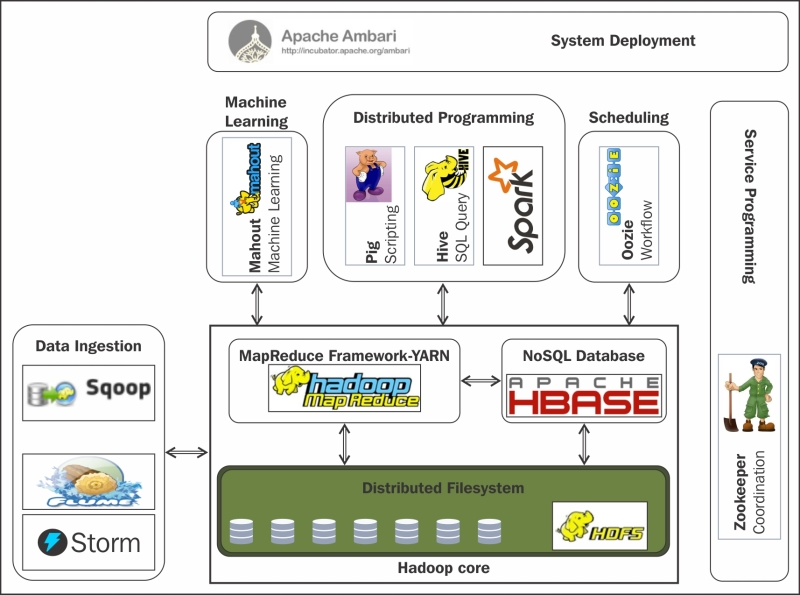
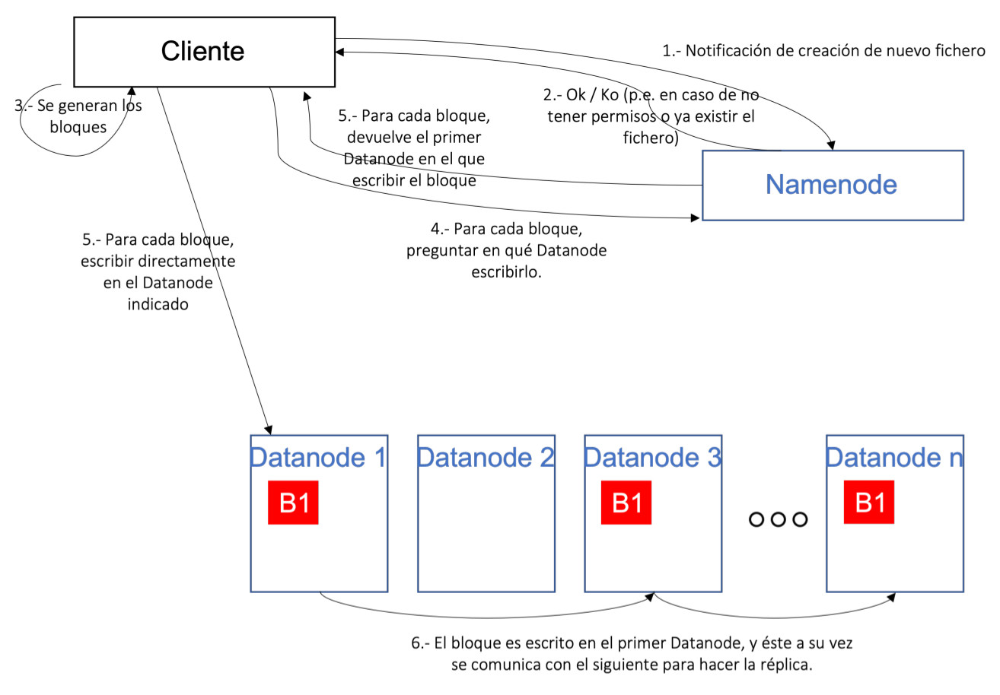

# UD 4 - Apache Hadoop

**Apache Hadoop** es un framework de software que soporta **aplicaciones distribuidas** bajo una licencia libre. Permite a las aplicaciones trabajar con miles de nodos y petabytes de datos.

Fue inicialmente concebido para resolver un problema de escalabilidad en Nutch, un motor de búsqueda Open Source que pretendía indexar mil millones de páginas web.

<figure style="align: center; width:600px;">
    
    <figcaption>Figura 4.1: Figura4.1_Componentes básicos de Hadoop</figcaption>
</figure>

Al mismo tiempo, Google había publicado los documentos que describían su novedoso sistema de archivos distribuidos, el Google File System (GFS), y MapReduce, un framework de computación para procesamiento paralelo. La exitosa implementación de estos conceptos en Nutch resultó en dos proyectos separados, el segundo se convirtió en Hadoop, un proyecto Apache de primera clase.

!!! Note "**Hadoop**"

    El nombre de Hadoop no es ningún acrónimo, sino un nombre inventado. Su creador se lo puso por un elefante amarillo de peluche que tenía su hijo. Pensó que un nombre corto, relativamente fácil de deletrear y pronunciar sería adecuado

Si Big Data es la filosofía de trabajo para grandes volúmenes de datos, [Apache Hadoop](http://hadoop.apache.org/) es la tecnología catalizadora. **Hadoop** puede escalar hasta miles de ordenadores creando un clúster con un almacenamiento del orden de petabytes de información.

!!! info "¿Qué es Hadoop?"

    Apache Hadoop es una **plataforma opensource** que ofrece la capacidad de **almacenar y procesar**, a "bajo" **coste**, grandes **volúmenes** de datos, sin importar su **estructura**, en un entorno **distribuido, escalable y tolerante a fallos**, basado en la utilización de hardware commodity y en un paradigma del **procesamiento a los datos**. 

Hadoop es una **plataforma**, lo que significa que es la base sobre la que construir aplicaciones. Se podría hacer el símil de Hadoop como una caja de herramientas que proporciona un conjunto de herramientas con las que construir una gran variedad de aplicaciones que requieran almacenar y procesar grandes volúmenes de datos. La selección de qué herramienta utilizar para cada aplicación la realizaremos en función de las necesidades de cada caso de uso.

Otras soluciones, como MongoDB u otras bases de datos NoSQL no se consideran plataformas, ya que tienen un único propósito y ofrecen un tipo de funcionalidad.

Hadoop aglutina una serie de **herramientas** para el procesamiento distribuido de grandes conjuntos de datos a través de clústers de ordenadores utilizando modelos de programación sencillos.

Sus características son:

- **Confiable**: Crea múltiples copias de los datos de manera automática y, en caso de fallo, vuelve a desplegar la lógica de procesamiento.
- **Tolerante a fallos**: Tras detectar un fallo aplica una recuperación automática. Cuando un componente se recupera, vuelve a formar parte del clúster. En Hadoop los fallos de hardware se tratan como una regla, no como una excepción.
- **Heterogeneo**: Los datos que pueden almacenarse y procesarse en Hadoop pueden ser de cualquier tipo: estructurados, semiestructurados o datos no estructurados.

<figure style="align: center;">
    
    <figcaption>Figura4.2_Hadoop: Datos heterogéneos</figcaption>
</figure>

- **Portable**: Se puede instalar en todo tipos de hardware y sistemas operativos.
- **Escalable**: Los datos y su procesamiento se distribuyen sobre un clúster de ordenadores (escalado horizontal), desde un único servidor a miles de máquinas, cada uno ofreciendo computación y almacenamiento local.

<figure style="align: center;">
    
    <figcaption>Figura4.3_Hadoop: Escalable</figcaption>
</figure>

- **Distribuido**: Hadoop se basa en una infraestructura que tiene muchos servidores (también llamados nodos) que trabajan conjuntamente para almacenar y para procesar los datos, a diferencia de los sistemas centralizados, donde todo se realiza en un único servidor.

## 4.1 Componentes y Ecosistema

<figure style="align: center; width:600px;">
    
    <figcaption>Figura4.4_Ecosistema Hadoop</figcaption>
</figure>

El **núcleo de Hadoop** se compone de:

- **Hadoop Common**: un conjunto de utilidades comunes
- **HDFS (Hadoop Distributed File System)**: un sistema de ficheros distribuidos (**capa de almacenamiento**) que almacena los datos en una estructura basada en espacios de nombres (directorios, subdirectorios, etc)
- **YARN**: un gestor de recursos (**capa de procesamiento**) para el manejo del clúster y la planificación de procesos, que permite ejecutar aplicaciones sobre los datos almacenados en HDFS
- **MapReduce**: un sistema para procesamiento paralelo de grandes conjuntos de datos, con aplicaciones que lo utilizan de forma transparente.

!!! note 

    Sin embargo, normalmente se identifica el nombre Hadoop con todo el ecosistema de componentes independientes que suelen incluirse para dotar a Hadoop de funcionalidades necesarias en proyectos Big Data empresariales, como puede ser la ingesta de información, el acceso a datos con lenguajes estándar, o las capacidades de administración y monitorización.
    Estos componentes suelen ser proyectos opensource de Apache.. 

Estos elementos permiten trabajar casi de la misma forma que si tuviéramos un sistema de fichero local en nuestro ordenador personal, pero realmente los datos están repartidos entre miles de servidores.

Las aplicaciones se desarrollan a alto nivel, sin tener constancia de las características de la red. De esta manera, los científicos de datos se centran en la analítica y no en la programación distribuida.

Sobre este conjunto de herramientas existe un ecosistema "infinito" con tecnologías que facilitan el acceso, gestión y extensión del propio Hadoop.

- [Accumulo](https://accumulo.apache.org/): Base de datos NoSQL que ofrece funcionalidades de acceso aleatorio y atómico.
- **[Ambari](https://ambari.apache.org/)**: Herramienta utilizada para instalar, configurar, mantener y monitorizar Hadoop.
- [Atlas](https://atlas.apache.org/): Herramienta de gobierno de datos de Hadoop.
- [Phoenix](https://phoenix.apache.org/): Capa que permite acceder a los datos de HBase mediante interfaz SQL.
- **[Flume](https://flume.apache.org/)**: Servicio distribuido y altamente eficiente para distribuir, agregar y recolectar grandes cantidades de información procedentes de sistemas _real-time_ en Hadoop. Es útil para cargar y mover información como ficheros de logs, datos de Twitter/Reddit, etc. Utiliza una arquitectura de tipo streaming con un flujo de datos muy potente y personalizables
- **[HBase](https://hbase.apache.org/)**: Es el sistema de almacenamiento NoSQL basado en columnas para Hadoop.
    - Es una base de datos de código abierto, distribuida y escalable para el almacenamiento de Big Data.
    - Escrita en Java, implementa y proporciona capacidades similares sobre Hadoop y HDFS.
    - El objetivo de este proyecto es el de trabajar con grandes tablas, de miles de millones de filas y columnas, sobre un clúster Hadoop.
- **[Hive](https://hive.apache.org/)**: Permite acceder a ficheros de datos estructurados o semiestructurados que están en HDFS como si fueran una tabla de una base de datos relacional, utilizando un lenguaje similar a SQL (_HiveSQL_). Simplifica enormemente el desarrollo y la gestión con Hadoop.
- **[Impala](https://impala.apache.org/)**: Herramienta con funcionalidad similar a Hive (tratamiento de los datos de HDFS mediante SQL) pero con un rendimiento elevado (tiempos de respuesta menores).
- **[Kafka](https://kafka.apache.org/)**: Sistema de mensajería que permite recoger eventos en tiempo real así como su procesamiento.
- [Mahout](https://mahout.apache.org/): Conjunto de librerías para desarrollo y ejecución de modelos de machine learning utilizando las capacidades de computación de Hadoop.
- **[Oozie](https://oozie.apache.org/)**: Herramienta que permite definir flujos de trabajo en Hadoop así como su orquestación y planificación.
- **[Pig](https://pig.apache.org/)**: Lenguaje de alto de nivel para analizar grandes volúmenes de datos. Trabaja en paralelo, lo que permite gestionar gran cantidad de información. Realmente es un compilador que genera comandos MapReduce, mediante el lenguaje textual denominado Pig Latin.
- **[Spark](https://spark.apache.org/)**: Aunque habitualmente no se asocia al ecosistema Hadoop, Apache Spark ha sido el mejor complemento de Hadoop en los últimos años. Apache Spark es un motor de procesamiento masivo de datos muy eficiente a gran escala que ofrece funcionalidades para ingeniería de datos, machine learning, grafos, etc. _Implementa procesamiento en tiempo real al contrario que MapReduce, lo que provoca que sea más rápido_. Para ello, en vez de almacenar los datos en disco, trabaja de forma masiva en memoria. Puede trabajar de forma autónoma, sin necesidad de Hadoop.
- **[Sqoop](https://sqoop.apache.org/)**: Componente para importar o exportar datos estructurados desde bases de datos relacionales a Hadoop y viceversa.
- [Storm](https://storm.apache.org/): Sistema de procesamiento real-time de eventos con baja latencia.
- [Zeppelin](https://zeppelin.apache.org/): Aplicación web de notebooks que permite a los Data Scientists realizar análisis y evaluar código de forma sencilla, así como la colaboración entre equipos.
- **[ZooKeeper](https://zookeeper.apache.org/)**: Herramienta técnica que permite sincronizar el estado de los diferentes servicios distribuidos de Hadoop.

## 4.2 Distribuciones Hadoop

No te preocupes si ves muchos componentes y piensas que es imposible dominar todos. En la realidad, los proyectos suelen utilizar sólo una pequeña parte de los componentes dependiendo de las necesidades. En negrita encuentras los más utilizados, además de los componentes core: HDFS y YARN.

Cada componente es un proyecto Apache independiente, lo que impacta, entre otros a:

- **Política de versionado (periodicidad, identificación, …)**: cada componente sigue su propio camino en cuanto a cuándo se publican las nuevas versiones, qué mejoras o evoluciones incluyen, etc.
- **Dependencias del proyecto con otras versiones de componentes del ecosistema y librerías externas**: los componentes suelen tener dependencias entre ellos. Por ejemplo, Hive tiene dependencia de HDFS, o Phoenix de HBase. Las dependencias suelen ser difíciles de gestionar, por ejemplo, porque una versión de Phoenix requiere una versión específica de HBase.
- **Roadmap y estrategia del proyecto**: al tener grupos de trabajo diferentes, cada proyecto tiene su propia estrategia en cuanto a cómo evolucionar la solución, cuándo adaptarse a cambios externos, etc. y no siempre están alineados.
- **Commiters / desarrolladores**: los desarrolladores de cada proyecto son diferentes.

Por este motivo, realizar una instalación de toda una plataforma Hadoop con sus componentes asociados de forma independiente (lo que se denomina Hadoop Vanila) resulta muy complicado. Por ejemplo, al instalar la versión X de Phoenix necesitas la versión Y de HBase, pero otro componente (Hive, por ejemplo), requiere la versión Z de HBase.

La misma dificultad ocurre para la **resolución de incidencias** que puedan ocurrir en la plataforma cuando se ejecuta en producción.

Para solventar las dificultades mencionadas, surgen las **distribuciones comerciales de Hadoop**, que contienen en un único paquete la mayor parte de componentes del ecosistema, resolviendo dependencias, añadiendo incluso utilidades, e incorporando la posibilidad de contratar soporte empresarial 24x7

### 4.2.1 Distribuciones: Cloudera

!!! note inline end

    **Cloudera** es la principal distribución que existe actualmente (hubo otras, como MAPR y HortonWorks, pero desaparece MAPR y Hortonworks se une a Cloudera)

Utiliza la mayor parte de componentes de Apache, en algún caso realizando algunas modificaciones, y añade algún componente
propietario (Cloudera Manager, Cloudera Navigator, etc.). _[CDN Cloudera](https://www.cloudera.com/products/open-source/apache-hadoop/key-cdh-components.html)_ y como [descargarlo](https://www.cloudera.com/downloads/cdh.html)

<figure style="align: center;">
    
    <figcaption>Distribución Cloudera. Fuente: Cloudera</figcaption>
</figure>

!!! note "CDH Cloudera" 

    **CDH (Cloudera’s Distribution including Apache Hadoop)** es la distribución de Cloudera con Apache Hadoop orientada a empresas. La última versión es Cloudera 6 (CDH 6). Está disponible como paquetes RPM y paquetes para Debian, Ubuntu o Suse. Cloudera proporciona CDH en varias modalidades.

    La versión más completa y empresarial es Cloudera Enterprise, que incluye suscripciones por cada nodo del clúster, Cloudera Manager y el soporte técnico. Por otro lado, Cloudera Express es una versión más sencilla, sin actualizaciones o herramientas de disaster recovery. Por último, existe una versión gratuita de CDH: Cloudera Community. Permite desplegar un clúster con un número de nodos limitado.

    Es posible ejecutar Cloudera desde un contenedor Docker. Proporciona una imagen Docker con CDH y Cloudera Manager que sirve como entorno para aprender Hadoop y su ecosistema de una forma sencilla y sin necesidad de Hardware potente. También es útil para desarrollar aplicaciones o probar sus funcionalidades.

### 4.2.2 Soluciones Cloud Computing

- **Amazon Elastic Map Reduce (EMR)**
    - [Sitio Oficial](https://aws.amazon.com/es/emr/)
    - [¿Qué es Amazon EMR?](https://docs.aws.amazon.com/es_es/emr/latest/ManagementGuide/emr-what-is-emr.html)
- **Microsoft Azure HDInsight**
    - [Sitio Oficial](https://azure.microsoft.com/es-es/products/hdinsight/)
    - [¿Qué es Azure HDInsight?](https://learn.microsoft.com/es-es/azure/hdinsight/hdinsight-overview)
- **Google Dataproc**
    - [Sitio Oficial](https://cloud.google.com/dataproc?hl=es)
    - [¿Qué es Dataproc?](https://cloud.google.com/dataproc/docs/concepts/overview?hl=es-419)

## 4.3 Arquitectura

Hadoop se basa en un modelo de despliegue distribuido y está diseñado para ejecutar sistemas de procesamiento en el mismo clúster que almacena los datos (_data local computing_). 

Pese a que hay un conjunto de servidores trabajando en paralelo y de forma conjunta, para un usuario externo todos ellos actúan como si fuera una sola máquina, es decir, un usuario del sistema de ficheros (**HDFS**) verá la estructura de directorios, subdirectorios y ficheros, pero no tendrá que conocer en qué servidores está cada fichero (lo mismo ocurre con cualquier otro componente que se ejecuta en toda la infraestructura)

**Su filosofía es almacenar todos los datos en un lugar y procesarlos en el mismo lugar, esto es, mover el procesamiento al almacén de datos y no mover los datos al sistema de procesamiento.**

!!! note inline end

    **Cluster y Nodo:** Al conjunto de servidores que trabajan para implementar las funcionalidades de Apache Hadoop se le denomina **clúster**, y a cada uno de los servidores que forman parte del clúster se le denomina **nodo**.
    A partir de ahora, cuando usemos la palabra "clúster de Hadoop" debes pensar en el conjunto de servidores que forman la plataforma que está en ejecución, y cuando usemos la palabra "nodo" debes pensar en cada uno de los servidores que componen el clúster.

Esto lo logra mediante un entorno distribuido de datos y procesos. El procesamiento se realiza en paralelo a través de nodos de datos en un sistema de ficheros distribuidos (HDFS), donde se distingue entre:

- Nodos **worker**: Realizan los trabajos. Tratan con los datos locales y los procesos de aplicación. Por ejemplo, para el almacenamiento, cada worker se ocupará de almacenar una parte, mientras que para la ejecución de trabajos, cada worker realiza una parte del trabajo. Su número dependerá de las necesidad de nuestros sistemas, pero pueden estar comprendido entre 4 y 10.000. Su hardware es relativamente barato (_commodity hardware_) mediante servidores X86.
- Nodos **master**: Encargados de los procesos de gestión global, es decir, controlar la ejecución o el almacenamiento de los trabajos y/o datos. Son los nodos que controlan el trabajo que realizan los nodos worker, por ejemplo, asignando a cada worker una parte del proceso o de los datos a almacenar, vigilando que están realizando el trabajo y no están caídos, rebalanceando el trabajo a otros nodos en caso de que un worker tenga problemas, etc. Normalmente se necesitan 3.
- Nodos **edge**: Hacen de puente entre el clúster y la red exterior y proporcionan interfaces, ya que normalmente un clúster Hadoop no tiene conexión con el resto de servidores e infraestructura de la empresa, por lo que toda la comunicación desde el exterior hacia el clúster se canaliza a través de los nodos frontera, que además, ofrecen las APIs para poder invocar a servicios del clúster.

<figure style="align: center;">
    
    <figcaption>Arquitectura Hadoop</figcaption>
</figure>

El hardware típico donde se ejecuta un cluster Hadoop sería:

!!! note inline end

    **Commodity Hardware:** A veces el concepto hardware commodity suele confundirse con hardware doméstico, cuando lo que hace referencia es a hardware no específico, que no tiene unos requerimientos en cuanto a disponibilidad o resiliencia exigentes

- Nodos _master_: 12 HDs x 2-3 TB JBOD (_Just a bunch of disks = sólo un montón de discos_) - 2CPUs x 8 cores - 256 GB RAM
- Nodos _worker_: 2 HDs x 2-3 TB RAID - 2CPUs x 8 cores - 256 GB RAM
- Nodos _edge_: 2 HDs x 2-3 TB RAID - 2CPUs x 8 cores - 256 GB RAM

## 4.4 Uso de Hadoop

Es importante analizar y tener en cuenta en que casos reales es aconsejable el uso de Hadoop y cuando no lo es.

### ¿Cuándo Usar Hadoop?

- Cuando el **volumen** de datos es mayor que la capacidad de los sistemas tradicionales (no cabe en una máquina).
- Cuando hay un problema de **variedad** de datos, porque son diversos o porque cambian frecuentemente.
- Cuando se requiere una **escalabilidad** que no pueden ofrecer los sistemas tradicionales, por volumen, por velocidad de proceso, por rendimiento global, y no se requiere un nivel de transaccionalidad elevado.
- Cuando se pretende tener **una plataforma** con la capacidad de almacenamiento y procesamiento de un gran volumen de datos para cubrir diferentes casos de uso (con la misma plataforma).
### ¿Cuándo no usar Hadoop?

- Cuando los sistemas tradicionales son capaces de dar soporte a los casos de uso y cuando los formatos/tipos de datos son fijos o no cambian apenas.
- Cuando se tiene requisitos de transaccionalidad muy estrictos, es decir, cuando se pretende cubrir la operativa de una empresa (por ejemplo, en un banco: las transferencias, movimientos, pagos, etc.).
- Cuando sólo se requiere resolver un caso de uso "Big Data" muy específico.

## 4.5 HDFS

**Hadoop Distributed File System (HDFS)** Es el componente principal del ecosistema Hadoop. Hace posible almacenar conjuntos de datos masivos con tipos de datos estructurados, semi-estructurados y no estructurados como imágenes, vídeo, datos de sensores, etc.

Es un sistema de almacenamiento distribuido y tolerante a fallos que puede almacenar gran cantidad de datos, escalar de forma incremental y sobrevivir a fallos de hardware sin perder datos. Se basa en el [paper](https://static.googleusercontent.com/media/research.google.com/es//archive/gfs-sosp2003.pdf) que publicó Google detallando su Google File System en 2003.

Está optimizado para obtener un alto rendimiento y trabajar con máxima eficiencia cuando se leen _archivos grandes_. Para obtener este rendimiento, utiliza tamaños de bloque inusualmente grandes y optimización de localización de los datos para reducir la E/S de red.

Con el fin de ofrecer una visión de los recursos como una sola unidad crea una capa de abstracción como un sistema de ficheros único. **Está basado en la idea de que mover el procesamiento es mucho más rápido, fácil y eficiente que mover grandes cantidades de datos, que pueden producir altas latencias y congestión en la red**.

### 4.5.1 Características HDFS

- **Es un sistema de ficheros distribuido**, es decir, se ejecuta sobre diferentes nodos que trabajan en conjunto ofreciendo a los usuarios y aplicaciones que utilizan el sistema, un interfaz como si sólo hubiera un único servidor por detrás.
- Está diseñado para ejecutarse sobre **hardware commodity**, es decir, no requiere unos servidores específicos o costosos. Esto conlleva la necesidad de poder sobreponerse a los fallos que pudieran tener los servidores o algunas partes de los servidores.
- Está optimizado para almacenar **ficheros de gran tamaño** y para hacer operaciones de lectura o escritura masivas. Su objetivo es cubrir los casos de uso de analítica masiva, no los casos de uso que dan soporte a las operaciones de las empresas.
- Tiene capacidad para **escalar horizontalmente** hasta volúmenes de Petabytes y miles de nodos, y está diseñado para poder dar soporte a **múltiples clientes** con acceso concurrente. La escalabilidad se consigue añadiendo más servidores
- No establece **ninguna restricción sobre los tipos de datos** que se almacenan en el sistema, ya que éstos pueden ser estructurados, semiestructurados o no disponer de ninguna estructura, como el caso de imágenes o vídeos.
- HDFS tiene una orientación **"write-once, read many"**, que significa "se escribe una vez, se lee muchas veces", es decir, asume que un archivo una vez escrito en HDFS **no se modificará**, aunque se puede acceder a él muchas veces. Así pues, los datos, una vez escritos en HDFS son _immutables_. Cada fichero de HDFS solo permite añadir contenido (append-only). Una vez se ha creado y escrito en él, solo podemos añadir contenido o eliminarlo. Es decir, a priori, no podemos modificar los datos.

_Recuerda las características con esta imagen_

<figure style="align: center; width:600px;">
    
    <figcaption>Figura4.7_Características HDFS</figcaption>
</figure>

### 4.5.2 Bloques

Un bloque es la cantidad mínima de datos que puede ser leída o escrita. En HDFS, los ficheros se dividen en bloques, como en la mayoría de sistemas de ficheros. Sin embargo, el **tamaño de un bloque en HDFS es** muy grande, **de 128 megabytes por defecto**. En el sistema operativo de un PC (Windows, Linux, etc.), el tamaño suele ser de 512 bytes o 4 kilobytes, es decir, unas 50.000 veces más pequeño que en HDFS.

_El bloque es la unidad mínima de lectura_, lo que significa que aunque tengamos un fichero que ocupa 1 kilobyte, tendremos que leer o escribir 128 megabytes cada vez que queramos operar con el fichero. Para ficheros grandes, por ejemplo, de 500 gigabytes, la ventaja que aporta es que hay que buscar y leer o escribir muchos menos bloques. Esta característica explica por qué Hadoop está diseñado para ficheros grandes y lecturas masivas, y por qué tiene un mal rendimiento para operaciones pequeñas.

Por lo tanto, cuando queremos escribir un fichero en HDFS, lo primero que se hace es dividir el fichero en bloques. A continuación, los bloques son almacenados en diferentes nodos, no siendo necesario que los bloques de un mismo fichero estén en un mismo nodo. Además, un aspecto importante es que cada bloque se replica (se copia) en más de un nodo, lo que se conoce como el **factor de replica**. _El factor de replica por defecto en HDFS es 3_, lo que significa que cada bloque tiene 3 copias almacenadas en 3 nodos diferentes. **La replicación es el mecanismo con el que se consigue, entre otras cosas, la tolerancia a fallos**.

Al tener varias réplicas de cada bloque en diferentes nodos, en caso de que un nodo se caiga, o que un disco de un nodo se corrompa, HDFS dispondrá de otras copias, por lo que no se perderán los datos. 

<figure style="align: center;width:600px;">
    
    <figcaption>Figura4.8_Bloques HDFS</figcaption>
</figure>

En el ejemplo anterior, si se cayera el nodo 3, HDFS dispondría de otras dos copias por cada bloque que almacena del fichero.

<figure style="align: center;width:800px;">
    
    <figcaption>Figura4.9_Factor Replicación HDFS</figcaption>
</figure>

El factor de replica puede configurarse a nivel de fichero o directorio, es decir, podemos elegir un factor de replica diferente para los ficheros o directorios que consideremos. Cuanto mayor sea el factor de replica, más difícil será que perdamos los datos e incluso mejorará el rendimiento en las lecturas, porque para leer un bloque, HDFS podrá utilizar cualquier nodo. Sin embargo, un factor de replica alto hace que las escrituras tengan peor rendimiento, al tener que hacer muchas copias en cada escritura, y además, consumirá más espacio real en disco.

### 4.5.3 Arquitectura HDFS

La arquitectura de HDFS consta de distintos servicios y tipos de nodo, aunque fundamentalmente son tres tipos:

- **NameNode**(NN): Nodo de Nombres.
- **Secondary NameNode**(SNN): Nodo de Nombres Secundario.
- **DataNode**(DN): Nodos de Datos

**NameNode**

El nodo Namenode actúa de maestro, manteniendo la metainformación de todo el sistema de ficheros, esto es:

- Almacena el espacio de nombres HDFS
- La estructura de directorios, subdirectorios y los ficheros
- La información de los ficheros: tamaño, fecha de modificación, propietario, permisos, etc.
- El factor de replica de cada fichero.
- Los bloques que componen cada fichero.
- La ubicación de los distintos bloques (en qué nodo se encuentran).

!!! note inline end

    _La información es almacenada tanto en disco, para garantizar la durabilidad en caso de una caída del servidor, como en memoria, para poder acceder a la información lo más rápido posible y optimizar el rendimiento._

NameNode se compone principalmente de dos ficheros:

- **FsImage:** Contiene la estructura de directorio completa (espacio de nombres) de HDFS con detalles sobre la ubicación de los datos en los bloques de datos y qué bloques están almacenados en qué nodo. NameNode utiliza este archivo cuando se inicia.
- **EditLog:** Es un _registro de transacciones_ que registra los cambios en el sistema de archivos HDFS o cualquier acción realizada en el clúster HDFS, como la adición de un nuevo bloque, la replicación, la eliminación, etc. En resumen, registra los cambios desde que se creó la última FsImage

Cuando se inicia un NameNode, lee el estado HDFS de un archivo de imagen, fsimage, y luego aplica las ediciones del archivo de registro de ediciones. Seguidamente escribe un nuevo estado HDFS en el fsImage y comienza la operación normal con un archivo de edición vacío.

!!! example

    Por ejemplo, la creación de un nuevo archivo en HDFS hace que NameNode inserte un registro en EditLog para indicarlo. De manera similar, cambiar el factor de replica de un archivo hace que se inserte un nuevo registro en EditLog. El NameNode utiliza un archivo en su sistema de archivos del sistema operativo anfitrión local para almacenar el EditLog. Todo el espacio de nombres del sistema de archivos, incluida la asignación de bloques a archivos y las propiedades del sistema de archivos, se almacena en un archivo denominado FsImage. La FsImage también se almacena como un archivo en el sistema de archivos local de NameNode.

Además de gestionar la **metainformación**, **coordina** todas las **lecturas** y **escrituras**, y controla el funcionamiento de los Datanodes, es decir, detecta si hay algún fallo en algún nodo y toma las acciones necesarias en caso de que alguno esté caído o con fallos.

Es importante que el Namenode sea robusto y no tenga caídas. Por este motivo, se utiliza hardware más resiliente que en el caso de los Datanodes.

**Secondary NameNode**

Para mejorar la **tolerancia a fallos**, suele existir un nodo secundario del maestro, denominado **Secondary Namenode**.

El NameNode es el único punto de fallo en HDFS ya que, si el Namenode falla, se pierde todo el sistema de archivos HDFS. Para reducir este riesgo esto, Hadoop implementó el Secondary Namenode en la versión 3.

Secondary Namenode no es un **nodo de respaldo**. Su principal función es almacenar una copia de los ficheros ***fsimage*** y ***editlog***. Comprueba los metadatos del sistema de archivos almacenados en NameNode. Esto es lo que se llama _checkpointing_. El proceso que sigue el NameNode secundario para fusionar periódicamente los archivos fsimage y edits log es el siguiente:

1. El NameNode secundario obtiene los últimos archivos fsImage y editLog del NameNode primario.
2. El NameNode secundario aplica cada transacción del archivo editLog a fsImage para crear un nuevo archivo FsImage fusionado.
3. El archivo fsImage fusionado se transfiere de nuevo al NameNode primario.

<figure style="align: center;">
    
    <figcaption>Figura4.10_Relación entre NameNode y DataNode</figcaption>
</figure>

**DataNode**

Los **Datanodes** son los servicios que se encuentran en los **nodos worker**, y su labor principal es almacenar o leer los bloques que componen los ficheros que están almacenados en HDFS, con las siguientes particularidades:

- Habrá más de uno en cada clúster. Por cada Namenode podemos tener miles de Datanodes.
- Almacena y lee bloques de datos. El Datanode sólo conoce los bloques que contiene, pero no sabe a qué fichero pertenecen o dónde se encuentran el resto de bloques del fichero. Toda esta información sólo está en el Namenode. Por eso es crítico para HDFS.
- Envían al Namenode la lista de los bloques que almacenan, para que el Namenode pueda tener una lista actualizada de los bloques y su ubicación.
- Almacenan un checksum por cada bloque para detectar si el bloque
está corrupto y garantizar su integridad.
- Envía un latido (_heartbeat_) al Namenode, que es un mensaje corto indicando que está levantado

**Resumen**

<figure style="align: center;">
    
    <figcaption>Figura4.11_Resumen Nodos HDFS</figcaption>
</figure>

### 4.5.4 Funcionamiento (Lectura y Escritura)

Los datos que se escriben en HDFS son ***immutables***, es decir, no pueden ser modificados.

Esto significa que HDFS sólo permite añadir contenido a los ficheros, así que por ejemplo, si en un fichero de 256 megabytes se pretende modificar un carácter, HDFS creará un nuevo bloque con el cambio y lo escribirá por completo, borrando el bloque anterior. 

Esto, junto con la característica del tamaño de bloque de **128 megabytes**, que es la **unidad mínima de lectura**, hace que el rendimiento de HDFS para operaciones sencillas sobre registros aleatorios sea muy pobre. Recuerda que HDFS está pensado para _ficheros grandes y lecturas masivas_. 

HDFS proporciona dos tipos de operaciones básicas con los ficheros: **leer y escribir un fichero**

**Lectura**

En el caso de las lecturas, un ***esquema simplificado*** de esta operación sería:

<figure style="align: center;">
    
    <figcaption>Figura4.12_Lectura HDFS</figcaption>
</figure>

1. El cliente que desea leer un fichero de HDFS, mediante una librería instalada en su equipo, realiza una llamada al Namenode para conocer qué bloques forman un fichero (llamemos X al fichero), así como los Datanodes que contienen cada uno de los bloques.
2. El Namenode retorna dicha información, y ordena para cada bloque los Datanodes que contienen dicho bloque en función de la distancia al cliente (un algoritmo evalúa la distancia entre el cliente y cada Datanode). El objetivo de esta lista ordenada es intentar reducir el tiempo de acceso a cada Datanode desde el cliente.
3. Con la información recibida del Namenode, el cliente se comunica directamente con el Datanode 1 para solicitarle el primer bloque.
4. El cliente se comunica con el Datanode 2 para obtener el bloque 2.
5. El cliente se comunica con el Datanode 1 para obtener el bloque 3. 

!!! info

    Es preciso indicar que durante la operación, la única responsabilidad del Namenode es devolver al cliente la lista de bloques y la ubicación de los mismos, pero no interviene en las lecturas. Es decir, para realizar las lecturas de cada bloque, **el cliente se comunica directamente con los Datanodes, sin que los datos pasen por el Namenode**. Esto hace que el Namenode no sea cuello de botella del proceso, y pueda atender múltiples peticiones en paralelo, ya que no le supone mucho esfuerzo de computación atender las diferentes solicitudes de los clientes.

**Escritura**

En el caso de las escrituras, un esquema simplificado de esta operación sería:

<figure style="align: center;">
    
    <figcaption>Figura4.13_Escritura HDFS</figcaption>
</figure>

1. El cliente, que desea escribir un fichero, invoca a un servicio del Namenode para solicitar la creación del fichero, indicándole en la llamada el nombre y la ruta en la que desea guardarlo.
2. El Namenode realiza una serie de verificaciones, como los permisos del usuario/cliente en el directorio, si el fichero ya existe, etc. En caso de que todas las verificaciones sean correctas, devuelve un OK, en caso contrario un KO.
3. El cliente comienza a generar los bloques en los que se dividirá el fichero utilizando una librería de HDFS.
4. Para cada bloque que desea escribir el cliente, se invoca al Namenode para obtener el Datanode en el que escribir el bloque.
5. El Namenode devuelve la lista de Datanodes en los que escribir el bloque, y el cliente escribe dicho bloque en el primer Datanode obtenido, realizando una comunicación directamente con dicho Datanode.
6. Una vez escrito el bloque en el primer Datanode, éste es responsable de comunicarse con el siguiente Datanode en la cadena para que escriba una copia del bloque. Una vez todos los Datanodes han escrito la réplica, se devuelve un "Ok" al cliente para que escriba el siguiente bloque.

!!! info

    Al igual que en el caso de la lectura, es importante señalar que el Namenode no recibe en ningún momento los datos del fichero, sino que se limita a resolver las cuestiones relacionadas con la ubicación de cada bloque. De esta manera, liberando al Namenode de la operativa de escritura, permite optimizar el funcionamiento y que el Namenode no se convierta en el cuello de botella de HDFS en las escrituras de fichero.

### 4.5.5 Factor de replica

Como sabemos, la replicación es un concepto muy importante en HDFS, ya que nos permite tener una mayor tolerancia a fallos, pero tiene otras implicaciones en cuanto al rendimiento como acabamos de ver.

Sin embargo, tiene una implicación directa en la capacidad de almacenamiento. Veámoslo.

En un clúster, la capacidad de almacenamiento total viene dado por la suma de la capacidad de todos los discos que hay en los Datanodes. Por ejemplo, en un clúster de 20 nodos, con 12 discos de 3 terabytes por nodo, tendremos una capacidad de 36 terabytes por nodo, y 720 terabytes en total.

Ahora bien, si todos los ficheros de HDFS van a tener un factor de
replicación 3 significará que cada fichero ocupará el triple, al haber 3 copias para cada datos. Esto hace que la capacidad total del clúster baje hasta 240 terabytes.

Además, cuando calculamos la capacidad real de un clúster, hay que dejar otro espacio para que las aplicaciones o los usuarios puedan guardar datos parciales de sus operaciones, logs, etc. Normalmente se reserva un 30 o 40% para este propósito, así que nuestro clúster de 20 nodos y 36 terabytes por nodo, tendrá una capacidad real de unos 150 terabytes. Sigue siendo una capacidad alta, _pero está lejos de los 720 terabytes iniciales_.

Con esto, podemos afirmar por lo tanto que:

- Un factor de replica alto:
  * Mejora la tolerancia a fallos.
  * Mejora la velocidad de lectura porque se pueden utilizar más Datanodes para recuperar un bloque.
  * Reduce la velocidad de las escrituras porque cada bloque hay que almacenarlo en más Datanodes.
  * Reduce la capacidad total de almacenamiento de un clúster.

- Un factor de replica bajo:
  * Incrementa el riesgo de perder algún dato si se corrompen los Datanodes que almacenan un bloque.
  * Reduce la velocidad de lectura porque hay que leer cada bloque de uno o pocos Datanodes que lo contienen, y a lo mejor esos Datanodes están ocupados con otras operaciones.
  * Incrementa la velocidad de escritura, al tener que escribir cada bloque en pocos Datanodes.
  * Incrementa (o mejor dicho, reduce menos) la capacidad total de almacenamiento del clúster.

Con estos puntos enumerados, normalmente se aplican estas reglas para calcular el **factor de replica óptimo**:

- Para datos temporales, que se van a escribir y quizás no se lean nunca, y que no son críticos, el factor de replica suele ser bajo (1 ó 2).
- Para datos críticos, que es importante que no se puedan perder, y que suelen ser accedidos muchas veces, como por ejemplo una tabla maestra, el factor de replica suele ser alto (incluso teniendo una copia por cada Datanode si es accedida muchas veces y no ocupa mucho).
- Para el resto de ficheros, se suele dejar el factor de replica por defecto.

### 4.5.6 Manejo y uso de HDFS

!!! example inline end

    Para una primera aproximación y para empezar a familiarizarnos con Apache Hadoop y HDFS usaremos la siguiente [imagen de Cloudera](https://bit.ly/3k3bmWx) _(Necesitas pertenecer a IES Gran Capitán)_

HDFS soporta operaciones similares a los sistemas Unix:

- Lectura, escritura o borrado de ficheros.
- Creación, listado o borrado de directorios.
- Usuarios, grupos y permisos.

En cuanto a los interfaces con los que poder usar el sistema de ficheros, ofrece diferentes interfaces, siendo los principales los mencionados a continuación:

- **Cliente de línea de comandos**: HDFS dispone de un amplio número de comandos que pueden ser ejecutados en consola. 
- **Java API**: HDFS está escrito en Java de forma nativa y ofrece un API que puede ser utilizado por aplicaciones con el mismo lenguaje.
- **RestFul API(WebHDFS)**: para poder utilizar HDFS desde otros lenguajes, HDFS ofrece su funcionalidad mediante un servicio HTTP mediante el protocolo WebHDFS. Este interfaz, sin embargo, ofrece un rendimiento inferior al API de Java al utilizar HTTP como capa de transporte, por lo que no debería utilizarse para operaciones masivas o con alto volumen de datos.
- **NFS interface (HDFS NFS Gateway)**: es posible montar HDFS en el sistema de archivos de un cliente local utilizando la puerta de enlace NFSv3 de Hadoop.
- **Librería C**: HDFS ofrece una librería escrita en C, llamada libhdfs, que tiene un buen rendimiento, pero que no suele ofrecer toda la funcionalidad del API Java.

**Cliente de línea de comandos**

Una vez dentro del sistema, el comando _hadoop fs_ nos proporcionará todas las funcionalidades sobre HDFS. Si se introduce sólo el comando, nos ofrecerá la lista de opciones o comandos disponibles. Algunos de los comandos más utilizados son los siguientes:

!!! info inline end

    <figure style="align: center;">
        
        <figcaption>Figura4.14_HDFS DFS</figcaption>
    </figure>

    `hadoop fs` es soportado por cualquier sistema de archivos genérico que puede apuntar a cualquier sistema de archivos como local, HDFS, FTP, S3, etc. En cambio `hdfs dfs` es exclusivo de HDFS y es el usado en las versiones actuales. 

!!! note 

    En la distribución de cloudera, el sistema de archivos local por defecto está localizado en /home/cloudera y la localización por defecto de HDFS es /user/cloudera

En el caso concreto de interactuar con el sistema de ficheros de Hadoop se utiliza el comando dfs, el cual requiere de otro argumento (empezando con un guion) el cual será uno de los comandos Linux para interactuar con el shell. Podéis consultar la lista de comandos en la [documentación oficial](https://hadoop.apache.org/docs/current/hadoop-project-dist/hadoop-common/FileSystemShell.html).

- **Listar contenidos de un directorio**: Para ver los contenidos del directorio HDFS el comando es el siguiente:

    `hdfs dfs -ls /user/cloudera`

- **Crear un directorio**: Para crear un nuevo directorio dentro del sistema de ficheros HDFS.

    `hdfs dfs -mkdir /user/cloudera/prueba`

!!! warning 

    Atención a los permisos necesarios para crear directorios en diferentes puntos del sistema de archivos

- **Copiar un fichero** del sistema de archivos local al sistema de archivos HDFS. Se podrá verificar esa copia mediante el comando     _hdfs dfs -ls_ o mediante la operación cat que se menciona a continuación.

    `hdfs dfs -copyFromLocal /home/cloudera/fichero /user/cloudera`

    _Por defecto, el destino de cualquier operación HJDFS es /user/cloudera, de manera que es opcional especificar esa parte de la ruta salvo que sea diferente a la de por defecto._

- **Visualización del contenido de un archivo**: Para ver el contenido de un archivo ubicado en el sistema de archivo HDFS la operación será la siguiente:

    `hdfs dfs -cat /user/cloudera/prueba/fichero`

- **Extraer un fichero** del sistema de archivos HDFS: Con el fin de copiar a nuestros sistema de archivos local un archivo del sistema de archivos de HDFS se utilizará alguno de los siguientes comandos.
    `hdfs dfs -copyToLocal /user/cloudera/prueba/fichero`
    `hdfs dfs -get /user/cloudera/prueba/fichero`

- **Mover ficheros** dentro de HDFS: Para mover ficheros almacenados en HDFS a otros directorios de HDFS se podría utilizar el siguiente comando:

    `hdfs dfs -mv /user/cloudera/prueba/fichero /user/cloudera/`

    Se permiten múltiples orígenes de ficheros, lo que obliga a que el destino sea un directorio. El movimiento de ficheros entre diferentes sistemas de archivos no está permitido.

- **Copiar ficheros** dentro de HDFS: Copia un fichero entre diferentes localizaciones dentro de HDFS. También, como mv permite copiar desde diferentes orígenes, pero siempre con un directorio de destino final.

    `hdfs dfs -cp -f /user/cloudera/prueba/fichero /user/cloudera/`

    _la opción -f permitirá sobreescribir el destino si éste existe previamente._

- **Put**: Permite copiar uno o varios orígenes desde el sistema de archivos local al sistema de archivos distribuido.

    `hdfs dfs -put /user/cloudera/prueba/fichero /user/cloudera/`

    También permite leer desde la entrada estándar (stdin) y escribe en el sistema de archivos destino.

    `hdfs dfs -put - /user/cloudera/entrada`

- **Añadir contenido al final del fichero**: A veces es necesario hacer operaciones de concatenación de ficheros, etc., para ello existe la operación _appendToFile_ que permite hacer esta operación.
    `hdfs dfs -appendToFile fichero_tail /user/cloudera/fichero`

- **Mezcla de ficheros**: se utiliza para combinar varios archivos (o directorios) del sistema de archivos distribuido y luego ponerlo en un solo archivo de salida en nuestro sistema de archivos local. Dispone de una opción -nl con el fin de añadir una nueva línea al final de cada fichero.

    `hdfs dfs -getmerge -nl file1.txt file2.txt /home/cloudera/output.txt`

- **Borrado de ficheros**: La operación rm permitirá borrar los ficheros especificados como argumentos. Con la opción -R se borrarán el directorio y los subdirectorios de forma recursiva.

    `hdfs dfs -rm -r /user/cloudera/prueba`

- **Cambio de permisos a los ficheros**: De la misma forma que en Linux la operación chmod permitirá realizar cambios en los permisos de uso de los ficheros. Con la opción -R hace que el cambio se propague recursivamente a través de la estructura de directorios.

    `hdfs dfs -chmod -R 777 /user/cloudera/prueba`

- **Comprobar uso de disco**: Servirá para comprobar cuando espacio de disco se está usando en HDFS. Si estamos interesados únicamente en el uso de disco de nuestro directorio de usuario el comando será:

    `hdfs dfs -du`

    Si por el contrario queremos conocer cuando espacio de disco está disponible en todo el cluster, el comando será:

    `hdfs dfs -df`

- **Contar número de directorios**: El siguiente comando permite  obtener la información del número de directorios , ficheros y tamaño de los mismos.

    `hdfs dfs -count /user/cloudera`

- **Crea un fichero vacío**:

    `hdfs dfs -touchz /user/cloudera/emptyfile`

- **setrep**: Modifica el factor de replica de un fichero o un directorio. Ya sabes que el factor de replica por defecto es 3. Con este comando se puede modificar para un fichero o directorio concreto.

    `hdfs dfs -setrep 6 /user/cloudera/changerepfile`

!!! tip "Recuerda"

    Recuerda diferencia entre trabajar con HDFS o trabajar con el disco local de la máquina en la que tienes abierto un terminal, que suele ser el nodo frontera. Este esquema te permitirá ver la diferencia:

    <figure style="align: center;">
        
        <figcaption>Figura4.15_Comandos HDFS</figcaption>
    </figure>

    Cuando accedemos por terminal a una máquina, que suele ser la máquina frontera, y navegamos por su sistema de ficheros, lo estaremos haciendo sobre el disco o los discos que tiene esa máquina. Cuando ejecutamos el comando `hdfs dfs` , éste se ejecutará sobre el sistema de ficheros de HDFS, que es diferente al de la máquina en la que estamos.

    Cuando queremos subir un fichero a HDFS, lo habitual es copiarlo primero en la máquina frontera, y posteriormente subirlo a Hadoop con el comando put.

[figura4.1]: images/Figura4.1_Componentes_básicos_de_Hadoop.png "Figura4.1_Componentes básicos de Hadoop"
[figura4.2]: images/Figura4.2_Hadoop_Caract_datos_heterogeneos.png "Figura4.2_Hadoop: Datos heterogéneos"
[figura4.3]: images/Figura4.3_Hadoop_Caract_escalado.png "Figura4.3_Hadoop: Escalado"
[figura4.4]: images/Figura4.4_Ecosistema_Hadoop.jpg "Figura4.4_Ecosistema Hadoop"
[figura4.5]: images/Figura4.5_Distribución_Cloudera.png "Figura4.5_Distribución Cloudera."
[figura4.6]: images/Figura4.6_Arquitectura_Hadoop.png "Figura4.6_Arquitectura Hadoop"
[figura4.7]: images/Figura4.7_Características_HDFS.png "Figura4.7_Características HDFS"
[figura4.8]: images/Figura4.8_Bloques_HDFS.png "Figura4.8_Bloques HDFS"
[figura4.9]: images/Figura4.9_Factor_Replicación_HDFS.png "Figura4.9_Factor_Replicación HDFS"
[figura4.10]: images/Figura4.10_Relacion_NameNode_DataNode.png "Figura4.10_Relación entre NameNode y DataNode"
[figura4.11]: images/Figura4.11_Resumen_Nodos_HDFS.jpg "Figura4.11_Resumen Nodos HDFS"
[figura4.12]: images/Figura4.12_Lectura_HDFS.jpg "Figura4.12_Lectura HDFS"
[figura4.13]: images/Figura4.13_Escritura_HDFS.jpg "Figura4.13_EscrituraHDFS"
[figura4.14]: images/Figura4.14_HDFS_DFS.png "Figura4.14_HDFS DFS"
[figura4.15]: images/Figura4.15_Comandos_HDFS.jpg "Figura4.15_Comandos HDFS"